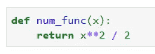
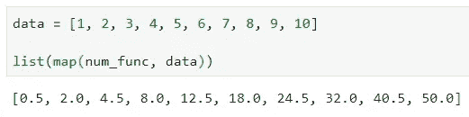
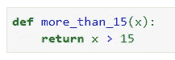
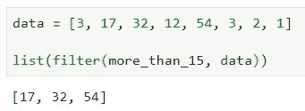
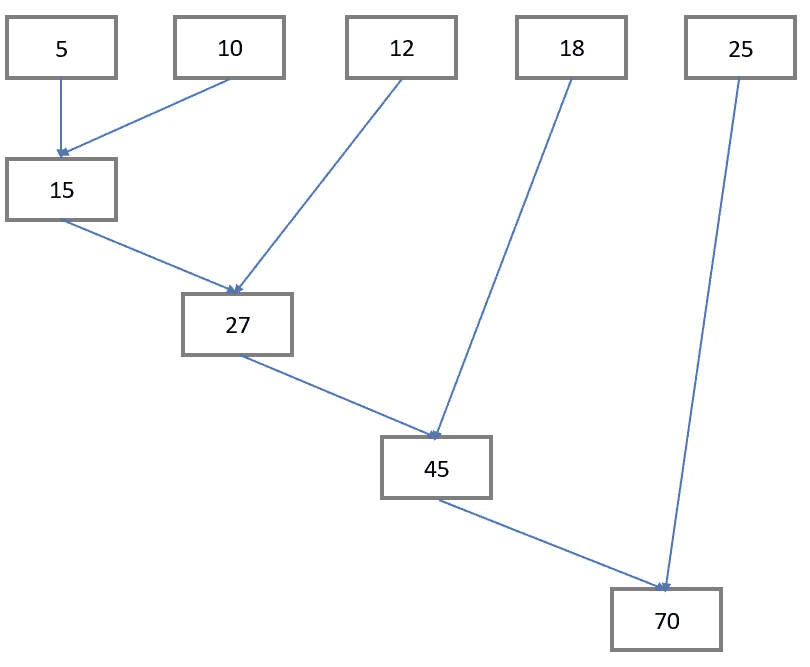
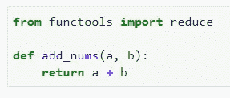
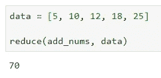

# 你不知道的三大 Python 函数(可能)

> 原文：<https://towardsdatascience.com/top-3-python-functions-you-dont-know-about-probably-978f4be1e6d?source=collection_archive---------0----------------------->

## 更干净的代码和更少的循环？算我一个。

作为 21 世纪最流行的语言之一，Python 当然有很多有趣的功能值得深入探索和研究。今天将讨论其中的三个，每个都是从理论上和通过实际的例子。

由 [Max Duzij](https://unsplash.com/@max_duz?utm_source=medium&utm_medium=referral) 在 [Unsplash](https://unsplash.com?utm_source=medium&utm_medium=referral) 上拍摄的照片

我想介绍这些函数的主要原因是它们可以帮助你避免编写循环。在某些情况下，运行循环的成本可能很高，除此之外，这些函数还有助于提高速度。

以下是本文将涉及的功能:

1.  `map()`
2.  `filter()`
3.  `reduce()`

即使你以前听说过这些功能，用更多的理论和例子来巩固你的知识也没有坏处。

所以事不宜迟，我们开始吧！

# 地图()

`map()`函数接受另一个函数作为参数，旁边是某种数组。这个想法是将一个函数(作为参数传入的那个)应用于数组中的每一项。

这很方便，有两个原因:

1.  你不必写一个循环
2.  它比循环快

让我们看看它的实际效果。我将声明一个名为`num_func()`的函数，它接受一个数字作为参数。该数字被平方并除以 2，然后返回。注意，操作是任意选择的，您可以在函数中做任何您想做的事情:

现在让我们声明一个要应用`num_func()`的数字数组。请注意，`map()`本身将返回一个**地图对象**，因此您需要将其转换为一个列表:

似乎该过程已成功完成。这里没有什么突破性的东西，但是尽可能避免循环是一件好事。

# 过滤器()

这里有另一个不错的函数可以节省您的时间——无论是在编写还是执行方面。顾名思义，这个想法是在数组**中只保存满足特定条件**的项目。

就像使用`map()`一样，我们可以预先声明函数，然后将它和可迭代列表一起传递给`filter()`。

让我们来看看实际情况。我已经声明了一个名为`more_than_15()`的函数，顾名思义，如果作为参数给出的项目大于 15:

接下来，我们声明一个数字数组，并将它们作为第二个参数传递给`filter()`函数:

正如所料，只有三个值满足给定的条件。同样，这里没有什么突破性的东西，但看起来比循环好得多。

# 减少()

现在的`reduce()`和前面两个有点不一样。首先，我们必须从`functools`模块导入它。这背后的主要思想是，它将给定的函数应用于项目数组，并将**返回单个值**作为结果。

最后一部分至关重要— `reduce()`不会返回一个项目数组，它总是返回一个值。让我们来看一张图，让这个概念具体化。

以下是在图表不是 100%清楚的情况下写出的逻辑:

1.  5 与 10 相加，得到 **15**
2.  15 与 12 相加，得到 **27**
3.  27 与 18 相加，得到 **45**
4.  45 与 25 相加，得到 **70**

70 是返回的值。从代码实现开始，让我们从`functools`模块导入 reduce 函数，并声明一个返回两个数之和**的函数:**

现在，我们可以用代码重新查看图表，并验证一切都正常工作:

现在还不要跳到注释部分——我很清楚还有其他方法来对列表项求和。这只是展示该函数如何工作的最简单的例子。

# 在你走之前

我希望你能在日常生活中利用这三种功能。速度的提高可能不会很大——这取决于您要处理的数据量——但是循环越少，代码看起来就越好。

如果你有一些其他的例子，不要犹豫，在评论区分享吧。

感谢阅读。

*喜欢这篇文章吗？成为* [*中等会员*](https://medium.com/@radecicdario/membership) *继续无限制学习。如果你使用下面的链接，我会收到你的一部分会员费，不需要你额外付费。*

 [## 通过我的推荐链接加入 Medium-Dario rade ci

### 作为一个媒体会员，你的会员费的一部分会给你阅读的作家，你可以完全接触到每一个故事…

medium.com](https://medium.com/@radecicdario/membership)