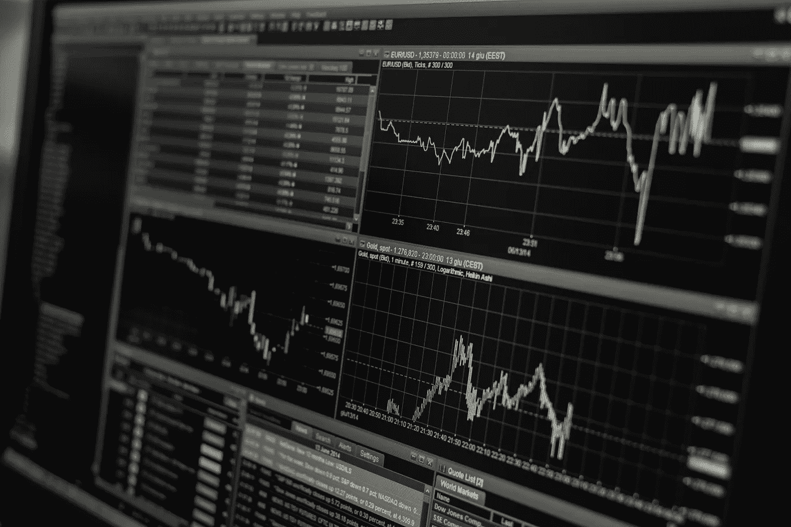

# 前 3 名 Python 可视化库

> 原文：<https://towardsdatascience.com/top-3-python-visualization-libraries-e32a7e0402f8?source=collection_archive---------46----------------------->

## 我们都需要创造视觉效果来讲述我们的故事，但是我们如何创造呢？我从代码开始！

照片来自[洛伦佐](https://www.pexels.com/@lorenzocafaro)在[像素](https://www.pexels.com/)上

当创建不同的图时，三个 Python 可视化库是我的首选，它们是 [Matplotlib](https://matplotlib.org/) 、 [Bokeh](https://bokeh.org/) 和 [Plotly](https://plotly.com/) 。每个图书馆都有其不同和相似之处。Matplotlib 是一个静态绘图工具，而 Bokeh 和 Plotly 允许交互式的仪表板功能。因此，让我们简单介绍一下这三个库。

# Matplotlib

Matplotlib 是一个 Python 库，它为用户提供了创建静态或动态可视化的能力。我通常倾向于使用 matplotlib 图来绘制任何可以保持静态的东西，比如报告或 PPT 文档中使用的视觉效果。我使用这个库中的标准图:条形图、时间序列分析的线图和热图。这个库的另一个很好的特性是它的 [TeX 表达式解析器](https://matplotlib.org/tutorials/text/mathtext.html#sphx-glr-tutorials-text-mathtext-py)，它允许在绘图中使用数学表达式。添加这些表达式有助于格式化需要额外细节的绘图。

# 散景

Bokeh 是我最常使用的绘图库，因为它具有交互性。我特别喜欢的功能是它通过引入[自定义 JavaScript](https://bokeh.org/) 来扩展功能的能力，这“可以支持高级或专门的情况”,您可能会在绘图时遇到。散景允许在网页或笔记本中创建绘图、仪表盘和应用程序。我会注意到，有时我发现在笔记本中很难使用散景功能，比如按钮，但在网页中却很好用。当向最终用户提供仪表板时，过滤数据以定制绘图输出的能力是有用的。与其他绘图库相比，我最喜欢选择散景的一个用例是将其用于[分类数据](https://docs.bokeh.org/en/latest/docs/user_guide/categorical.html)。我发现带抖动的分类散点图是各种仪表板的绝佳视图。我经常使用这种类型的情节，并发现它非常有益。

# Plotly

我经常使用的最后一个绘图库是 Plotly，主要是为了它们的[绘图功能](https://plotly.com/python/maps/)。Plotly 提供了许多不同的方法来绘制和利用地图数据，如果您查看任何与位置相关的数据，这是非常好的。这些图对理解我基于位置的数据和向利益相关者展示变化非常有帮助。提供一个可视化的表示允许用户快速分解什么是重要的。这将使他们能够开始问更多的目标问题，例如为什么 X 比 Y 更多，或者为什么 Z 在最近几天改变了它的轨迹？如果你有任何位置数据，我建议查看 Plotly 的工具。

# 摘要

对于我的项目，这是我的三个常用库，用于可视化和仪表板。

*   ***Matplotlib*** —通常用于静态绘图，您可能想要将其放入演示文稿、纸张或 PPT 中。
*   ***散景*** —用于定制仪表板和交互式绘图的大型库。
*   ***plottly***—他们有各种位置数据的绘图工具，比如轨迹、热图等等。

*你最喜欢或最常用的绘图工具是什么，为什么推荐它？*