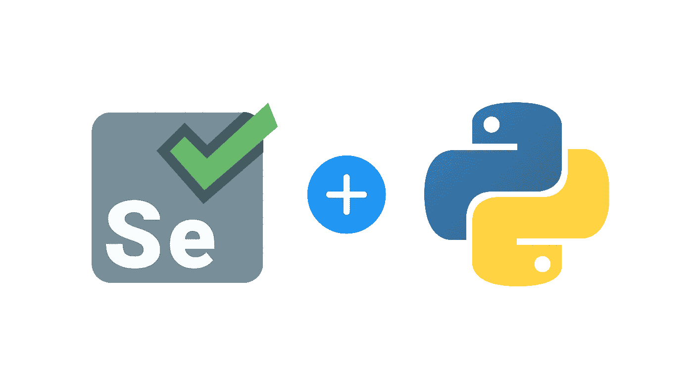
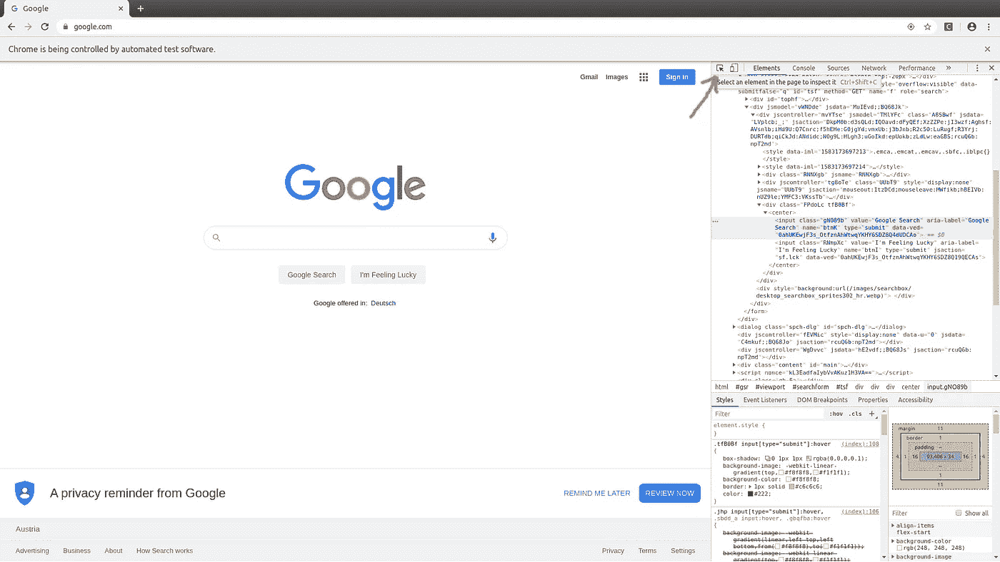

# 硒的三大功能让你的生活更轻松

> 原文：<https://towardsdatascience.com/top-3-selenium-functions-to-make-your-life-easier-84b174d2a0fe?source=collection_archive---------37----------------------->

## 每个人都应该知道的基本功能

在今天这样一个快节奏的世界里，有许多事情我们必须**自动化**以便更有生产力或效率，尽管我们有时并不真的喜欢它。

想象一下，你有一项需要花 2 个小时才能完成的任务，但是你可以制作一个工具在 30 秒内自动完成。



这就是**网页抓取**的目的。这是一个术语，用来从网页上获取数据，然后制作出来，这样你就不用动一根手指了！

获取数据，然后按照你想要的方式进行处理。

这就是为什么今天我想向大家展示 Selenium 的一些顶级功能，Selenium 是一个用于 Web 抓取的库。

我以前写过关于 Selenium 和 Web Scraping 的文章，所以在你开始之前，我建议你阅读这篇文章“[关于 Web Scraping](/everything-you-need-to-know-about-web-scraping-6541b241f27e) 的一切”，因为它的设置过程。如果你已经比较精通网络抓取，可以试试我的高级脚本，比如“[如何用 Python 省钱](/how-to-save-money-with-python-8bfd7e627d13)”和“[如何用 Python 制作分析工具](/how-to-make-an-analysis-tool-using-python-c3e4477b6d8)”。

让我们直接投入进去吧！

# 获取()

get 命令启动一个新的浏览器，并在 C [hrome Webdriver](https://chromedriver.chromium.org/) 中打开给定的 URL。它只是将字符串作为您指定的 URL，并打开它进行测试。

如果您使用的是 Selenium IDE，它类似于 open command。

> 示例:

```
driver.get(“https://google.com");
```

“驱动程序”是您的 Chrome Webdriver，您将在上面执行所有操作，在执行上面的命令后，它看起来像这样:


测试目的 Chrome 窗口

# find_element()

当您想要访问页面上的元素时，这个函数非常重要。假设我们想要访问“Google search”按钮来执行搜索。

有许多方法可以访问元素，但是我更喜欢的方法是找到元素的 XPath。XPath 是元素在网页上的最终位置。

通过点击 F12，您将检查该页面，并获得关于您所在页面的背景信息。



通过单击选择工具，您将能够选择元素。

找到按钮后，单击右边蓝色标记的部分，复制元素的“完整 Xpath”。

```
self.driver.find_element_by_xpath('/html/body/div/div[4]/form/div[2]/div[1]/div[3]/center/input[1]')
```

这是查找特定元素的完整命令。与常规 XPath 相比，我更喜欢完整的 XPath，因为如果新会话中的元素发生变化，常规的 XPath 可能会发生变化，而下次执行脚本时，它就不起作用了。

其他 find_element 函数概述。(还有 find _ element**s**s)


find_element 函数的所有选项

# send_keys()并单击()

我为你添加了一个额外的功能，所以我们可以通过这个例子，使它完全工作。

Send_keys 函数用于将文本输入到您通过 find_element 函数选择的字段中。

假设我们想在 google 中输入“plate”并执行搜索。我们已经有了我们的“谷歌搜索”按钮，现在我们只需要输入文本，并在点击功能的帮助下点击按钮。

```
google_tray = self.driver.find_element_by_xpath('/html/body/div/div[4]/form/div[2]/div[1]/div[1]/div/div[2]/input')google_tray.send_keys("plate")google_search = self.driver.find_element_by_xpath('/html/body/div/div[4]/form/div[2]/div[1]/div[3]/center/input[1]')google_search.click()
```

为了更加清晰，我将元素保存在各自的变量中，然后对它们执行函数。

最后你会得到这个:


# 临终遗言

如前所述，这不是我第一次写关于 Selenium 和 Web 抓取的文章。

如果你想了解更多关于这个话题的知识，请查看“[25 个 Selenium 函数，它们将使你成为网络抓取专家](/top-25-selenium-functions-that-will-make-you-pro-in-web-scraping-5c937e027244)”。

我还想介绍更多的功能，还会有更多的功能。为了跟上，关注我更多！

**感谢阅读！**

[](https://medium.com/@lazar.gugleta)

查看我的**其他文章**并关注我的[媒体](https://medium.com/@lazar.gugleta)

[](https://twitter.com/intent/user?screen_name=LazarGugleta)

当我发布一篇新文章时，请在 Twitter 上关注我