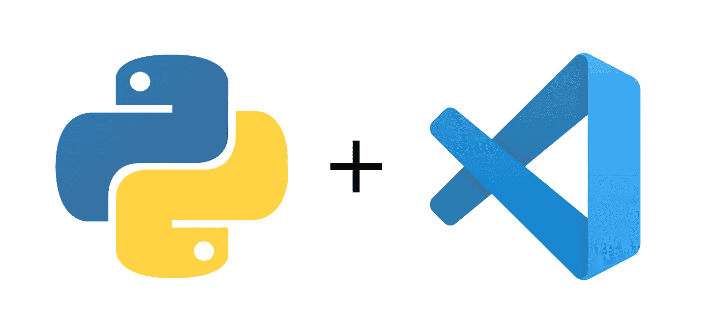
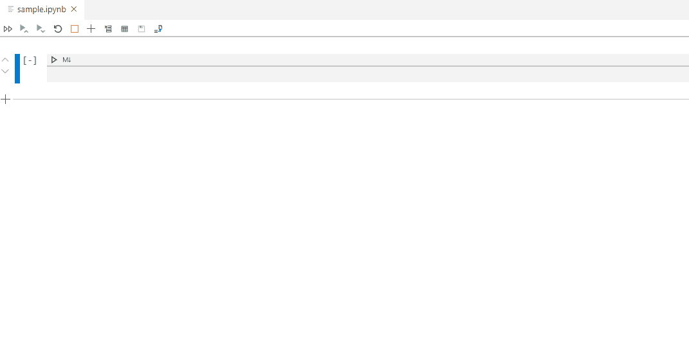
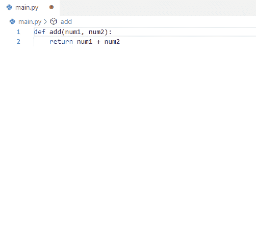
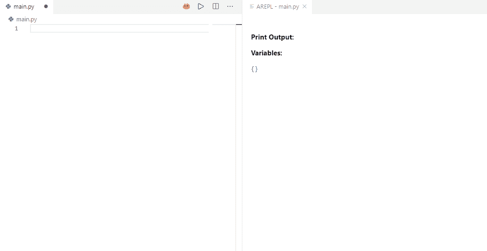

# Python 和数据科学的 3 大 VS 代码扩展

> 原文：<https://towardsdatascience.com/top-3-vs-code-extensions-for-python-and-data-science-7462dd4ee530?source=collection_archive---------4----------------------->

## 谁不喜欢智能 IDE 呢？

IDE 太棒了。如果你不知道 IDE 是什么，它代表 ***集成开发环境*** ，这意味着它不同于普通的文本编辑器，它支持代码编辑、林挺、语法突出显示和一系列其他很酷的东西，从长远来看，这些都将帮助你并节省你的时间。

总的来说，我对 IDE 的主要问题是——它们太重了。你的普通 IDE，比如 [PyCharm](https://www.jetbrains.com/pycharm/) ，会占用大量的磁盘空间，还会占用大量的 RAM，并且会花费更多的启动时间。甚至不要让我开始谈论 [Visual Studio](https://visualstudio.microsoft.com/) 。

这也是我今天要把重点转移到 Visual Studio 的更轻巧的兄弟 [**Visual Studio 代码**](https://code.visualstudio.com/) 的原因。这是一个简单而轻量级的 IDE，多年前我就喜欢上了它，并且从未回头。

默认情况下，VS 代码与其他轻量级 IDE(如 [Sublime](https://www.sublimetext.com/3) 或 [Atom](https://atom.io/) )没有太大区别，除了更好的设计(只是个人偏好)，但通过各种插件，它可以匹配更“严肃”的 IDE，在某些情况下甚至会让你花钱。

今天，我想把重点放在 3 个插件上，它们将会为你节省很多时间，同时考虑到 **Python 和数据科学**。在开始之前，让我们检查一下需求。

## 要求

开始之前，请确保安装以下设备:

*   [Python](https://www.python.org/downloads/) (我用的是 3.7.6)
*   [Visual Studio 代码](https://code.visualstudio.com/)
*   [VS 代码的 Python 扩展](https://marketplace.visualstudio.com/items?itemName=ms-python.python)

最后一个你将不得不通过 VS 代码本身来安装，但是由于安装非常简单(只需一次点击)，我不会在这里涉及它。现在我们可以进入正题了。

# 1.笔记本支持

我是一名数据科学家，喜欢笔记本。说真的，它们是我典型工作流程中如此重要的一部分。我很少想直接跳到代码编辑器并输入解决方案——主要是因为笔记本非常适合探索性分析，这是数据科学的一大部分。

因此，当笔记本支持在几个月前首次被引入 VS 代码时，我很高兴能尝试一下。起初，它们似乎比传统的 Jupyter 笔记本慢一点，但速度问题现在似乎得到了解决。

你不需要安装任何插件来使用笔记本，只要你有前面需求部分提到的 **Python 扩展**。

你需要做的就是创建一个扩展名为`.ipynb`的文件——我把我的文件命名为`sample.ipynb`

下面是所有事情的工作原理——我准备了一个简单的 GIF，而不是一堆截图(耶科学):

1.笔记本支持

这就是它的全部功能-您现在可以像在任何常规笔记本电脑环境中一样工作。不客气，玩得开心。

# 2.autoDocstring

从它的名字，我敢肯定你能猜到它背后的目的——它将帮助你管理文档字符串。要使用它，你需要先安装它——所以转到 VS 代码的**扩展**部分，键入 **autoDocstring** 并点击 **Install** 。

为了看看它对我们有什么样的魔力，我们需要创建一个 Python 文件——我把我的文件命名为`main.py`

我在其中声明了一个函数，它将两个数字相加并返回它们——这两个数字是由用户用函数参数的魔力指定的。

要使用`autoDocstring`包，首先需要在函数声明下面键入三个双引号`"""`，然后按回车键。这里有一个简短的演示:

2.autoDocstring

现在您可以逐段完成 docstring，按下**选项卡**键跳到下一段。

这个扩展对你们中的许多人来说肯定不是一个令人惊叹的因素，但是它将使你的 docstrings 保持干净和一致。

# 3.AREPL

难道你不讨厌繁琐的控制台打印，只是找出你的变量的当前值吗？

别担心，AREPL 会帮你的。这是一个插件，它会在你每次敲击键盘上的一个字母时改变它的输出(有时会很烦人)，但也会告诉你你的变量保存的**值**，并显示`print`语句的输出，而不需要你去运行程序。

起初听起来可能不多，但是相信我，如果你正在做任何探索性的工作，这是一个白天和夜晚的差别(我想你是这样的，因为你正在阅读关于数据科学的*)。*

*要使用它，你需要像安装`autoDocstring`扩展一样安装它。到目前为止，我相信您已经知道如何安装扩展，所以我不会讨论这个问题。*

*安装完成后，创建一个虚拟 Python 文件——我已经调用了我的文件`main.py`,你会立即在右上角看到一个红色图标(不是关闭窗口的那个)。当你按下它时，一个窗口就会出现在屏幕的右边。*

****现在一切顺利吗？*** 好。让我们看看扩展的实际应用:*

**

*3.AREPL*

*您可以明白我说的扩展有点烦人是什么意思——当实际上我还没有完成语句时就显示错误。但是如果你权衡利弊，我会说利远大于弊。*

# *在你走之前*

*VS 代码和 Python 都有很多可用的扩展，Python 是当今最流行的语言之一。*

*这篇文章并没有列出所有好的插件，但是我展示了我认为最有用的插件。如果你想看更多像这样的文章，一定要让我知道，我一定会给你发。*

*感谢阅读。*

*喜欢这篇文章吗？成为 [*中等会员*](https://medium.com/@radecicdario/membership) *继续无限制学习。如果你使用下面的链接，我会收到你的一部分会员费，不需要你额外付费。**

* [## 通过我的推荐链接加入 Medium-Dario rade ci

### 作为一个媒体会员，你的会员费的一部分会给你阅读的作家，你可以完全接触到每一个故事…

medium.com](https://medium.com/@radecicdario/membership)*