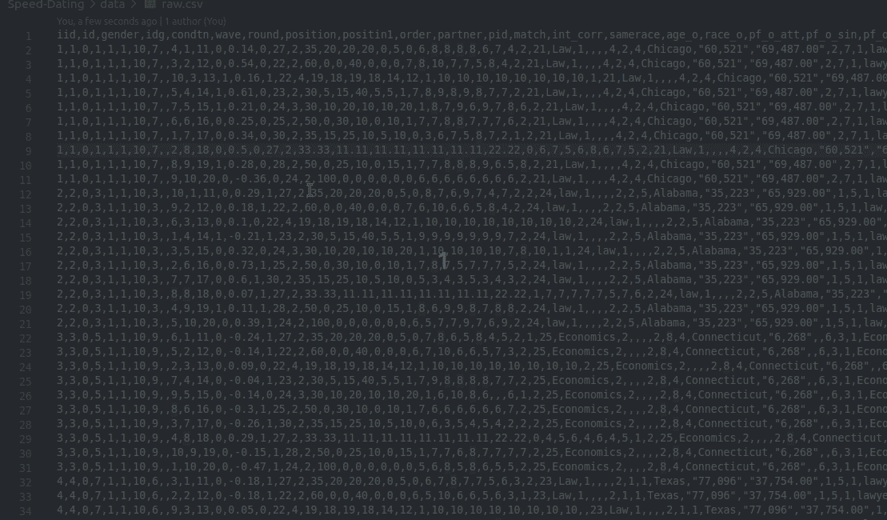
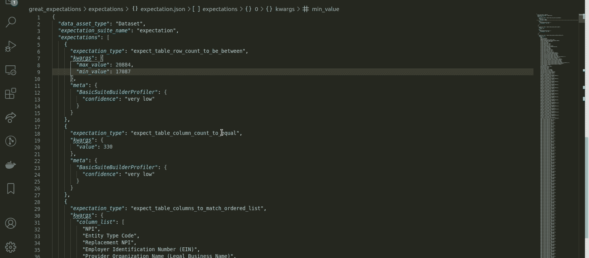
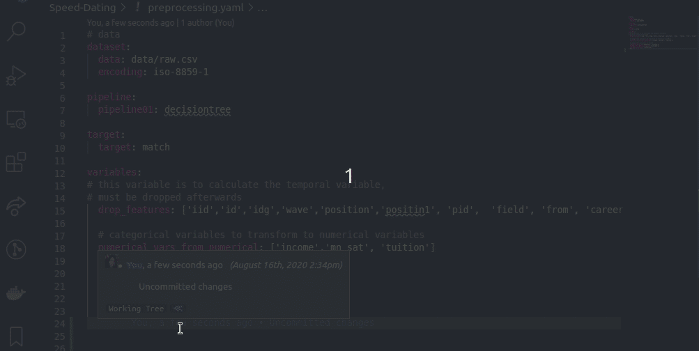
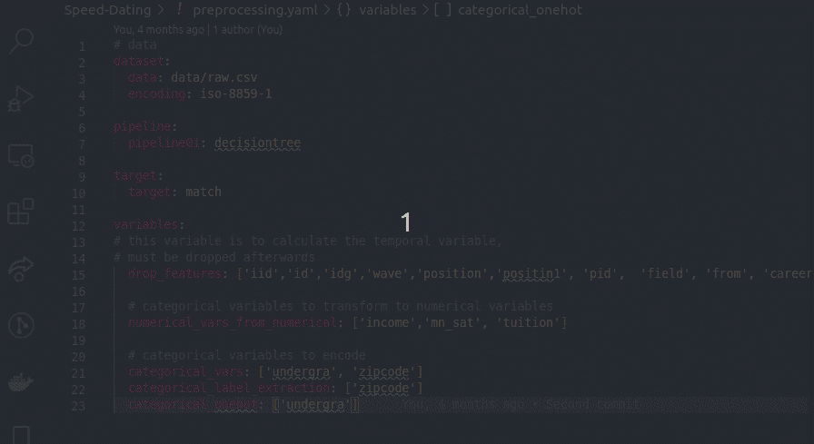
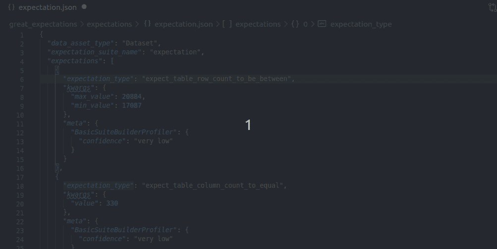

# VSCode 中数据科学家的 4 大代码查看器

> 原文：<https://towardsdatascience.com/top-4-code-viewers-for-data-scientist-in-vscode-e275e492350d?source=collection_archive---------15----------------------->

## 让 YAML、JSON、CSV 和 Jupyter Notebook 为你工作，而不是与你作对

[梁杰森](https://unsplash.com/@ninjason?utm_source=medium&utm_medium=referral)在 [Unsplash](https://unsplash.com?utm_source=medium&utm_medium=referral) 上的照片

# 动机

数据科学领域需要处理不同格式的数据和文件，如 YAML、JSON、CSV 和 Jupyter Notebook。这些格式服务于不同的目的。有很多，因为每个都有自己的优点和缺点。

您可能会在一些琐碎的任务上花费数小时，比如理解 json 文件的内容，或者确保为列表编写正确的 yaml 代码。幸运的是，有一个针对 VSCode 的方法。

如果你不知道 [VSCode](https://code.visualstudio.com/) ，它是微软为 Windows、Linux 和 macOS 制作的免费源代码编辑器。我喜欢 VS 代码的两大优点是[键盘快捷键](/how-to-leverage-visual-studio-code-for-your-data-science-projects-7078b70a72f0)和有用的扩展。

使用 VSCode 扩展是救命稻草。在我的上一篇文章中，我介绍了我最喜欢的两个扩展:

*   [Git 版本控制的 Git lens](/how-to-leverage-visual-studio-code-for-your-data-science-projects-7078b70a72f0)
*   [片段创建器创建定制的片段。](/how-to-boost-your-efficiency-with-customized-code-snippets-on-vscode-8127781788d7)

在这篇文章中，我将介绍 4 个用于查看不同格式文件的其他扩展。这些工具极大地促进了我作为数据科学家的工作流程。我们开始吧！

# CSV 至表

CSV 文件很常见，但很难阅读。读取它们的常用方法是打开一个电子表格或使用`pandas.read_csv().`,但这两种方法都要求您要么打开笔记本，要么关闭 VSCode 编辑器，找到 csv 文件所在的目录并打开电子表格。

有比那更快的方法。CSV to Table 是一个扩展，可以将您的 CSV/TSV/PSV 文件转换为 ASCII 格式的表格，如下所示。

现在，您不仅可以查看格式良好的 csv 文件，还可以在表格中编辑 csv 文件！多酷啊。

要使用扩展，请将 CSV 安装到表中。键入`Ctrl + Shift + P` 然后选择`CSV: Edit as csv.`

# Json 编辑器

Json 是保存数据的另一种常见格式。与 csv 相比，读取数据可能更容易，也可能不容易。当 Json 有很多嵌套对象时，它变得非常难以阅读。

如果您发现自己花了很长时间查看 json 文件，试图理解其内容，Json Editor 将是您的救命稻草。

在 Json Editor 中，您可以在一个树状结构中查看 Json 文件，如右边屏幕所示。更好的是，您可以在树视图中编辑 json 文件！

要使用该扩展，请安装 JSON 编辑器。键入`Ctrl+Shift+P`和`JSON editor: Start JSON editor session.`在设置中更改主题，如果您想设置“亮”或“暗”主题，请键入`vscode-json-editor.theme`。

# YAML

Yaml 是一种人类可读的数据序列化语言，通常用于配置文件。Yaml 比 json 更容易阅读和编辑，但是它并不总是直观的，特别是对初学者来说，正确地编写 yaml 或判断 yaml 是表示列表、字典还是字符串。

但是幸运的是，有一个叫做 YAML 的扩展。YAML 可以做以下事情:

*   检测整个文件是否是有效的 yaml。

*   文档大纲显示(Ctrl + Shift + O)
*   自动完成(Ctrl +空格键)
*   允许格式化当前文件

有了 YAML，你可以了解文件的结构，对象的类型，并快速访问该对象！

# Jupyter 观察器

Jupyter 笔记本在数据科学家中极为常见。尽管 Jupyter Notebook 对分析数据很有用，但你不能只是打开一个. ipynb 文件就期望看到它。您需要通过在终端上键入`jupyter notebook`来打开 jupyter 笔记本会话。

如果你想用笔记本工作一段时间，这没问题。但是，如果您只想快速分析或可视化 VSCode 中的数据，而不打开新的会话，该怎么办呢？幸运的是，有一个叫做 Python 的扩展。

如果我打算暂时使用 Jupyter 笔记本，我更喜欢经典笔记本，但如果我只想快速分析数据，我会使用这款笔记本。

要使用该扩展，只需安装微软的 Python 扩展。现在，您可以查看和编辑笔记本，而无需启动新的会话！

# 结论

恭喜你！您已经学习了格式化 VSCode 的 4 个扩展。能够格式化我的文件让我的生活变得简单多了！我希望你在尝试了这些扩展之后也有同样的感觉。

星[这个回购](https://github.com/khuyentran1401/Data-science)如果你想检查我写的所有文章的代码。

我喜欢写一些基本的数据科学概念，并尝试不同的算法和数据科学工具。你可以在 LinkedIn 和 Twitter 上与我联系。

如果你想查看我写的所有文章的代码，请点击这里。在 Medium 上关注我，了解我的最新数据科学文章，例如:

 [## 如何用 Faker 创建假数据

### 您可以收集数据或创建自己的数据

towardsdatascience.com](/how-to-create-fake-data-with-faker-a835e5b7a9d9)  [## 如何使用 HyperDash 远程监控和记录您的机器学习实验

### 培训需要很长时间才能完成，但你需要去洗手间休息一下…

towardsdatascience.com](/how-to-monitor-and-log-your-machine-learning-experiment-remotely-with-hyperdash-aa7106b15509)  [## Datapane 简介:构建交互式报表的 Python 库

### 创建精美报告并与您的团队分享分析结果的简单框架

towardsdatascience.com](/introduction-to-datapane-a-python-library-to-build-interactive-reports-4593fd3cb9c8)  [## 如何在一行代码中跨不同环境共享 Python 对象

### 为建立与他人分享你的发现的环境而感到沮丧？以下是如何让它变得更简单

towardsdatascience.com](/how-to-share-your-python-objects-across-different-environments-in-one-line-of-code-f30a25e5f50e)