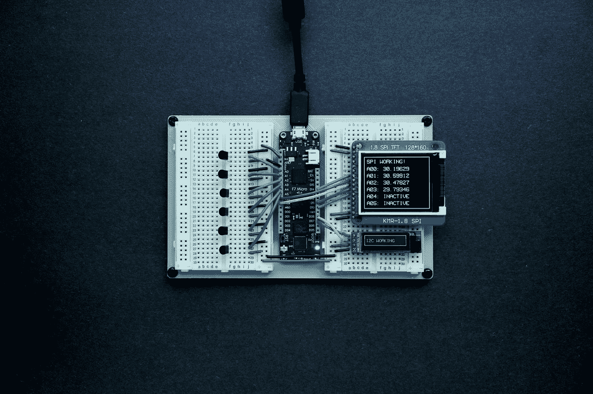
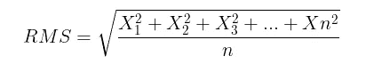
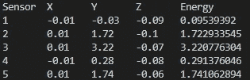
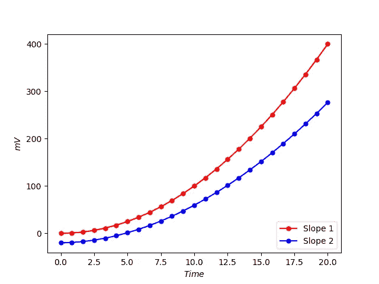
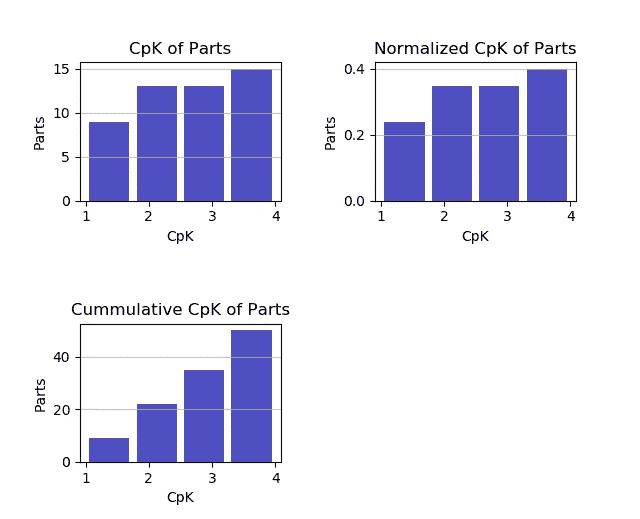
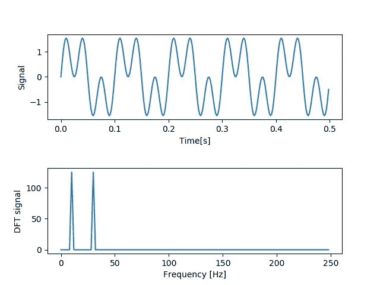

# 面向工程和研究的 4 大 Python 模块

> 原文：<https://towardsdatascience.com/top-4-python-modules-for-engineering-research-346d43e7b878?source=collection_archive---------28----------------------->

## 面向当今工程师和研究人员的 Python 模块


在 [Unsplash](https://unsplash.com?utm_source=medium&utm_medium=referral) 上拍摄的 [ThisisEngineering RAEng](https://unsplash.com/@thisisengineering?utm_source=medium&utm_medium=referral)

Python 对于初学者来说是完美的，因为它的语法易于掌握和理解。凭借这一优势，它已经是工程和研究领域的领先编程语言。作为工程师，我们的任务是**“应用科学和数学原理开发技术问题的经济解决方案”**。

Python 是众多可以帮助我们完成这项任务的工具之一。我在工作中使用 Python 从技术规格表中提取信息，处理实验和测试结果，并解决数值计算。这里有一些我最喜欢的 Python 模块，每个工程师和研究人员都可以利用它们来提高日常产出。

# 1.数学模块

数学模块是 Python 标准库的一部分，包含工程计算中常用的数学工具和常数。需要知道角度的反正弦？一行代码就可以完成这项工作。

```
[math.asin(x](https://www.w3schools.com/python/ref_math_asin.asp))
```

记不住欧拉数，或者圆周率的第四位小数？没问题，数学模块会帮我们搞定的。

```
math.e **# returns 2.718281828459045**
```

当然，被命名为数学模块，它也能计算函数，如三角函数和对数函数。我最喜欢的另一个操作符是“_”操作符，Python 在这里返回上一次操作的值。

```
23.74*0.56 **# returns 13.2944**
_+0.582 **# returns 13.8764**
_/math.e **# returns 5.104842277471403**
```

当我们需要快速计算时，这非常方便。让我们来看一个使用数学模块中的方法从一些振动传感器读数(读数的*幅度*)计算均方根数据的例子。



Jorge Ramirez 在 [Unsplash](https://unsplash.com?utm_source=medium&utm_medium=referral) 上拍摄的照片



以 10 个传感器能量读数为例，我们可以通过下式求出均方根值:

```
**import** math
N = 6with open("data.txt") as file:
for i in range(6):
 line = next(file).strip()
print(line)
```



```
list **=** [0.09539392, 1.722933545, 3.220776304, 0.291376046, 1.741062894]
n **=** len(list)
squares **=** 0
for i in range(0,n):
  squares **+=** (list[i]******2)
mean **=** (squares **/** (n))
RMS **=** math.sqrt(mean)
print(RMS)# **returns** **1.8147837337772996**
```

# 2.Numpy 模块

[**Numpy**](http://numpy.org)**(Numeric Python)是为科学计算而设计的 Python 模块。它有许多有用的特性，它的核心数据类型是数组。Numpy 数组是 n 维数组对象，用于表示向量和矩阵。**


照片由 [Antonio Garcia](https://unsplash.com/@angarav?utm_source=medium&utm_medium=referral) 在 [Unsplash](https://unsplash.com?utm_source=medium&utm_medium=referral) 拍摄

下面是一些基于来自 [Kaggle](https://www.kaggle.com/knowbuddycare/sensor-dataset) 的温度传感器数据集使用 Numpy 的例子。

我们可以检查数据集的内容，即存在的列、读数的数量以及第一个/最后 10 个读数。

```
import numpy as np
from numpy import genfromtxt
data = genfromtxt(data.csv", delimiter=',', names = True)
print("Columns in dataset: " , data.dtype.names)Temp = data[:, 0] 
print(Temp[1: 10]) # **returns** **first 10 elements**
print(Temp[-10:]) # **returns** **last 10 elements**
print(Temp.size)# **returns** **number of elements**
```

根据我们的应用程序，我们还可以使用 **where()** 方法快速过滤出温度列中读数大于 30 度的值。

```
index = np.where(Temp >= 30)
print(Temp[index])
```

简单的数据分析，如百分位值**、平均值、中值、标准偏差**以及数据集中最频繁出现的数据，可以使用几行代码进行计算。

在这里，我们探索水温列:

```
WaterTemp = data[:, 2]
tenth, ninetieth = np.nanpercentile(WaterTemp[1:], q =[10, 90])
mean, median, std = np.nanmean(WaterTemp), np.nanmedian(WaterTemp), np.nanstd(WaterTemp)values, counts = np.unique(WaterTemp, return_counts=True)
print(tenth, ninetieth)
print(mean, median, std)
print(values[np.argmax(counts)])
```

# 3.Matplotlib 模块

为了用更少的代码行生成出版物质量的数字和图形，可以使用 [Matplotlib](https://matplotlib.org/3.3.1/contents.html) 模块，其中包含 Pyplot 模块。Pyplot 对于 2D 图特别有用，例如绘制直方图、数据集图表或直观检查模拟结果。

一个简单的 2D 图的例子:(它看起来比 Excel 图表好吧？)



传感器灵敏度的斜率。作者图片

从根本上说，我们可以自由定制我们的绘图，即:设置轴标签，调整线条和标记厚度，甚至将绘制的图形保存到高分辨率图像或 pdf 中。

Pyplot 是我最喜欢的工具之一，尤其是 subplot 方法，我可以创建多个图并将它们保存到 PDF 或 JPEG 文档中。



作为工程师，我们经常被要求做出数据驱动的决策，例如，根据 CpK 值确定被拒绝的制造零件的数量，而 **Matplotlib 是一个有用的库，我们可以轻松地可视化数据趋势以进行决策。**

# 4.SciPy 模块

**SciPy(科学 PYthon)模块提供了大量的数值和科学处理算法**，有助于工程师进行计算和求解方程。让我们从下面的另一个信号处理示例来看看 SciPy 的实际应用。

10 Hz 正弦波信号与 30Hz 正弦波信号叠加。我们对信号应用傅立叶变换，系数相对于频率绘制。

```
import scipy as sp
...
df = 1/signal_length
t = sp.arange(0, signal_length, dt)
n_t = len(t)y = sp.sin (2*pi*10*t)+ sp.sin (2*pi*30*t) 
#Note that the arange and sin functions are available in numpy toof = sp.fft (y)
frequencies = df * sp.arange(0 ,(n_t -1)/2)
n_freq = len (frequencies)plt.subplot (2 ,1 ,1)
plt.plot (t ,y)
...plt.subplot (2 ,1 ,2)
plt.plot(freqs, abs(f[0: n_freq]))
...plt.show()
```



信号的傅立叶变换。作者图片

只需几行代码，就可以获得并可视化信号的傅立叶变换。SciPy 也提供了 NumPy 的所有功能，后者通过一整套算法扩展了前者的功能，如**积分、最小化、傅立叶变换、回归、形态学、**和其他应用数学技术。

如果你有兴趣了解更多关于信号处理的知识，我在这里写了另一篇关于这个主题的文章:

[](/how-do-machine-learning-and-signal-processing-blend-4f48afbb6dce) [## 机器学习和信号处理如何融合？

### IBM 在 Coursera 上的“高级机器学习和信号处理”概述

towardsdatascience.com](/how-do-machine-learning-and-signal-processing-blend-4f48afbb6dce) 

# 总结和后续步骤

你可能会问，既然有像 MATLAB、Microsoft Excel 和其他工程软件这样的工具，为什么还要使用 Python 呢？嗯，它们中的大多数都是闭源软件，使用起来可能很昂贵——尤其是当需要额外的定制工具箱和许可证时。

然而，Python 是免费的、开源的，包含许多模块和库，与付费软件一样好，甚至更好。

我们在上面的帖子中看到的只是冰山一角，但我希望它足以让任何开始使用 Python 的工程师和科学家相信 Python 在处理、处理和可视化数据集方面的强大功能。**21 世纪瞬息万变，了解 Python 有朝一日对于传统的工程学科来说是必要的。**

以下是的附加资源列表，用于了解上述模块的更多信息:

1.  [关于数学模块](https://realpython.com/python-math-module/)你需要知道的一切
2.  [数字参考](https://docs.scipy.org/doc/numpy-1.13.0/reference/)
3.  [Matplotlib & SciPy 引用](https://scipy-lectures.org/intro/)