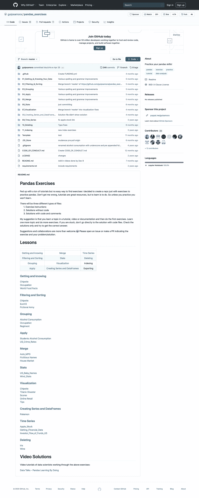
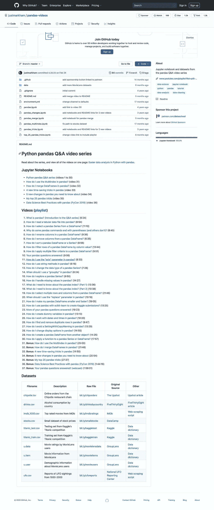
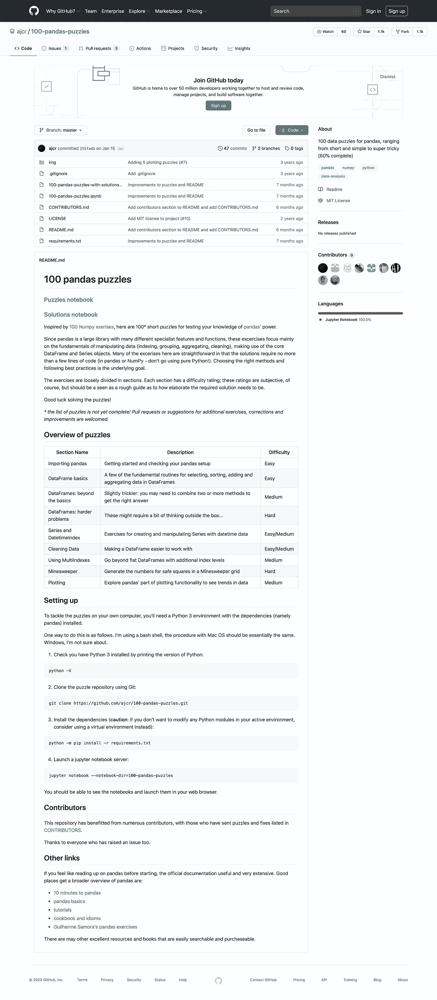
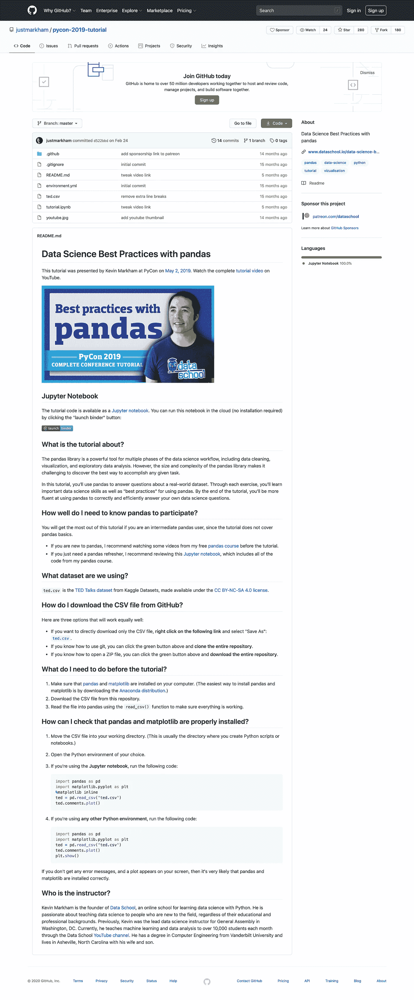

# GitHub 上学习熊猫的四大知识库

> 原文：<https://towardsdatascience.com/top-4-repositories-on-github-to-learn-pandas-1008cb769f77?source=collection_archive---------16----------------------->

## 编程；编排

## 对于初学者和专家来说，一些最受欢迎的关于熊猫的知识库。

你可以在 Github 找到很多熊猫！

大家都知道 Github 是什么。

如果你和我一样是新手，可能还是不敢碰。虽然我还没有真正超越`git commit` + `git push`，但我知道你可以把 Github 不仅仅作为你项目的版本控制工具。

除了任何人都可以参与的开源项目，Github 还有无数的资源可以作为学习材料。

虽然参加在线课程很好，但有时额外的练习可以帮助你更好地记住你以前学到的东西。受欢迎的网站“Codewars”和“Codekata”是每天获得额外练习的一种方式，因为你可以选择一种你喜欢的语言，并解决尽可能多的问题。

对于那些专门搜索熊猫实践的人来说，你可以从 GitHub 上的**四大熊猫知识库列表中受益！**每个级别都有一个资源库，无论你是刚刚开始接触熊猫，还是已经在寻求将你的技能从基础提升到高级。我已经包括了分叉最多的，作为受欢迎程度的衡量标准。

# 熊猫练习—所有主题(4k 叉)

熊猫 Github 库来自 [guipsamora](https://github.com/guipsamora/pandas_exercises)

这个存储库有 11 个不同的部分，包括从将数据放入数据框架到创建高级可视化的练习。每个文件夹都有多个数据集，每个数据集都有不同的练习。

您可以下载 IPYNB 文件，打开 Jupyter 笔记本，亲自尝试练习。每个问题下面都有空单元格，所以你可以输入你的代码，然后通过查看“Exercise_with_Solution.ipynb”文件来检查你的答案。

总共有 27 本笔记本供你翻阅，所以这绝对是一个全面的资源。即使你已经对熊猫很熟悉，也值得浏览一下“了解”部分，因为你可能会发现像`.describe(include=all)`和`.nunique()`这样你以前没见过的功能。

还有一个链接，链接到数据科学家浏览所有笔记本的视频，所以如果你更喜欢观看解决方案的演示，而不是仅仅阅读它们，你可以在这里查看。

 [## 吉普萨莫拉/熊猫 _ 练习

### 厌倦了大量的教程，但没有找到练习的简单方法，我决定创建一个回购只是练习…

github.com](https://github.com/guipsamora/pandas_exercises) 

# 熊猫视频—所有主题和视频(1.2k 分叉)

来自 [justmarkham](https://github.com/justmarkham/pandas-videos) 的熊猫 GitHub 知识库

这个资源库包含 Jupyter 笔记本，其中包含了一个视频系列的代码，该视频系列介绍了许多不同的 Pandas 功能。作者讲述了如何使用真实数据集解决问题(已由作者发布在网上，并包含在笔记本中)。

理想情况下，你应该打开一个 Jupyter 笔记本，跟着视频走。然后，一旦您完成了视频并浏览了所有代码，您就可以使用存储库中包含的笔记本作为答案纸。笔记本中还有一些额外的脚注，可能有助于阐明某些单元格的输出。

这个视频和相关笔记本的列表非常全面，所以如果你有关于熊猫的问题，你可以在这里找到一个演示。有简单的小众问题，如“我如何对熊猫数据帧或系列进行排序”，也有广泛而复杂的问题，如“我如何使用带有 sci-kit 的熊猫学习创建 Kaggle 提交”。

 [## 贾斯特马克姆/熊猫-视频

### Jupyter 笔记本和来自熊猫问答视频系列的数据集-just Markham/pandas-videos

github.com](https://github.com/justmarkham/pandas-videos) 

# 100 个熊猫拼图(1k 叉子)

来自 [ajcr](https://github.com/ajcr/100-pandas-puzzles) 的熊猫 GitHub 知识库

这个资源库只有一个 Jupyter 笔记本供您下载所有练习。每个问题下面都有一个单元格，您可以在其中填写您的代码，您可以对照解决方案笔记本中的相关单元格来检查代码。

笔记本分为不同的部分，如“进口熊猫”，“数据帧基础”，“系列和日期时间索引”等。您会发现大多数问题只需几行就可以解决，所以理想情况下，您不会为一个问题编写大量代码。

还有一个很酷的“扫雷”部分，其中:

> 我们将制作一个数据帧，其中包含扫雷游戏所需的数据:方块的坐标、方块中是否有地雷以及相邻方块中发现的地雷数量。

它在难度上被归类为“中到难”，但是如果你已经完成了前面的练习，你应该能够通过它。我认为这是对传统数据分析的一种有趣的突破，因为它迫使你思考如何在独特的情况下操纵数据框架。

作者还指出，谜题列表并不完整，所以如果你也想为谜题列表做出贡献，你可以提交额外练习、更正和改进的请求。

 [## ajcr/100-熊猫-拼图

### 受 100 个数字游戏的启发，这里有 100 个简短的谜题来测试你对熊猫力量的了解。自从熊猫…

github.com](https://github.com/ajcr/100-pandas-puzzles) 

# Pycon 2019 教程—中级(180 叉)

来自 [justmarkham](https://github.com/justmarkham/pycon-2019-tutorial) 的熊猫 GitHub 知识库

这个存储库包括一个(很长的)笔记本，上面有作者制作的“[熊猫数据科学最佳实践](https://www.youtube.com/watch?v=dPwLlJkSHLo&list=PL5-da3qGB5ICCsgW1MxlZ0Hq8LL5U3u9y&index=36)”视频中讨论的代码。它最适合中级熊猫用户，因为它不包括熊猫基础的演练。

有八个主要部分，并不真正遵循“教程”类型的格式。相反，这本笔记本读起来就像一个实际的数据分析项目，从检查数据到清理数据，到创建初步的可视化效果，再到回答一些具体的问题，比如“平均来说，哪些职业的 TED 演讲最有趣？”。

如果您是 Python 和 Pandas 数据分析项目的新手，可能值得浏览整个视频，看看有人如何处理清理、探索和分析的不同步骤。然后，您可以将这些最佳实践应用到您自己的项目中。

 [## justmarkham/pycon-2019-教程

### 本教程由凯文·马卡姆于 2019 年 5 月 2 日在 PyCon 上发表。在 YouTube 上观看完整的教程视频。的…

github.com](https://github.com/justmarkham/pycon-2019-tutorial) 

我希望您发现这份流行库的汇编很有用！有很多不同的学习方法，所以如果 GitHub 上的这些资源适合你的熊猫水平和学习风格，一定要试一试。

如果您有兴趣查看一个数据分析类型的项目，我在该项目中分析了 Medium 的热门页面，以了解哪些类型的故事是流行的，您可以查看以下内容:

 [## 我如何用 Python 分析 Medium 的流行页面(第 1 部分)

### 数据收集和处理:用 XPath 解析 HTML，处理数据，创建熊猫数据框架

medium.com](https://medium.com/better-programming/how-i-analyzed-mediums-popular-page-with-python-part-1-8b81e81ae298) 

祝你的熊猫学习愉快！