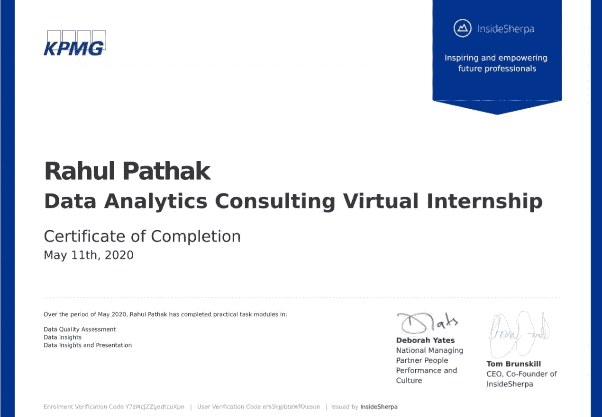

# 2020 年要做的 4 大虚拟实习

> 原文：<https://towardsdatascience.com/top-4-virtual-internships-to-do-in-2020-2fc88c97e440?source=collection_archive---------24----------------------->

## 想在这个季节有所收获吗？参加一门课程，提升自己的技能。

由 [konsangjira](https://pixabay.com/users/konsangjira-16148062/) 在 [Pixabay](https://pixabay.com/photos/work-from-computer-office-laptop-5071617/) 上拍摄的照片

由于我们都在这个**疫情**期间受到打击，并面临**隔离**，保持**乐观**心态，走出舒适区，在每一个可能的时刻提升自己变得非常重要。现在让我们记下在这个**封锁/隔离中要做的前 4 个虚拟实习。**

虚拟实习方案如下

★ **德勤科技咨询虚拟实习**

这个科技咨询虚拟实习你会做什么？

*   **技术战略&创新**
*   **优化&交付**
*   **云工程**

在开发在线银行平台之前，应考虑哪些技术方面，提供成本、收益和考虑事项的高级概述，移动化的考虑事项，制定高级实施计划并预测成本估算，定义项目方法，进行初始市场扫描以评估和选择新的财务会计系统，评估市场以了解有哪些潜在的解决方案可满足 SectorMetric 的要求，进一步分析和解决方案演示。

对选定的供应商进行进一步分析，总结您的发现，并提交您提议的解决方案，了解云计算，为客户会议准备云计算的高级概述，云可行性评估，就向云过渡的优势、风险和注意事项向客户提供建议，云就绪性评估，进行分析并推荐哪些应用程序适合向云过渡。

## 通过学习本模块，您将获得实用技能:

> **批判性思维、行业研究、项目规划、资源管理、可行性评估、价值分析、项目交付、规划、成本估算、市场扫描研究、能力、评估、标准优先排序、成本分析、实施规划、沟通、演示技巧、研究、理解云、就绪性评估、应用程序优先排序、研究、风险评估、收益分析**

该计划是自定进度的，免费的，实习结束后德勤将颁发证书。

**★ GE EXPLORER 数字技术数据分析程序**

你将在这个数字技术数据分析项目中做什么？

*   **数据工程**
*   **数据可视化**

1)使用数据工程结合全飞行发动机数据、零件制造数据、机场位置数据来确定每架飞机的飞行距离。

2)将您的工作与通用电气团队创建的真实模型解决方案进行比较。

3)使用数据创建基于模拟航空数据的运行图和 KPI(关键性能指标)表。

## 通过学习本模块，您将获得实用技能:

> **Postgres/SQL、数据编排&转换、批判性思维、运行图、通过可视化讲述数据、商业智能(BI)**

该计划是自定进度的，免费的，实习结束后通用电气将颁发证书。

★ **JP 摩根软件工程虚拟体验**

在这个软件工程虚拟体验中你会做什么？

*   **与股票价格数据馈送的接口**
*   **使用摩根大通的框架和工具**
*   **为交易员直观显示数据**

## 通过学习本模块，您将获得实用技能:

> **金融数据、Python、Git、基本编程、React、Typescript、Web 应用、技术交流、金融分析、为开源社区做贡献**

该计划是自定进度的，免费的，实习结束后，JP 摩根大通公司将颁发证书。

★ **毕马威数据分析咨询虚拟实习**

毕马威的虚拟实习包括三个阶段

*   **数据质量评估**
*   **数据洞察**
*   **数据展示**

## 通过学习本模块，您将获得实用技能:

> **数据质量分析、分析仪表板创建、数据分析、客户细分、数据驱动演示、数据仪表板、数据可视化、演示**

该计划是自定进度的，免费的，实习结束后毕马威会颁发证书。

这里有一个由毕马威数据分析虚拟实习产生的证书样本

拉胡尔·帕塔克拍摄的照片

这里是上面提到的所有虚拟实习的链接，如果感兴趣，请访问并借此机会提升自己。

 [## 德勤技术咨询虚拟实习- InsideSherpa

### 你对技术职业感兴趣吗？你天生好奇，喜欢挑战现状吗？你……

www.insidesherpa.com](https://www.insidesherpa.com/virtual-internships/prototype/FqFtWwQzNxJ8Qsh5H/Technology-Consulting)  [## 通用电气数字技术数据分析程序- InsideSherpa

### 渴望深入了解通用电气如何引领新技术时代？葛招先锋，问题…

www.insidesherpa.com](https://www.insidesherpa.com/virtual-internships/prototype/ThbphD5N5WRsd9Mxo/Digital-Technology-%28Data-Analytics%29-Virtual-Experience-Program)  [## 摩根大通软件工程虚拟体验

### 我们很高兴为您提供在摩根大通探索软件工程师生活的机会，并获得有价值的…

www.insidesherpa.com](https://www.insidesherpa.com/virtual-internships/prototype/R5iK7HMxJGBgaSbvk/Technology%20Virtual%20Experience)  [## 毕马威虚拟实习- InsideSherpa

### 评估数据质量和完整性，为分析做准备。您将从以下工作中获得实用技能…

www.insidesherpa.com](https://www.insidesherpa.com/virtual-internships/theme/m7W4GMqeT3bh9Nb2c/KPMG-Data-Analytics-Virtual-Internship) 

感谢你阅读这篇文章。如果你有任何关于上述实习的问题，请通过我的 LinkedIn 简介联系我。我很乐意帮助你，☺

由[拍摄的照片普拉蒂克·卡蒂亚尔](https://www.pexels.com/@prateekkatyal)在[的像素点](https://www.pexels.com/photo/close-up-photography-of-a-cellphone-2740955/)