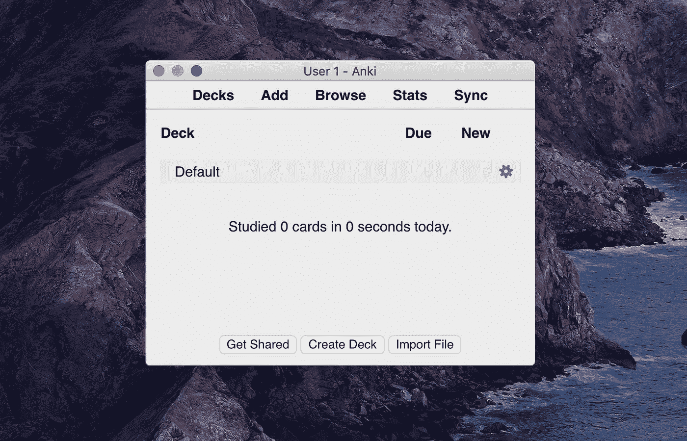

# 数据科学家的五大应用

> 原文：<https://towardsdatascience.com/top-5-apps-for-data-scientists-dc8b66886560?source=collection_archive---------9----------------------->

## 我如何跟上最新的研究？我如何记住领域中的复杂概念？在这 5 款免费应用的帮助下！


Brando 在 [Unsplash](https://unsplash.com?utm_source=medium&utm_medium=referral) 上制作品牌

我们口袋里装着功能强大的设备。我们如何使用计算能力取决于我们自己。我对尝试新的生产力应用程序持保留态度，因为效果通常与预期相反。除了电话和信息，我几乎不用手机上的任何应用程序。我甚至屏蔽了网络浏览器。然后我开始阅读生产力指南，令我惊讶的是，我发现这些应用程序真的很有用。

> 我与其在脸书和 Instagram 上浪费时间，不如试着开发肌肉记忆，打开 Anki。

**这里有几个你可能会感兴趣的链接:**

```
- [Labeling and Data Engineering for Conversational AI and Analytics](https://www.humanfirst.ai/)- [Data Science for Business Leaders](https://imp.i115008.net/c/2402645/880006/11298) [Course]- [Intro to Machine Learning with PyTorch](https://imp.i115008.net/c/2402645/788201/11298) [Course]- [Become a Growth Product Manager](https://imp.i115008.net/c/2402645/803127/11298) [Course]- [Deep Learning (Adaptive Computation and ML series)](https://amzn.to/3ncTG7D) [Ebook]- [Free skill tests for Data Scientists & Machine Learning Engineers](https://aigents.co/skills)
```

上面的一些链接是附属链接，如果你通过它们购买，我会赚取佣金。请记住，我链接课程是因为它们的质量，而不是因为我从你的购买中获得的佣金。

# **我如何记住领域内的复杂概念？**



安基

我写抽认卡并用 Anki 定期复习。Anki 是一个使用间隔重复的程序，这使得记住事情变得容易。间隔重复是一种学习技巧，通常用抽认卡来完成。新推出的难度更高的抽认卡展示频率更高，而较老的难度较低的抽认卡展示频率较低，以利用心理间隔效应[【1】](https://en.wikipedia.org/wiki/Spaced_repetition)。

Anki 比传统的学习方法更有效率，你可以大大减少你花在学习上的时间，或者大大增加你的学习量。任何需要在日常生活中记住事情的人都可以从 Anki 中受益。因为它是内容不可知的，并且支持图像、音频、视频和科学标记(通过 LaTeX)，所以可能性是无限的。

我为我觉得难以记忆的概念制作抽认卡。例如，我觉得非常直观的正则化解释。当我需要向某人解释这个概念时，我不需要考虑类比，因为我已经有了类比。

Anki 的缺点是你需要找到一种适合你的组织抽认卡的方法。没有放之四海而皆准的模式。太多的抽认卡也会很快变得杂乱无章。所以我只把它用于最重要和最难记的概念。

# 边听边学


Juja Han 在 [Unsplash](https://unsplash.com?utm_source=medium&utm_medium=referral) 上的照片

当我不听乔·罗根或蒂姆·费里斯**的播客**时，我喜欢收听:

*   [TWIML AI 播客(原本周机器学习&人工智能)](https://twimlai.com/)
*   [Lex frid man 的人工智能(AI 播客)](https://lexfridman.com/ai/)
*   [数据怀疑论者](https://dataskeptic.com/)
*   [线性离题](http://lineardigressions.com/)
*   [偏导数](http://partiallyderivative.com/)

播客主持人用简单的方式解释复杂的想法，因为没有人会理解他们🙂当有一个我不太了解的有趣想法出现时，我会记下来，然后用谷歌搜索。

# 把笔记带到 21 世纪


照片由[完美卡普西尼](https://unsplash.com/@perfecto_capucine?utm_source=medium&utm_medium=referral)在 [Unsplash](https://unsplash.com?utm_source=medium&utm_medium=referral) 上拍摄

2020 年你不能没有电子书。我用 Kindle 阅读电子书，我喜欢它的高亮显示功能。Kindle 在突出显示方面做得很好，但在浏览时用户体验很糟糕。幸运的是，有一个免费的在线服务[**clipping . io**](https://www.clippings.io/)，可以导入集锦。除此之外，它有一个友好的用户界面和许多其他功能。在我的手机上，我通过手机浏览器访问它。

# 我如何跟上最新的研究？


由 [Kon Karampelas](https://unsplash.com/@konkarampelas?utm_source=medium&utm_medium=referral) 在 [Unsplash](https://unsplash.com?utm_source=medium&utm_medium=referral) 上拍摄的照片

> Reddit 是一个基于人们兴趣的社区网络。

Reddit 无需介绍。虽然有许多社区可以进行建设性的对话，但这也可能是一把双刃剑。跟着浪费时间的社区走，你不会有太多收获。

我积极合作的社区包括:

*   r/learn 机器学习
*   [r/机器学习](https://www.reddit.com/r/MachineLearning/)

任何领域的重大突破都会在这些社区中被提及和讨论。

# 当您找到想要稍后查看的内容时


由[朱利安·圣安娜](https://unsplash.com/@jul_xander?utm_source=medium&utm_medium=referral)在 [Unsplash](https://unsplash.com?utm_source=medium&utm_medium=referral) 上拍摄的照片

这些天我们信息过剩。每当我访问 [HackerNews](https://news.ycombinator.com/) 或 [DataTau](https://datatau.net/) 时，我都会发现许多我想/应该阅读的有趣文章，但是没有时间。**口袋**前来救援！Pocket 是一个应用程序和浏览器扩展，可以存储文章并在以后查看。

# 很少值得一提

## 对于无组织的想法

每部手机都预装了**笔记应用**。市场上有更强大的应用程序，如 Evernote 或 OneNote，但对我来说，它们太臃肿，带有不必要的功能。我发现苹果的笔记应用程序真的很有用，当有一个自发的想法，想到一些我应该研究的东西时，我只是做个笔记。

## 获得灵感

我在**媒体**上发现越来越多精彩的内容。从精心编写的教程(有时甚至比文档更好)到简化的解释，这些都是深入研究的良好起点。

# 在你走之前

在 [Twitter](https://twitter.com/romanorac) 上关注我，在那里我定期[发布关于数据科学和机器学习的](https://twitter.com/romanorac/status/1328952374447267843)消息。


康特尼·赫格尔在 [Unsplash](https://unsplash.com/?utm_source=medium&utm_medium=referral) 上拍摄的照片