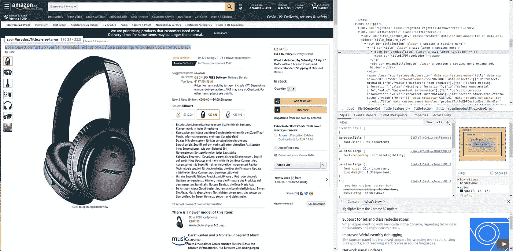
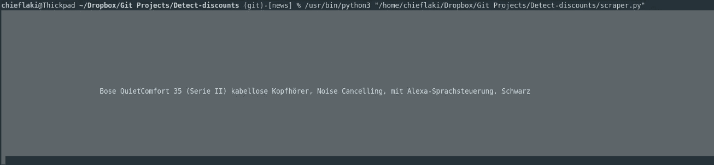
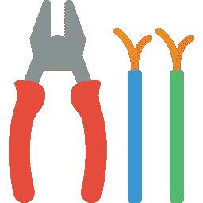
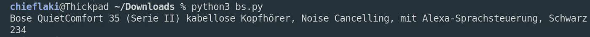

# 让你的生活更轻松的五大美味汤

> 原文：<https://towardsdatascience.com/top-5-beautiful-soup-functions-7bfe5a693482?source=collection_archive---------6----------------------->

一旦你进入[的网络搜集和数据处理领域，你会发现有很多工具可以帮你完成这项工作。其中之一是](/everything-you-need-to-know-about-web-scraping-6541b241f27e)[美汤](https://www.crummy.com/software/BeautifulSoup/bs4/doc/)，这是一个用于从 HTML 和 XML 文件中提取数据的 python 库。它创建了数据解析树以便于获取数据。


[Joshua Sortino](https://unsplash.com/@sortino?utm_source=unsplash&utm_medium=referral&utm_content=creditCopyText) 在 [Unsplash](https://unsplash.com/s/photos/data?utm_source=unsplash&utm_medium=referral&utm_content=creditCopyText) 上的原始照片

基本过程是这样的:

> 获取数据，然后按照你想要的方式进行处理。

这就是为什么今天我想向你展示一些美丽的汤提供的顶级功能。

如果你也对其他库感兴趣，比如 [Selenium](/top-25-selenium-functions-that-will-make-you-pro-in-web-scraping-5c937e027244) ，这里有一些你应该看看的例子:
我以前写过关于 Selenium 和 Web 抓取的文章，所以在你开始阅读这些之前，我建议你阅读这篇文章“[关于 Web 抓取的一切](/everything-you-need-to-know-about-web-scraping-6541b241f27e)”，因为这是一个设置过程。如果你已经比较精通网络抓取，试试我的高级脚本，比如“[如何用 Python 省钱](/how-to-save-money-with-python-8bfd7e627d13)”和“[如何用 Python 制作分析工具](/how-to-make-an-analysis-tool-using-python-c3e4477b6d8)”。

另外，为 BeautifulSoup 设置环境的一个很好的例子在文章“[如何用 Python](/how-to-save-money-with-python-8bfd7e627d13) 省钱”中。

让我们直接投入进去吧！


# 漂亮的汤设置

在我们进入前 5 个函数之前，我们必须设置我们的环境和库，我们将使用它们来获取数据。

在终端中，您应该安装库:

```
*pip3 install requests*
```

可以使用**请求**，这样您就可以通过简单的 Python 库添加内容，如标题、表单数据、多部分文件和参数。它还允许您以同样的方式访问 Python 的响应数据。

```
sudo pip3 install beautifulsoup4
```

这是我们上面已经提到过的主库美汤。

另外，当您开始启动 Python 脚本时，您应该包括我们刚刚安装的库:

```
*import* requests*from* bs4 *import* BeautifulSoup
```

现在让我们继续讨论函数！


# 获取()

这个功能绝对是必不可少的，因为有了它，你就可以进入你想要的网页。让我展示给你看。

首先，我们必须找到一个我们想要从中抓取(获取数据)的 URL:

```
URL = '[https://www.amazon.de/gp/product/B0756CYWWD/ref=as_li_tl?ie=UTF8&tag=idk01e-21&camp=1638&creative=6742&linkCode=as2&creativeASIN=B0756CYWWD&linkId=868d0edc56c291dbff697d1692708240](https://www.amazon.de/gp/product/B0756CYWWD/ref=as_li_tl?ie=UTF8&tag=idk01e-21&camp=1638&creative=6742&linkCode=as2&creativeASIN=B0756CYWWD&linkId=868d0edc56c291dbff697d1692708240)'headers = {"User-agent": 'Mozilla/5.0 (X11; Linux x86_64) AppleWebKit/537.36 (KHTML, like Gecko) Chrome/79.0.3945.130 Safari/537.36'}
```

我随机拿了一个亚马逊产品，通过 get 函数，我们可以访问网页上的数据。标题只是你的浏览器的一个定义。你可以在这里查看你的[。](http://www.xhaus.com/headers)

使用请求库，我们可以获得带有已定义标题的所需 URL。
之后，我们创建一个对象实例‘soup ’,我们可以用它在页面上找到我们想要的任何东西。

```
page = requests.get(URL, headers=headers)soup = BeautifulSoup(page.content, 'html.parser')
```

BeautifulSoup(，)创建一个表示解析后的 HTML 或 XML 文档的数据结构。
您将在 BeautifulSoup 对象上调用的大多数方法都继承自 PageElement 或 Tag。
在内部，这个类定义了将 HTML/XML 文档转换成数据结构时树构建器调用的基本接口。该接口抽象出了解析器之间的差异。

我们现在可以继续下一个函数，它实际上搜索我们刚刚创建的对象。


# 查找()

使用 find()函数，我们可以在网页中搜索任何内容。
假设我们想根据他们的 id 获得产品的标题和价格。

```
title = soup.find(id="productTitle").get_text()price = soup.find(id="priceblock_ourprice").get_text()
```

这些 Web 元素的 id 可以通过单击键盘上的 F12 或右键->“Inspect”来找到。



让我们仔细看看刚刚发生了什么！


# get_text()

正如您在前面的函数中看到的，我们使用 get_text()提取新发现的元素 title 和 price 的文本部分。

但是在我们得到最终结果之前，为了得到完美的输出，我们还需要对我们的产品做一些事情。


# 条状()

strip()方法返回删除了前导字符和尾随字符的字符串副本(基于传递的字符串参数)。

我们使用这个函数来删除标题中的空白:



这个函数也可以用在任何其他 python 用法中，不仅仅是漂亮的 Soup，但是以我个人的经验，当操作文本元素时，它已经派上用场很多次了，这就是为什么我把它放在这个列表中。



# **split()**

这个函数对于 Python 来说也是通用的，但是我发现它也非常有用。它将字符串分成不同的部分，我们可以使用我们想要的部分。它与分隔符和字符串结合使用。

我们使用 **sep** 作为价格字符串中的分隔符，并将其转换为整数(整数)。

replace()只是替换“.”带有空字符串。

```
sep = ','
con_price = price.split(sep, 1)[0]
converted_price = int(con_price.replace('.', ''))
```


以下是最终结果:



我把完整的代码放在这个要点中:

在执行之前，只需检查您的头文件。

如果您想运行它，下面是终端命令:

```
python3 bs_tutorial.py
```

> 我们完了！


# 临终遗言

如前所述，这不是我第一次写关于美丽的汤，硒和网络刮一般。我还想介绍更多的功能，还会有更多的功能。我希望你喜欢这个教程，为了跟上进度，请继续关注我！

**感谢阅读！**

[](https://medium.com/@lazar.gugleta)

查看我的**其他文章**，关注我的[媒体](https://medium.com/@lazar.gugleta)

[](https://twitter.com/intent/user?screen_name=LazarGugleta)

当我有新文章时，在 Twitter 上关注我