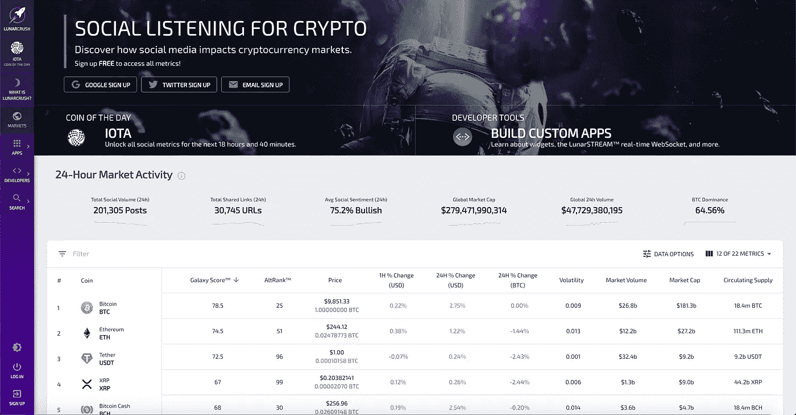
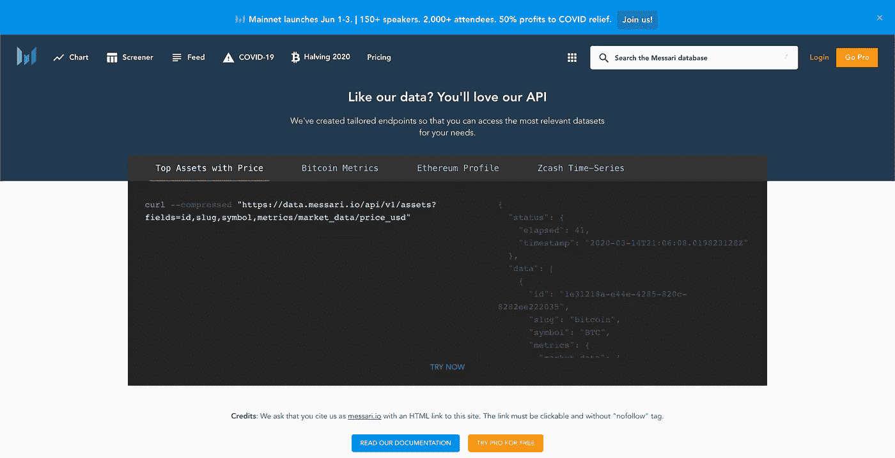
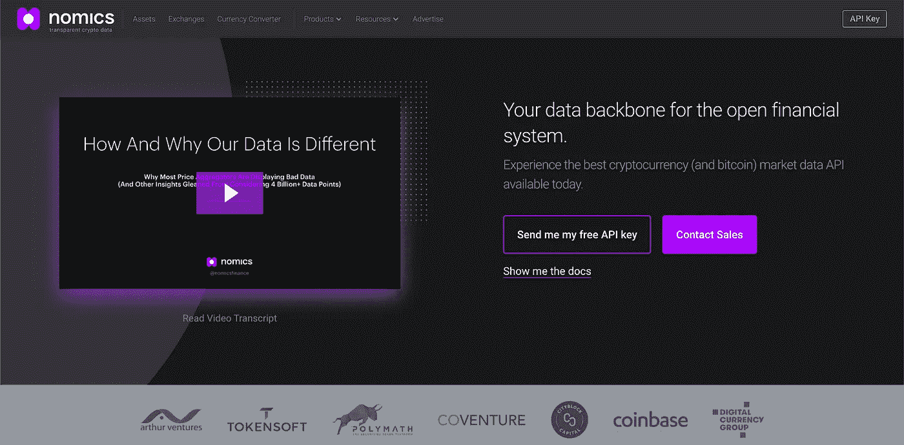
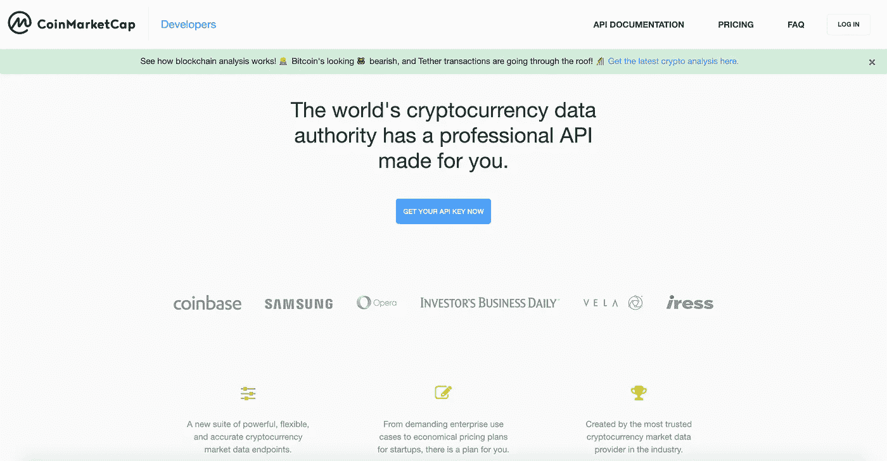
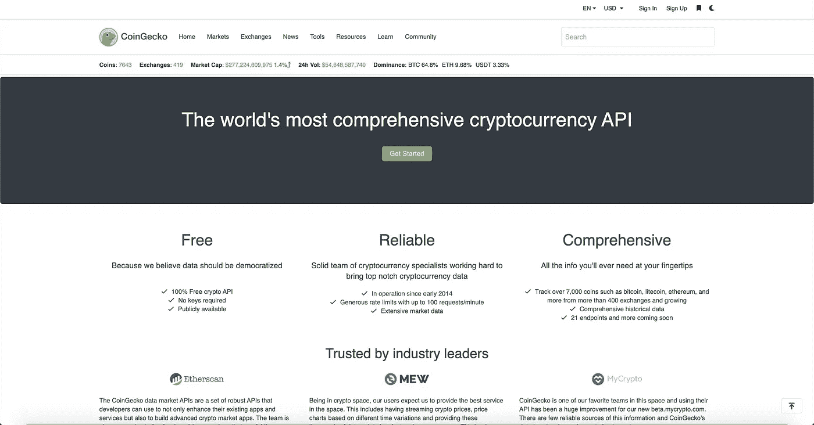

# 面向开发者的五大加密货币 API

> 原文：<https://towardsdatascience.com/top-5-best-cryptocurrency-apis-for-developers-32475d2eb749?source=collection_archive---------0----------------------->

## 加密数据 API 的数据科学指南

亚历山大·辛恩在 [Unsplash](https://unsplash.com?utm_source=medium&utm_medium=referral) 上的照片

加密货币行业引起了全球开发者、企业家和爱好者的兴趣。当以太坊 ERC20 令牌变得更加流行时，最热门的趋势是创建一个令牌，在 ICO 中拍卖，并在项目中作为公用设施进行交易或使用。这一新发现的财富创造机制帮助启动了大量项目，最终导致了 2017 年的大牛市。

今天，以太坊区块链的开发仍然很受欢迎；然而，使用加密货币市场数据的开发正在成为新的加密淘金热。

无论你是加密货币交易者、投机者、开发者还是对加密货币研究感兴趣的人，都有大量的 API 可供选择。幸运的是，我已经测试了几乎所有的顶级加密货币 API，结果令人惊讶。无论您是想利用实时加密数据来帮助交易、构建交易机器人、对加密货币进行学术研究，还是想学习使用加密数据进行编码，我都计划从日常开发人员的角度出发，就我开发的项目中使用的 API 以及我认为将使您长期受益的内容向您提供一个诚实的意见。

让我们来发现市场上最好的加密 API。

# [lunar crush——加密社交监听](https://lunarcrush.com/developers/docs)

[**lunar crush**](http://lunarcrush.com)**为成千上万的加密资产提供 API 端点。这是驱动他们的[网络应用](https://lunarcrush.com/developers/widgets)的同一个 API。访问超过 1 亿个收集的社交帖子，所有帖子都使用人工智能进行分类，并与独特的见解一起显示。这家专注于加密货币的公司每天收集超过 100，000 个社交帖子，其中有 20，000 个链接，他们支持 2000 多种加密货币。LunarCRUSH 被认为是最可靠的社区和社会洞察 API 之一。**

**LunarCRUSH 收集了超过数千种加密货币的影响者、社会影响者活动及其参与度、频率和影响的数据。这允许一些非常棒的事情，比如什么是看涨还是看跌。它还让你知道谁对机器人真正有影响力。您还可以将超过 2000 枚硬币的社交指标整合到您的 [TradingView 图表](https://lunarcrush.com/developers/tradingview)中。LunarCRUSH 拥有实时加密货币警报 LunarAlerts，用于通知加密货币价格和社会指标，这有助于自动化交易决策。**

## **LunarCRUSH API 用法**

**LunarCRUSH API 允许访问其公共[网站](http://lunarcrush.com)上的大部分可用数据。鉴于它们为收集加密货币数据提供了最大的社交数据集，我将用多个例子来扩展这一部分。**

**使用 Python 开发时要使用的基本 URL 端点:**

**`[https://api.lunarcrush.com/v2](https://lunarcrush.com/developers/docs#)`**

****资产端点:**一个或多个资产的细节、整体度量和时间序列度量。我们将所有受支持的加密货币称为资产。**

****市场终点:**所有支持资产的汇总信息，包括一些指标的 5 个最近时间序列值。**

****全局端点:**所有受支持资产的总体聚合指标。**

****供稿:**一枚或多枚硬币的社交帖子、新闻和共享链接[。](https://lunarcrush.com/feeds)**

****警报:**超出典型趋势的显著指标变化的历史时间戳记录，包括周期性的高点、低点和突然的增加或减少。**

****影响者:**个人影响者详细信息，包括实际帖子。**

****影响者:**根据关注者数量、参与度和帖子数量列出对不同资产影响最大的社交账户。**

## **LunarCRUSH API 文档**

** [## 加密货币的社交监听| LunarCRUSH

### 获取比特币、以太坊和 2000 种其他替代币和区块链的实时加密货币价格和社交数据…

lunarcrush.com](https://lunarcrush.com/developers/docs) 

## 使用 LunarCRUSH 的体验

到目前为止还不错，对吧？在测试了我能找到的几乎每一个加密数据提供者之后，LunarCRUSH API 是我最后尝试的一个。有点像隐藏的宝石，我在网上浏览教程时发现了他们，最终导致他们的 Twitter，他们在那里积极发布加密数据。虽然我曾计划把它们当作另一个 API，但是我决定更深入地研究它们所提供的东西。令我特别惊讶的是，他们提供了社交指标，如看涨和看跌情绪，以及社交网站上最有影响力的[T2 的名单。](https://lunarcrush.com/influencers)

我最初的项目是使用他们的 API 收集尽可能多的社会数据，并将这些数据输入到一个聚合模型中，该模型包含 [LunarCRUSH](https://lunarcrush.com/) 和 [Messari](https://messari.io/) 和 [Nomics](https://nomics.com/) [价格数据](https://lunarcrush.com/developers/pricing)。我目前仍在从事这个项目，我希望在未来的某个时候开源。请随时关注这个项目。我将在本文后面详述我使用其他两个 API 的经验。** 

# **[梅萨里](https://messari.io/api)**

****

**[Messari](https://messari.io/) 为成千上万的加密资产提供 API 端点。这些端点包括交易、市场数据(VWAP)、定量指标、定性信息。这是驱动他们的[网络应用](https://messari.io/)的同一个 API。它们的大多数端点都没有 API 密钥，但是它们限制了它们的速率。免费层不包括再分发的权利，并要求归属和链接到他们的网站。**

## **Messari API 用法**

**它们的基本 URL 是:`https://data.messari.io/api`，端点是版本化的(v1、v2 等。)每当引入突破性变化时。**

## **Messari API 文档**

** [## API |您可以与我们一起构建很多东西

### 梅萨里是领先的机构级比特币和加密市场数据、区块链数据、个人资料、新闻…

梅萨里·io](https://messari.io/api) 

## 与梅萨里的经历

一般来说，对于那些希望构建定制解决方案的人来说，Messari 是一个很好的 API。虽然他们的网站为交易者提供了很好的信息，但使用他们的 API 进行开发可能会很有挑战性。几年前，我在加密社区受到了积极的关注，决定跟随一个名为['](https://medium.com/@spenserhuang/exploring-messaris-crypto-api-a7aa2c03fde2)[messari-API-exploration](https://github.com/spenserhuang/messari-api-exploration)'['](https://medium.com/@spenserhuang/exploring-messaris-crypto-api-a7aa2c03fde2)的 Github 回购来碰碰运气。文档非常容易阅读，对我来说很快就能理解 API 的基础知识。从那以后，我一直使用他们的数据作为一种验证形式，用 Nomics 来构建一个聚合的加密数据中心。** 

# **[经济学](https://p.nomics.com/cryptocurrency-bitcoin-api)**

****

**[Nomics](https://nomics.com/) 是一个加密货币数据 API，专注于价格、[加密市值](https://nomics.com/)、供应和空前高的数据。他们为[货币](https://nomics.com/) & [交易所](https://nomics.com/exchanges)提供蜡烛/OHLC 数据。此外，它们还提供自 2013 年 1 月以来的历史加密货币总市值。**

**Nomics API 是面向所有开发者的资源。对于寻找廉价或免费加密 API 的典型开发人员来说，它们的价格似乎很贵。尽管如此，它们是加密行业中备受推崇的 API。**

## **Nomics API 用法**

**Nomics API 基本 url 在`https://api.nomics.com/v1`运行。所有请求都应该以服务器 URL 为前缀。**

## **Nomics API 文档**

** [## Nomics 的免费加密货币和比特币市场数据 API

### 最好的免费🚀加密货币和比特币 API。以编程方式访问当前和历史价格、市场和…

p.nomics.com](https://p.nomics.com/cryptocurrency-bitcoin-api) 

## 经济学经验

对经济学的总体积极体验让我发现了它能提供什么。Nomics API 使用起来相当简单，但当我几年前开始构建加密应用程序时，他们的 API 对我来说有点挑战性。如果你想要货币和外汇的历史蜡烛线数据，无缝原始贸易数据，或者订单数据，那么你需要为这些服务付费。如前所述，我仍然使用 Nomics API 作为我的聚合加密数据中心的加密货币市场价格验证形式，我希望在未来开源。** 

# **[CoinMarketCap](https://coinmarketcap.com/api/)**

****

**[CoinMarketCap](https://coinmarketcap.com/) 通常被认为是检查加密货币和代币价格的最佳去处。CoinMarketCap 最近被由赵昌鹏于 2017 年在中国创立的国际加密货币交易所[币安](https://binance.com)收购。**

**CoinMarketCap 为个人用户和商业用户提供 API 层。免费计划对每月可以调用的 API 数量有限制。该功能对于测试来说是不错的，但是对于那些试图构建供消费者使用的应用程序的人来说，我建议使用带有更多选项的 API。**

## **CoinMarketCap API 用法**

**通过 Python 使用他们的 API，所有请求都应该以他们的基本 URL `[https://pro-api.coinmarketcap.com](https://pro-api.coinmarketcap.com.)`为目标**

## **CoinMarketCap API 文档**

** [## 最值得信赖的加密货币市场数据 API | CoinMarketCap

### 一套新的强大、灵活、准确的加密货币市场数据端点。从要求苛刻的企业使用…

coinmarketcap.com](https://coinmarketcap.com/api/) 

## 使用 CoinMarketCap 的经验

最初发现加密数据的威力时，CMC 是我接触的第一个 API。我最初尝试使用他们的数据是通过一个价格预测模型，使用他们免费的历史数据。不幸的是，在我的项目上花了几天时间后，CMC 更新了他们的网站，所以我所有的代码都不再工作，我没有耐心去开发更多的代码。从今天起，由于用户界面的变化，我的回购不再有效。你可以在这里查看我的项目。** 

# **[守宫](https://www.coingecko.com/en/api)**

****

**[CoinGecko](https://www.coingecko.com/) 直接提供实时定价、交易量、报价器、交易所、历史数据、硬币信息&图像、开发者&社区统计、事件、全球市场和 CoinGecko Beam 硬币&交易所状态更新的数据。**

**只有 21 个端点，这可能不是贸易商和企业的最佳选择。我不建议将用于这些目的。尽管 CoinGecko 是免费的，但它很可能无法满足交易者和交易所的需求。**

## **CoinGecko API 用法**

**在 Python 中使用 CoinGecko API 时，您将需要使用它们的基本 URL `[https://api.coingecko.com/api/v3](https://api.coingecko.com/api/v3)`**

## **CoinGecko 文档**

** [## 最强大和免费的加密货币 API | CoinGecko

### 2020 年 4 月 23 日:向硬币/市场端点添加了 atl、atl_change_percentage 和 atl_date。2020 年 3 月 31 日:查询时…

www.coingecko.com](https://www.coingecko.com/en/api) 

## CoinGecko 体验

这个 API 是我开始开发项目时使用的第二个 API。我在使用 CoinGecko 时发现的挑战是缺少可用的 Python 文档。我相信 CoinGecko 有潜力成为一个免费的 API 然而，社区需要介入并为项目提供更多的文档。当我对我的项目应该使用哪种 API 进行初步研究时，简单地搜索“CoinGecko Python API”不会返回很多结果。幸运的是，我能够在 Github 上找到一个包装器，它有助于实现我的项目。我试图跟踪一个具有多种功能的 Discord 机器人的开源项目，可以在我的 [Github](https://github.com/nrese) 上查看。** 

# **结论**

**加密货币市场继续冲击主流覆盖率，增加曝光率，并被大众广泛使用。我认为在行业内开发应用程序和进行分析时取得领先是非常重要的。加密数据是一种有价值的资产，可用于进行交易、进行研究实验以及为您的组织增加透明度。密码开发的未来取决于 2020 年有多少项目将继续在应用程序编程接口中创造创新功能。**

**有大量的加密货币数据 api 可供选择，有时会让人感到不知所措。选择最好的加密货币 API 完全取决于您的需求，尤其是取决于您计划使用哪种编程语言。大多数 API 都提供加密货币价格 API 访问，所以也许你想找到一个不仅仅是价格的 API，比如社会指标。**

**我希望这篇文章能帮助你决定哪个数据提供商最适合你的项目。**

# **感谢阅读**

**欢迎提问、评论和建设性的批评。这是我发表的第一批文章之一。**

**欢迎建设性的批评和反馈。可以在 Instagram [@nirholas](http://instagram.com/nirholas?ref=hackernoon.com) 、 [LinkedIn](http://linkedin.com/in/nixholas?ref=hackernoon.com) **、**和 Twitter [@nickresendez](https://twitter.com/nickresendez) 上联系到 Nicholas Resendez，了解新文章的更新。**