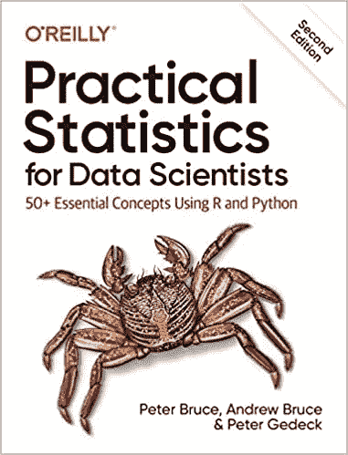
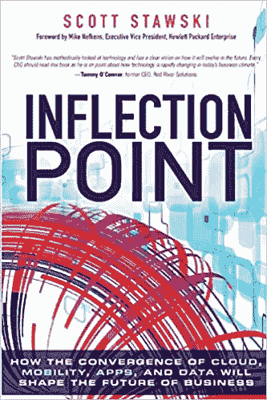
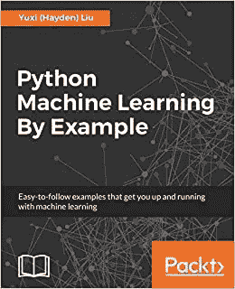
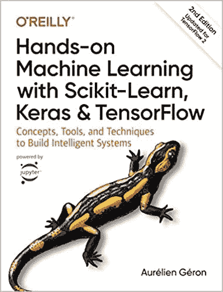

# 2021 年学习数据科学的前 5 本书

> 原文：<https://towardsdatascience.com/top-5-books-to-learn-data-science-in-2020-f43153851f14?source=collection_archive---------29----------------------->

## 以及为什么书总的来说比在线课程要好。

仅在亚马逊[1]上就有超过 20，000 种与数据科学相关的书籍，对于新人来说，选择进入该行业的最佳方式可能是一项艰巨的任务。本文旨在解决这一问题，为您提供 5 本关于统计学、数据科学的高质量书籍，同时也提供该领域的全貌。

金伯利农民在 [Unsplash](https://unsplash.com?utm_source=medium&utm_medium=referral) 上拍摄的照片

在文章的副标题中，我提到了这样一个观点，对于学习数据科学，或者事实上，学习任何其他技术技能，书籍通常比在线课程更好。如果你是在线课程的超级粉丝，我希望你正在读这一段，还没有去评论区。

我来详细说明一下。**书籍需要全神贯注**才能看完，尤其是技术书籍。另一方面，对于在线课程，我发现自己一直在看视频，但并没有真正注意。此外，书本上的知识对我们大多数人来说会更好。

不要误解我的意思，在线课程对于实践性很强的东西来说很棒，但是阅读书籍是学习基础知识和理论概念的更好的解决方案——这是跳到代码之前必须的。

将两者结合起来——基础和理论的书籍，以及实践部分的在线课程将确保你在长期内掌握这两个方面。

无论如何，你是来找前五本书的，所以让我们看看哪一本是第一本。

# 1.数据科学家实用统计学

这本书是初学者的必读之作，因为它涵盖了数据科学所有先决概念的基本概述。不太深入，不会把你烦死。你可以学习探索性数据分析的基本概念，什么是随机抽样，如何使用回归来估计结果，关键的分类技术等等。

来源:[亚马逊](https://amzn.to/3remC2x)

我发现它对初学者来说很棒，因为它都是关于基础的，这足以更深入地研究数据科学和机器学习。由于这本书没有太多的深度(对初学者来说非常好)，如果你发现自己没有理解一些更高级的概念，你将不得不寻找额外的资源。

在这里可以得到[。](https://amzn.to/3remC2x)

# 2.用于数据分析的 Python

如果你已经读过这个列表中的第一本书，那么这又是一个很好的读物，也是显而易见的下一步。这本书涵盖了几乎所有可能的数据分析方法，以及 T2 Python 编程语言的基础知识。

来源:[亚马逊](https://amzn.to/34JLdEB)

我特别喜欢这本书的一点是，作者让你很好地了解了作为一名数据分析师/科学家你应该期待什么。总之，这本书组织得很好，读起来很愉快，它的节奏完美，一切都解释得很简单。

这里可以得到[。](https://amzn.to/34JLdEB)

# 3.拐点

如果你刚刚读了前两本书，你可能需要从技术书籍中解脱出来。这就是这个发挥作用的地方。

来源:[亚马逊](https://amzn.to/3GvbOTV)

如果你已经决定涉足 IT，或者更准确地说是数据科学，那么暂时放下所有的技术工作，专注于商业视角是一件好事。

这本书总结了作者的个人经历和故事，让读者熟悉这个行业的*——IT、大数据和云是如何工作的。如果你将来想在数据科学领域找份工作，了解这一切是如何联系在一起的对你有好处。*

*在这里可以得到[。](https://amzn.to/3GvbOTV)*

# *4.Python 机器学习示例*

*现在，您已经了解了一些统计学、Python 编程、数据分析的基础知识，并且对您的角色以及您将与之共事的其他人的角色有了坚实的业务理解。接下来要学的逻辑就是，你已经猜到了，**机器学习**！*

**

*来源:[亚马逊](https://amzn.to/3nmLQuw)*

*这本书还涵盖了 Python 的基础知识。因为这部分已经在第二本书里讲过了，你可以跳过它或者再复习一遍来巩固你的知识。*

*此外，这本书以有趣的方式涵盖了一些机器学习的经典例子。作者分享了他在优化方面的经验和最佳实践，以及其他你可能会发现对工作有用的东西。*

*总的来说，这是一本好书。*

*你可以在这里买到。*

# *5.使用 Scikit-Learn 和 TensorFlow 进行机器实践学习*

*这当然是我读过的最长的数据科学书籍之一，但是包含了惊人的信息。是最容易推荐的书籍之一。*

**

*来源:[亚马逊](https://amzn.to/3qtxMB2)*

*你不仅会深入研究机器学习，还会花大量时间在最受欢迎的库中进行深度学习——**tensor flow**。*

*在阅读和完成练习后，你会知道足够深入深度学习，开发解决现实世界问题的应用程序，但你也应该知道足够开始申请工作。*

*你可以在这里买到[。](https://amzn.to/3qtxMB2)*

# *结论*

*如果你是一个初学者，通读这 5 本书(按照准确的顺序)将会花费你几个月的时间。你也可以更进一步，用**在线课程**补充实践部分，只是为了获得不同的观点。*

*如果你不能决定参加哪门额外的视频课程，这篇文章可以帮助你:*

* [## 学习机器学习的三大资源

### 想找应用机器学习的课程？或者更理论的东西？从这里开始。

towardsdatascience.com](/top-3-resources-to-learn-machine-learning-a2adcda40fd) 

感谢阅读。* 

**喜欢这篇文章吗？成为* [*中等会员*](https://medium.com/@radecicdario/membership) *继续无限制学习。如果你使用下面的链接，我会收到你的一部分会员费，不需要你额外付费。**

* [## 通过我的推荐链接加入 Medium-Dario rade ci

### 作为一个媒体会员，你的会员费的一部分会给你阅读的作家，你可以完全接触到每一个故事…

medium.com](https://medium.com/@radecicdario/membership)* 

# *参考*

*[1][https://www.amazon.com/s?k=data+science&ref = nb _ sb _ noss _ 2](https://www.amazon.com/s?k=data+science&ref=nb_sb_noss_2)*