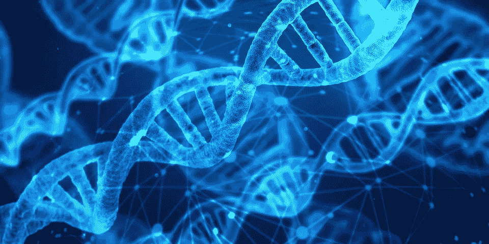

# 能让你在 6 个月内成为人工智能/人工智能专家的前 5 门课程

> 原文：<https://towardsdatascience.com/top-5-courses-that-can-make-you-an-ai-ml-expert-within-6-months-53af64c26d73?source=collection_archive---------2----------------------->

## 你是一个试图在互联网上寻找能让你成为人工智能或人工智能领域专家的最佳在线课程的人吗？如果是的话，那么这篇短文就是给你看的！

图片来源: [Pixabay](https://cdn.pixabay.com/photo/2018/07/15/10/44/dna-3539309__480.jpg)

****更新**如果你喜欢这篇文章，并希望更多地支持我为社区所做的贡献，请看看我的书“** [**【应用机器学习可解释技术**](https://www.amazon.com/dp/1803246154/ref=as_sl_pc_as_ss_li_til?tag=adib0073-20&linkCode=w00&linkId=74817cc3f53ad04fe861a6ed9f619830&creativeASIN=1803246154) **”，这是 GitHub 资源库，其中包含许多关于书中各个章节的实践教程:**[**https://GitHub . com/packt publishing/Applied-Machine-Learning-explability-Techniques**](https://github.com/PacktPublishing/Applied-Machine-Learning-Explainability-Techniques)**。如果你喜欢 GitHub 资源库中提供的教程，请在资源库中做 fork 和 star，以示你对这个项目的支持！请订购本书的** [**实体本**](https://www.amazon.com/dp/1803246154/ref=as_sl_pc_as_ss_li_til?tag=adib0073-20&linkCode=w00&linkId=74817cc3f53ad04fe861a6ed9f619830&creativeASIN=1803246154) **或** [**电子本**](https://www.amazon.com/dp/B0B2PTF5PC/ref=as_sl_pc_as_ss_li_til?tag=adib0073-20&linkCode=w00&linkId=e180f73d5590baee93582fc1a8b17d15&creativeASIN=B0B2PTF5PC) **以示支持。**

 [## 应用机器学习可解释技术:使 ML 模型可解释和可信…

### 应用机器学习可解释技术:使 ML 模型可解释和可信赖的实践…

www.amazon.com](https://www.amazon.com/Applied-Machine-Learning-Explainability-Techniques/dp/1803246154?_encoding=UTF8&pd_rd_w=Wr6SJ&content-id=amzn1.sym.716a1ed9-074f-4780-9325-0019fece3c64&pf_rd_p=716a1ed9-074f-4780-9325-0019fece3c64&pf_rd_r=6P2PM599T97MRG7NZD9J&pd_rd_wg=m4qUW&pd_rd_r=6e349d93-5ba0-4bfe-9055-905c0153fe58&linkCode=li3&tag=adib0073-20&linkId=35506e1847de5c011fc57aa66c2b1d8e&language=en_US&ref_=as_li_ss_il) 

每当我发表关于数据科学、机器学习或人工智能的公开会议时，我经常会收到这样的问题“*我如何开始在数据科学、人工智能或人工智能领域建立职业生涯？*“虽然这个问题在任何地方都很常见，但有时答案会因受众而大相径庭。对于大学生来说，答案会有所不同，对于初级专业人员来说，答案会略有不同，而对于高级或中级专业人员来说，答案又会不同。但是为了概括答案，我的常规答案是:

1.  我强烈建议关注与 AI/ML 相关的在线博客和文章，并亲自实施项目以获得实践经验。我的博客网站可以是一个很好的起点:【https://aditya-bhattacharya.net/blogs/[。一个知名网站上的快速在线课程也有助于基础知识的入门。](https://aditya-bhattacharya.net/blogs/)
2.  利用 [Kaggle](https://www.kaggle.com/) 解决几乎现实生活中的数据科学问题
3.  在博客/文章中阐述学习内容，并在您的网站或热门网站上发布，如[走向数据科学、数据驱动投资者、分析、Vidhya 或任何其他媒体出版物](https://medium.com/@adib0073)或[个人博客网站](https://aditya-bhattacharya.net/)
4.  维护 [GitHub](https://github.com/adib0073) 中的工作，通过分享您的代码或参加 [GitHub](https://github.com/adib0073) 或 [Stackoverflow 论坛](https://stackoverflow.com/users/12407899/aditya-bhattacharya)与社区分享并为社区做贡献
5.  通过实践和实际项目学习实际用例
6.  加入数据科学协会/学习小组，积极参与他们的会议、讨论，并不断学习以在该领域成长。MUST Research 就是这样一个伟大的社区:[https://must.co.in/](https://must.co.in/)，MUST Research 也有自己的认证计划，为开始在数据科学、ML 和 AI 领域的职业生涯量身定制:[https://academy.must.co.in/](https://academy.must.co.in/)，我强烈推荐。

说到这里，这些都是 DS/AI/ML 职业生涯的伟大起点。但是下一个明显的问题是，如何加速和提升到下一个水平，成为人工智能/人工智能专家？

因此，在这篇文章中，我想强调一下 **5 门专业在线课程**，它们可以让你成为人工智能、人工智能和数字系统领域的专家。

[**人工智能纳米程序**](https://www.udacity.com/course/ai-artificial-intelligence-nanodegree--nd898?irclickid=1gX1LqVDGxyORarwUx0Mo3QUUkiTxQVcZQ6xUI0&irgwc=1&utm_source=affiliate&utm_medium=ads_n&aff=2422388)

来自 Udacity 的[人工智能纳米学位课程](https://www.udacity.com/course/ai-artificial-intelligence-nanodegree--nd898?irclickid=1gX1LqVDGxyORarwUx0Mo3QUUkiTxQVcZQ6xUI0&irgwc=1&utm_source=affiliate&utm_medium=ads_n&aff=2422388)是为工作专业人士精心设计和定制的，旨在开发基本的人工智能直觉，并加速学习构建实际的人工智能应用程序。

 [## 人工智能

### 纳米学位课程的先决知识这个项目需要线性代数，统计和 Python 的经验…

imp.i115008.net](https://imp.i115008.net/c/2422388/788805/11298?prodsku=nd898&u=https%3A%2F%2Fwww.udacity.com%2Fcourse%2Fai-artificial-intelligence-nanodegree--nd898&intsrc=PUI1_5678) 

像 [**彼得·诺维格**](https://en.wikipedia.org/wiki/Peter_Norvig) 和 [**巴斯蒂安·特龙**](https://en.wikipedia.org/wiki/Sebastian_Thrun) 这样的人工智能专家，会对搜索、优化、规划、模式识别等相关算法给出深入的直觉。要做的作业和实际项目简直太棒了，在这门课程之后，人们实际上可以设计自己的无人驾驶汽车原型！来自行业专家的真实世界项目肯定会让所有课程参与者成为机器人人工智能领域的实用专家。

该课程通常需要 2.5 至 3 个月完成，可以很容易地做全职工作！我强烈推荐这门课程给初至中高级的专业人士。所以，如果你对机器人和人工智能感兴趣，那么你可以停止拖延，开始上这门[课程](https://www.udacity.com/course/ai-artificial-intelligence-nanodegree--nd898?irclickid=XSRTjlUsfxyOT-zwUx0Mo3Q3UkiT3RxQZQ6xUI0&irgwc=1&utm_source=affiliate&utm_medium=ads_n&aff=2422388)！

[**计算机视觉纳米级程序**](https://www.udacity.com/course/computer-vision-nanodegree--nd891?irclickid=1gX1LqVDGxyORarwUx0Mo3QUUkiT3WVsZQ6xUI0&irgwc=1&utm_source=affiliate&utm_medium=ads_n&aff=2422388)

已经认识我的许多人都知道，计算机视觉是我最感兴趣的领域之一。虽然有许多与计算机视觉相关的在线课程使用了经典方法和现代深度学习方法，但来自 Udacity 的这个[纳米学位项目经过精心设计，将传统的计算机视觉方法与基于现代深度学习的新方法相结合。](https://www.udacity.com/course/computer-vision-nanodegree--nd891?irclickid=1gX1LqVDGxyORarwUx0Mo3QUUkiT3WVsZQ6xUI0&irgwc=1&utm_source=affiliate&utm_medium=ads_n&aff=2422388)

 [## 成为计算机视觉专家

### 纳米学位课程的先决知识这个项目需要与 Python，统计学，机器学习的经验…

imp.i115008.net](https://imp.i115008.net/c/2422388/788805/11298?prodsku=nd891&u=https%3A%2F%2Fwww.udacity.com%2Fcourse%2Fcomputer-vision-nanodegree--nd891&intsrc=PUI1_5678) 

这门课程还提供了一种实用的动手方法，作为课程一部分的项目和作业简直令人惊叹。如果你懂 Python 或者 Matlab，还懂一点 Open-CV，并且想推进你的职业生涯，成为一名计算机视觉专家，[这个课程强烈推荐给你](https://www.udacity.com/course/computer-vision-nanodegree--nd891?irclickid=1gX1LqVDGxyORarwUx0Mo3QUUkiT3WVsZQ6xUI0&irgwc=1&utm_source=affiliate&utm_medium=ads_n&aff=2422388)！这门课程也需要大约 3 个月的时间来完成，但就我个人而言，除了[这门课程](https://www.udacity.com/course/computer-vision-nanodegree--nd891?irclickid=1gX1LqVDGxyORarwUx0Mo3QUUkiT3WVsZQ6xUI0&irgwc=1&utm_source=affiliate&utm_medium=ads_n&aff=2422388)，我没有见过任何其他关于计算机视觉的专业课程，它提供了视觉领域的深入工作知识。

[**应用数据科学计划**](https://academy.must.co.in/)

上述纳米学位课程肯定会让你成为所提到的选择性领域的专家，但如果你想成为应用数据科学家，你需要在多个领域拥有行业级的专业知识，如经典机器学习、深度学习、自然语言处理、计算机视觉、无监督学习、数据可视化等。特别是对于早期的专业人员，所有主要组织都希望获得应用数据科学的全面知识。因此，由乔伊·穆斯塔菲 领导的来自 MUST 研究院的应用数据科学项目就是这样一个独特的项目，它可以指导 AI 或 DS 爱好者在 6 个月内成为专家。这个项目最好的部分是最后的顶点项目，它将指导所有的学生执行一个研究项目，甚至发表一篇研究论文。

因此，如果你对研究和实用数据科学有浓厚的兴趣，我强烈建议你参加这个课程，向行业专家学习，并开发一套全面的技能。

[**人工智能医疗**](https://www.udacity.com/course/ai-for-healthcare-nanodegree--nd320?irclickid=1gX1LqVDGxyORarwUx0Mo3QUUkiT3SU8ZQ6xUI0&irgwc=1&utm_source=affiliate&utm_medium=ads_n&aff=2422388) [**纳米级程序**](https://www.udacity.com/course/ai-for-healthcare-nanodegree--nd320?irclickid=1gX1LqVDGxyORarwUx0Mo3QUUkiT3SU8ZQ6xUI0&irgwc=1&utm_source=affiliate&utm_medium=ads_n&aff=2422388)

考虑到 Covid19 的现状，医疗保健将是未来重要的领域之一，其中 AI、DS 和 DL 将产生巨大影响，并可以显著改善医疗保健体验！[来自 udacity 的这一专业化纳米学位课程](https://www.udacity.com/course/ai-for-healthcare-nanodegree--nd320?irclickid=1gX1LqVDGxyORarwUx0Mo3QUUkiT3SU8ZQ6xUI0&irgwc=1&utm_source=affiliate&utm_medium=ads_n&aff=2422388)可以帮助您开发一套非常适合的技能，将人工智能应用于医学成像数据、电子健康记录数据，甚至从健身带等电子设备获得的健康数据。

 [## 学会在医疗保健中利用人工智能

### 新的！纳米学位项目以个性化服务取得成功，我们为您的每一步需求提供量身定制的服务…

imp.i115008.net](https://imp.i115008.net/c/2422388/788805/11298?prodsku=nd320&u=https%3A%2F%2Fwww.udacity.com%2Fcourse%2Fai-for-healthcare-nanodegree--nd320&intsrc=PUI1_5678) 

对于人工智能专家来说，应用机器学习和深度学习模型来自动化分析医疗保健数据的过程有多么重要，我怎么强调都不为过。因此，如果你想学习如何推动人工智能改善人类健康，并在大约 3 个月内每周抽出近 15 个小时的时间，[人工智能在医疗保健中的专业化纳米学位课程](https://imp.i115008.net/c/2422388/788805/11298?prodsku=nd320&u=https%3A%2F%2Fwww.udacity.com%2Fcourse%2Fai-for-healthcare-nanodegree--nd320&intsrc=PUI1_5678)可以让你成为这一领域的专家。

[**深度学习专精**](https://www.coursera.org/specializations/deep-learning)

来自 deeplearning.ai 和 coursera 的深度学习专业化课程是我参加过的最顶尖的[深度学习专业化](https://www.deeplearning.ai/)课程之一。该课程提供了关于深度学习的广泛主题的直觉，从超参数调整到卷积神经网络再到递归神经网络。

虽然，我会把这门课程推荐给刚接触深度学习的人，而不是高级深度学习相关工作的人，但我仍然会把这门课程放在我最喜欢的前五名名单中，因为它确实提供了关于深度学习的实用知识， [**【吴恩达】**](https://www.linkedin.com/in/andrewyng) 的教学简直太棒了，可以让你在几个月内成为深度学习专家！

****更新**如果你喜欢这篇文章，并希望更多地支持我为社区所做的贡献，请看看我的书“** [**【应用机器学习可解释技术**](https://www.amazon.com/dp/1803246154/ref=as_sl_pc_as_ss_li_til?tag=adib0073-20&linkCode=w00&linkId=74817cc3f53ad04fe861a6ed9f619830&creativeASIN=1803246154) **”，这是 GitHub 资源库，其中包含许多关于书中各个章节的实践教程:**[**https://GitHub . com/packt publishing/Applied-Machine-Learning-explability-Techniques**](https://github.com/PacktPublishing/Applied-Machine-Learning-Explainability-Techniques)**。如果你喜欢 GitHub 资源库中提供的教程，请在资源库中做 fork 和 star，以示你对这个项目的支持！这本书现在接受预购。请订购本书的** [**实体本**](https://www.amazon.com/dp/1803246154/ref=as_sl_pc_as_ss_li_til?tag=adib0073-20&linkCode=w00&linkId=74817cc3f53ad04fe861a6ed9f619830&creativeASIN=1803246154) **或** [**电子本**](https://www.amazon.com/dp/B0B2PTF5PC/ref=as_sl_pc_as_ss_li_til?tag=adib0073-20&linkCode=w00&linkId=e180f73d5590baee93582fc1a8b17d15&creativeASIN=B0B2PTF5PC) **以示支持。**

 [## 应用机器学习可解释技术:使 ML 模型可解释和可信…

### 应用机器学习可解释技术:使 ML 模型可解释和可信赖的实践…

www.amazon.com](https://www.amazon.com/Applied-Machine-Learning-Explainability-Techniques/dp/1803246154?_encoding=UTF8&pd_rd_w=Wr6SJ&content-id=amzn1.sym.716a1ed9-074f-4780-9325-0019fece3c64&pf_rd_p=716a1ed9-074f-4780-9325-0019fece3c64&pf_rd_r=6P2PM599T97MRG7NZD9J&pd_rd_wg=m4qUW&pd_rd_r=6e349d93-5ba0-4bfe-9055-905c0153fe58&linkCode=li3&tag=adib0073-20&linkId=35506e1847de5c011fc57aa66c2b1d8e&language=en_US&ref_=as_li_ss_il) 

因此，这就把我们带到了本文的结尾。以上是我个人的最爱，这 5 门专业化课程其实可以让你在 6 个月内成为 AI/ML 专家。希望我能帮上忙！继续关注:[*https://medium.com/@adib0073*](https://medium.com/@adib0073)*以及我的网站:*[https://www.aditya-bhattacharya.net/](https://aditya-bhattacharya.net/)*更多*！