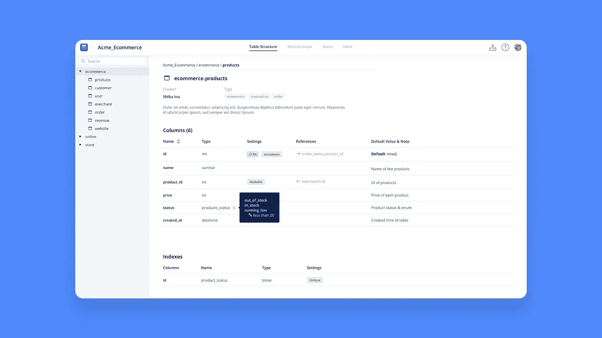
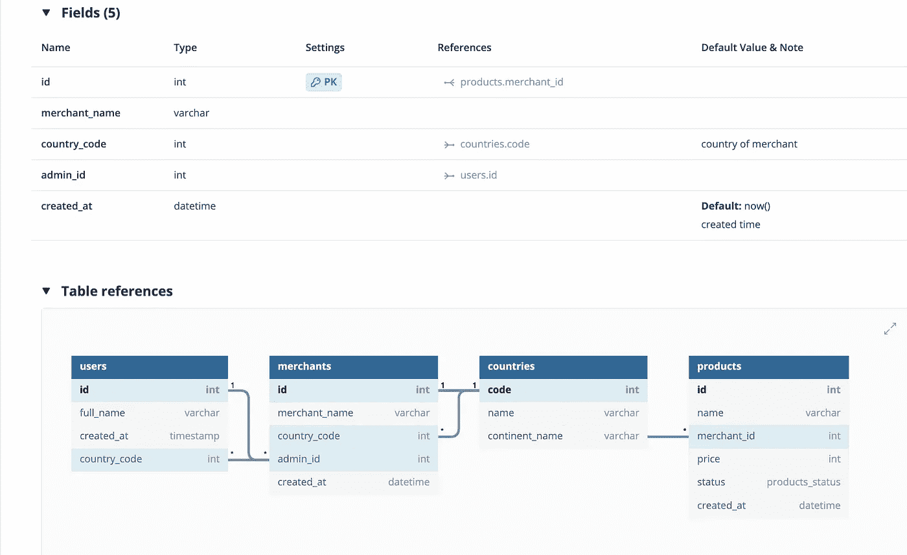
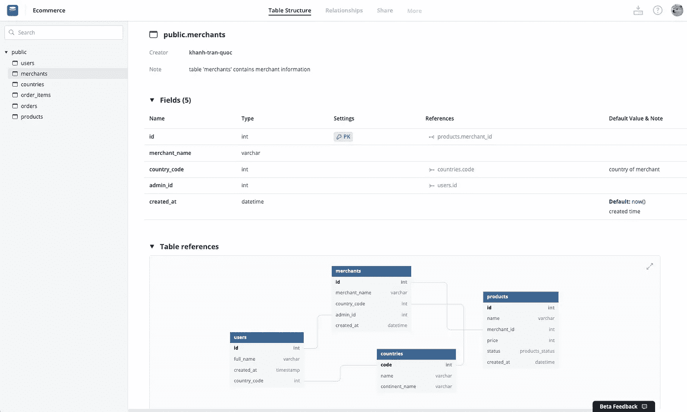
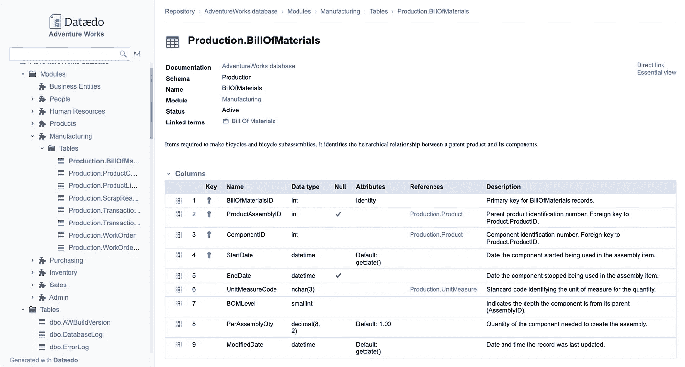
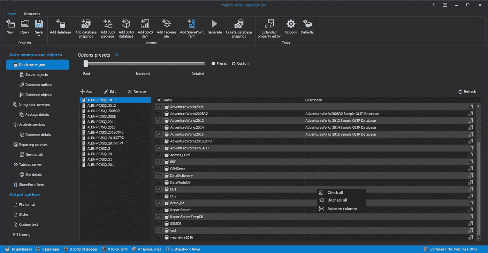
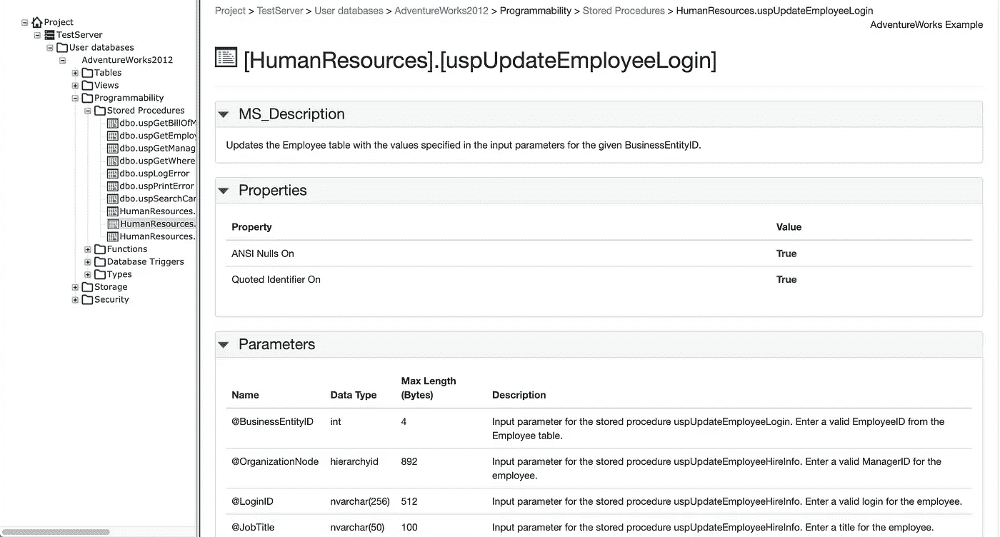
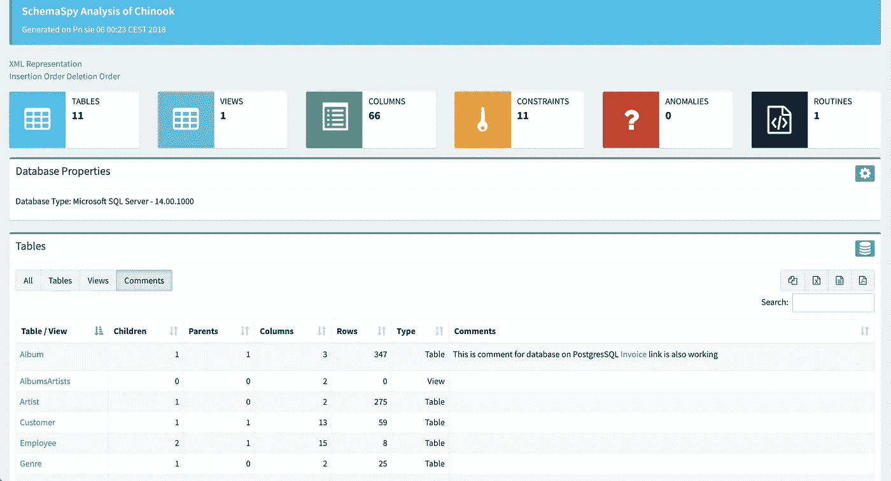

# 2020 年任何团队的 5 大数据库文档工具

> 原文：<https://towardsdatascience.com/top-5-database-documentation-tools-for-any-team-in-2020-e968bb5319b3?source=collection_archive---------21----------------------->

## 数据爱好者/工具

## 以及为什么你迟早需要一个。

来源:dbdocs.io

数据库可能很复杂，令人望而生畏。

作为一名开发人员(尤其是如果你来自后端团队)，你有多少次被非技术团队成员或客户的电子邮件轰炸，询问字段的含义？

记录和组织数据库的元数据在这方面很重要，但这不是我们的首要任务。由于数据库复杂的性质，我们经常避免维护它，或者更糟糕的是，首先创建它。

这就是数据库文档工具派上用场的地方。除了帮助您使用预定义的格式为数据库创建详细的数据目录之外，工具对于整个团队来说也是一笔巨大的财富。

这篇博客文章将与你分享数据库文档工具的真正重要性，以及你应该用来提高你个人和团队生产力的 5 大工具。

# 什么是数据库文档工具？

互联网上没有具体的、被广泛接受的文档工具的定义，所以我将尝试从我自己的知识和研究中总结一下。

数据库文档工具充当数据目录，以简化的表格格式捕获数据库的所有信息。

它最常用作提供表模式的粒度细节的数据字典，或者提供数据库内部所有关系的概述的单一事实来源。

字段细节和表格引用是任何数据库文档工具最基本的元素。来源:dbdocs.io

# 为什么我们需要一个数据库文档工具？

文档工具有短期和长期的好处。

然而，由于大多数人只意识到其暂时的优势，而忽略了大局，他们往往把这些工具视为一个临时的解决方案。

数据库文档工具的一些更明显的**短期利益**是:

*   帮助开发人员快速构建当前项目的数据库结构原型
*   业务成员(销售、BA)可以轻松理解开发人员输入的具有丰富元数据的表字段的上下文和含义

然而，正是**的长期利益**使得数据库目录工具真正有价值:

*   工具可以帮助开发人员生成一个完整的数据库文档，作为每个人的单一事实来源。现在，数据库的知识不再局限于任何高级开发人员，而是随着他们离开公司而走出大门。它留下了。
*   当团队扩大时，共享数据 wiki 可以帮助避免未来的冲突。资深开发人员可以很容易地用一个数据源来接纳新手。
*   一些工具允许共享，外部用户可以在线访问最新版本的数据库文档。不需要手动截图或会议。这将有助于节省你的编码时间，是的，但从长远来看，也提高了企业的生产力和声誉，特别是如果你的企业是在咨询行业。

# 2020 年 5 大数据库文档工具

2020 用户要求 [2020 设计风格](https://uxdesign.cc/biggest-design-trends-for-2020-8988bf2d5caa) s。

没有人愿意使用那些设计风格可以追溯到 90 年代的工具。

此外，数据分析领域正变得越来越复杂。团队更加意识到[构建一个可扩展的分析栈](https://www.holistics.io/books/setup-analytics/)，将更多的注意力放在他们的数据仓库上。

因此，数据库的复杂性和规模都在增长，以处理大量的数据源。

因此，我们需要功能强大的工具来适应数据库的增长，但它们必须是轻量级的，设计得足够漂亮，以便为我们日益繁忙的开发人员节省时间。

下面我们列出了符合这些要求的 5 种数据库文档工具:

*   dbdocs.io
*   达泰多
*   ApexSQL 文档
*   RedGate SQL 文档
*   图式

# dbdocs.io

来源: [https://dbdocs.io](https://dbdocs.io)

dbdocs.io 是一个免费的简单工具，可以为你的数据库创建基于网络的数据库文档。与大多数竞争对手不同， [dbdocs.io](http://dbdocs.io) 是最轻量级的，不需要复杂的设置。

此外，dbdocs 有自己的 DSL 语言，可以帮助开发人员快速定义和记录他们的数据库模式和结构。你可以在这里查看一个[样本文档。](https://dbdocs.io/khanh-tran-quoc/Ecommerce)

**定价**

dbdocs 正处于测试阶段，所以它是完全免费的。你可以从这里开始。

**优点**

*   重量轻，安装简单。通过 CLI 安装 dbdocs 的唯一要求是拥有 NodeJS 和 NPM(大多数开发人员已经拥有)。不需要连接到任何数据库。
*   使用[DBML](https://www.dbml.org/)——它自己的开源 DSL 语言，一种超快速的文档数据库方式。您可以完全控制要添加到文档中的模式、关系和元数据。
*   拥有数据库结构的可视化概览以及每个表及其关系的单独视图。您可以使用带有 [dbdiagram.io](http://dbdiagram.io) 的 dbdocs 来快速原型化您的数据库 ERD。
*   通过简单的链接与团队成员轻松共享文档。如果您正在使用客户端，请使用密码保护来保持文件的私密性，只有那些有密码的人才能访问。
*   轻松集成到您的工作流程中。在 git repo 中创建一个 DBML 文件，并在每次提交时更新它。
*   适用于任何操作系统。dbdocs 只需要一个简单的代码编辑器和一个 CLI 工具来生成文档(例如，Windows 和 Mac 中的终端)，这意味着它可供任何用户使用！
*   即时电子邮件支持

**缺点**

*   dbdocs.io 是一个相当新的工具，因此它缺乏某些功能，如版本控制或深度编辑功能。但是据他们的开发者说，这些功能已经在路线图上了。
*   dbdocs 不允许协同编辑。目前，每个开发人员都可以使用本地 DBML 文件编辑文档，因此一个人所做的更改不会反映在另一个人的文档中。
*   dbdocs 不像它的大多数竞争对手那样支持`export`特性，但它很快就会可用。

# 达泰多

来源:[https://dataedo.com](https://dataedo.com)

Dataedo 是一个高级数据库文档工具，包括数据字典、ERD 和业务术语表。

它将连接到一个广泛的数据源列表(即 MySQL、PostgreSQL、Oracle、Amazon Redshift……)并提取元数据，您可以向其中添加更有意义的自定义信息。

像 dbdocs 一样，Dataedo 允许开发人员用 ER 图可视化数据模型。

**定价**

Dataedo 有三种定价方案: **Pro** 、 **Pro+** 和 **Enterprise** 。

专业版每个用户每月 39 美元(30.11 英镑)，有标准的电子邮件支持和五个自定义字段。Pro+版本每个用户每月花费 79 美元(60.99 英镑)，有 10 个自定义字段和优先级支持。

企业版的价格为每个用户每月 159 美元(122.74 英镑)，包含 100 个定制字段，具有模式更改跟踪和业务术语表**等额外功能。**他们还提供定制定价计划，以防您发现当前计划不合适。

**优点**

*   支持大量数据源
*   易于创建的 ER 图:只需拖放数据表和数据，就可以自动检测和可视化它们之间的关系。
*   丰富的元数据:用户可以用自定义字段和丰富的文本描述数据元素，或者将表组织到不同的模块中
*   可共享性:除了 PDF 和 Excel 格式，用户可以生成一个交互式的 HTML，不需要专门的服务器

**缺点**

*   初创公司可能会发现定价有点高。
*   复杂的设置
*   该工具需要一个陡峭的学习曲线才能充分发挥其威力
*   仅适用于 Windows 用户

# ApexSQL

来源:https://www.apexsql.com/sql-tools-doc.aspx

[ApexSQL](https://www.apexsql.com/sql-tools-doc.aspx) 不仅是 SQL 的强大工具，也是 SSIS、SSAS、SSRS 和 Tableau 文档的强大工具。ApexSQL 最令人印象深刻的特性就是定制。您可以使用不同的样式、自定义文本、主题和图形来完全自定义文档及其布局。

**定价**

ApexSQL 每个用户仅花费 699 美元。从长远来看，这听起来是一项合理的投资，但这意味着该工具仅限于一个用户使用。

**优点**

*   强大的定制和个性化功能
*   各种服务的支持文档
*   轻松自动化和安排文档
*   支持多种输出格式(CHM、HTML、Word、MD 和 PDF)
*   包括图形关系和数据模型图

**缺点**

*   仅适用于 Windows 用户
*   对于有多个用户的团队来说，想要协作地记录他们的数据库，前期成本很高
*   需要一个陡峭的学习曲线来充分利用它的力量
*   过时的设计风格

# Redgate SQL 文档

来源:[https://www.red-gate.com/products/sql-development/sql-doc/](https://www.red-gate.com/products/sql-development/sql-doc/)

[Redgate SQL Doc](https://www.red-gate.com/products/sql-development/sql-doc/) 是一款帮助你快速自动为你的数据库生成文档的工具。您可以获得数据库模式、对象间和数据库间依赖关系的概述，以及帮助用户找到所需内容的注释。您还可以通过右键单击对象资源管理器来记录 SSMS 中的数据库。

你可以在这里查看样品[。](https://assets.red-gate.com/products/sql-development/sql-doc/browse-sql-doc/main.html)

**定价**

Redgate SQL Doc 适用于广泛的用途。如果您的团队有 1-4 个用户，则每个用户的费用为 385 美元(终身)，包括 1 年的支持和升级。如果你的团队有 5-9 个用户，那么每个用户的花费会少一点，只有 327 美元。如果你的团队有 10-20 个用户，那就是 308 美元。对于超过 20 个用户，您可以联系团队以获得个性化报价。

**优点**

*   从 CLI 轻松自动化文档
*   支持多种输出格式(PDF、HTML、MS Word)

**缺点**

*   Redgate SQL Doc 主要用于查看目的，因此其编辑能力非常有限。您不能更改表字段、类型和值，它们是任何模式的基本组件。您只能编辑描述。
*   过时的设计风格(用户界面和 UX)
*   无法创建 ER 图表

# 图式

来源:http://schemaspy.org/

SchemaSpy 是这个列表中的第二个免费工具。这是一个基于 Java、基于 CLI 的工具(需要 Java 5 或更高版本)，它分析数据库模式的元数据，并以浏览器可显示的格式生成它的可视化表示

您可以在此查看文档[的预览。](http://schemaspy.org/sample/index.html)

**定价**

SchemaSpy 可以免费使用。

**优点**

*   SchemaSpy 是免费的、轻量级的。如果与具有几乎相同的特性集(除了生成实体关系图)的 RedGate SQL Doc 相比，SchemaSpy 无疑具有价格优势
*   易于设置和配置
*   SchemaSpy 可以扫描并生成数据库的全面元数据(表、列、约束、关系、孤立表、异常、例程)
*   支持表注释的降价！

**缺点**

*   该项目已近一年未更新(最新版本 v6.1.0 发布于 2019 年 9 月 18 日)。看起来这个神奇工具的所有者不会积极支持它，所以如果你期待不断的更新和新功能，那么这个工具可能不适合你。
*   SchemaSpy 编辑功能有限。它既不能向表组件添加注释，也不能直接编辑/添加当前模式的更多元数据。
*   过时的设计风格(尤其是图表)

# 结论

每个文档工具都是为特定的需求而设计的，所以了解第一手的业务需求是非常重要的。

如果您只想生成当前数据库的只读版本，那么 RedGate SQL Doc 和 SchemaSpy 是最佳选择。虽然 SchemaSpy 适合预算有限的团队，但 RedGate SQL Doc 可能会给您更多的保证，因为该产品仍在积极开发中。

如果您需要用更多的元数据和视觉上漂亮的 ER 图来丰富您的文档，您肯定应该选择 [dbdocs.io](http://dbdocs.io) 。它自己的语言(DBML)不需要太多的学习，比传统的 DDL 语言(如 SQL)更容易编写、阅读和维护。此外，这个工具是咨询初创公司/中小型企业的首选，因为它是免费的，具有带密码保护的可共享文档，并且可以在任何操作系统上使用。

如果您的企业很大，并且有大量的数据库文档专用预算，那么 dataedo 是 [dbdocs.io](http://dbdocs.io) 的一个可能的替代方案。它的功能比 [dbdocs.io](http://dbdocs.io) 稍多，需要更陡峭的学习曲线，这可能会成为就业的障碍。

如果您的首要任务是记录广泛的服务(和大量定制)，那么 ApexSQL 是首屈一指的！与 Dataedo 类似，该工具适用于数据团队预算较大的团队，因为其前期成本和每用户定价模型较高。

*原载于 2020 年 6 月 30 日*[*https://www . holistics . io*](https://www.holistics.io/blog/top-5-database-documentation-tools-for-any-teams-in-2020/)*。*