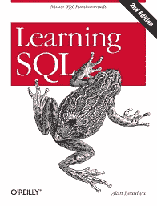

# 学习 SQL 的五大免费资源

> 原文：<https://towardsdatascience.com/top-5-free-resources-for-learning-sql-537e6c4e4d6c?source=collection_archive---------24----------------------->

## 免费学习最受欢迎的技术技能

卢克·切瑟在 [Unsplash](https://unsplash.com/s/photos/data?utm_source=unsplash&utm_medium=referral&utm_content=creditCopyText) 上的照片

根据最近来自 Burning Glass 的一份[报告，SQL 是 2020 年 2 月至 3 月发布的公开招聘中最受欢迎的技术技能。企业正在收集越来越多的数据，如何从这种资产中获取价值的问题正成为企业的困扰。](https://insights.dice.com/2020/03/20/demand-skills-february-march-2020-python-sql/)

> 我们正在进入一个数据可能比软件更重要的新世界。"， [*蒂姆·奥赖利*](https://www.oreilly.com/tim/) *，方正，* [*奥赖利传媒*](https://www.oreilly.com/)

绝大多数企业数据仍然以行和列的形式存储在数据库中，SQL(结构化查询语言)是一种使企业能够提取、转换和加载这些数据的语言。因此，SQL 是开发任何增值数据产品的基础。

我正在为完全的初学者运行一个在线 SQL 课程。我组织的这个项目使用了现有的免费在线资源，我通过每周视频电话来指导我的学生。在这篇文章中，我想与你分享我们在学习 SQL 的过程中使用的五个最好的免费资源。

# **1。SQLBolt**

 [## SQLBolt -学习 SQL-SQL 介绍

### 欢迎使用 SQLBolt，这是一系列交互式课程和练习，旨在帮助您在工作中快速学习 SQL

sqlbolt.com](https://sqlbolt.com/) 

SQLBolt 是一门完全免费的完全互动的入门课程。除了创建、更新和删除表之外，还涵盖了所有 SQL 基础知识，包括编写查询、过滤、连接、聚合。

在介绍完每个概念后，需要完成一些实践练习，这有助于巩固您对所涵盖主题的理解。

# 2.可汗学院

Khan Academy[SQL 简介课程](https://www.khanacademy.org/computing/computer-programming/sql/sql-basics/v/welcome-to-sql)是对 SQLBolt 的一个很好的补充，因为它包含了基于视频的类似概念的内容。这提供了一些有用的背景和更深入的解释。它也包括一些实用的互动练习。

# 3.Pop SQL

 [## 学习 SQL | PopSQL

### 现在免费试用。编写查询、可视化数据并共享结果。通过 URL 共享查询，并将它们组织在…

popsql.com](https://popsql.com/learn-sql) 

Pop SQL 实际上是一个非常有趣的协作 SQL 查询工具。它使多个用户能够共享查询，将常用查询存储在可搜索的库中，并为分析提供可视化界面。

Pop SQL 网站还在“ [Learn SQL](https://popsql.com/learn-sql) ”部分提供了全面的 SQL 教程库。特别有用的是，这些是按数据库类型组织的，例如，Redshift 或 MySQL 特定教程。如果您想了解不同平台之间的语法差异，这很有帮助。

# 4.SQLcourse.com

 [## SQL 解释器:SQL 结果

### 通过提交您的信息，您同意 SQLCourse 可以通过电子邮件、电话和短信向您发送 SQLCourse 报价…

www.sqlcourse.com](http://www.sqlcourse.com/cgi-bin/interpreter.cgi?sql_cmd=select+first%2C+age%0D%0Afrom+empinfo%3B) 

本课程在格式上类似于 SQLBolt。这是非常互动的大量实践练习，你可以在他们的 SQL 编辑器中完成。还有一个 sqlcourse2.com，使用相同的格式和编辑器涵盖了更高级的概念。

# 5.Alan Beaulieu《学习 SQL》

学习 SQL:【Amazon.co.uk 

如果您想对 SQL 语言有更深入的了解，那么一本书会是您资源列表中的一个有用的补充。***Alan Beaulieu***的《学习 SQL》是我发现的最好的书之一，可以通过这个 [PDF](http://www.r-5.org/files/books/computers/languages/sql/mysql/Alan_Beaulieu-Learning_SQL-EN.pdf) 免费在线阅读。

这本书提供了一些有用的语言起源和用法的背景知识，提供了查询和表设计的概述，并涵盖了一些比上面列出的课程更高级的 SQL 主题。

在当今的商业世界中，诸如 SQL 之类的较老的编程语言仍然非常受欢迎。幸运的是，SQL 是最容易学习的语言之一，正如我在授课过程中发现的那样，来自许多不同背景的人可以通过在线学习相对快速地掌握这项技能。

感谢阅读！

[**我每月发一份简讯，如果你想加入，请通过此链接注册。期待成为您学习旅程的一部分！**](https://mailchi.mp/ce8ccd91d6d5/datacademy-signup)