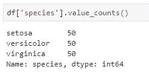

# 熊猫探索性数据分析的 5 大功能

> 原文：<https://towardsdatascience.com/top-5-functions-for-exploratory-data-analysis-with-pandas-7b3cbe1a1566?source=collection_archive---------12----------------------->

## 或者再多几个？

当谈到数据科学或数据分析时，Python 几乎总是首选语言。它的图书馆熊猫是你不能，更重要的是，不应该回避的。

马修·施瓦茨在 [Unsplash](https://unsplash.com?utm_source=medium&utm_medium=referral) 拍摄的照片

虽然 Pandas 本身并不难学，主要是因为它有不言自明的方法名，但是拥有一个备忘单仍然是值得的，尤其是如果您想快速编写代码的话。这就是为什么今天我想把重点放在我如何使用 Pandas 来做探索性数据分析上，通过向你提供我最常用的方法列表以及对这些方法的详细解释。

我不想过多地介绍，所以我将快速浏览一下所用的数据集，然后我们将进入正题。

## 使用的数据集

没有必要使用复杂的数据集来演示简单的想法，因此考虑到这一点，我决定使用**虹膜数据集**。如果您决定跟随代码，您可以在[链接](https://gist.githubusercontent.com/netj/8836201/raw/6f9306ad21398ea43cba4f7d537619d0e07d5ae3/iris.csv)上找到数据集。

下面是如何导入 Pandas 库并加载到数据集中:

好了，让我们不要浪费更多的时间，看看 EDA 过程通常是什么样子，熊猫式的。

# 1.头部()、尾部()和样本()

我决定将这三个放在同一个桶中，因为它们背后的主要思想是相同的——那就是在不可视化的情况下查看数据的样子。

毫无疑问，我可以说这 3 种方法是我最先使用的方法之一，重点是最后一种，因为如果你处理的是顺序数据，那么`head()`和`tail()`可能会产生误导。

总之，下面是如何在我们的数据集上使用它们:

对于最后一个，不能保证你会得到相同的结果——由于**随机效应**——没有任何错误。

关于这三种方法没有太多要说的，使用它们来初步查看您的数据，但仅此而已。

# 2.描述()

如果在探索性数据分析的过程中有一件事是你反复做的，那就是为每个(或几乎每个)属性执行**统计汇总**。

如果没有合适的工具，这将是一个非常乏味的过程——但谢天谢地，熊猫在这里为你做繁重的工作。`describe()`方法将对每个数字列进行快速统计汇总，如下所示:

简而言之，这是一个熊猫数据框架，没有人强迫你保留每一个统计值。以下是如何只保留均值、中值和标准差的方法:

注意我是如何使用 transpose 操作符从列切换到行的，反之亦然。

# 3.nsmallest()和 nlargest()

我想这两种方法的目的是毋庸置疑的，尽管如此，它们在探索性数据分析的过程中是有价值的。

我经常在对数据集进行统计汇总后使用它们，以检查某个感兴趣的属性是否包含极端值或相当静态。

让我们看看如何找到具有最小值`sepal_width`的 5 个观察值:

另一方面，下面是如何找到具有最大值`petal_width`的 5 个元素:

差不多就是这些了——这里没什么好说的了。

# 4.isnull()

缺失值是数据分析的一大部分，这是毫无疑问的。不太可能在每个时间点都能得到所有的观察结果，原因可能有很多——从特定领域的原因到简单的人为错误。

因此，每个探索性数据分析过程的一部分就是**测试缺失值**并找出如何处理它们。

熊猫图书馆这里也有你。我们可以检查整个数据帧上的缺失值:

现在 Iris 数据集完全没有缺失值，但这并不意味着我们可以进一步探索。

由于 Python 将 True 计算为 1，将 False 计算为 0，我们可以使用`sum()`函数来获得一些具体的数字，而不是上面的布尔数据帧:

现在，这个看起来更舒服。如果我们想检查整个数据集中缺失值的总数，而不是特定列中缺失值的总数，没有什么可以阻止我们再次使用`sum()`函数:

# 5.值计数()

如果您正在寻找一种方法，能够告诉您一个属性的单个可能选项有多少个观察值，请不要再找了。

`value_counts()`方法可以为您完成所有这些工作，还可以选择计算缺失值，甚至以百分比显示结果。

现在，您不会在整个数据帧上使用该方法，而是在单个属性上使用。这里有一个例子:

这里揭示了另一个重要的思想——如果您关心简洁的输出，最好在分类属性上使用这种方法。如果你没有那么幸运，你可以参考像`cut()`这样的方法将连续变量转换成分类变量。

如果您的属性包含缺失值，`value_counts()`不会自动考虑它们-您需要指定:

类似地，有时返回百分比而不是计划整数更好——这样更容易向他人展示结果:

# 在你走之前

我希望这篇文章能够在 Python、Pandas 和探索性数据分析方面为您指明正确的方向。

就我个人而言，我不会在实际项目中使用更多的方法，但诀窍是事先进行适当的数据操作和转换。分析本身就变得微不足道了。

感谢阅读。

*喜欢这篇文章吗？成为* [*中等会员*](https://medium.com/@radecicdario/membership) *继续无限制学习。如果你使用下面的链接，我会收到你的一部分会员费，不需要你额外付费。*

 [## 通过我的推荐链接加入 Medium-Dario rade ci

### 作为一个媒体会员，你的会员费的一部分会给你阅读的作家，你可以完全接触到每一个故事…

medium.com](https://medium.com/@radecicdario/membership)