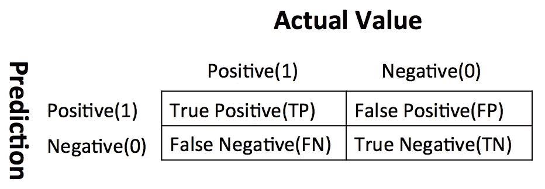
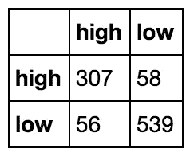
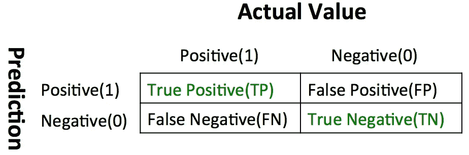
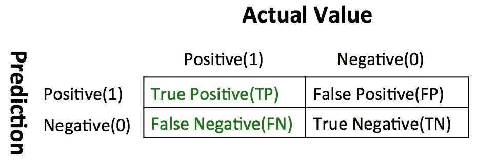
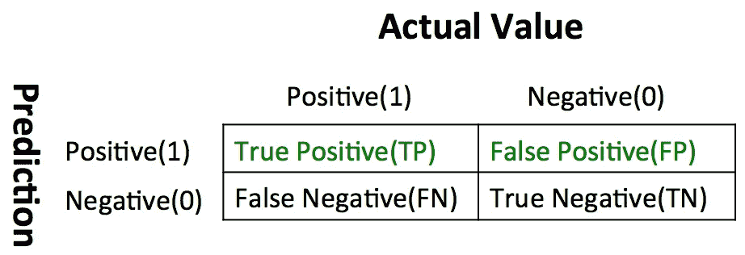
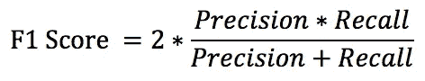
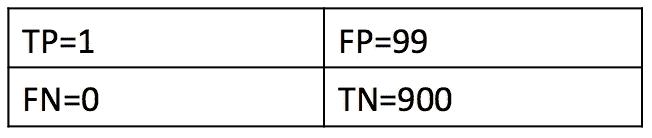
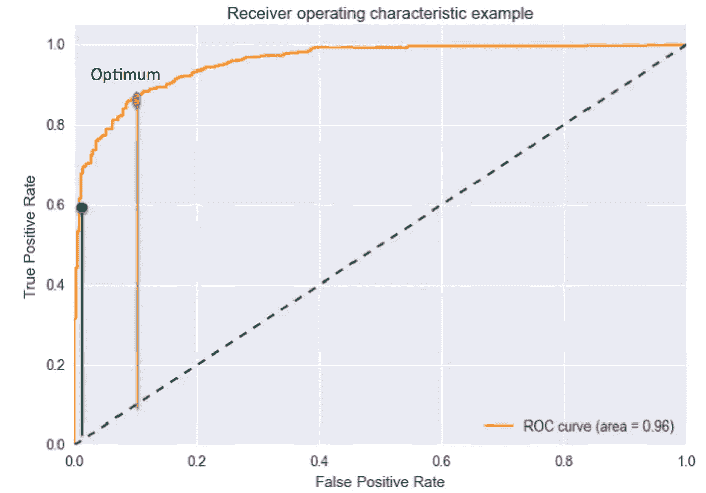
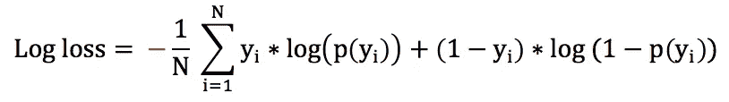
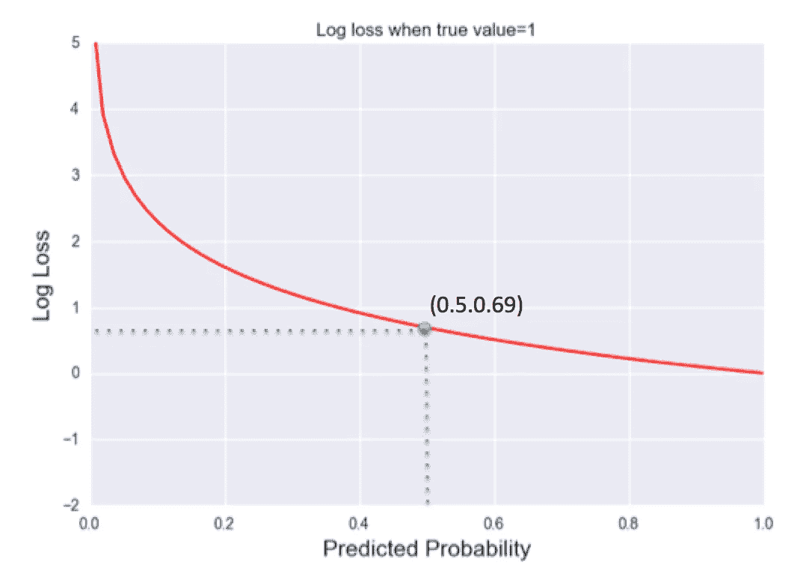

# 如何评价我的分类模型结果

> 原文：<https://towardsdatascience.com/top-5-metrics-for-evaluating-classification-model-83ede24c7584?source=collection_archive---------16----------------------->

混淆矩阵、ROC-AUC、F1 得分、对数损失


来源:照片由来自 Unsplash 的 Annie Spratt 拍摄

与回归模型不同，当我们评估分类模型结果时，我们不仅要关注预测结果，还需要考虑每一类的预测概率和预测能力。

网上有很多关于分类指标选择的文章，这里我将只使用我自己的话来解释我的 5 个最重要的指标，在你评估你的分类模型之前，你应该考虑和知道。

> 1.混淆矩阵
> 
> 2.准确度、召回率、精确度
> 
> 3.F1 分数
> 
> 4.接收操作特性(ROC)，曲线下面积(AUC)
> 
> 5.原木损失

上面的列表没有按照重要性的顺序排列。为了便于说明，我将使用一个住房数据示例来展示预测住房价格范围的分类结果。

# 1.混淆矩阵

## 什么是混淆矩阵？

从名字我们可以看出，混淆矩阵输出是一个矩阵，它相当'混淆'？不过，如果你懂逻辑的话，其实还是挺直观的。混淆矩阵是一个 2*2 的表(用于二进制分类),它是许多其他度量的基础。假设您的分类只有两类结果(1 或 0)，混淆矩阵是您的预测(1 或 0)与实际值(1 或 0)的组合。



来源:作者-困惑矩阵

> **真阳性:**正确预测阳性结果的情况
> 
> **假阳性:**预测结果为阳性但实际为阴性的情况
> 
> **假阴性:**案例然后你预测结果是阴性，但实际上是阳性
> 
> **真阴性:**正确预测阴性结果的情况

在这四个部分中，第一个词表示你的预测是否正确，第二个词表示你的预测值。查看**您的分类模型在不同价值类别上的表现非常有用。矩阵不仅仅局限于 2*2，如果你的分类结果有 2 个以上的类别，你可以看到一个更大的矩阵。**

## [示例](https://scikit-learn.org/stable/modules/generated/sklearn.metrics.confusion_matrix.html)

```
#Calculate confusion matrix
from sklearn.metrics import confusion_matrix
matrix=confusion_matrix(y_test, y_predicted,labels=['high','low'])
cm=pd.DataFrame(matrix,index=['high','low'],columns=['high','low'])
print(cm)
```



混淆矩阵示例

在这里，我将房价分为高和低，你可以看到不同类别的分类结果。注意，在 sklearn 包中，y 轴是真值，为什么 x 值是不同于正常约定的预测值。在这里，您只能看到绝对数字，而不能直接看到百分比指标。

# 2.准确度、召回率、精确度

这 3 个指标直接从混淆矩阵结果中计算得出，是基于您从混淆矩阵中看到的绝对数字的百分比指标。

## [精度](https://scikit-learn.org/stable/modules/generated/sklearn.metrics.accuracy_score.html)

准确性纯粹是您总体上正确预测的案例的百分比。



来源:作者-准确性计算

准确度= (TP+TN)/(TP+TN+FP+FN)

## 什么时候使用准确性？

准确性是衡量整体模型表现的一个很好的标准。然而，它并没有告诉你在每个类别中的表现，因此，如果你单纯地看准确性，你可能会错过重要的信息。当不同类别中的大量案例相似或与其他指标一起使用时，最好使用**。**

## [回忆](https://scikit-learn.org/stable/modules/generated/sklearn.metrics.recall_score.html)

召回衡量实际**阳性病例**被正确识别的百分比。



来源:作者-回忆计算

召回= TP/(TP+FN)

## 何时使用召回？

当**的目标是获取最大数量的阳性病例**时，使用召回。例如，在最近的新冠肺炎疫情中，政府希望跟踪社区中所有的感染病例。如果你建立了一个模型，根据症状来预测这个人是否感染了新冠肺炎病毒，回忆将是一个重要的衡量指标。

## [精度](https://scikit-learn.org/stable/modules/generated/sklearn.metrics.precision_score.html)

精确测量在预测为阳性的案例中，有多少百分比是真正的阳性。



来源:作者-精确计算

精度= TP/(TP+FP)

## 何时使用 Precision？

当您想要**非常精确地测量阳性病例**时，使用 Precision。它总是**与召回相冲突，因为您想要捕获的阳性案例越多，您将被归类为阳性案例的标准就越低**。在新冠肺炎病例的例子中，如果您想要捕获更多的感染病例，您可能想要包括所有具有轻微症状的病例，这些症状可能只是由于普通流感引起的。

## 例子

```
#Calculate Accuracy
from sklearn.metrics import accuracy_score
accuracy_score(y_test,y_predicted)
# Accuracy is 0.88124999999999998#Calculate Recall
from sklearn.metrics import recall_score
recall_score(y_test, y_predicted)
#Recall is 0.84109589041095889#Calculate Precision
from sklearn.metrics import precision_score
precision_score(y_test, y_predicted)
# Precision is 0.84573002754820936
```

我们可以看到，这里的准确率略高于召回率和准确率，因为该模型在负面(低价)情况下预测得更好。

# 3.F1 分数

## F1 成绩是多少？

考虑到精确度和召回率之间的冲突特征，F1 分数被创建为**具有召回率和精确度之间的平衡度量**。这是回忆和精确的调和平均值。



F1 得分公式

## 为什么我们需要 F1 的分数？

你可能要问:为什么我们不简单地平均精度和召回率？嗯，如果正面和负面案例的分布非常不均匀，平均值可能不能很好地代表模型性能。



在上面的例子中，只有一个真实的阳性案例，模型捕捉到了它。然而，在确定为阳性的 100 个病例中，只有 1 个是真正阳性的。因此，召回率=1，精确度=0.01。两者之间的平均值是 0.505，这显然不能很好地代表模型有多差。F1 得分= 2*(1*0.01)/(1+0.01)=0.0198，这更好地展示了模型的表现。

## [例子](https://scikit-learn.org/stable/modules/generated/sklearn.metrics.f1_score.html)

```
#calculate F1 score
from sklearn.metrics import f1_score
f1_score(y_test,y_predicted)
# F1 score is 0.84340659340659341
```

# 4.接收操作特性(ROC)，曲线下面积(AUC)

AUC 是 ROC 曲线下的面积，它是两个方面的良好衡量标准:

1.  该模型如何区分这两个类别(积极和消极)
2.  模型对不同类别的识别有多准确(比如它是否正确地将 A 组识别为阳性)？

## 那么什么是 ROC 曲线呢？

这里，我们需要首先理解两个指标:

1.  真实阳性率(TPR): TPR 实际上等于回忆真实阳性案例中，有多少百分比在模型中被正确捕获
2.  假阳性率(NPR):这衡量在真正阴性的病例中，有多少百分比实际上是假阳性。

TPR 和 NPR 正相关。这是因为当你想在你的分类模型中捕获更多的正面案例时，不可避免地你会错误地分类其中的一些案例，并且 NPR 会增加。 **ROC 曲线是对 NPR 绘制的 TPR，曲线下的面积越大，不同组之间的分离越好。**

## 例子

```
#Calculate AUC 
from sklearn.metrics import roc_curve, auc
fpr, tpr, treshold = roc_curve(y_test, y_score_new)
roc_auc = auc(fpr, tpr)
#auc is 0.96
```



来源:作者 ROC 曲线

对于 2 类(1 或 0)上的分类问题，你瞎猜的概率是 50%。当你盲目猜测类别时，蓝色虚线显示曲线 TPR 和 FPR，对于该对角线，曲线下面积(AUC)为 0.5。

**曲线上的每个点代表 TPR 和 FPR 之间不同的分界点**。例如，如果我不能容忍任何假阳性率(< 0.01)，那么我能达到的真阳性率在 0.6 左右(见图上的绿点)。如果我把自己的标准放宽一点，只需要把 FPR 控制在 0.1 以下，那么我的 TPR 就可以达到 0.9(见图上的红点)。

阈值的选择基于不同的业务需求，通常情况下，**最佳选择是最大化 TPR 和 FPR 之间的差异，在图上用橙色和蓝色虚线(见红线)**之间的最大垂直距离表示。我们的预测示例具有相当好的 AUC(0.96)，优化点在(0.1，0.9)左右

您可以在以下链接中找到有关 ROC-AUC 的更多信息:

[](/deep-dive-into-roc-auc-cfdd78959ac3) [## 深入研究 ROC-AUC

### 什么是 ROC 曲线，我们如何解读它？

towardsdatascience.com](/deep-dive-into-roc-auc-cfdd78959ac3) 

# 5.对数损失/二元交叉熵

日志损失函数惩罚错误分类的案例，并且对正确分类的案例缺乏信心。与 ROC-AUC 相同，它不仅考虑分类准确性或结果，还考虑分配给模型中每个病例的概率。模型越好，测井曲线损失值越低。



对数损失公式

y 是真实结果(0 或 1)，p 函数是模型预测结果为 1 的概率。因此，如果实际值为 1，我们希望最大化分配给预测 1 的概率，即 p(y ),而如果实际值为 0，我们希望最大化预测 0 的概率，即 1-p(y)。这是求和符号之后我们想要最大化的部分。值在 0-1 之间的对数函数为负。因此，为了使整个值为正，函数前面有一个负号，我们需要最小化整个函数。

## 日志损失的可接受值是多少？



来源:作者-日志损失值曲线

对数损失值可以从 0 变化到无穷大。但是如果按照公式计算，如果只是盲目的给每种情况分配 50%，那么 log loss 函数就是 0.69。因此，您应该明确地将日志损失值保持在 0.69 以下，并根据业务需求来决定阈值。

## [例子](https://scikit-learn.org/stable/modules/generated/sklearn.metrics.log_loss.html)

```
#Calculate log loss
from sklearn.metrics import log_loss
log_loss(y_test,y_score)
#log loss is 0.32241485496779987
```

# 建议

总之，不同的度量服务于不同的目的，并且可以相应地应用于不同的问题。**但是，一般建议使用 ROC-AOC 或对数损失，因为它们考虑了每类预测的预测概率。**尽管两种模型都能正确预测这种情况，但 90%置信度的预测模型肯定比 51%置信度的预测模型更受青睐。

如果您有兴趣知道回归模型使用什么指标，可以参考下面的链接:

[](/what-are-the-best-metrics-to-evaluate-your-regression-model-418ca481755b) [## 评估您的回归模型的最佳指标是什么？

### 缅因州 RMSE MSE 的 r 广场

towardsdatascience.com](/what-are-the-best-metrics-to-evaluate-your-regression-model-418ca481755b)