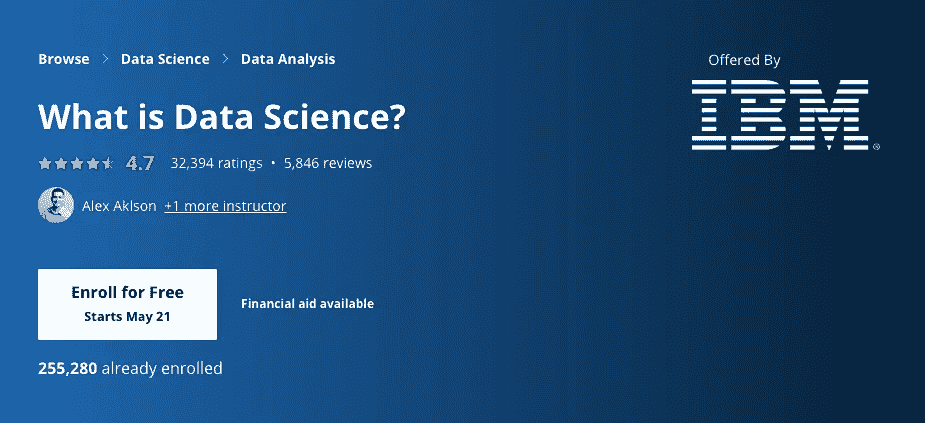
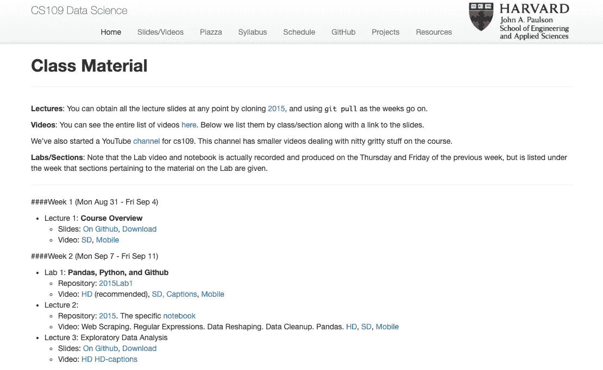
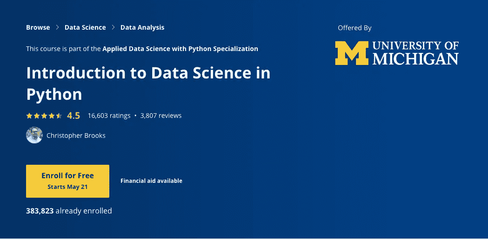
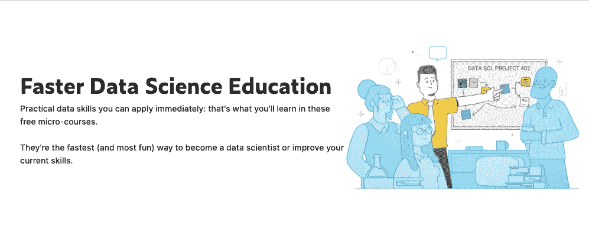
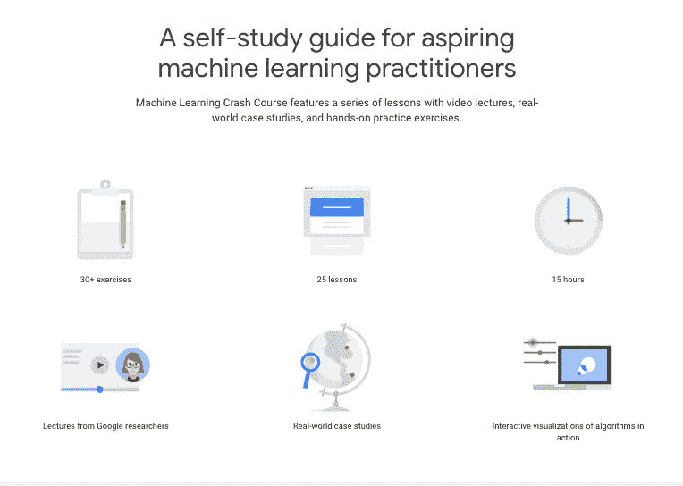

# 让您立即开始学习数据科学的 5 大在线课程。

> 原文：<https://towardsdatascience.com/top-5-online-courses-to-get-you-started-with-data-science-today-a3752bc6d7d8?source=collection_archive---------32----------------------->

## 以下是让我开始学习数据科学的在线课程。

图为[加藤裕](https://unsplash.com/@yukato?utm_source=medium&utm_medium=referral)在 [Unsplash](https://unsplash.com?utm_source=medium&utm_medium=referral)

数据科学仍然是 2020 年最受欢迎的专业之一。事实上，需求正在飙升，以至于数据科学技能缺口将持续扩大，因为数据奇才的供应赶不上世界各地公司的需求。

也就是说，有成千上万的学生跳入这个领域，在大学里接受这个复杂的课题，这样他们就可以跟上潮流，在这个多学科的职业生涯中有一个机会。由于像 [Glassdoor 的 50 个最好的工作](https://www.glassdoor.com/List/Best-Jobs-in-America-LST_KQ0,20.htm)这样的报告连续 4 年将数据科学视为征服者，以及大量的文章和在线课程促使和影响年轻人开始努力掌握数据科学。

然而，有了互联网，一些大胆的人决定制定自己的课程或途径来学习数据科学。由于数据科学已经变得民主化，今天几乎任何人都可以学习它，即使没有受过正规教育，自学也是完全可能的。

因此，这篇文章是写给所有想学习数据科学的人，或者你一直想了解更多，但不知道从哪里开始。在本文中，我分享了让我开始学习数据科学并让我对将数据转化为见解充满热情的 5 门课程。

但是在开始学习这些课程之前，这里有一些先决条件。

*   基本的计算机科学知识
*   基本编程技能
*   好奇心
*   热情
*   决心

解决了这个问题后，看看下面的列表吧！

# 1.[什么是数据科学— IBM](https://www.coursera.org/learn/what-is-datascience)

coursera.org

Coursera 是当今最好的 MOOC/在线学习平台之一，它有无数令人惊叹的课程来提升你在编程、数学、机器学习等方面的水平。

由 IBM 提供的课程“什么是数据科学”是所有数据科学爱好者的一个很好的起点，它探索了人类如何从远古时代的数据中发现见解和趋势。快进到今天，在这个时代，人工智能正在某些领域取代人类，数据呈指数级增长，数据科学可以做令人惊叹的事情。

在本课程中，您将发现什么是真正的数据科学，该领域涉及的重要主题-神经网络、Hadoop、大数据，以及如何在业务中使用数据魔法。

# 2.[CS109——哈佛大学](http://cs109.github.io/2015/pages/videos.html)

哈佛大学

CS109 是一门受欢迎的数据科学初学者课程，它涵盖了数据科学的基本方面，并遵循事实上的标准大学课程。这门课最棒的部分是它是由哈佛教授的，哈佛是一所著名的大学，学费昂贵，但对每个人都是免费的。

整个课程都可以在 [GitHub](https://github.com/cs109/2015) 上获得，视频大部分都是高清的。还有[讲座幻灯片](https://github.com/cs109/2015lab1)供你在学习的过程中跟随课程。也有家庭作业，如果你有兴趣做，只要按照 README.md 上的步骤做就可以了。

虽然这门课程是 2015 年的，但它仍然教授几乎所有你需要知道的数据科学知识。课程内容包括——Python、网络搜集、概率、回归、机器学习、集成、贝叶斯和聚类。最后一周还有最后一个顶点项目，用来测试你的知识以及你是否真的有建设性地学习。

# 3.[Python 中的数据科学简介—密歇根大学](https://www.coursera.org/learn/python-data-analysis)

coursera.org

由美国顶级大学之一密歇根大学提供的[这门课程](https://www.coursera.org/learn/python-data-analysis)通过 python 编程语言向学习者介绍数据科学，这在当今的数据科学领域非常突出。

您将学习 python 编程环境的基础知识，包括基本的 python 编程技术，如 lambdas、读取和操作 CSV 文件以及 Numpy 库。

整个课程都使用 Jupyter 笔记本，功能多样，非常好用。你可以熟悉科学家在日常工作中使用的流行工具数据。

简而言之，您可以学习 Python(数据科学中最流行的语言，尽管其他语言如 Golang 和 Julia 正在迎头赶上)、Numpy、Pandas 和数据清理(正如您所知，数据科学家 80 %的时间都花在这上面)

# 4. [Kaggle 微课](https://www.kaggle.com/learn/overview)

Kaggle.com

这个令人惊叹的微型课程集合是每个想免费学习数据科学的人的一个令人惊叹的资源，它几乎涵盖了数据科学的每个方面，一些课程包括基础知识，如 Pandas、SQL 简介、数据可视化以及复杂的主题，如深度学习和 NLP。

他们声称，这些微型课程是学习数据科学或提高技能的“最快、最有趣”的方式。此外，这些课程教授复杂的主题，但被分解成它们的关键组成部分，因此你可以在短短几个小时内学会它们。

一个很好的起点是课程[学习 Python](https://www.kaggle.com/learn/python) 和[机器学习入门](https://www.kaggle.com/learn/intro-to-machine-learning)。

P.s .完成后您将获得免费证书，只需稍微提醒一下。它们是很好的动力，会推动你完成它。

# 5.[带 TensorFlow APIs 的谷歌机器学习速成班](https://developers.google.com/machine-learning/crash-course)

谷歌开发者

这门课程是互联网内容海啸中的一颗神奇宝石，每个想学习机器学习的人都应该去看看。它是由谷歌的人际关系专家教授的，他们非常擅长以一种适合完全初学者的方式分解困难的话题。

尽管在你参加这个课程之前，你应该去看看[先决条件](https://developers.google.com/machine-learning/crash-course/prereqs-and-prework)页面，确保你有能力学习机器学习。不要太激动，开始学习一些你不能理解的东西。需要线性代数和多变量微积分的数学知识。

通过这个速成课程获得算法和基本机器学习概念的实践，并通过同伴 Kaggle 竞赛获得真实世界的经验。

如果你感兴趣，谷歌开发者也有免费的 python 速成班。您还可以访问[用谷歌人工智能](https://ai.google/education/)学习，探索完整的培训资源库。

# 行动计划

由[保罗·吉尔摩](https://unsplash.com/@paulgilmore_?utm_source=medium&utm_medium=referral)在 [Unsplash](https://unsplash.com?utm_source=medium&utm_medium=referral) 上拍摄

老实说，互联网是有史以来最伟大的发明之一，但是和所有事物一样，它也有好的一面和坏的一面。你可以学习新的技能，为你的生活创造一个更好的未来，或者花几天时间看网飞的多个电视节目，当你长大后，你可能会后悔。我建议选择前者，尽管有控制地使用网飞并无大碍。

面对如此多的不确定性和混乱，真的很难集中意志力和力量去专注于你的个人项目和激情。但是保持乐观，看事情积极的一面，你会花更多的时间在家里，你甚至会和你的家人有更多的联系。

所以我希望你能利用互联网来获得对你的未来有益的技能，同时珍惜你与家人和朋友在一起的时间。记住要保持乐观，积聚学习的能量。

## 推荐的在线学习习惯/实践

1.  活跃在论坛中。不要害怕问。提问是学习的基本步骤，表明你正在学习。
2.  对于 Coursera 来说，讲座视频的底部有字幕，你可以突出显示任何你认为有见地的重要信息。这样，你就可以把它储存起来，在你需要的时候随时取用。
3.  Coursera 课程在讲课和作业中使用 Jupyter 笔记本，所以建议尝试使用它。确保您对快捷键和命令感到舒适，因为您将来会经常用到它们。

感谢您的阅读，并祝您在数据科学之旅中一切顺利！

## 下一步是什么

查看互联网上的[**20 大免费数据科学、ML 和 AI MOOCs 列表**](/top-20-free-data-science-ml-and-ai-moocs-on-the-internet-4036bd0aac12) 以了解更多主题，如深度学习和 NLP

 [## 互联网上 20 大免费数据科学、ML 和 AI MOOCs

### 以下是关于数据科学、机器学习、深度学习和人工智能的最佳在线课程列表

towardsdatascience.com](/top-20-free-data-science-ml-and-ai-moocs-on-the-internet-4036bd0aac12) 

## 查看我关于数据科学的一些最好的文章！

 [## 了解数据科学的十大热门 GitHub 存储库。

### 以下是 GitHub 上一些关于数据科学的最佳资源。

towardsdatascience.com](/top-10-popular-github-repositories-to-learn-about-data-science-4acc7b99c44)  [## 机器学习和数据科学的 20 大网站

### 这里是我列出的最好的 ML 和数据科学网站，可以提供有价值的资源和新闻。

medium.com](https://medium.com/swlh/top-20-websites-for-machine-learning-and-data-science-d0b113130068)  [## 开始数据科学之旅的最佳书籍

### 这是你从头开始学习数据科学应该读的书。

towardsdatascience.com](/the-best-book-to-start-your-data-science-journey-f457b0994160)  [## 数据科学 20 大播客

### 面向数据爱好者的最佳数据科学播客列表。

towardsdatascience.com](/top-20-podcasts-for-data-science-83dc9e07448e) 

## 请阅读我的超学习数据科学系列，其中提供了大量关于有效学习的建议和技巧。

 [## 如何“超级学习”数据科学—第 1 部分

### 这是一个简短的指南，基于《超学习》一书，应用于数据科学

medium.com](https://medium.com/better-programming/how-to-ultralearn-data-science-part-1-92e143b7257b) 

# 联系人

如果你想了解我的最新文章[，请通过媒体](https://medium.com/@benthecoder07)关注我。

其他联系方式:

*   [领英](https://www.linkedin.com/in/benthecoder/)
*   [推特](https://twitter.com/benthecoder1)
*   [GitHub](https://github.com/benthecoder)
*   [Reddit](https://www.reddit.com/user/benthecoderX)

注意安全！