# 新型新冠肺炎冠状病毒 100 大资源

> 原文：<https://towardsdatascience.com/top-5-r-resources-on-covid-19-coronavirus-1d4c8df6d85f?source=collection_archive---------0----------------------->

## 关于新冠肺炎冠状病毒的最佳 R 资源(闪亮的应用程序、R 包、代码和数据),您可以免费使用它们来分析疾病爆发

[疾控中心](https://unsplash.com/@cdc?utm_source=medium&utm_medium=referral)拍摄

冠状病毒是全球严重关注的问题。随着它的扩张，关于它的网上资源也越来越多。这篇文章介绍了关于新冠肺炎病毒的最佳 R 资源的选择。

这份清单绝非详尽无遗。我不知道网上所有关于冠状病毒的 R 资源，所以如果你认为其他资源(R 包、闪亮的应用程序、R 代码、博客帖子、数据集等),请随时在评论中或通过[联系我](https://www.statsandr.com/contact/)让我知道。)配得上这个榜单。

# r 闪亮的应用程序和仪表盘

# 冠状病毒跟踪器

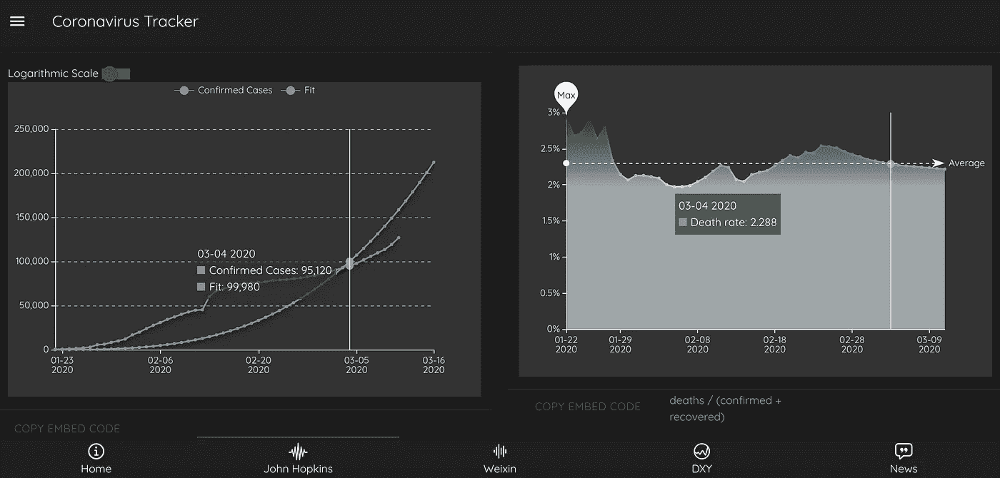

由 John Coene 开发的这个闪亮的应用程序基于三个数据源(约翰·霍普斯金、微信和 DXY 数据)追踪冠状病毒的传播。这个闪亮的应用程序由 shinyMobile 构建(这使得它可以在不同的屏幕尺寸上做出反应)，以一种非常好的方式按时间和地区显示死亡人数、确诊人数、疑似人数和恢复人数。

该代码可在 [GitHub](https://github.com/JohnCoene/coronavirus) 上获得。

# `{coronavirus} package`冠状病毒仪表板

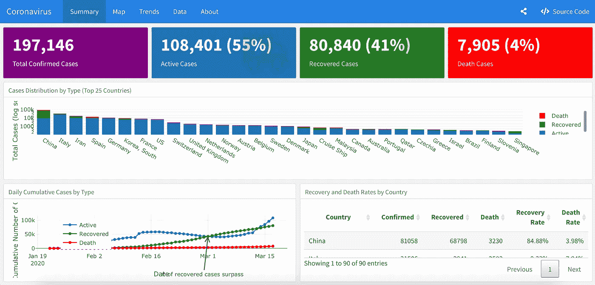

由`[{coronavirus} package](https://www.statsandr.com/blog/top-r-resources-on-covid-19-coronavirus/#coronavirus)`的作者开发的这个[仪表盘](https://ramikrispin.github.io/coronavirus_dashboard/)提供了 2019 年新型冠状病毒新冠肺炎(2019-nCoV)疫情的概况。数据和控制面板每天都会刷新。

该代码可在 [GitHub](https://github.com/RamiKrispin/coronavirus_dashboard) 上获得。

从这个仪表板，我创建了另一个专门针对比利时的仪表板。请随意使用 [GitHub](https://github.com/AntoineSoetewey/coronavirus_dashboard) 上可用的代码来构建一个特定于您的国家的代码。在这篇[文章](http://127.0.0.1:4321/blog/how-to-create-a-simple-coronavirus-dashboard-specific-to-your-country-in-r)中可以看到更多细节。

# 新冠肺炎全球案例

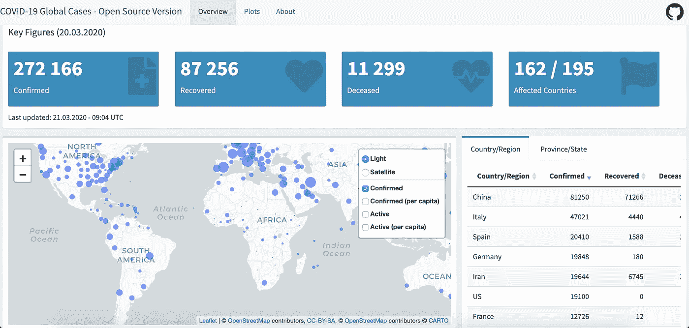

由 Christoph Schoenenberger 开发的这个[闪亮的应用程序](https://chschoenenberger.shinyapps.io/covid19_dashboard/)通过地图、汇总表、关键数字和图表展示了新冠肺炎疫情的最新发展。

在这篇[文章](/covid-19-open-source-dashboard-fa1d2b4cd985)中可以找到作者关于这个仪表盘的更多想法。

该代码可在 [GitHub](https://github.com/chschoenenberger/covid19_dashboard) 上获得。

# 新冠肺炎案例的可视化

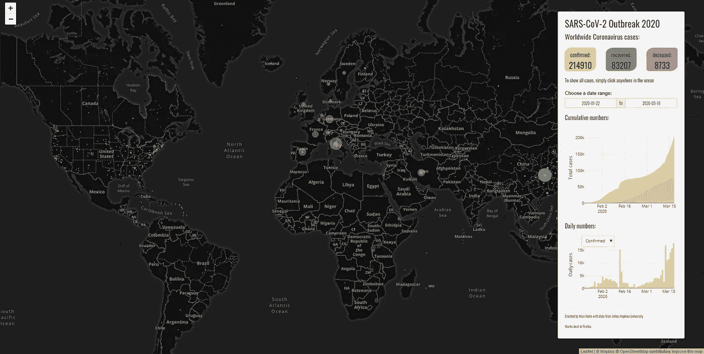

由 [Nico Hahn](https://github.com/nicoFhahn) 开发的这个[闪亮的应用](https://nicohahn.shinyapps.io/covid19/)使用传单、plotly 和来自约翰霍普金斯大学的数据来可视化新型冠状病毒的爆发，并显示整个世界或单个国家的数据。

该代码可在 [GitHub](https://github.com/nicoFhahn/covid_shiny) 上获得。

# 模拟新冠肺炎传播与医疗保健能力

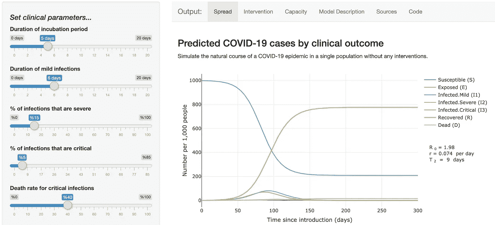

由艾莉森·希尔博士开发的这个[闪亮的应用](https://alhill.shinyapps.io/COVID19seir/)使用了一个基于经典 SEIR 模型的流行病学模型来描述新冠肺炎的传播和临床进展。它包括不同的临床感染轨迹，减少传播的干预措施，以及与医疗保健能力的比较。

该代码可在 [GitHub](https://github.com/alsnhll/SEIR_COVID19) 上获得。

# 新冠肺炎数据可视化平台

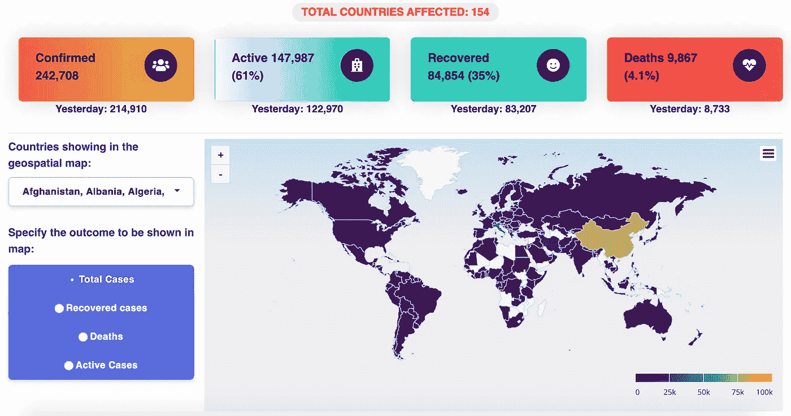

这款[闪亮应用](https://shubhrampandey.shinyapps.io/coronaVirusViz/)由 [Shubhram Pandey](https://github.com/shubhrampandey) 开发，提供了全球范围内 Covid19 影响的清晰可视化，还提供了使用 Twitter 自然语言处理的情感分析。

该代码可在 [GitHub](https://github.com/shubhrampandey/coronaVirus-dataViz) 上获得。

# 冠状病毒 10 天预报

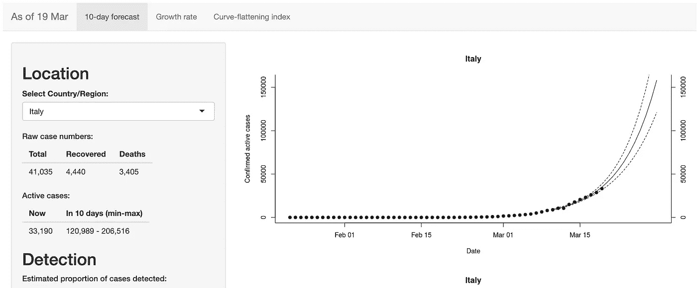

由[空间生态和进化实验室](https://blphillipsresearch.wordpress.com/)开发的这个[闪亮的应用](https://benflips.shinyapps.io/nCovForecast/)给出了每个国家可能的冠状病毒病例数的 10 天预测，并让公民了解这种流行病的发展速度。

在这篇[博文](https://blphillipsresearch.wordpress.com/2020/03/12/coronavirus-forecast/)中可以看到关于该应用的详细解释以及如何阅读。该代码可在 [GitHub](https://github.com/benflips/nCovForecast) 上获得。

# 冠状病毒(新冠肺炎)席卷全球

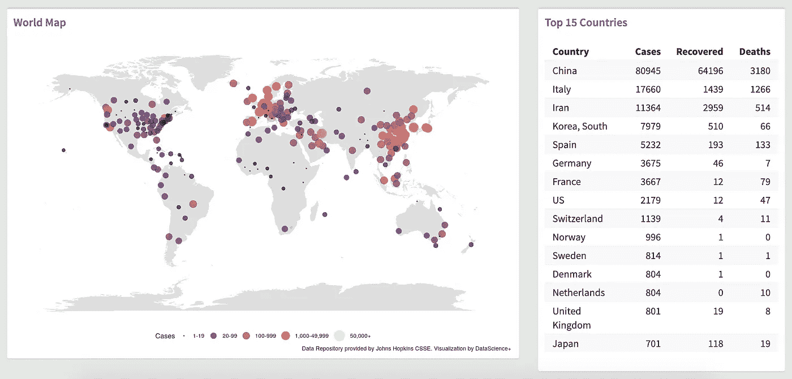

这款[闪亮的应用](https://dash.datascienceplus.com/covid19/)由 [Anisa Dhana](https://datascienceplus.com/author/anisa-dhana/) 与 datascience+合作开发，通过确诊病例的可视化地图和一些关于病毒生长的图表来监控新冠肺炎在世界各地的传播。

使用的数据集来自约翰·霍普金斯大学 CSSE 分校，部分代码可以在 T21 的博客文章中找到。

# 新冠肺炎疫情

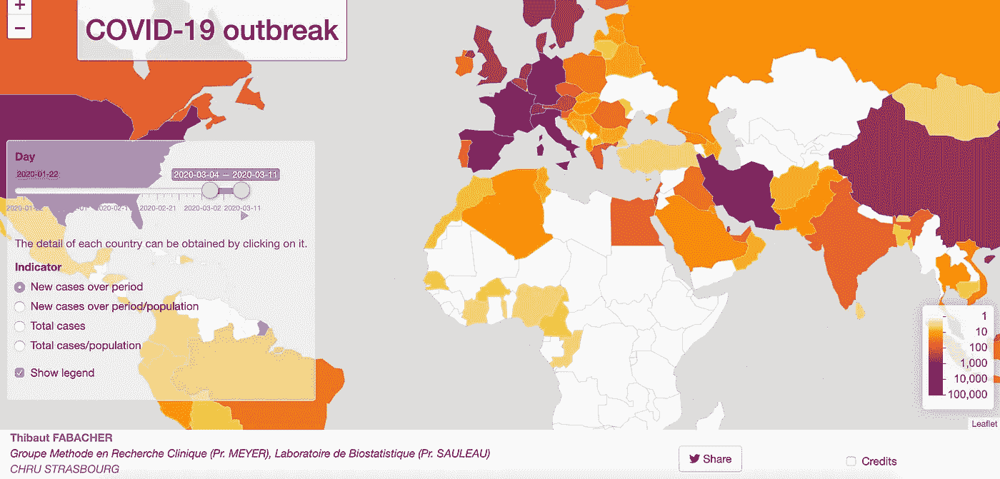

这款[闪亮的应用](https://thibautfabacher.shinyapps.io/covid-19/)显示了全球感染监测的互动地图，由[thi baut Fabacher](https://www.linkedin.com/in/thibaut-fabacher)博士与斯特拉斯堡大学医院公共卫生系和斯特拉斯堡医学院生物统计和医学信息学实验室合作开发。它侧重于每个国家和特定时期的病例数在发病率和流行率方面的演变。

代码可以在 GitHub 上找到，这篇在 T2 的博客文章将详细讨论它。

# 比较电晕轨迹

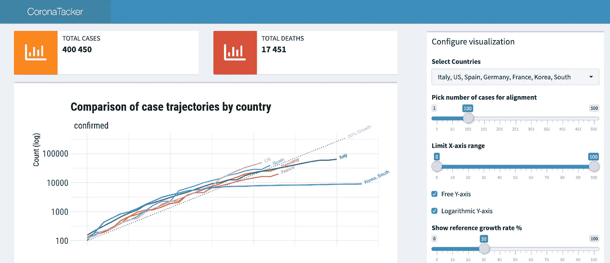

由 [André Calero Valdez](https://twitter.com/Sumidu) 开发的这个[闪亮的应用程序](https://andrecalerovaldez.shinyapps.io/CovidTimeSeriesTest/)通过两个图表比较了确诊和死亡病例的数量以及各个国家的病例轨迹。该应用程序还允许你通过表格比较不同国家的增长率和病例数。

代码可在 [GitHub](https://github.com/Sumidu/covid19shiny) 上获得。

# 使曲线变平

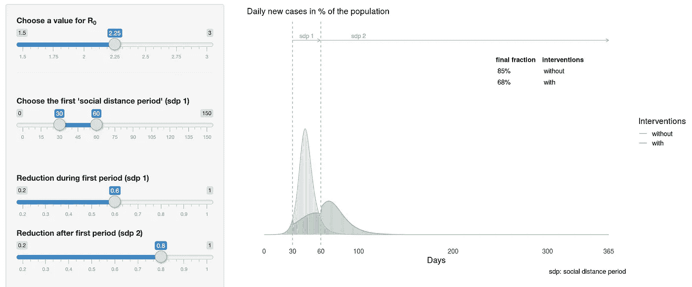

由 Tinu Schneider 开发的这个[闪亮的应用程序](https://tinu.shinyapps.io/Flatten_the_Curve/)以互动的方式展示了#FlattenTheCurve 信息背后的不同场景。

该应用基于 Michael hle 的[文章](https://www.statsandr.com/blog/top-r-resources-on-covid-19-coronavirus/#flatten-the-covid-19-curve)构建，代码可在 [GitHub](https://github.com/tinu-schneider/Flatten_the_Curve) 上获得。

# 探索新冠肺炎的传播

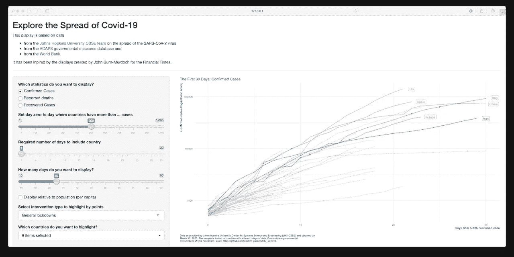

由约阿希姆·加森开发的这个闪亮的应用程序可以让你通过一个汇总图表可视化几个国家的确诊、恢复的病例和报告的死亡人数。

这款闪亮的应用基于以下数据:

*   [约翰·霍普金斯大学 CSSE 小组](https://github.com/CSSEGISandData/COVID-19)研究新型冠状病毒病毒的传播
*   [ACAPS 政府措施数据库](https://www.acaps.org/covid19-government-measures-dataset)
*   [世界银行](https://data.worldbank.org/)

这篇[博文](https://joachim-gassen.github.io/2020/03/meet-tidycovid19-yet-another-covid-19-related-r-package/)进一步详细解释了这个闪亮的应用，尤其是它背后的`[{tidycovid19}](https://www.statsandr.com/blog/top-r-resources-on-covid-19-coronavirus/#tidycovid19)` [R 包](https://www.statsandr.com/blog/top-r-resources-on-covid-19-coronavirus/#tidycovid19)。

# 政府和新冠肺炎

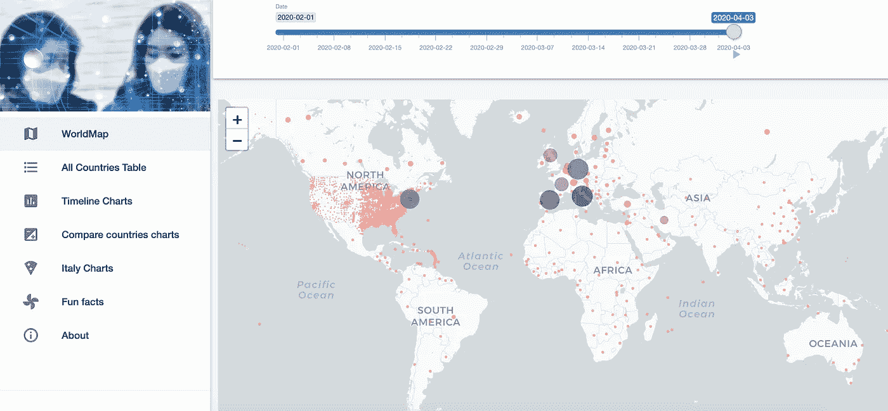

由 [Sebastian Engel-Wolf](https://mail-wolf.de/?page_id=1292) 开发的这款[闪亮应用](https://sebastianwolf.shinyapps.io/Corona-Shiny/)以优雅的方式呈现了以下测量结果:

*   连续指数增长的最大时间
*   感染翻倍的天数
*   今天的指数增长
*   确诊病例
*   死亡
*   人口
*   100，000 名居民的确诊病例
*   致死率

该代码可在 [GitHub](https://github.com/zappingseb/coronashiny) 上获得，这篇[文章](https://mail-wolf.de/?p=4632)对此进行了更详细的解释。

# 模拟西非多哥的新冠肺炎疫情

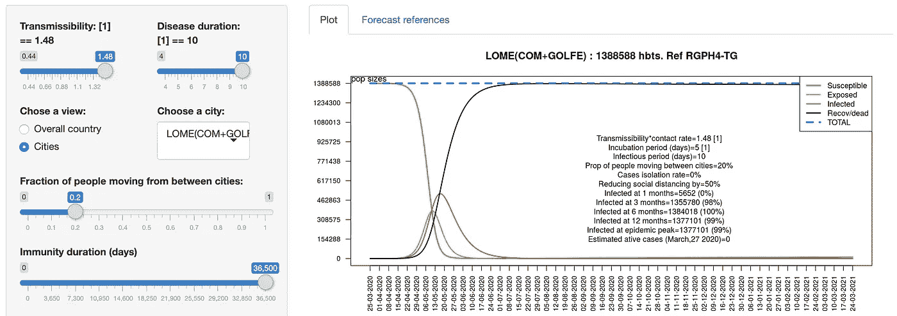

由[kankoéSallah](mailto:kankoe.sallah@univ-amu.fr)博士开发的这个[闪亮的应用程序](https://c2m-africa.shinyapps.io/togo-covid-shiny/)使用 SEIR 集合人口模型和集水区之间的流动性来描述新冠肺炎病毒在国家层面的传播以及干预措施对西非多哥的影响。

# 新冠肺炎预测

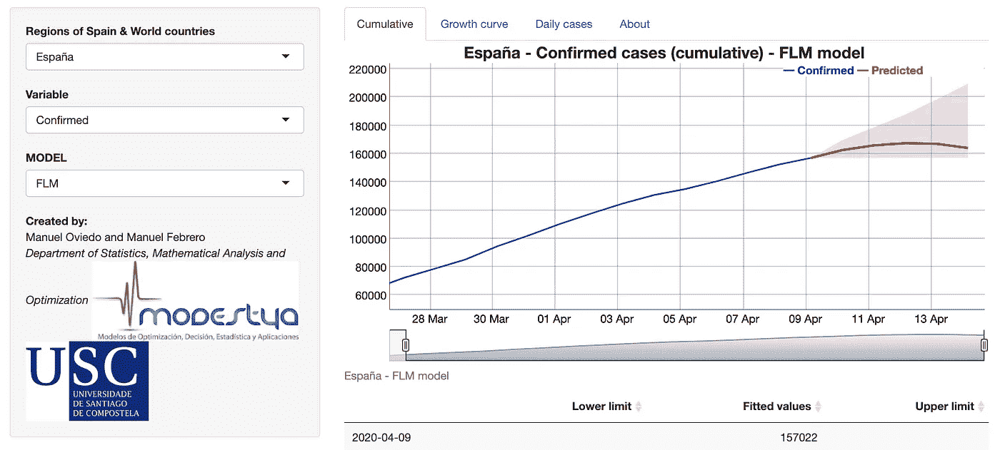

由 Manuel Oviedo 和 Manuel Febrero(圣地亚哥德孔波斯特拉大学的 Modestya 研究小组)开发的这个[闪亮的应用程序](http://modestya.securized.net/covid19prediction/)使用过去 15 天增长率的演变来预测 5 天范围内的增长率。当新数据可用时，拟合并重新估计三个函数回归模型。该应用程序还显示了按国家(来自[约翰霍普金斯大学 CSSE](https://github.com/CSSEGISandData/COVID-19) )和西班牙地区(来自 [ISCII](https://covid19.isciii.es/) )划分的每个地平线的累积病例和每日新病例的预期数量的交互式图表。

请参阅“关于”选项卡中的方法说明。

# 新冠肺炎仪表板

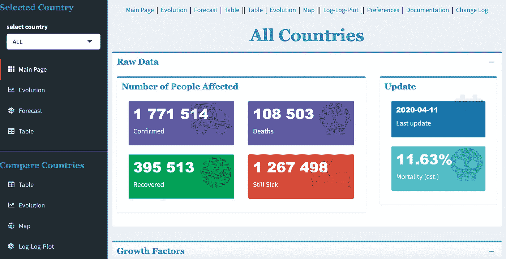

由 Philippe De Brouwer 开发的这个[仪表盘](http://www.de-brouwer.com/about/covid.html#covid)显示了关于病毒爆发的几个关键指标(按国家或所有国家的总和)，以及一些预测、世界地图和其他交互式图表。

# 美国医护人员死于新型冠状病毒(新冠肺炎)

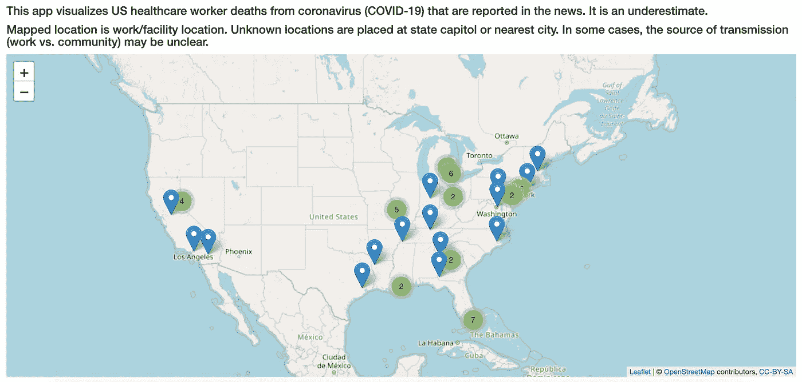

由 Jonathan Gross 开发的这款[闪亮应用](https://jontheepi.shinyapps.io/hcwcoronavirus/)将新闻报道的美国医护人员死于冠状病毒(新冠肺炎)的情况可视化。它每天更新，代码可在 [GitHub](https://github.com/jontheepi/hcwcoronavirus) 上获得。

# 比利时的新冠肺炎住院治疗

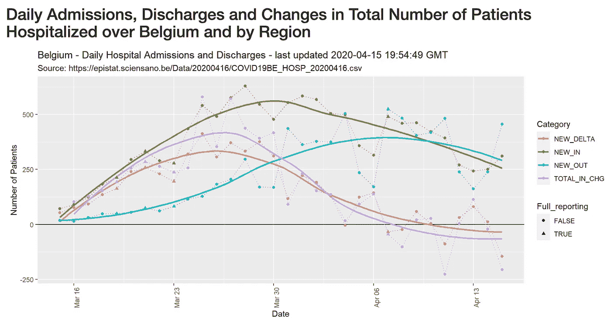

由 [Jean-Michel Bodart](https://www.linkedin.com/in/jeanmichelbodart/?miniProfileUrn=urn%3Ali%3Afs_miniProfile%3AACoAAAHQTPIBtRIC0Gzz2XvPOZK8SCfDcWoH6KM) 开发的这款[仪表盘](https://rpubs.com/JMBodart/Covid19-hosp-be)按地区和省份提供了比利时新冠肺炎相关住院治疗的发展概况。

该代码可在 [GitHub](https://github.com/jmbo1190/Covid19) 上获得。

# 你住在哪里很重要！

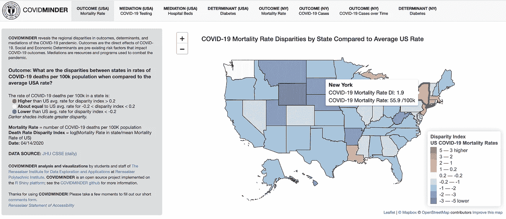

由[伦斯勒数据探索和应用研究院](https://idea.rpi.edu/)开发的这个[闪亮的应用](https://covidminder.idea.rpi.edu/)揭示了美国各地在结果、决定因素和药物治疗(例如死亡率、测试病例、糖尿病和医院床位)方面的地区差异，特别关注纽约。

这篇[博文](/covidminder-where-you-live-matters-rshiny-and-leaflet-based-visualization-tool-168e3857dbf2)更详细地解释了这个闪亮的应用程序，代码可以在 [GitHub](https://github.com/TheRensselaerIDEA/COVIDMINDER) 上找到。

# 新冠肺炎加拿大数据浏览器工具

Petr Baranovskiy 从[数据爱好者的博客](https://dataenthusiast.ca/)开发的这个[闪亮的应用](https://dataenthusiast.ca/apps/covid_ca/)处理加拿大政府提供的官方数据集，并显示与加拿大新型冠状病毒疫情相关的几个指标。

这篇[博客文章](https://dataenthusiast.ca/2020/covid-19-canada-data-explorer/)更详细地描述了这个应用。

# 菲律宾新冠肺炎病例预测

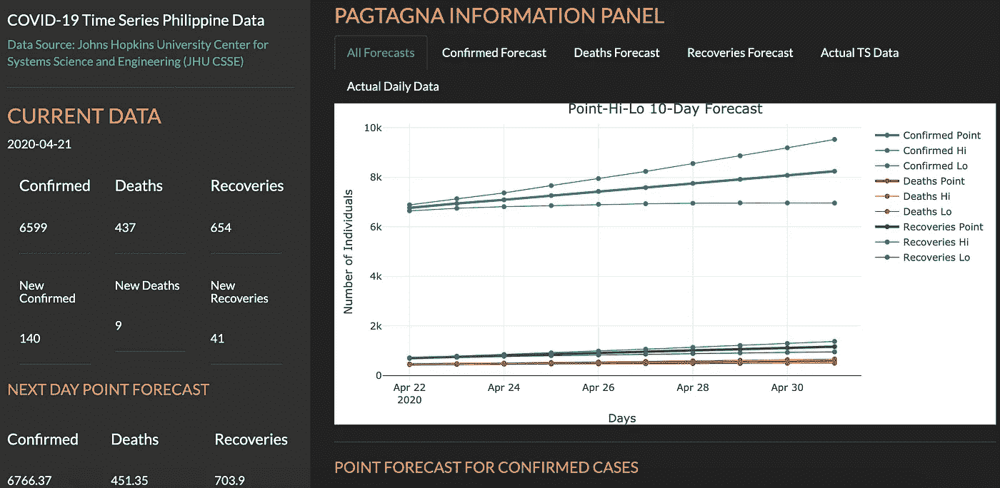

由 Jamal Kay Rogers 和 Yvonne Grace Arandela 开发的这个[闪亮应用](https://jamalrogersapp.shinyapps.io/tsforecast/)提供了菲律宾新冠肺炎病例确诊阳性、死亡和康复的 5 天预测。

该应用程序还提供了 10 天的天气预报以及菲律宾每日和累计的新冠肺炎病例的图表。数据来源是约翰·霍普金斯大学系统科学与工程中心(JHU·CSSE)。

# 新冠肺炎病例和死亡报告数字校正器

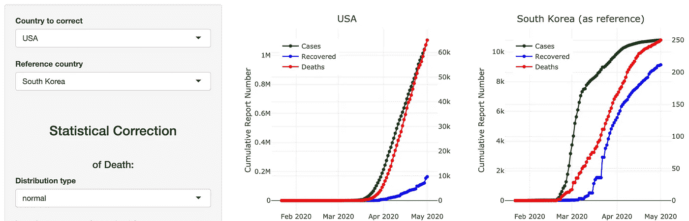

由 [Matt Maciejewski](http://www.mattmaciejewski.com/) 开发的这个[闪亮的应用](https://pharmhax.shinyapps.io/covid-corrector-shiny/)专注于使用基于 [Lachmann 等人(2020)](https://www.medrxiv.org/content/10.1101/2020.03.14.20036178v2) 的参考国家，并通过总死亡数和病例数的乘法估算器，来校正少报的新冠肺炎病例数和死亡数。一旦数据可用，估计器将变成后验预测。

在这篇[文章](https://www.neurosynergy.io/articles/fixingcovid-19underreporting)中对这款应用进行了更详细的解释，这款闪亮应用的代码可以在 [GitHub](https://github.com/pharmhax/covid19-corrector) 上找到。

# 新冠肺炎:斯皮克模式

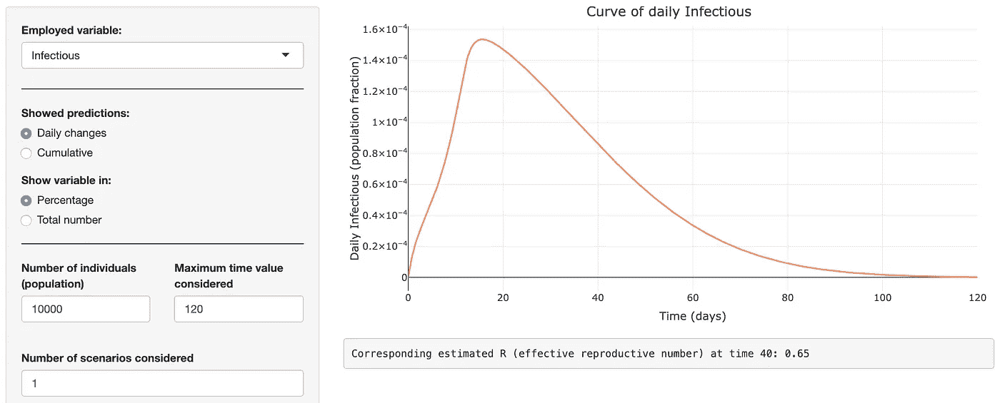

这个[闪亮的应用](https://jose-ameijeiras.shinyapps.io/SPQEIR_model/)由来自卢森堡大学卢森堡系统生物医学中心(LCSB)、鲁汶大学和 UGent 大学的几位研究人员开发，它使用新的 [SPQEIR 模型](https://www.medrxiv.org/content/10.1101/2020.04.22.20075804v1)来模拟各种抑制策略(社交距离、锁定、保护等)的影响。)关于新冠肺炎的发展。

# 新冠肺炎预测

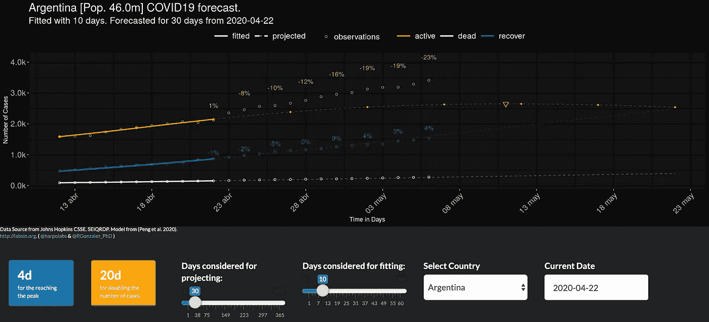

由卡洛斯·卡塔尼亚开发的这个闪亮的应用程序提供了不同国家(南美和一些欧洲国家)的艾滋病传播预测。该应用程序实现了对模型的推广，其中包括隔离和死亡(Peng et al. 2020)。

# 比利时 Covid 病例跟踪系统

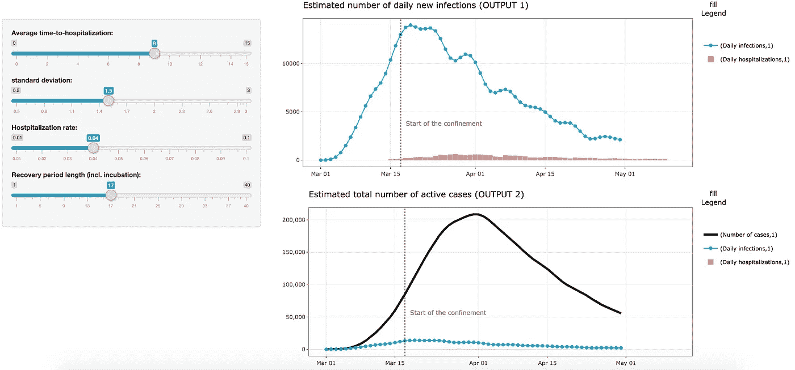

由 Patrick Sciortino 开发的这款[闪亮应用](https://psciortino.shinyapps.io/BelgianCovidCasesTracker/)旨在基于一个住院病例及时 *t* 通知我们几天前发生的感染的想法来估计真实新冠肺炎病例的曲线。

# 新冠肺炎监视器

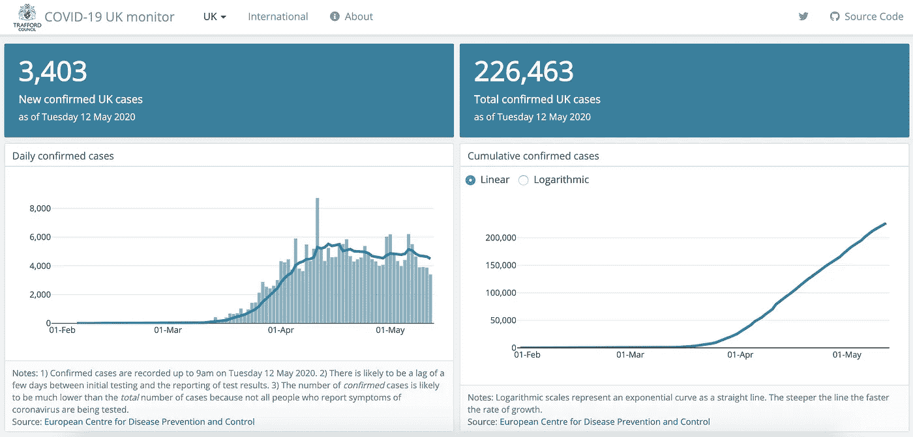

由特拉福德数据实验室开发的这个[闪亮的应用](https://trafforddatalab.shinyapps.io/covid-19/)可视化了英国每日确诊的冠状病毒病例和死亡人数。

它使用以下数据源:

*   [欧洲疾病预防和控制中心](https://www.ecdc.europa.eu/en/publications-data/download-todays-data-geographic-distribution-covid-19-cases-worldwide)
*   [英国公共卫生](https://www.gov.uk/government/publications/covid-19-track-coronavirus-cases)
*   [牛津大学布拉瓦特尼克政府学院](https://www.bsg.ox.ac.uk/research/research-projects/coronavirus-government-response-tracker)

代码可以在 [GitHub](https://github.com/traffordDataLab/covid-19) 上找到。

# 新冠肺炎公告板

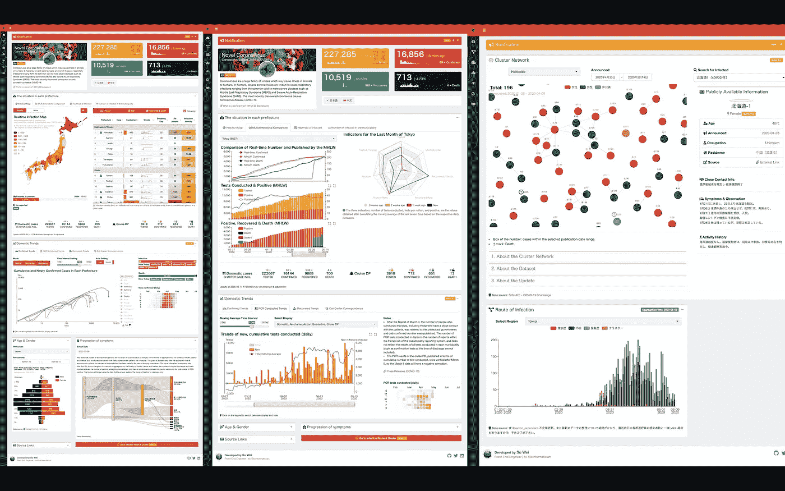

由苏伟[研发的这个](https://swsoyee.github.io/)[仪表盘](https://covid-2019.live/en/)显示了新冠肺炎疫情在日本的实时可视化。它主要显示各种指标，包括但不限于聚合酶链式反应测试、阳性确诊、出院和死亡，以及日本各县的趋势。还有聚类网络、日志尺度新确诊病例等多种图表供用户参考。

仪表盘就是基于这个[日版](https://covid-2019.live/)(同一作者开发的)。代码可以在 [GitHub](https://github.com/swsoyee/2019-ncov-japan) 上找到。

# 新冠肺炎统计显示器

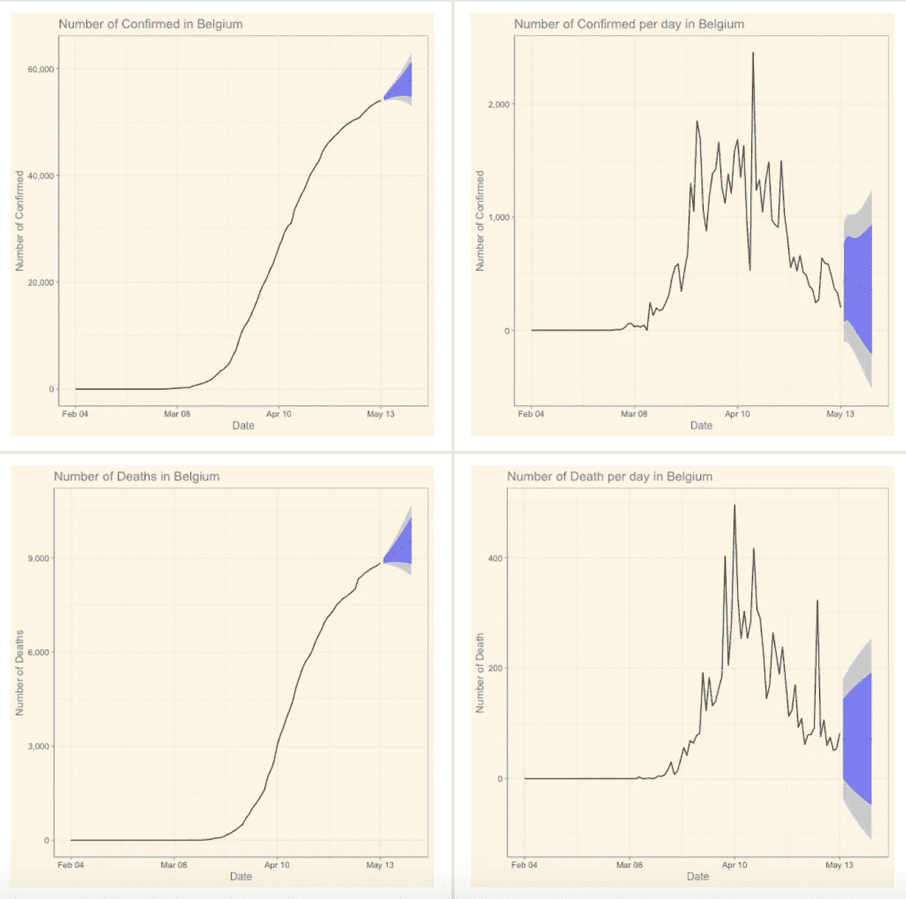

由 Carl sans faon 创建的这个 [Wordpress 插件](http://moduloinfo.ca/wordpress/)将 R `{ggplot2}`图形与 ARIMA 预测和 PHP 编码关联起来，以显示不同国家、州/省和美国城市的确诊、死亡和恢复病例的演变。

它使用来自约翰·霍普金斯大学系统科学与工程中心(CSSE)的新冠肺炎数据库的数据。这个插件可以作为一个 [Wordpress 插件](https://wordpress.org/plugins/covid-19-statistics-displayer/)安装。

# 日冕制图仪

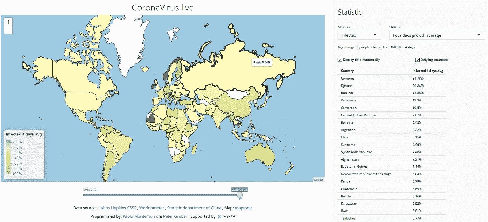

由 Paolo Montemurro 和 Peter Gruber 创建的 OxyLabs 提供支持，这种可视化显示了四天的平均增长指标，它清楚地显示了病毒的某个统计数据是如何随着时间的推移而演变的，过滤了噪音。

该网站每小时从几个官方数据源接收数据，并以直观和互动的方式可视化 COVID19 的历史演变。

# 科罗纳达什

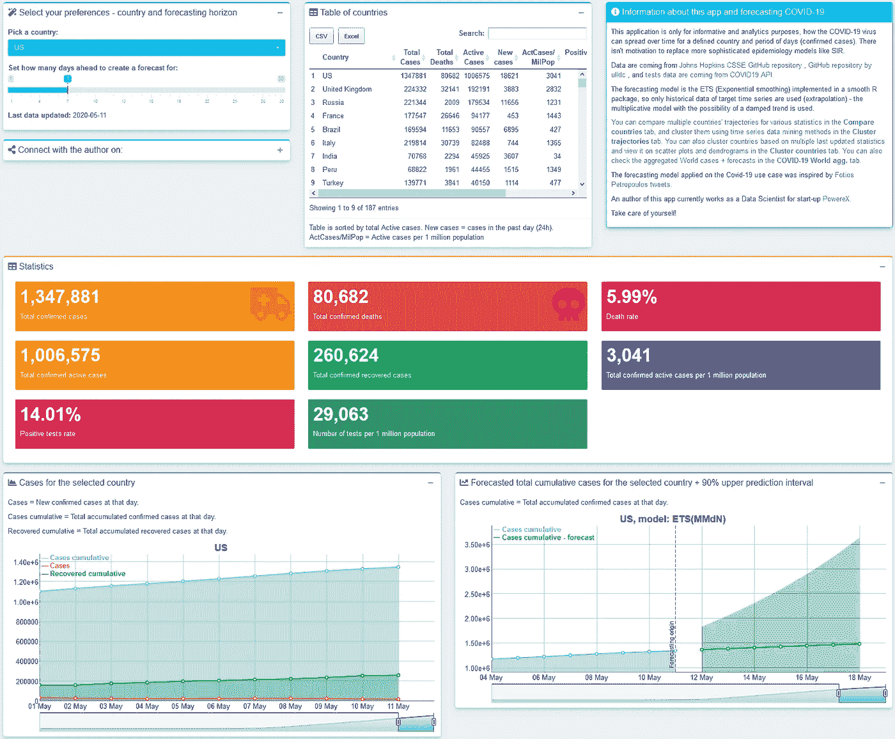

由 [Peter Laurinec](https://petolau.github.io/) 开发的这款[闪亮的应用](https://petolau.shinyapps.io/coronadash/)提供了各种数据挖掘和可视化技术，用于比较各国的新冠肺炎数据统计:

*   用指数平滑模型外推总确诊病例，
*   病例/死亡传播的轨迹，
*   国家数据/统计数据的多维聚类——树状图和聚类平均数表，
*   全世界的综合视图，
*   基于 DTW 距离和 SMA 预处理的国家轨迹分级聚类(+归一化)，用于快速比较大量国家的新冠肺炎大小和趋势。

这篇[博文](https://petolau.github.io/CoronaDash-hierarchical-clustering-countries-trajectories/)更详细的解释了上面列表的最后一点。该应用程序的代码可在 [GitHub](https://github.com/PetoLau/CoronaDash) 上获得。

# Covidfrance

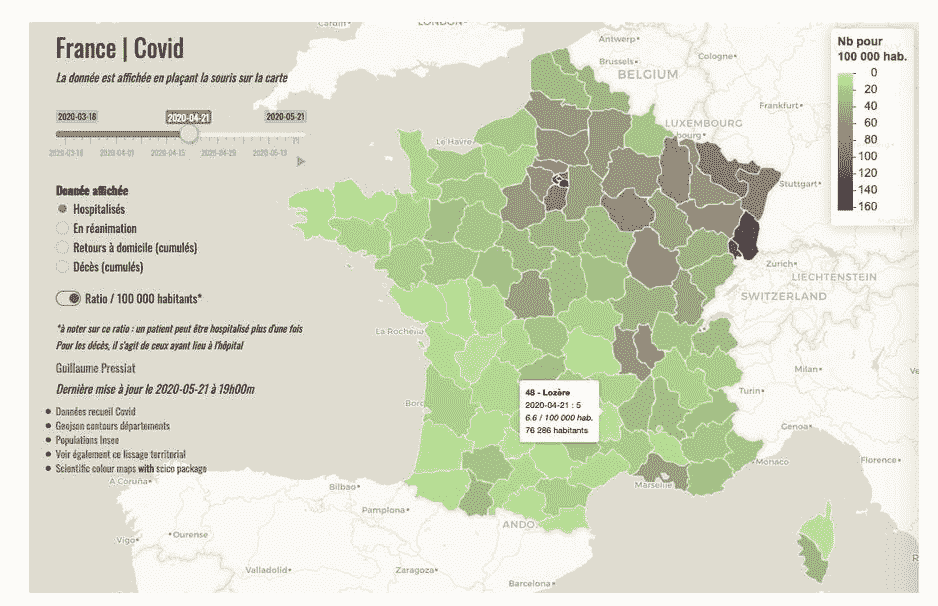

由 Guillaume presiat 开发的这款[闪亮应用](https://guillaumepressiat.shinyapps.io/covidfrance/)展示了法国住院、重症监护室、康复和死亡人数的变化(按部门)。

这篇[的博文](https://guillaumepressiat.github.io//blog/2020/05/covidview)展示了这款应用程序，该应用程序的代码可以在 [GitHub](https://gist.github.com/GuillaumePressiat/0e3658624e42f763e3e6a67df92bc6c5) 上获得。

# 新冠肺炎对流动性的影响

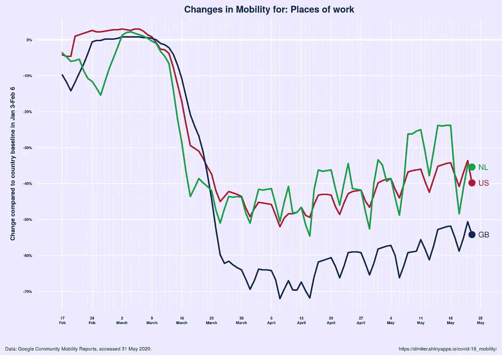

由 Dimiter Toshkov 开发的这个闪亮的应用程序显示了一个国家内特定类别的地方相对于基线的移动性(访问次数和停留时间)的相对变化。基线计算为 2020 年 1 月 3 日至 2 月 6 日之间的 5 周期间一周中某一天的中值。因此，该图显示了相对于年初同一国家的情况，流动性发生了怎样的变化。

作者还为美国各州开发了一个版本。

数据来自[谷歌社区移动报告](https://www.google.com/covid19/mobility/)。

# 冠状病毒分析平台

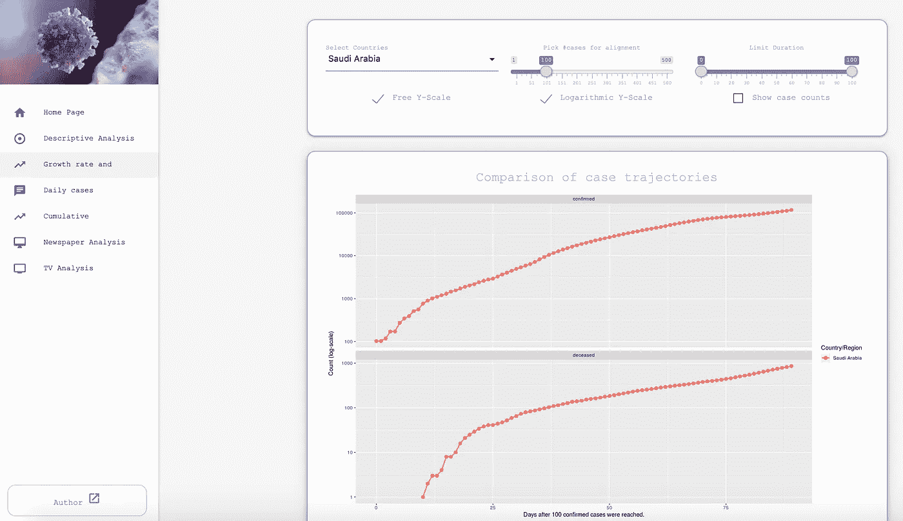

由 [Khaled M Alqahtani](https://twitter.com/Alqahtani_khald) 开发的这个[闪亮的应用](https://drkhalid.shinyapps.io/covid19/)提供了一个强大的分析工具，包括:

1.  描述性分析
2.  增长率和曲线平坦化
3.  累积预测
4.  包含 16 种不同模型的每日案例预测
5.  报纸分析
6.  电视分析

数据来自约翰霍普金斯大学 CSSE 分校和一些 GDELT APIs。

# 新冠肺炎跟踪器

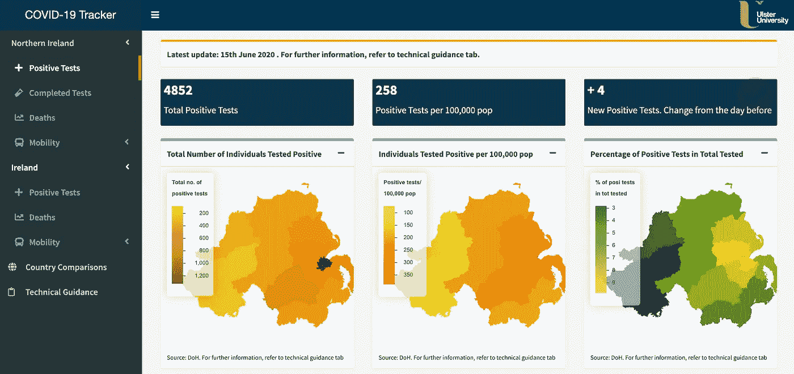

这个[仪表板](https://nicovidtracker.org/)由阿尔斯特大学的[Magda buch OLC](https://twitter.com/bucholcmagda)博士开发，报告北爱尔兰地方政府辖区和爱尔兰全岛县级的病例，提供报告病例的性别和年龄分类、增长率和每 10 万人口的统计数据；它还拥有来自谷歌和苹果的每日移动数据。

关于这个仪表板的更多信息可以在[这里](https://www.ulster.ac.uk/news/2020/june/ulster-university-covid-19-tracker-compares-ni-and-roi-data-on-coronavirus-testing,-positive-cases-and-deaths)找到。

# 新冠肺炎概述

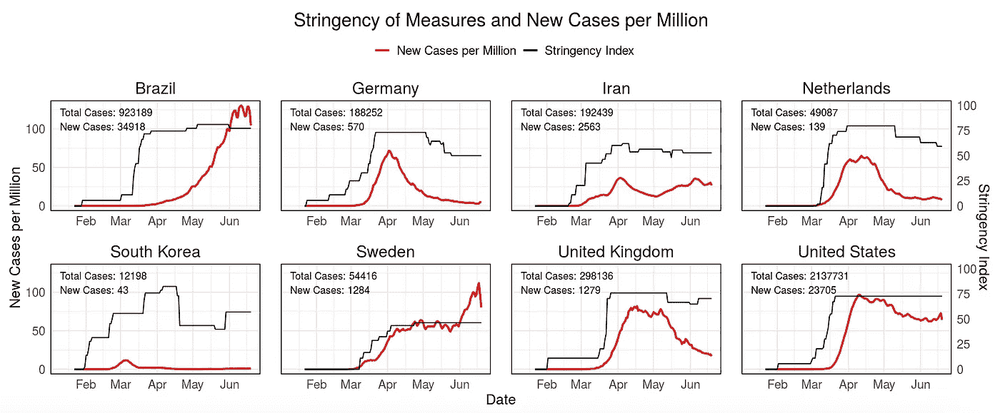

由[法比安·达布兰德](https://twitter.com/fdabl)、[亚历山德拉·鲁苏](https://www.linkedin.com/in/ialmi/)、[马塞尔·施雷纳](http://smip.uni-mannheim.de/PhD%20Candidates/Cohort%202019/Schreiner,%20Marcel/)和[亚历山大·托马舍维奇](https://www.atomasevic.com/)开发的这个[仪表板](https://scienceversuscorona.shinyapps.io/covid-overview/)是[科学对抗电晕](https://scienceversuscorona.com/)项目的一部分，它提供了确诊病例、死亡人数以及各国为遏制病毒传播所采取措施的概况。

有关这个仪表板的更多信息，请参见这篇[博客文章](https://scienceversuscorona.com/visualising-the-covid-19-pandemic/)。

# 新冠肺炎退出战略

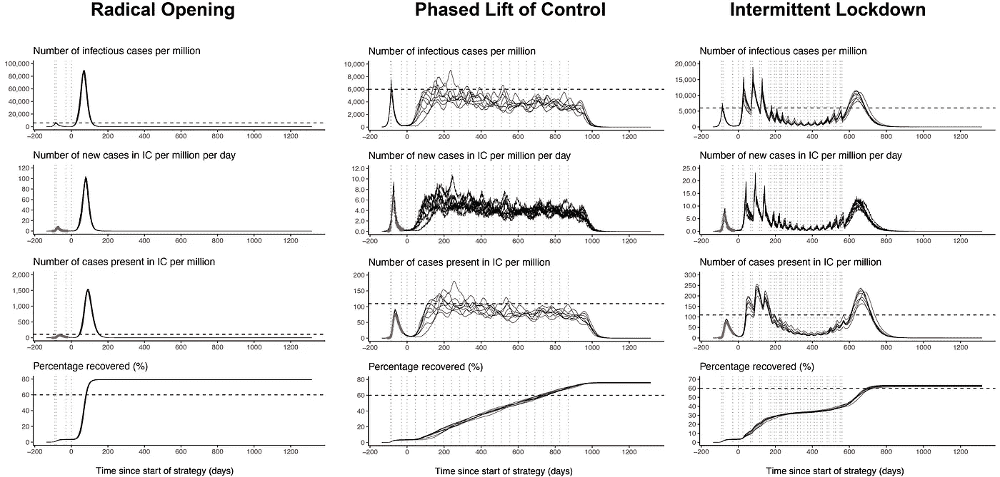

作为[科学对抗电晕](https://scienceversuscorona.com/)项目的一部分，这个[闪亮的应用](https://scienceversuscorona.shinyapps.io/covid-exit/)比较了几种替代退出策略，要么旨在尽可能降低感染数量(例如，接触追踪)，要么旨在发展群体免疫而不超出卫生保健能力。

闪亮的应用程序基于 de Vlas 和 Coffeng (2020)开发的基于个体的随机 SEIR 模型。这篇[帖子](https://fabiandablander.com/r/Covid-Exit.html)更详细地解释了这个闪亮的应用程序。

# 电晕病毒统计:COVID19

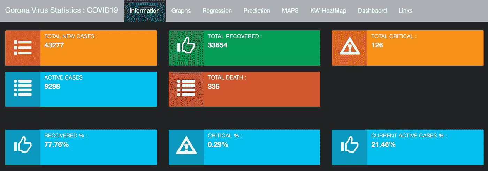

由[Mohammed n . Alenezi](https://twitter.com/dr_malenezi)博士开发的这个[仪表盘](https://m-alenezi.shinyapps.io/CoronaKW3/)为科威特、海湾合作委员会和全世界显示冠状病毒的最新信息。仪表板包含 8 个选项卡下显示的不同图和模型的集合。

# Covid19 数据

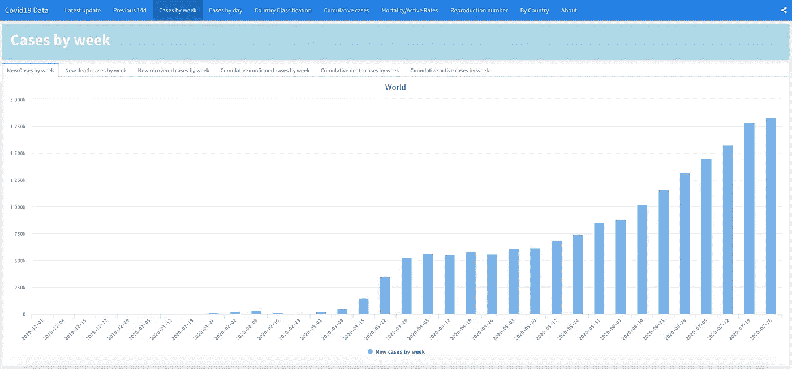

这款[仪表盘](https://malouche.github.io/covid19data/)由 [Dhafer Malouche](https://malouche.github.io/) 开发，呈现了 200 多个国家和地区的统计数据，包括对过去 60 天内生育数量 R(t)R(t)的估计和 Covid19 国家分类。

# 世卫组织·新冠肺炎探险家

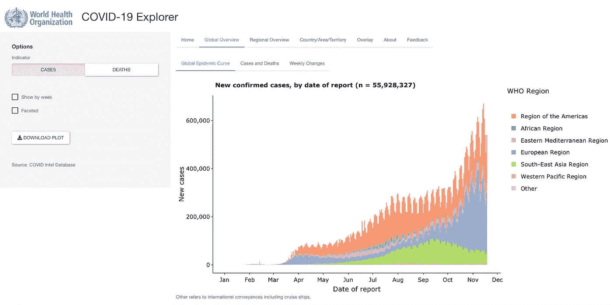

由[世界卫生组织(世卫组织)](https://covid19.who.int/)开发的这个[闪亮的应用程序](https://worldhealthorg.shinyapps.io/covid/)旨在提供全球、区域和国家层面上关于确诊病例和死亡的频繁更新的数据可视化。

# 新冠肺炎情景分析工具

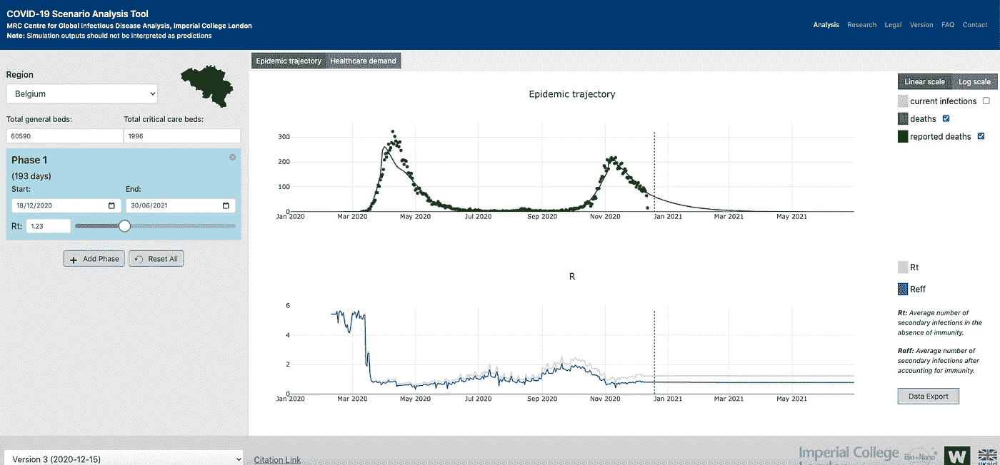

这个[仪表板](https://www.covidsim.org/)由 [MRC 全球传染病分析中心(伦敦帝国学院)](https://www.imperial.ac.uk/mrc-global-infectious-disease-analysis)开发，以互动图表的形式展示了许多国家随时间推移的疫情轨迹、医疗需求和 R_t & R_eff 措施。

仪表板使用了 [squire](https://github.com/mrc-ide/squire) R 组件以及其他组件。

# r 包

# `{nCov2019}`

`[{nCov2019}](https://github.com/GuangchuangYu/nCov2019)` [包](https://github.com/GuangchuangYu/nCov2019)让你获得冠状病毒爆发的流行病学数据。 [1](https://www.statsandr.com/blog/top-r-resources-on-covid-19-coronavirus/#fn1) 该软件包提供实时统计数据，并包含历史数据。[插图](https://guangchuangyu.github.io/nCov2019/)解释了包装的主要功能和可能性。

此外，该软件包的作者还开发了一个具有交互式图表和时间序列预测的[网站](http://www.bcloud.org/e/)，这可能有助于向公众提供信息和研究病毒如何在人口众多的国家传播。

# `{coronavirus}`

由 [Rami Krispin](https://ramikrispin.github.io/) 开发的`[{coronavirus} package](https://github.com/RamiKrispin/coronavirus)`提供了 2019 年新型冠状病毒新冠肺炎(2019-nCoV)疫情的整洁格式数据集。R 包来自约翰·霍普斯金的数据集，给出了各州/省冠状病毒病例的每日汇总。该数据集包含各种变量，如不同国家和州的确诊病例、死亡和恢复情况。

更多详细信息可在[此处](https://ramikrispin.github.io/coronavirus/)获得，软件包数据集的`csv`格式可在[此处](https://github.com/RamiKrispin/coronavirus-csv)获得，摘要仪表板可在[此处](https://ramikrispin.github.io/coronavirus_dashboard/)获得。

# `{tidycovid19}`

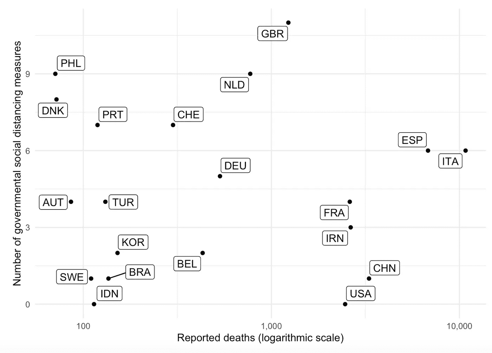

由约阿希姆·加森开发的`[{tidycovid19}](https://github.com/joachim-gassen/tidycovid19)` [软件包](https://github.com/joachim-gassen/tidycovid19)可以让你直接从权威渠道下载、整理和可视化新冠肺炎的相关数据(包括政府措施的数据)。它还提供了一个灵活的功能和一个附带的[闪亮应用](https://jgassen.shinyapps.io/tidycovid19/)来可视化病毒的传播。

这个包可以在 [GitHub](https://github.com/joachim-gassen/tidycovid19) 上获得，这些博客文章[在这里](https://joachim-gassen.github.io/2020/03/meet-tidycovid19-yet-another-covid-19-related-r-package/)和[在这里](https://joachim-gassen.github.io/2020/04/tidycovid19-new-viz-and-npi_lifting/)更详细地解释了它。

# 来自 R 流行病联盟的 R 包

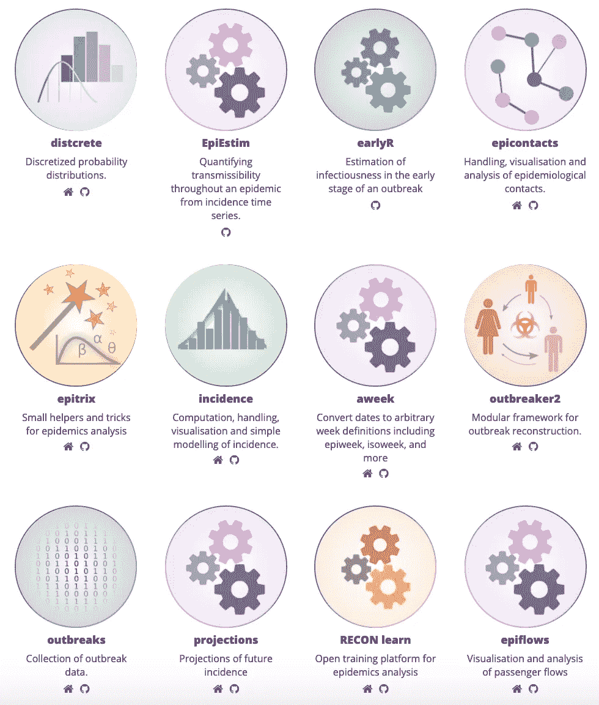

这些来自 R 流行病联盟的 R 包允许您找到专业流行病学家和专家在分析疾病爆发领域使用的最先进的工具。

# `{covdata}`

由[Kieran Healy](https://kieranhealy.org/)教授发布的`[{covdata}](https://kjhealy.github.io/covdata/)` [包](https://kjhealy.github.io/covdata/)是一个 R 包，提供来自多个来源的新冠肺炎病例数据:

1.  来自欧洲疾病控制中心的国家级数据
2.  来自 [COVID 追踪项目](https://covidtracking.com/)的美国州级数据
3.  美国的州级和县级数据来自[纽约时报](https://github.com/nytimes/covid-19-data)
4.  数据来自美国疾病控制中心的[冠状病毒疾病 2019(新冠肺炎)——相关住院监测网络](https://www.cdc.gov/coronavirus/2019-ncov/covid-data/covidview/index.html) (COVID-NET)
5.  来自[苹果](https://www.apple.com/covid19/mobility)的数据显示，自 2020 年 1 月中旬以来，城市和国家的相对移动趋势，基于其地图应用的使用情况
6.  来自 [Google](https://www.google.com/covid19/mobility/index.html?hl=en) 的数据，基于位置和活动信息，显示了自 2020 年 1 月中旬以来各个地区和国家的相对移动趋势

该代码可在 [GitHub](https://github.com/kjhealy/covdata/) 上获得。

# `{covid19italy}`

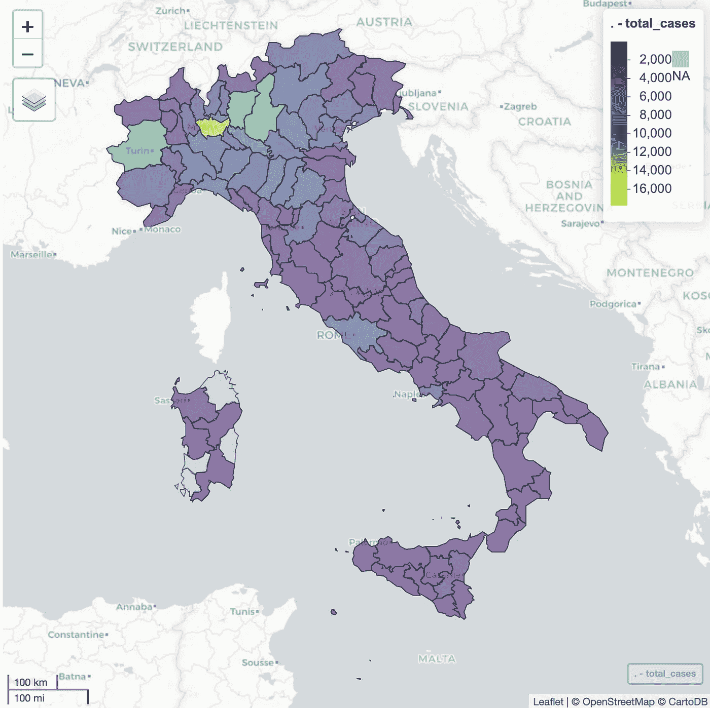

[covid19italy R package](https://github.com/Covid19R/covid19italy) 提供了意大利 2019 年新型冠状病毒新冠肺炎(2019-nCoV)疫情疫情的整洁格式数据集。该包包括以下三个数据集:

1.  `italy_total`:国家级疫情每日摘要
2.  `italy_region`:区域级别爆发的每日摘要
3.  `italy_province`:省级别的疫情每日摘要

关于软件包数据集的更多信息，请参见本[简介](https://covid19r.github.io/covid19italy/articles/intro.html)，本[博客文章](https://ramikrispin.github.io/2020/05/covid19italy-v0-2-0-is-now-on-cran/)，以及本支持[仪表盘](https://ramikrispin.github.io/italy_dash/)。

数据来源:[意大利民事保护部](http://www.protezionecivile.it/)

# `{COVID19}`

[新冠肺炎数据中心](https://covid19datahub.io/)的目标是通过收集世界范围内的精细案例数据，结合有助于更好地了解新冠肺炎的外部变量，为研究社区提供一个统一的数据中心。以米兰大学为特色，[数据科学和经济学硕士](https://dse.cdl.unimi.it/en/avviso/notice-detail/covid-data-analysis)并由加拿大[数据价格研究所 IVADO](https://ivado.ca/en/covid-19/#phares) 资助。

该软件包收集政府来源的新冠肺炎数据，包括来自牛津新冠肺炎政府回应跟踪系统的政策措施，并通过接口将数据集扩展到世界银行公开数据、谷歌移动报告、苹果移动报告和苹果移动报告。

该包在 [CRAN](https://cloud.r-project.org/package=COVID19) 上可用，它是 100% [开源](https://github.com/covid19datahub/COVID19/)，欢迎外部贡献者加入。

# `{COVOID}`

[COVOID](https://cbdrh.github.io/covoidance/) (用于 **COV** ID-19 **O** 笔源 **I** 感染 **D** 动力学项目)是一个 R 包，用于使用确定性房室模型(DCMs)对新冠肺炎和其他传染病进行建模。

它包含一个内置的[闪亮的应用程序](https://cbdrh.shinyapps.io/covoidance/)，使没有 R 编程背景的人能够轻松使用和演示关键概念，以及一个扩展的 API，用于模拟和估计同质和年龄结构的 SIR、SEIR 和扩展模型。特别是 COVOID 允许在不同的时间间隔内同时模拟特定年龄(如学校关闭)和一般干预。

该代码可在 [GitHub](https://github.com/CBDRH/covoid) 上获得。

# `{cdccovidview}`

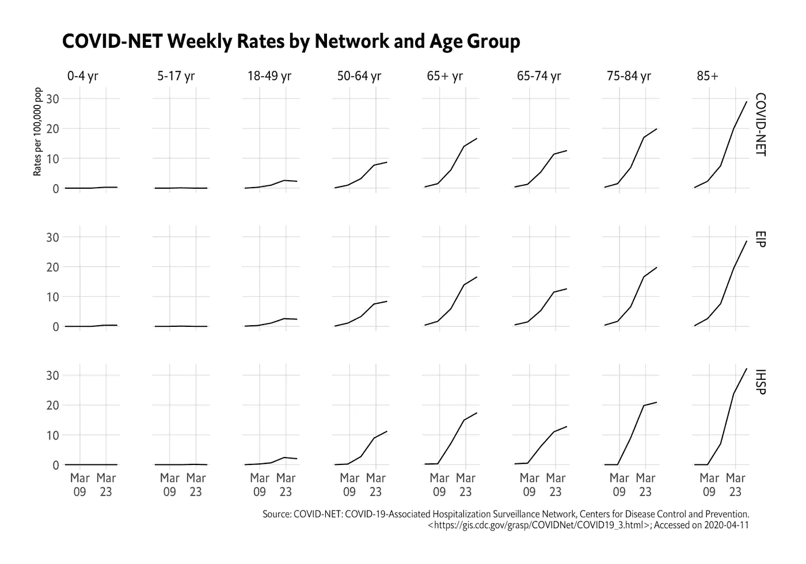

由[鲍勃·鲁迪斯](https://rud.is/)发布的`[{cdccovidview}](https://cinc.rud.is/web/packages/cdccovidview/index.html)` [软件包](https://cinc.rud.is/web/packages/cdccovidview/index.html)可以用来与美国疾病预防控制中心的新新冠肺炎追踪器 [COVIDView](https://www.cdc.gov/coronavirus/2019-ncov/covid-data/covidview/index.html) 和 [COVID-NET](https://gis.cdc.gov/grasp/COVIDNet/COVID19_3.html) 一起工作。

# `{babsim.hospital}`

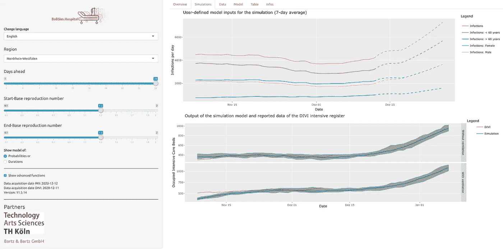

由来自[TH kln](https://www.th-koeln.de/)的几位研究人员发布的`[{babsim.hospital}](https://cran.r-project.org/package=babsim.hospital)` [软件包](https://cran.r-project.org/package=babsim.hospital)实现了一个医院资源规划问题的离散事件模拟模型。卫生部门可以使用它来预测对重症监护病床、呼吸机和人力资源的需求。

该团队还开发了一款闪亮的应用程序,可以预测新冠肺炎医院重症监护室的床位资源。该应用程序有英语和德语两种版本。

# r 代码和博客帖子

# 用 R 分析新冠肺炎疫情数据

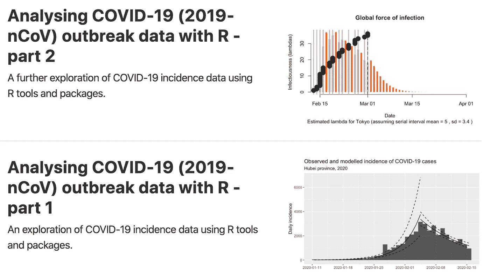

由[蒂姆·丘奇斯](https://timchurches.github.io/)撰写的这两篇文章([第一部分](https://timchurches.github.io/blog/posts/2020-02-18-analysing-covid-19-2019-ncov-outbreak-data-with-r-part-1/)和[第二部分](https://timchurches.github.io/blog/posts/2020-03-01-analysing-covid-19-2019-ncov-outbreak-data-with-r-part-2/))探索了可能用于分析新冠肺炎数据的工具和软件包。特别是，作者考虑了中国的疫情何时会消退，然后将分析转向日本、韩国、意大利和伊朗。他还展示了常见的累积发病率图的改进。此外，由于传染病爆发的经典 SIR(易感-感染-康复)房室模型，他提出了 R 代码来分析冠状病毒的传染性。 [2](http://127.0.0.1:4321/blog/top-r-resources-on-covid-19-coronavirus/#fn2)

该代码可在 GitHub 上获得([第 1 部分](https://github.com/timchurches/blog/tree/master/_posts/2020-02-18-analysing-covid-19-2019-ncov-outbreak-data-with-r-part-1)和[第 2 部分](https://github.com/timchurches/blog/tree/master/_posts/2020-03-01-analysing-covid-19-2019-ncov-outbreak-data-with-r-part-2))。

第 1 部分实际上是基于来自[学习机](https://blog.ephorie.de/)的 Holger K. von Jouanne-Diedrich 教授的另一篇更短的博客文章。阅读他的文章[这里](https://blog.ephorie.de/epidemiology-how-contagious-is-novel-coronavirus-2019-ncov)更简洁地分析了如何模拟冠状病毒的爆发并发现它的传染性。请注意，我已经根据这两位作者的文章写了一篇分析比利时的新冠肺炎的文章。

最近，蒂姆·丘奇斯发表了一系列其他有趣的文章:

*   使用由 R: [第 1 部分](https://timchurches.github.io/blog/posts/2020-03-10-modelling-the-effects-of-public-health-interventions-on-covid-19-transmission-part-1/)(此处为代码)和[第 2 部分](https://timchurches.github.io/blog/posts/2020-03-18-modelling-the-effects-of-public-health-interventions-on-covid-19-transmission-part-2/)(此处为代码)的`{EpiModel}`包实施的随机个体房室模型(ICMs)模拟各种公共卫生干预措施对新冠肺炎感染的本地流行传播的影响
*   [利用模拟研究各种干预措施对新冠肺炎传播的影响](https://rviews.rstudio.com/2020/03/19/simulating-covid-19-interventions-with-r/)
*   [新冠肺炎流行病学与 R](https://rviews.rstudio.com/2020/03/05/covid-19-epidemiology-with-r/) :在这篇博客文章中，作者使用了相对早期和部分的美国数据，将入境病例与社区病例分开，并预测了未来几周的发病人数。他还强调了几个 R 函数来分析疾病的爆发
*   [我们可以“收缩”新冠肺炎曲线，而不仅仅是展平它](https://newsroom.unsw.edu.au/news/health/we-can-shrink-covid-19-curve-rather-just-flatten-it)(与 Louisa Jorm 合作)

# 用`{tidyverse}`和`{ggplot2}`进行新冠肺炎数据分析

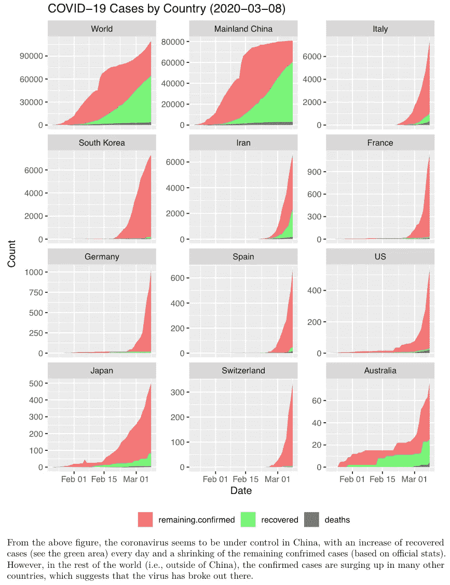

【RDataMining 的赵延昌博士发表了一份关于冠状病毒`{tidyverse}`和`{ggplot2}`包的数据分析，针对[中国](http://www.rdatamining.com/docs/Coronavirus-data-analysis-china.pdf)和[全球](http://www.rdatamining.com/docs/Coronavirus-data-analysis-world.pdf)。

这两个文件都是数据清理、数据处理和跨国家或地区的确诊/治愈病例和死亡率的可视化的混合。

# 一段时间内新冠肺炎累计观察到的病死率

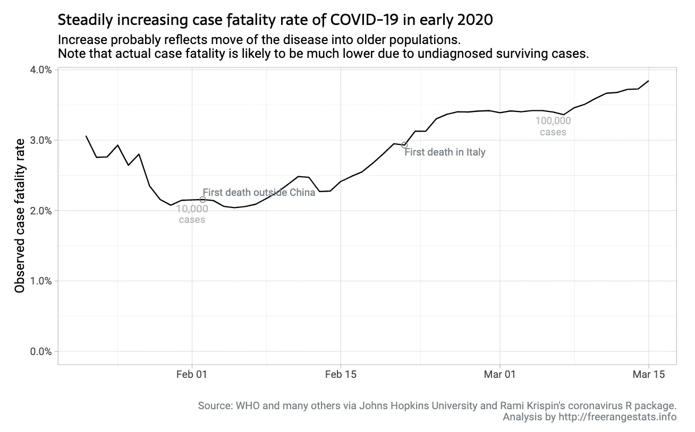

由 [Peter Ellis](http://freerangestats.info/) 撰写，这篇[文章](http://freerangestats.info/blog/2020/03/17/covid19-cfr)聚焦于观察到的新冠肺炎病死率如何在 7 个国家随时间演变，并评论为什么比率不同(低检测率、人口年龄、医院不堪重负等)。).

代码可以在文章的末尾找到。数据来自约翰·霍普斯金，使用的是`[{coronavirus} package](https://www.statsandr.com/blog/top-r-resources-on-covid-19-coronavirus/#coronavirus)`。

最近，作者发表了一系列其他文章:

1.  [一个国家的年龄分类对新冠肺炎病死率的影响](http://freerangestats.info/blog/2020/03/21/covid19-cfr-demographics):它根据不同国家的年龄分布(基于意大利的数据)查看这些国家的估计死亡人数。数据来自 Istituto Superiore di Sanità(罗马)，所有代码都显示在帖子中。
2.  [如何用 ggplot2 和刻度制作疯狂的福克斯新闻频道 y 轴图表](http://freerangestats.info/blog/2020/04/06/crazy-fox-y-axis):关于 COVID19，不如说是关于如何通过正确的变换重新创建一个奇异的福克斯新闻频道图，以使其刻度合适。
3.  [检测阳性率和疾病的实际发病率和增长](http://freerangestats.info/blog/2020/05/09/covid-population-incidence):这篇博客文章着眼于几种不同的方式来解释新冠肺炎高阳性检测率给我们提供的信息，并着眼于对某一时间点有效生殖数量估计的影响。
4.  [调整试验阳性后德克萨斯州新冠肺炎的发病率](http://freerangestats.info/blog/2020/05/17/covid-texas-incidence):作者研究了德克萨斯州新冠肺炎病例的趋势，有和没有用试验阳性率的平方根乘数进行调整。

# Covid 19 跟踪

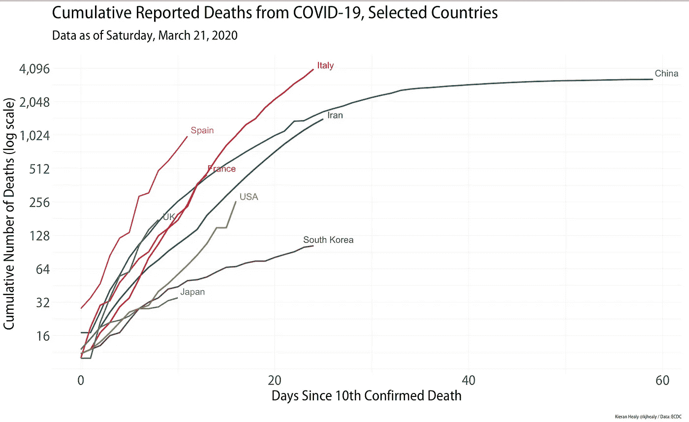

由[基兰·希利](https://kieranhealy.org/)教授撰写的这篇[文章](https://kieranhealy.org/blog/archives/2020/03/21/covid-19-tracking/)讨论了如何利用来自欧洲疾病控制中心的[新冠肺炎数据获得最佳可用死亡人数的概述。](https://www.ecdc.europa.eu/en/publications-data/download-todays-data-geographic-distribution-covid-19-cases-worldwide)

代码可以在文章中和 [GitHub](https://github.com/kjhealy/covid) 上找到。

最近，作者发表了另外三篇文章:

1.  [A COVID Small Multiple](https://kieranhealy.org/blog/archives/2020/03/27/a-covid-small-multiple/) :本文讨论如何按国家创建病例的 small-multiple 图，显示大量国家的疫情轨迹，每个 small-multiple 面板的背景也显示(灰色)其他每个国家的轨迹，以供比较。

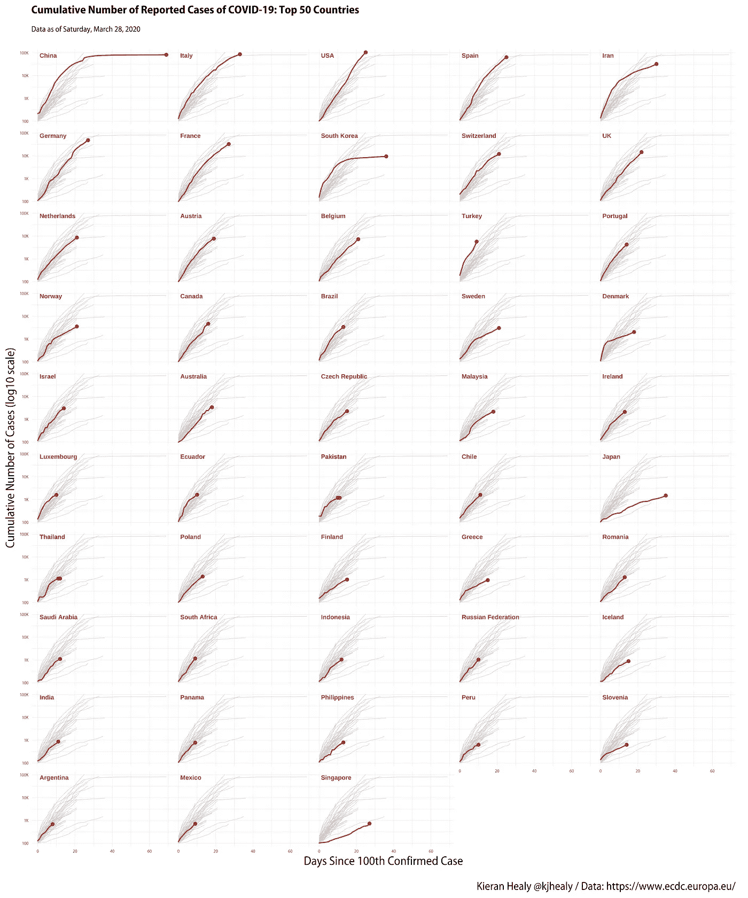

[2。苹果的 COVID 移动数据](https://kieranhealy.org/blog/archives/2020/04/23/apples-covid-mobility-data/):这篇文章使用苹果的几个城市和国家的时间序列移动数据(通过`[{covdata}](https://www.statsandr.com/blog/top-r-resources-on-covid-19-coronavirus/#covdata)` [包](https://www.statsandr.com/blog/top-r-resources-on-covid-19-coronavirus/#covdata))来绘制三种出行方式:驾车、公共交通和步行。该系列始于 1 月 13 日，指数为 100，因此趋势是相对于基线的。

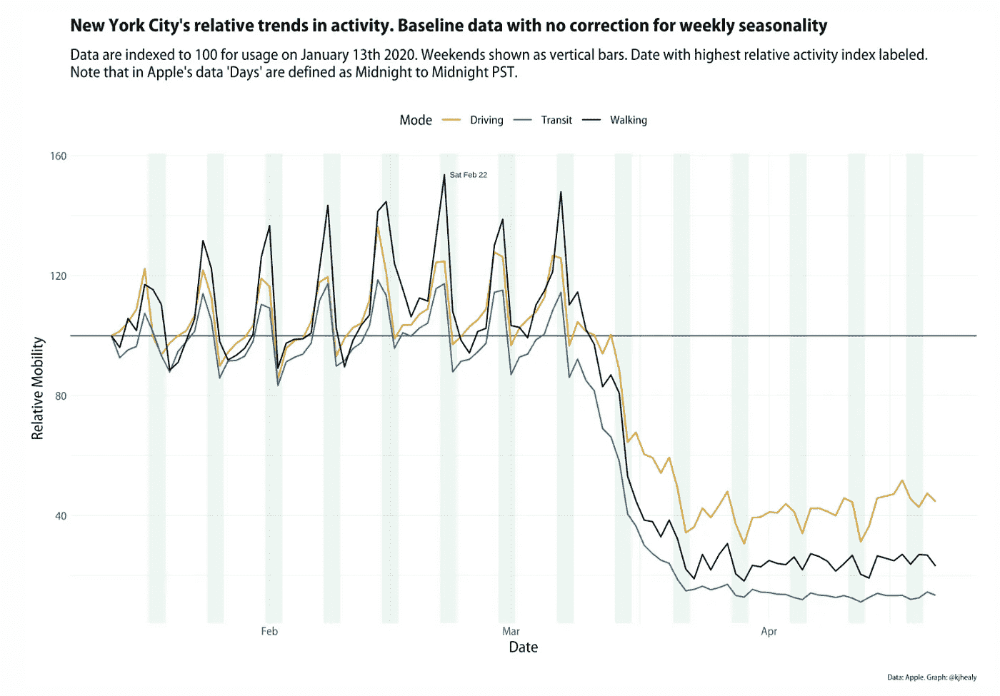

3.[新奥尔良和标准化](https://kieranhealy.org/blog/archives/2020/04/28/new-orleans-and-normalization/):这篇文章回应了 Drang 博士关于数据标准化改进的一篇深思熟虑的[帖子](https://leancrew.com/all-this/2020/04/small-multiples-and-normalization/)。

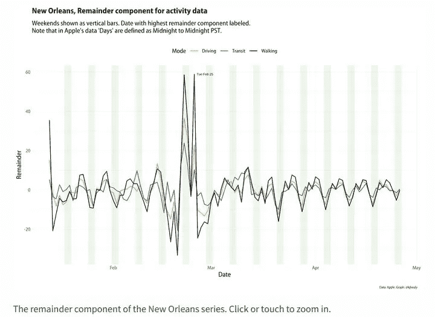

# 传染病与非线性微分方程

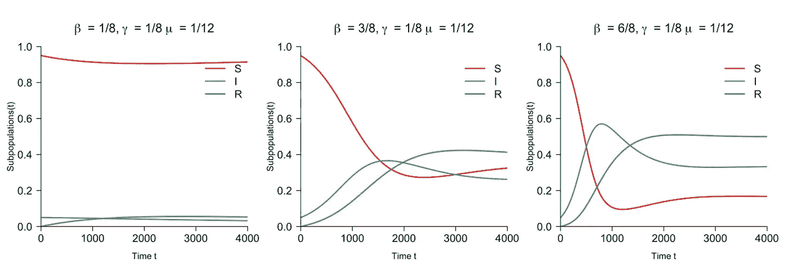

Fabian Dablander 发表的这篇数学密集型的[博客文章](https://fabiandablander.com/r/Nonlinear-Infection.html)解释了 SIR 和 SIRS 模型考虑的因素以及它们如何计算结果。

从疫情的角度来看，作者写道“SIRS 模型扩展了 SIR 模型，允许恢复的人口再次变得易感(因此有了额外的‘S’)。它假定易感人群与康复人群成比例增加”。

最近，作者与其他研究人员合作，发表了另一篇[博文](https://scienceversuscorona.com/visualising-the-covid-19-pandemic/)，概述了 COVID19 疫情的许多优秀可视化，并展示了他们自己的[仪表板](https://www.statsandr.com/blog/top-r-resources-on-covid-19-coronavirus/#covid-19-overview)。

# 使用 SIR 模型对英国的新冠肺炎疫情进行建模

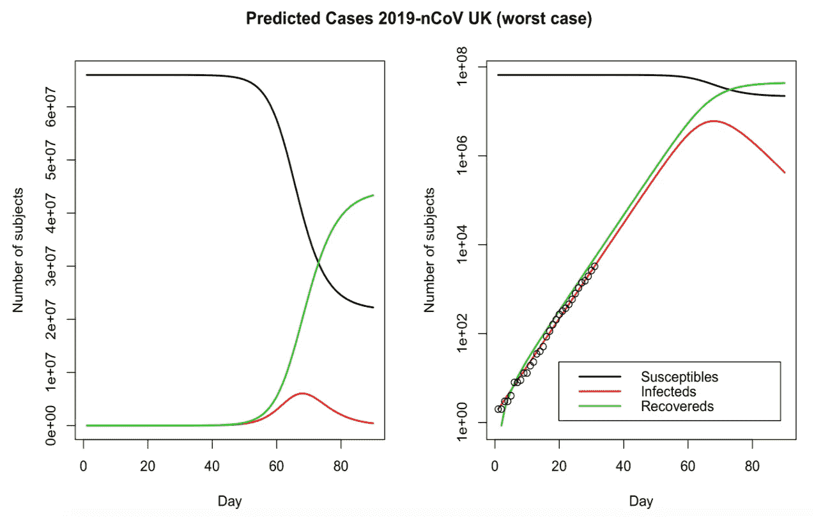

由[托马斯·威尔丁](https://tjwilding.wordpress.com/)发表的这篇[博文](https://tjwilding.wordpress.com/2020/03/20/epidemic-modelling-of-covid-19-in-the-uk-using-an-sir-model/)将 SIR 模型应用于英国数据。

作为模型的进一步扩展，作者建议:

*   使用 SEIR 模型(为已感染但尚未传染的人增加一个暴露的隔间)
*   增加了一个“Q”层，因为许多人被隔离或隔离
*   考虑到被感染但由于缺乏检测而被拒绝检测的“隐藏”人群
*   今年晚些时候爆发第二波/第二次疫情的可能性(如之前的疫情，如猪流感)

数据来源:

*   [维基百科](https://en.wikipedia.org/wiki/2020_coronavirus_pandemic_in_the_United_Kingdom)
*   [世界计量表](https://www.worldometers.info/coronavirus/country/uk/)
*   [守护者](https://www.theguardian.com/world/2020/mar/23/coronavirus-uk-how-many-confirmed-cases-are-in-your-area)

# 流行病建模

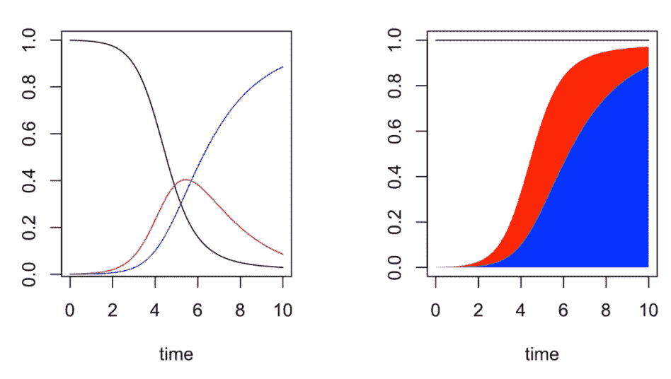

由 Arthur Charpentier 发表的这一系列 3 篇博文([第一部分](https://freakonometrics.hypotheses.org/60482)、[第二部分](https://freakonometrics.hypotheses.org/60543)、[第三部分](https://freakonometrics.hypotheses.org/60514))详细介绍了 SIR 模型及其参数，以及 ODEquations 如何求解该模型并生成繁殖率。它还给出了一个模型的数学解释，该模型解释了疫情将会以多快的速度回归，尽管强度会逐渐减弱。最后，它解释了一个比 SIR 更复杂的模型，即 SEIR 模型，并用伊波拉数据进行了说明。

最近，作者发表了另一篇[文章](https://freakonometrics.hypotheses.org/60900)，该文章调查了美国各州接受新型冠状病毒检测的人口比例，并试图回答以下两个问题:

1.  每天有多少人接受测试？
2.  我们到底在测试什么？

最后但同样重要的是，这篇[帖子](https://freakonometrics.hypotheses.org/60931)转载了他的一篇题为“[新冠肺炎疫情控制:在 ICU 可持续性下平衡检测政策和封锁干预](https://hal.archives-ouvertes.fr/hal-02572966)”的科学论文。

# 新冠肺炎:德国的例子

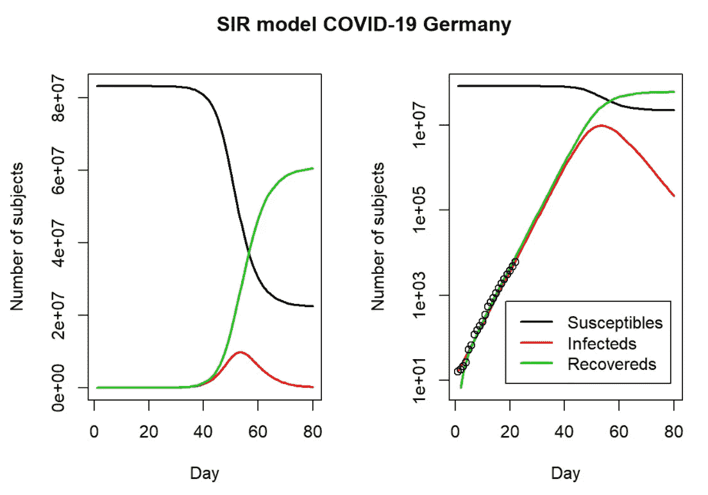

由来自[学习机器](https://blog.ephorie.de/)的 Holger K. von Jouanne-Diedrich 教授发布的这篇[博文](https://blog.ephorie.de/covid-19-the-case-of-germany)使用 SIR 模型和德国数据来估计疫情的持续时间和严重程度。

从 [Morgenpost](https://interaktiv.morgenpost.de/corona-virus-karte-infektionen-deutschland-weltweit/data/Coronavirus.history.v2.csv) 下载数据。

最近，作者发表了其他文章:

1.  [美国新冠肺炎:实际感染和未来死亡的粗略计算](https://blog.ephorie.de/covid-19-in-the-us-back-of-the-envelope-calculation-of-actual-infections-and-future-deaths):从 Covid19 报告的死亡数回溯，这篇文章展示了如何根据死亡率和感染期的几个假设(并承认许多未知和数据问题)来估计之前的感染数。
2.  [如何用 R](https://blog.ephorie.de/covid-19-analyze-mobility-trends-with-r) 分析移动趋势使用匿名化和聚合的[苹果向公众公开的移动数据](https://www.apple.com/covid19/mobility)。本文介绍了一个 R 函数，该函数以结构良好的格式返回国家和主要城市的数据，并可视化疫情导致的车辆和行人流量下降。

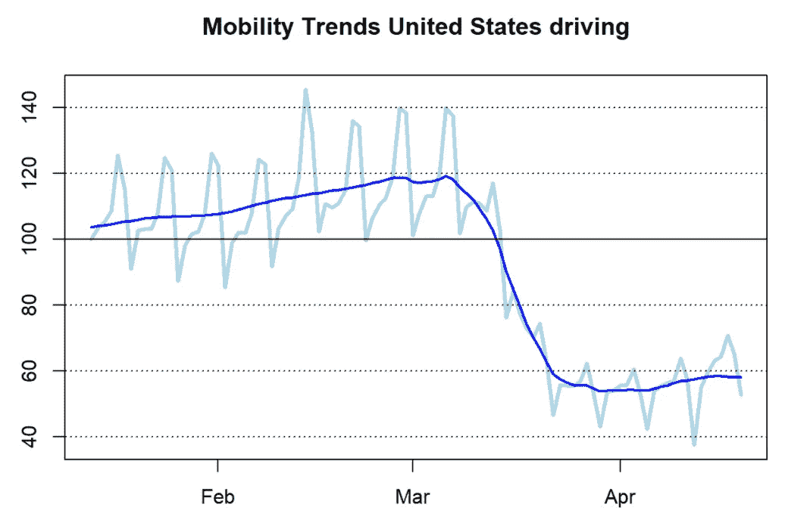

3.[新冠肺炎:假阳性警报](https://blog.ephorie.de/covid-19-false-positive-alarm)，展示了感染率对冠状病毒检测呈阳性的人实际呈阳性的可能性的重要性。

# 展平新冠肺炎曲线

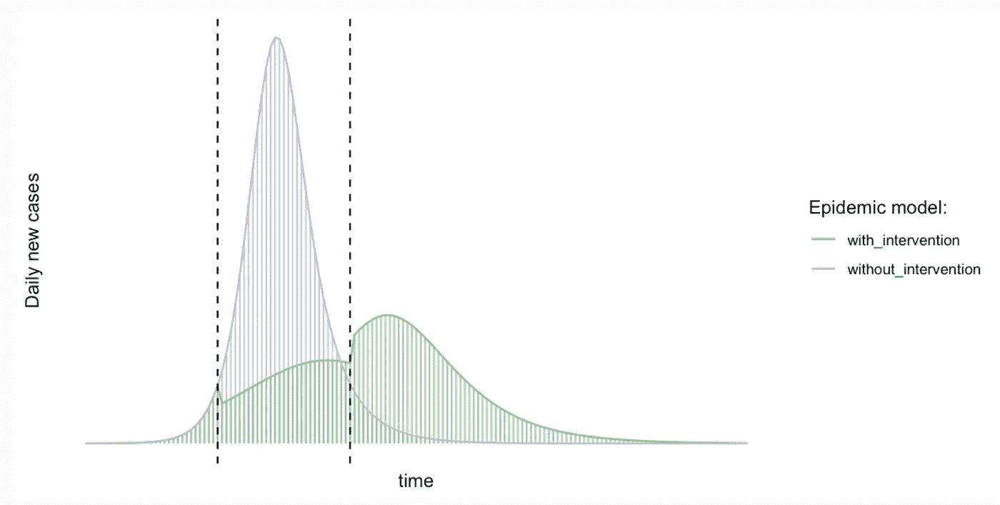

由来自《理论与实践》的 Michael hle 发表的这篇博客文章讨论了为什么平坦化新冠肺炎曲线的信息是正确的，但是为什么一些用来显示效果的可视化是错误的:减少基本繁殖数不仅仅延长了爆发，它也减少了爆发的最终规模。

从疫情的角度来看，作者写道“由于卫生能力有限，延长疫情爆发的时间将确保更大比例的需要住院治疗的人能够真正得到治疗。这种方法的其他优点是赢得时间，以便找到更好的治疗方法，并有可能最终研制出疫苗”。

本文还构建了一个[闪亮的应用](https://www.statsandr.com/blog/top-r-resources-on-covid-19-coronavirus/#flatten-the-curve)来研究不同的场景。

在第二篇题为“[有效再生产数量估算](https://staff.math.su.se/hoehle/blog/2020/04/15/effectiveR0.html)”的文章中，Michael hle 用`{R0}`包估算了新冠肺炎等传染病爆发期间随时间变化的有效再生产数量。他用一个模拟的疾病爆发来比较三种不同评估方法的性能。

最近，在这篇[文章](https://staff.math.su.se/hoehle/blog/2020/05/31/superspreader.html)中，作者从统计学的角度看待传染病传播中的“超级传播”。他用基尼系数而不是通常的负二项分布的离差参数来描述子代分布的异质性。这允许我们考虑更灵活的后代分布。

# 扁平化 vs 收缩:#扁平化曲线的数学

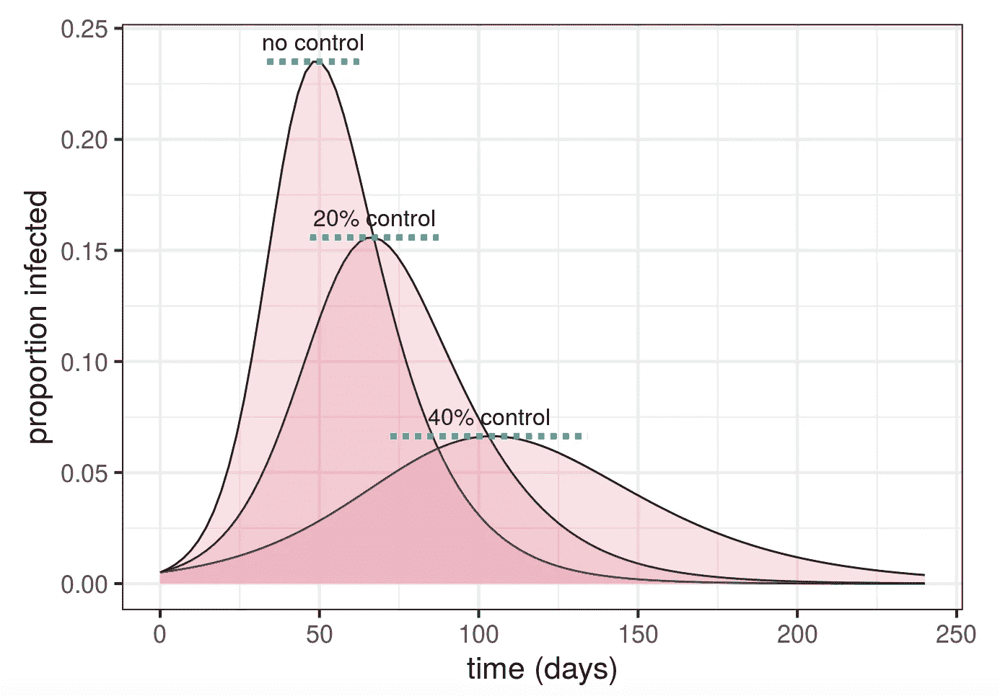

由 Ben Bolker 和 Jonathan Dushoff 发布的这篇[博客文章](http://ms.mcmaster.ca/~bolker/misc/peak_I_simple.html)对物理距离给出了清晰的解释，并解释了物理距离如何使几种有益的结果成为可能。

该代码可在 [GitHub](https://github.com/bbolker/bbmisc/blob/master/peak_I_simple.rmd) 上获得。

# #explainCovid19 挑战

由 Przemyslaw Biecek 发表的这篇[博客文章](https://medium.com/@ModelOriented/explaincovid19-challenge-2453b255a908)概述了一个使用梯度推进来预测基于年龄、国家和性别的存活率的模型。它还显示了老年人的风险更大，并让您自己使用 [modelStudio 交互式仪表盘](https://pbiecek.github.io/explainCOVID19/)来玩这个模型。

数据来源:

*   [谷歌表单](https://docs.google.com/spreadsheets/u/2/d/e/2PACX-1vQU0SIALScXx8VXDX7yKNKWWPKE1YjFlWc6VTEVSN45CklWWf-uWmprQIyLtoPDA18tX9cFDr-aQ9S6/pubhtml)(最新数据在二月底)
*   [Kaggle 数据集](https://www.kaggle.com/sudalairajkumar/novel-corona-virus-2019-dataset)

# 探索新型冠状病毒的 R 包

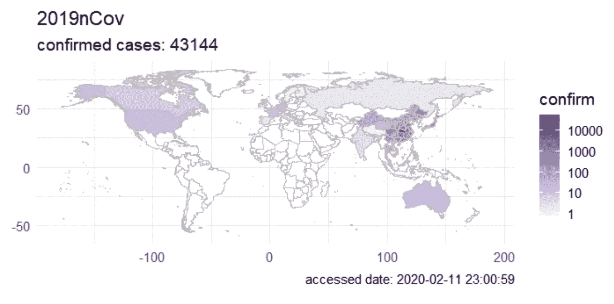

由 Patrick Tung 通过《走向数据科学》发表的这篇博文被翻译成英文。

数据收集自腾讯，位于[https://news.qq.com/zt2020/page/feiyan.htm](https://news.qq.com/zt2020/page/feiyan.htm)，其中包含冠状病毒的最新公开信息之一。

# 使用 R-哥伦比亚的冠状病毒模型

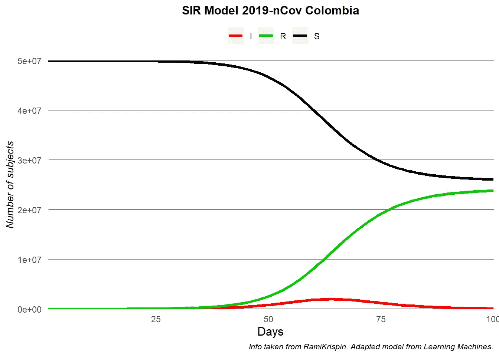

这篇由丹尼尔·佩纳·查维斯发布的[博客文章](https://medium.com/@daniel.pena.chaves/simple-coronavirus-model-using-r-cf6b1bc93949)使用了霍尔格·k·冯·朱安·迪德里奇教授的代码来模拟疫情的高度和预计的死亡人数。作者还指出，大量的其他变量需要考虑，如密度，气候和政府的反应。

数据来自 [Rami Krispin 的 GitHub](https://github.com/RamiKrispin) 。

最近，作者发表了另一篇[文章](https://medium.com/analytics-vidhya/can-the-worse-be-over-covid-19-data-analysis-4e9dd042dd26)比较中国和意大利的对数比例。

# 新冠肺炎:西班牙的案例

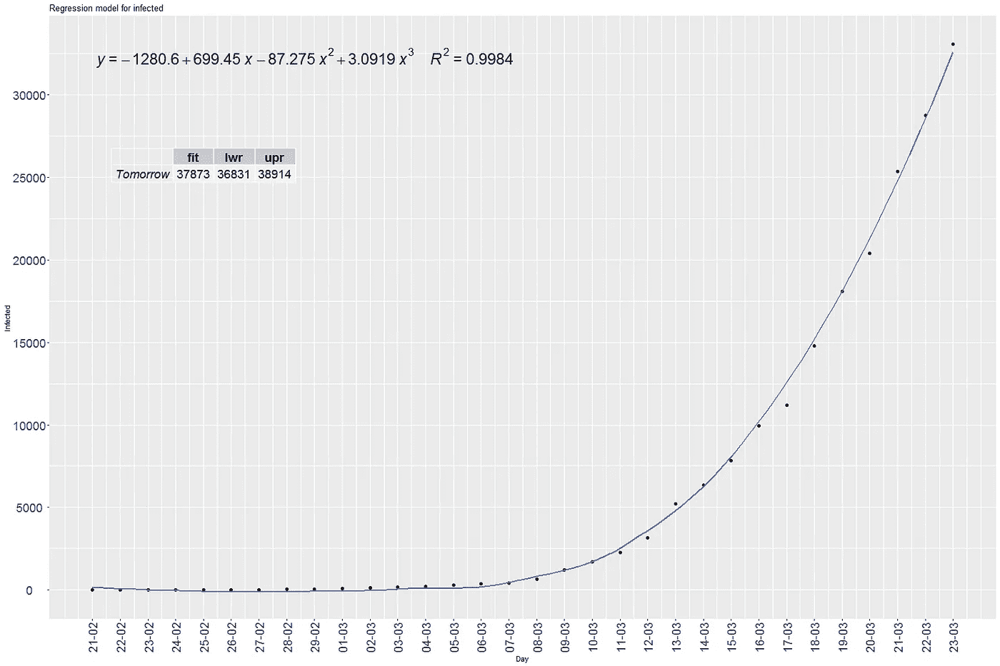

由来自[Diarium-Statistics and R software](https://diarium.usal.es/jose/author/jose/)的 Jose 撰写的这篇[博文](https://diarium.usal.es/jose/2020/03/20/covid-19-the-case-of-spain/)使用西班牙的数据，应用 SIR 模型，然后是三次多项式回归模型来预测感染、住院、死亡和高峰日期。

# 整理新的约翰霍普金斯大学新冠肺炎时间序列数据集

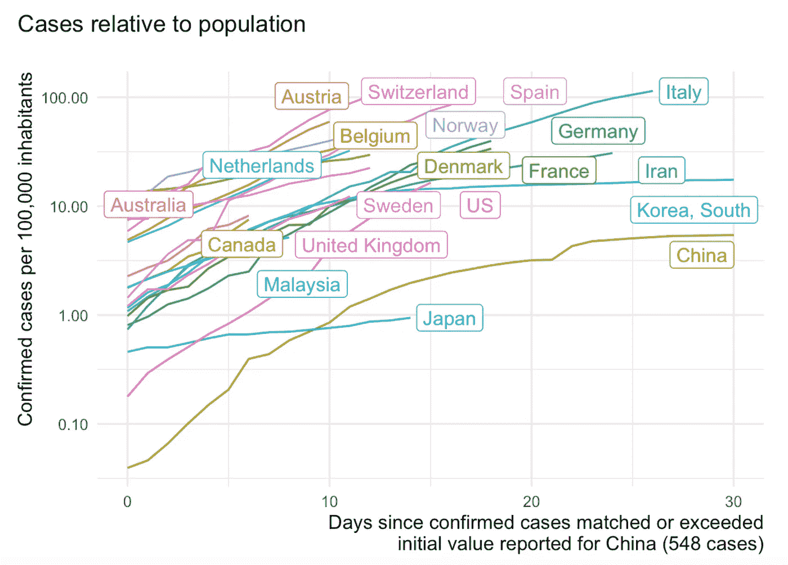

由 Joachim Gassen 撰写的这篇博客文章提供了处理不同国家名称和约翰霍普金斯网站上的变化的函数和代码。

最近，作者发表了一系列其他有趣的文章:

1.  [合并新冠肺炎数据和政府干预数据](https://joachim-gassen.github.io/2020/03/merge-covid-19-data-with-governmental-interventions-data/):本文分析了对新冠肺炎传播的五种干预。

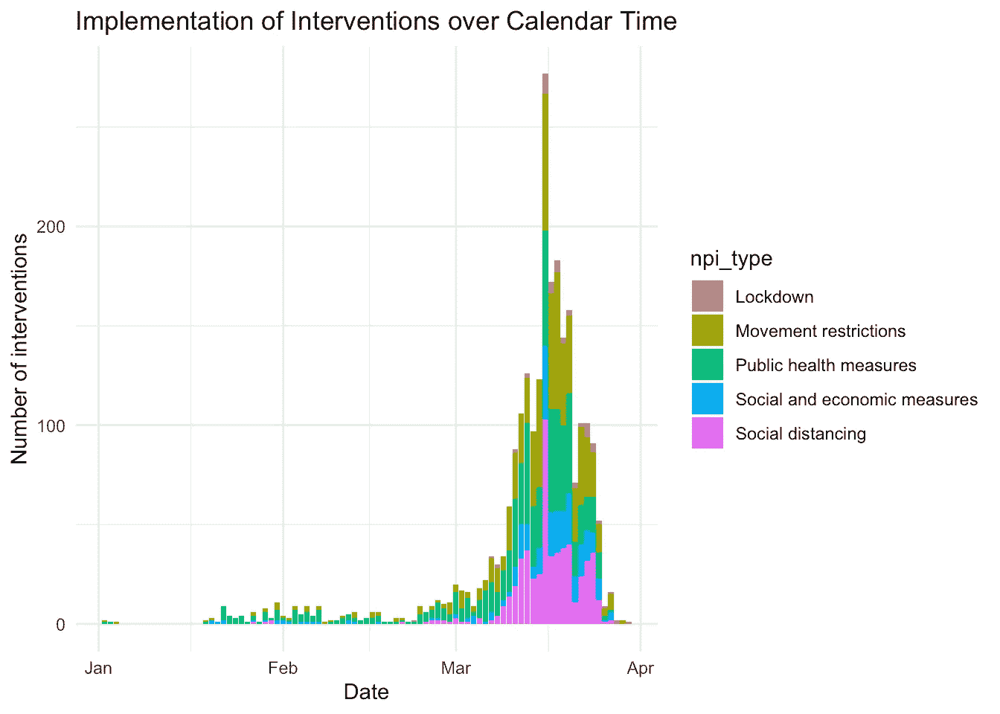

2.[从 PDF 数据中抓取谷歌新冠肺炎社区活动数据](https://joachim-gassen.github.io/2020/04/scrape-google-covid19-cmr-data/):这篇文章解释了如何从一个跟踪人们活动的谷歌网站中抓取数据。作者使用了`{tidycovid19}` R 软件包，准备对德国和其他国家进行分析。

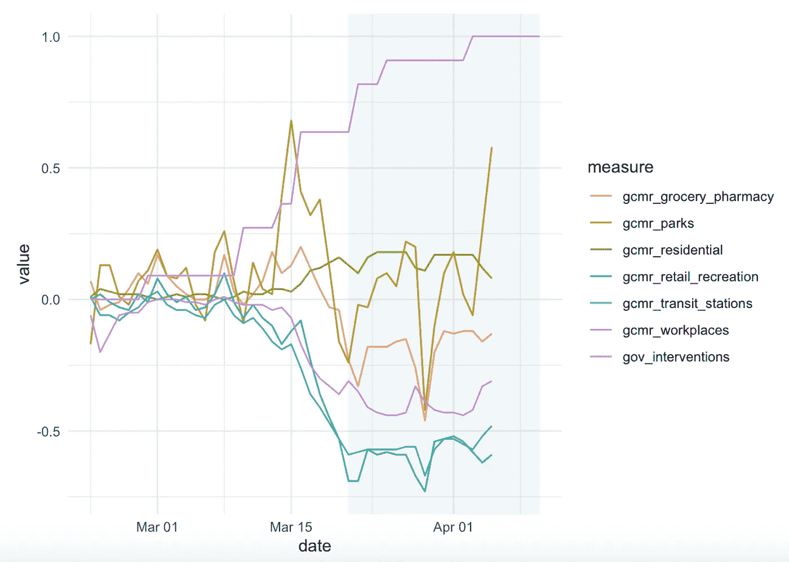

3.[新冠肺炎:探索你的可视化自由度](https://joachim-gassen.github.io/2020/04/covid19-explore-your-visualier-dof/):在这篇文章中，作者用新冠肺炎的数据展示了图形是如何以非常不同的方式交流和被操纵的。他指出，向读者传达一个“中性”的信息绝非易事，没有指导的可视化尤其容易误导读者。

4. [{tidycovid19}新数据和文档](https://joachim-gassen.github.io/2020/05/tidycovid19-new-data-and-doc/):最近对 [{tidycovid19}](https://www.statsandr.com/blog/top-r-resources-on-covid-19-coronavirus/#tidycovid19) 包的更新带来了测试数据、替代案例数据、一些地区数据和适当的数据文档。使用所有这些，你可以使用软件包来探索政府措施(的解除)、公民行为和新冠肺炎传播之间的联系。

5.[探索和基准牛津政府反应数据](https://joachim-gassen.github.io/2020/04/exploring-and-benchmarking-oxford-government-response-data/):基于[评估能力项目(ACAPS)](https://www.acaps.org/covid19-government-measures-dataset) 和[牛津新冠肺炎政府反应追踪](https://www.bsg.ox.ac.uk/research/research-projects/coronavirus-government-response-tracker)评估非药物干预对新冠肺炎传播影响的帖子。

# 比利时的新冠肺炎

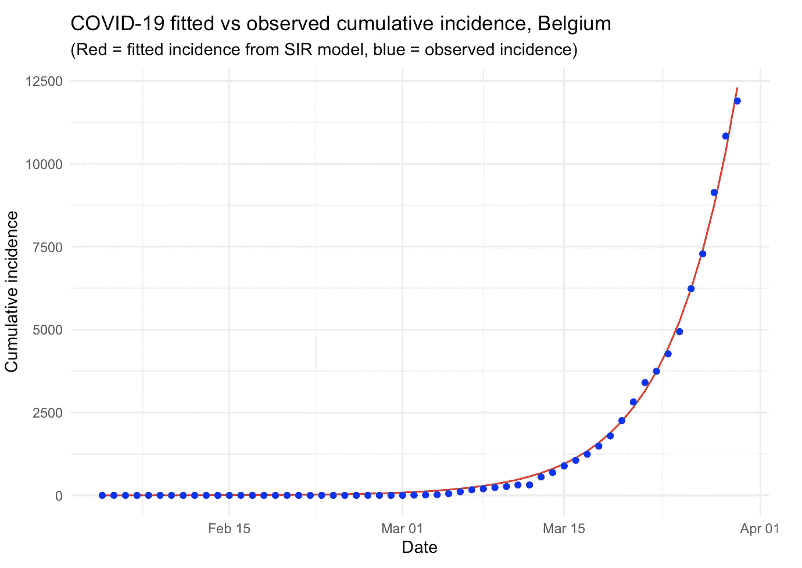

基于 Tim Churches 的文章，我发表了一篇关于新冠肺炎的分析文章。在这篇文章中，我还使用了最常见的流行病学模型，SIR 模型(以其最简单的形式)，来分析在没有公共卫生干预的情况下疾病的爆发。我还展示了如何计算繁殖数，并提出了一些额外的改进，可以进一步分析流行病。

该代码可在 GitHub 上获得，因此可以随意使用它作为分析您自己国家的病毒爆发的起点。

# 由 R 和 ggplot2 创建的 5 个图表中关于冠状病毒疾病 2019(新冠肺炎)的事实

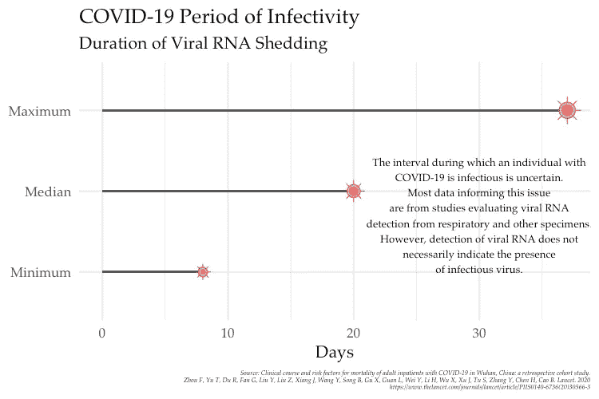

由 [Gregory Kanevsky](https://www.linkedin.com/in/gkanevsky/) 撰写的这篇[博客文章](https://novyden.blogspot.com/2020/03/facts-about-coronavirus-disease-2019.html)将一些关于新冠肺炎的有用事实汇编成 5 个图表，包括量表图表，并讨论了用于创建它们的 R 和`{ggplot2}`技术。

# 新冠肺炎的传染性第一部分:数学拟合的改进

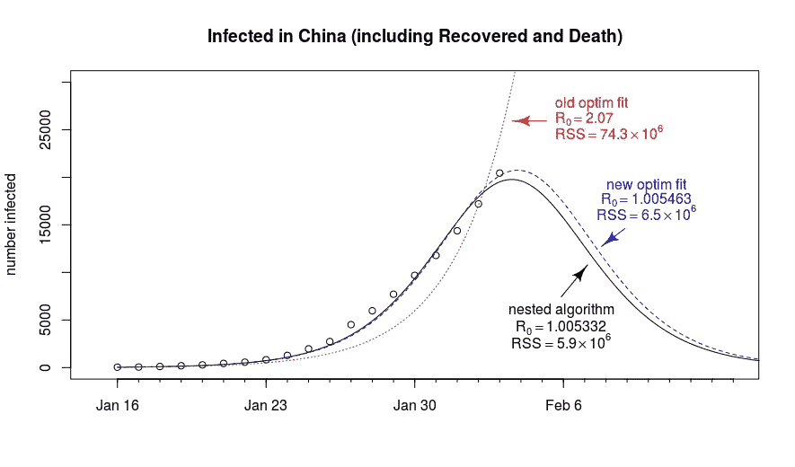

这篇[客座博文](https://blog.ephorie.de/contagiousness-of-covid-19-part-i-improvements-of-mathematical-fitting-guest-post)由 [Martijn Weterings](https://www.linkedin.com/in/martijn-weterings-7035609a/) 在学习机上撰写，描述了新冠肺炎数据与 SIR 模型的拟合，并解释了拟合方法的棘手部分以及我们如何减轻一些问题(例如，算法的早期停止或病态问题)。它非常清楚地解释了对标准模型的一些调整。

代码可在[这里](https://blog.ephorie.de/wp-content/uploads/2020/03/covid.r)获得。

# 冠状病毒:法国空间平滑死亡和死亡动画地图

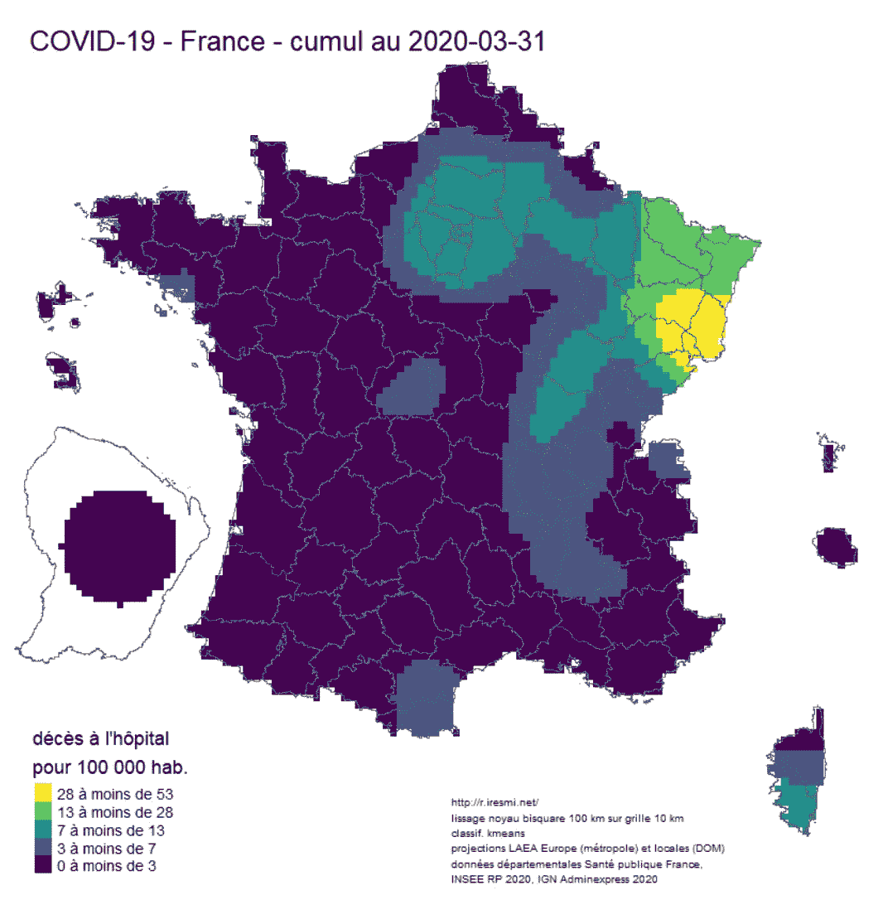

由来自 r.iresmi.net 的 Michael Ires 发布的这篇博文展示了 R 代码，展示了如何使用带有任意边界区域的核加权平滑来显示法国新冠肺炎的死亡地图。

作者还发表了另外两篇文章，内容是关于如何构建新冠肺炎在法国和欧洲的死亡动画地图。

最近，作者发表了一篇[文章](http://r.iresmi.net/2020/05/26/polygons-to-hexagons/)，其中他使用了`{geogrid}`包来显示法国各部门的 Covid19 发生率以及传播情况。

# 另一个“拉平新冠肺炎曲线”模拟…在 R

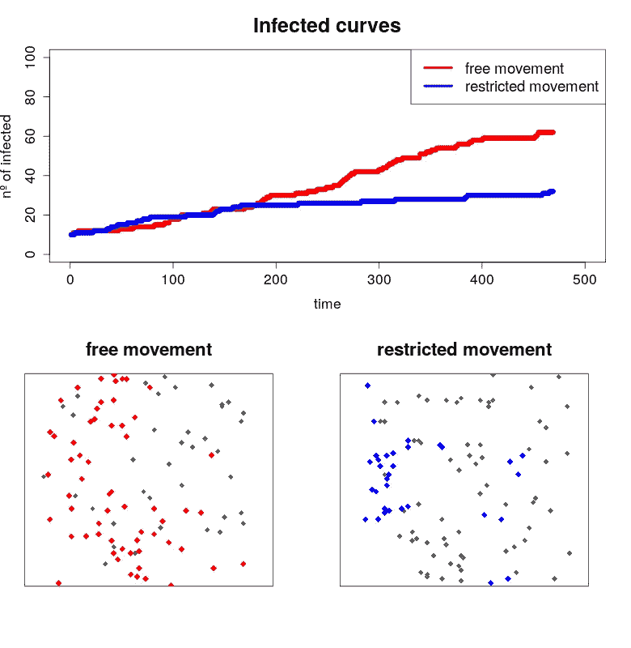

由[哈维尔·费尔南德兹-洛佩兹](http://allthiswasfield.blogspot.com/)撰写的这篇[博客文章](http://allthiswasfield.blogspot.com/2020/04/another-flatten-covid-19-curve.html)展示了 R 代码来创建静态图，然后模拟演示社交距离如何有助于“平坦化”新冠肺炎感染的曲线。

# 用 R 跟踪整个新泽西州的 Covid19 病例

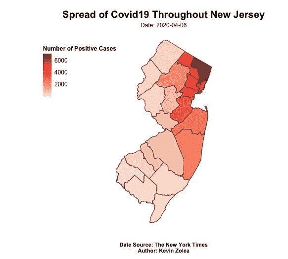

由 [Kevin Zolea](https://www.kevinzolea.com/) 撰写的这篇[博客文章](https://www.kevinzolea.com/post/covid19_nj/tracking-covid19-cases-throughout-nj-with-r/)展示了如何使用`{gganimate}`包创建一个动画时间序列地图，显示 Covid19 如何在美国新泽西州的各个县蔓延。

# 看着 Y A C M(又一个 COVID 模型)很有趣

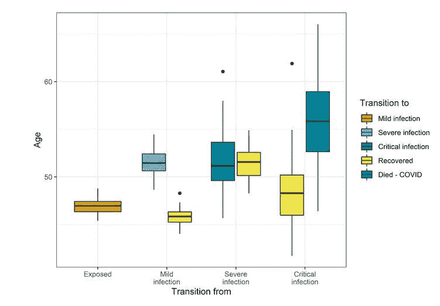

由 Adrian Barnett 从 [Median Watch](https://medianwatch.netlify.com/) 撰写，这篇[博文](https://medianwatch.netlify.com/post/covid-uncertainty/)中的所有模型都是基于 Alison Hill 优秀的常微分方程模型。它们是那些大量使用`{MicSim}`包在 r 中运行微观模拟的模型的微观模拟。

# Covid19 &一些计算语料库语言学

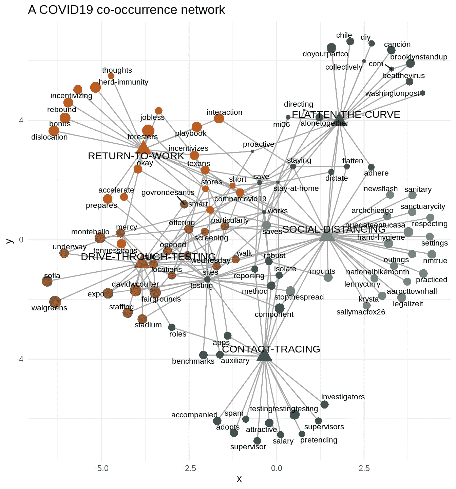

由 [Jason Timm](https://www.jtimm.net/) (语言学博士)撰写的这篇[博客文章](https://www.jtimm.net/2020/05/26/corp-comp-ling-covid19/)分析了美国国会 535 名投票议员在第 116 届国会第二次会议期间生成的所有推文。更具体地说，作者将 COVID19 相关术语的使用视为时间和党派关系的函数。他还使用手套模型和多维标度研究了 COVID19 相关术语的概念相关性。

# 新冠肺炎有那么糟糕吗？是的，很可能是

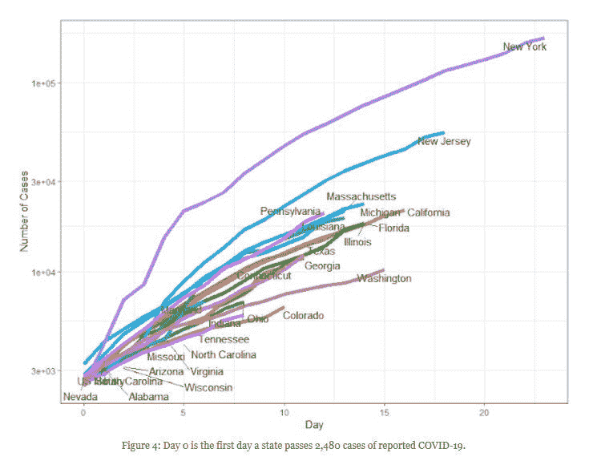

由[计量经济学的 Francis Smart 博士通过模拟](http://www.econometricsbysimulation.com/)撰写的这篇[文章](http://www.econometricsbysimulation.com/2020/04/is-covid-19-as-bad-as-all-that-yes-it.html)清楚地解释了决定 COVID19 感染和死亡的一些因素，以及不同的严重程度。

# 新冠肺炎潜在的长期干预策略

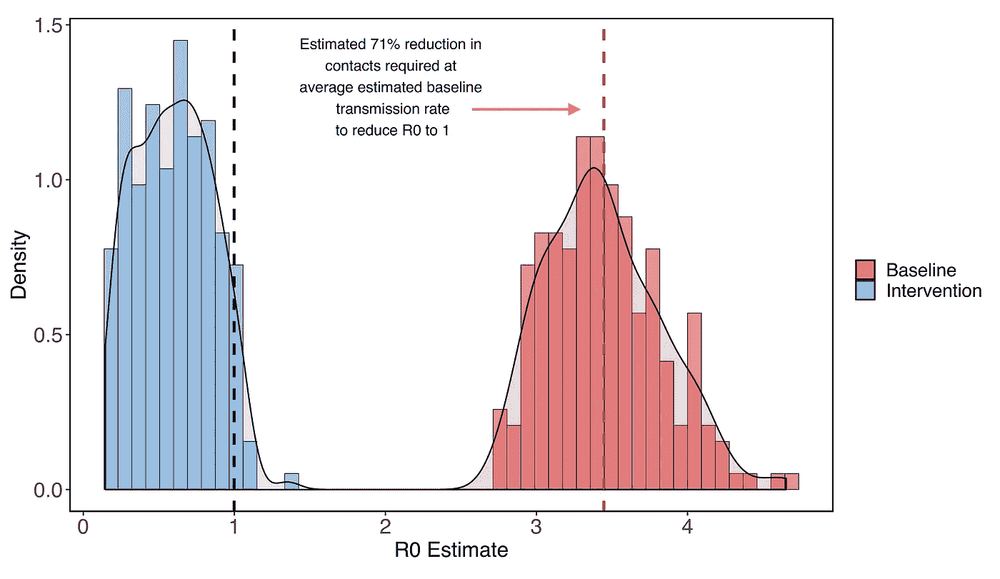

在这个[网站](https://covid-measures.github.io/)上，斯坦福大学的几位教授和成员(Marissa Childs、Morgan Kain、Devin Kirk、Mallory Harris、Jacob Ritchie、Lisa Couper、Isabel Delwel、Nicole Nova、Erin Mordecai)开发了一个新冠肺炎房室模型来评估非药物干预(如社会距离)的可能结果。

该网站介绍了该问题、利用模型预测 COVID 干预策略效果的可能性(多亏了一个闪亮的应用程序)、模型细节以及对加利福尼亚州圣克拉拉县的预测。

该代码可在 [GitHub](https://github.com/morgankain/COVID_interventions) 上获得。

# 冠状病毒时代的动画

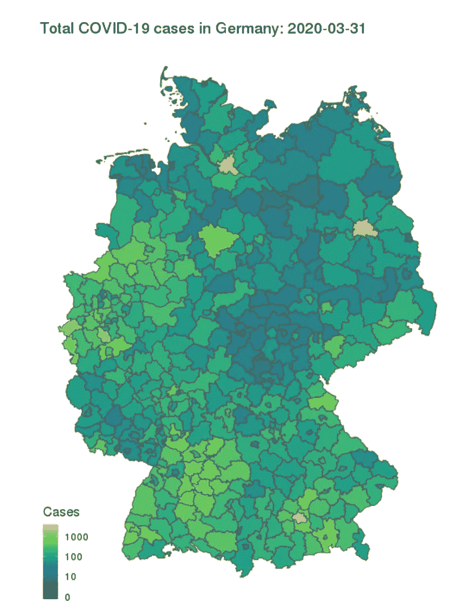

由 Martin Henze 从 [Heads or Tails 博客](https://heads0rtai1s.github.io/)撰写，这篇[文章](https://heads0rtai1s.github.io/2020/04/30/animate-map-covid/)描述了如何提取和准备必要的数据来制作病毒在德国随时间传播的动画，使用`{gganimate}`和`{sf}` R 包来创建动画地图视觉效果。

作者将与德国地图相关的数据集发布到 [Kaggle](https://www.kaggle.com/headsortails/covid19-tracking-germany) 上，他每天都在那里维护它。此外，他发布了一个版本的 [JHU 美国县级数据集](https://www.kaggle.com/headsortails/covid19-us-county-jhu-data-demographics)，其中他添加了一些来自美国人口普查的关键人口统计信息。这个数据集也每天更新。

# 密西根州的新冠肺炎数据和预测

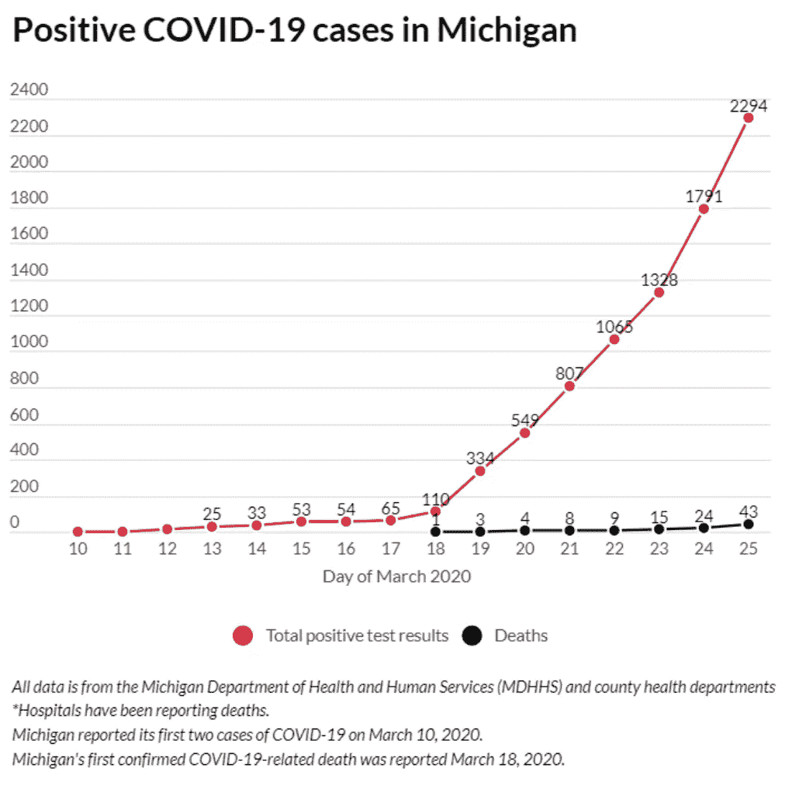

由 Nagdev Amruthnath 撰写的这篇博客文章建立并测试了一个基于密歇根州数据的指数回归模型。

# 美国新冠肺炎的数据可视化

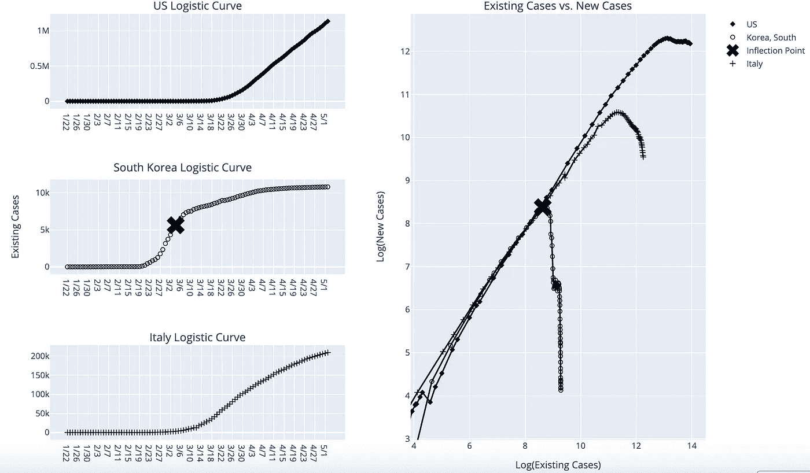

这篇由丹尼尔·雷夫撰写的文章使用指数和逻辑曲线研究了新冠肺炎的增长动力。

# 新冠肺炎教在各国的传播

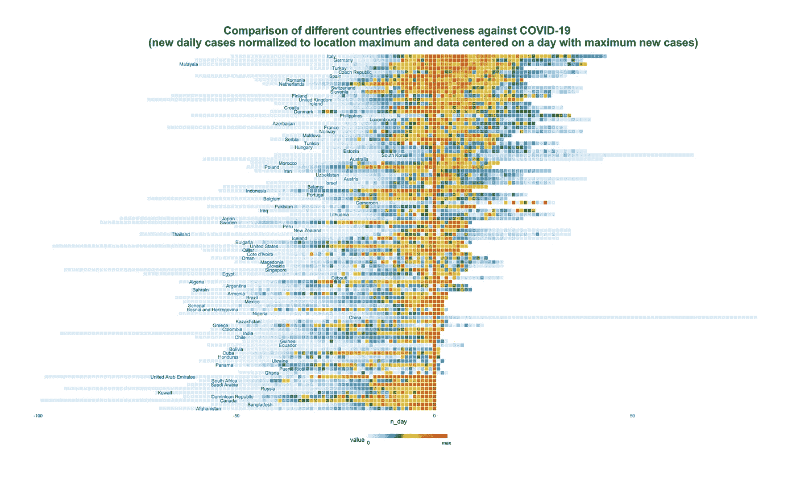

Sergey Bryl 在博客[analyzecore.com](https://analyzecore.com/)中写道，这篇[文章](https://analyzecore.com/2020/05/04/the-spread-of-covid-19-across-countries-visualization-with-r/)调查了病毒在国家间的传播速度。一个动画可视化和两个静态图表显示:

*   之前的阶段持续了多长时间，强度有多大
*   比较不同国家对新冠肺炎的有效性

代码可以在文章末尾找到。

# 美国的新冠肺炎和农村地区

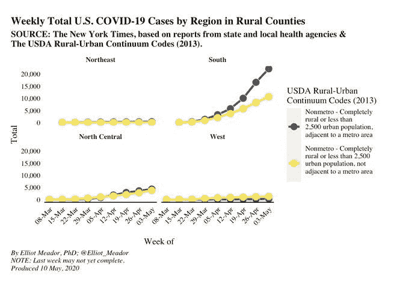

由来自 [Deltanomics](https://www.thedeltanomics.com/) 的 Elliot Meador 撰写的这篇[博客文章](https://www.thedeltanomics.com/post/covid-19-rural-deltanomics/)聚焦于美国农村地区的新冠肺炎案例，包括在南方是否有任何一个特定的州似乎是一个例外。

# Covid 死亡率:数据正确吗？

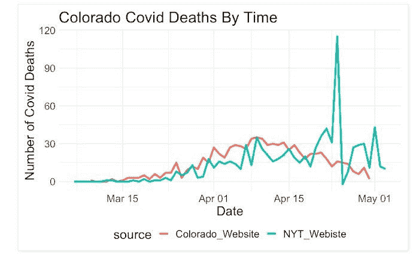

由 Sam Weiss 撰写的这篇[帖子](http://scweiss.blogspot.com/2020/05/covid-death-rates-is-data-correct.html)对病例数报告的准确性提出了质疑，因为它们可能无法填充正确的数据。

最近，作者发表了两篇文章([第一部分](https://scweiss.blogspot.com/2020/03/can-trade-explain-covid-19-cases.html)和[第二部分](https://scweiss.blogspot.com/2020/03/can-trade-with-china-predict-covid-19.html))，其中他发现并可视化了一个国家新冠肺炎病毒检测呈阳性的人数与从中国进口之间的关联。此外，他发现有些特定行业与新冠肺炎利率特别相关。

# 带有位置数据的新冠肺炎风险热图、Apache Arrow、马尔可夫链建模和 R Shiny

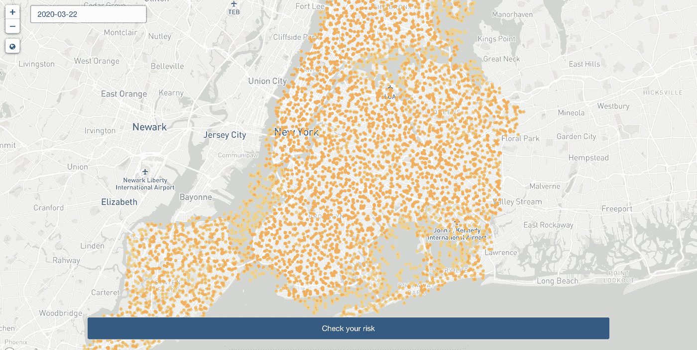

由 [Filip Stachura](https://www.linkedin.com/in/filipstachura/) 撰写，这篇[帖子](https://appsilon.com/covid-19-risk-heat-maps-with-location-data-apache-arrow-markov-chain-modeling-and-r-shiny/)描述了 Appsilon 提交给最近疫情响应黑客马拉松的解决方案(CoronaRank)。受谷歌 PageRank 的启发，它使用 Veraset 的 Apache Parquet 格式的地理位置数据，通过马尔可夫链建模进行有效的暴露风险评估。

# 新冠肺炎追踪者印度尼西亚

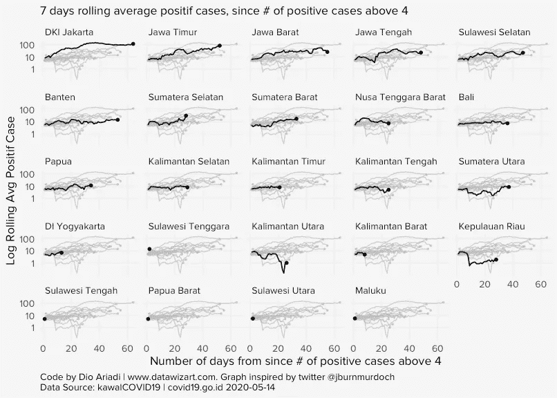

由来自 [DataWizArt](https://datawizart.com/) 的 Dio Ariadi 撰写，这篇[帖子](https://www.datawizart.com/covid-19-tracker-indonesia.html)展示了一些关于新冠肺炎病例和印尼死亡病例的地区差异的非常好的图表，每个图表都有非常整洁的集成 R 代码。

# 使用机器学习的新冠肺炎投影

由 [Youyang Gu](https://twitter.com/youyanggu) 开发的这个[网站](https://covid19-projections.com/)展示了一个直观的模型，该模型在经典传染病模型的基础上建立了机器学习技术，以预测美国、美国所有 50 个州和 60 多个国家的新冠肺炎感染和死亡人数。

代码可以在 [GitHub](https://github.com/youyanggu/covid19_projections) 上找到。

# 新冠肺炎在比利时:结束了吗？

本文由本人[与](https://www.statsandr.com/) [Niko Speybroeck 教授](https://twitter.com/NikoSpeybroeck)和 [Angel Rosas-Aguirre](https://twitter.com/arosas_aguirre) 合作撰写，展示了比利时住院人数和确诊病例数的变化(按省份和国家级别)。

文章中提供了地块的代码。

# 按族裔分列的新冠肺炎病例

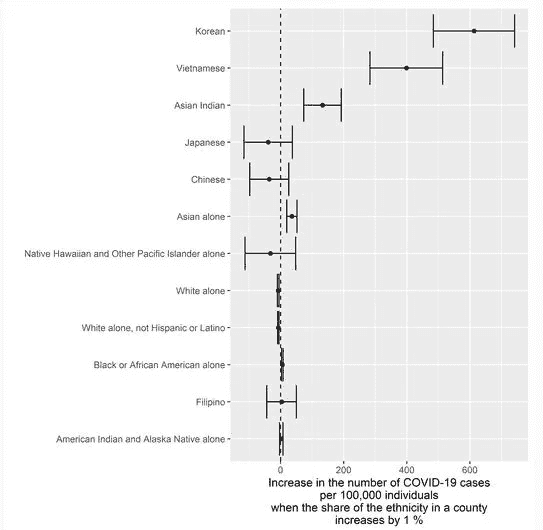

由 Tommi Suvitaival 撰写的这篇文章调查了不同种族背景的人在一个县的人口中所占的比例。

# 田纳西州新冠肺炎更新

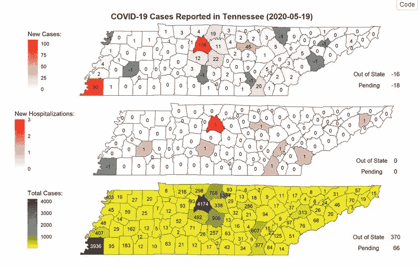

由詹姆斯·m·路德·T21 教授撰写的这份文档提供了田纳西州每日数据的摘要。作者使用了交互式地图、各种指标的七天滚动平均值和分面图表。

# 用起点-终点矩阵和 SEIR 模型模拟冠状病毒在城市中的爆发

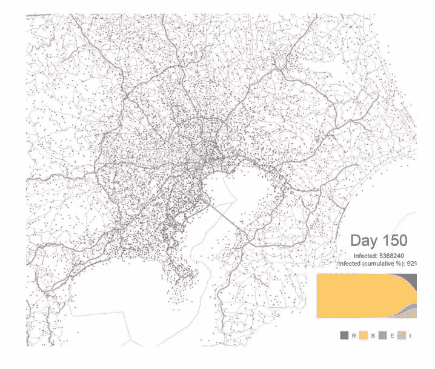

由来自[的](https://www.databentobox.com/)[的](https://www.databentobox.com/2020/03/28/covid19_city_sim_seir/)的范撰写的这篇博文展示了一个基于起点-终点矩阵和 SEIR 模型的模拟和可视化冠状病毒在大东京地区传播的分步指南。

来自同一作者的另一篇[帖子](https://www.databentobox.com/2020/03/08/covid19_sim_tokyo/)关注减少人口流动在管理冠状病毒爆发方面的有效性。

# 新冠肺炎人口流动性——在新冠肺炎·疫情统治下，人口流动性发生了怎样的变化？

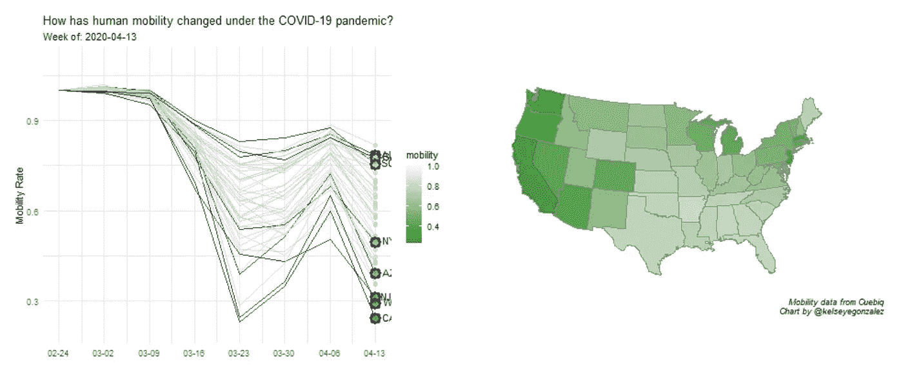

由凯尔西·e·冈萨雷斯撰写，这个可视化的作品旨在理解新冠肺炎疫情期间的种群行为。

数据来自 [Cuebiq](https://www.cuebiq.com/visitation-insights-covid19/) ，代码可从 [GitHub](https://github.com/kelseygonzalez/covid_mobility) 获得。

# 如何在 5 分钟内构建新冠肺炎数据驱动的闪亮应用

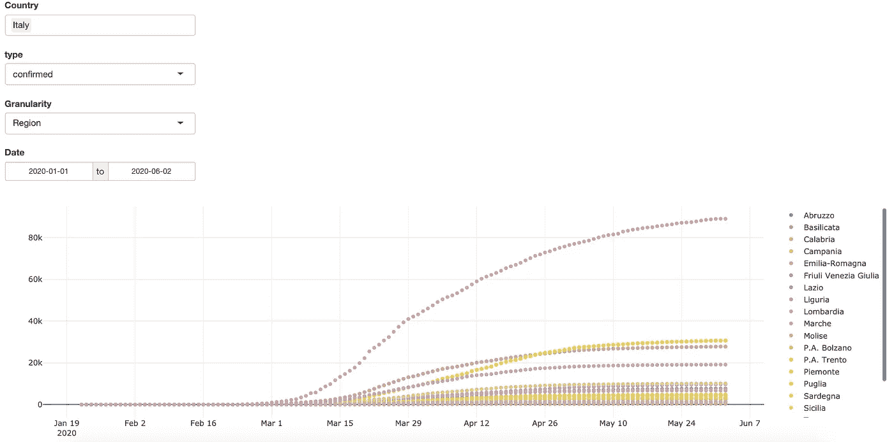

由[伊曼纽·吉多蒂](https://guidotti.dev/)撰写的本[教程](https://tutorial.guidotti.dev/h83h5/)展示了如何使用 [R 包 COVID19](https://www.statsandr.com/blog/top-r-resources-on-covid-19-coronavirus/#covid19) : R 接口构建一个简单而完整的闪亮应用程序到新冠肺炎数据中心。

在另一篇[帖子](https://tutorial.guidotti.dev/jv7v8/)中，作者进一步详细探究了 [R 包](https://www.statsandr.com/blog/top-r-resources-on-covid-19-coronavirus/#covid19) `[{COVID19}](https://www.statsandr.com/blog/top-r-resources-on-covid-19-coronavirus/#covid19)`。

# 分析 COVID19 R 包中的数据

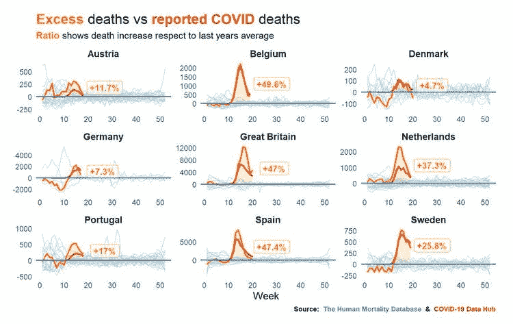

由 [Pablo Cánovas](https://typethepipe.com/authors/pablo-canovas/) 撰写的这篇[博文](https://typethepipe.com/post/analyzing-data-covid19-r-package/)探究了 COVID19 的死亡报道是否准确。

它使用来自[人类死亡率数据库](https://www.mortality.org/)和[新冠肺炎数据中心](https://www.statsandr.com/blog/top-r-resources-on-covid-19-coronavirus/#covid19)的数据。

# 体重与新冠肺炎和流感的风险

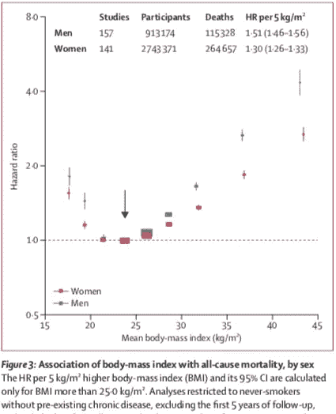

由拉德福德·尼尔教授撰写的这篇博文着眼于流感样疾病的数据和一些初步的 Covid19 数据。作者得出结论，体重不足和严重肥胖都是严重呼吸道疾病的风险因素。

最近，作者发表了一系列其他文章:

*   [新冠肺炎令人困惑的线性](https://radfordneal.wordpress.com/2020/04/23/the-puzzling-linearity-of-covid-19/)讨论了这样一个事实，即对于许多国家来说，总病例数或总死亡数的线性曲线首先呈指数上升，然后趋近于一条不水平的直线
*   [新冠肺炎病毒、其他冠状病毒和流感的季节性](https://radfordneal.wordpress.com/2020/04/30/seasonality-of-covid-19-other-coronaviruses-and-influenza/):这篇文章着眼于流感和普通感冒冠状病毒季节性的证据，以及在多大程度上人们可能认为新冠肺炎也是季节性的
*   [对“预测大流行后时期新型冠状病毒的传播动力学”的批评](https://radfordneal.wordpress.com/2020/05/27/critique-of-projecting-the-transmission-dynamics-of-sars-cov-2-through-the-postpandemic-period-part-1-reproducing-the-results/):这篇文章分析并批评了 Kissler 等人(2020)的一篇早期论文。参见[第 2 部分](https://radfordneal.wordpress.com/2020/06/17/critique-of-projecting-the-transmission-dynamics-of-sars-cov-2-through-the-postpandemic-period-part-2-proxies-for-incidence-of-coronaviruses/)和[第 3 部分](https://radfordneal.wordpress.com/2020/06/24/critique-of-projecting-the-transmission-dynamics-of-sars-cov-2-through-the-postpandemic-period-part-3-estimating-reproduction-numbers/)

# HMD —每周数据

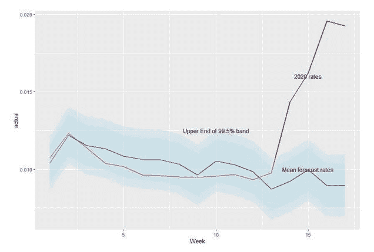

罗纳德·里奇曼撰写的这篇[博客文章](http://ronaldrichman.co.za/2020/05/21/hmd-weekly-data/)利用人类死亡率数据库及其最近开始的 13 个国家每周死亡数据的特殊时间序列，探索了目前报告的极不可能的死亡水平。

# 克里斯·缪尔博客上的客座博文

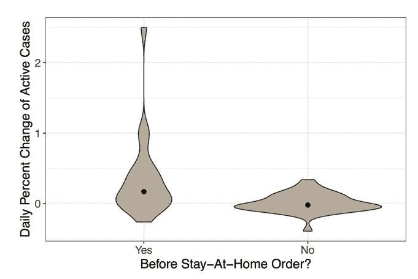

由 Skylar Hara 撰写的这篇[博客文章](https://cdmuir.netlify.app/post/2020-05-20-biol297-skylar-covid19/)研究了在夏威夷州长发布居家命令后，Covid19 的发病率是否发生了变化。

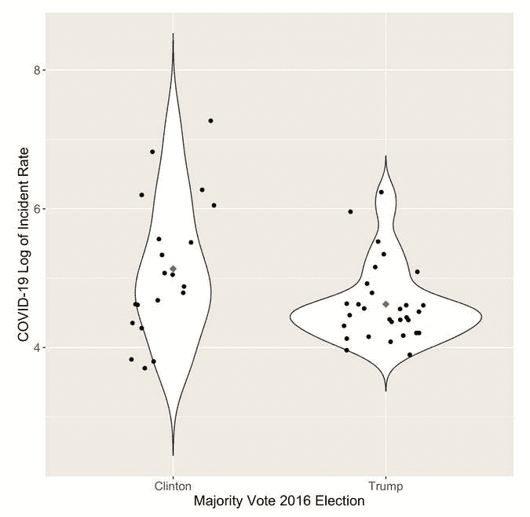

由 Ronja Steinbach 撰写的这篇[博客文章](https://cdmuir.netlify.app/post/2020-05-19-biol297-ronja-covid19/)收集了关于特朗普或克林顿州、少数族裔百分比和家庭收入中位数的数据，以回答以下问题:

*   2016 年大选中某州的党派归属对该州的病毒发病率有显著影响吗？
*   少数民族人口比例和中等家庭收入会影响各州的病毒发病率吗？

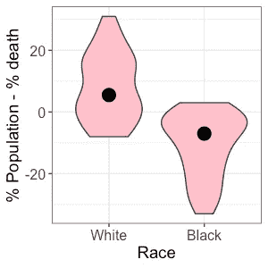

由香月明美·桑提亚哥撰写，这篇文章显示了美国非洲裔美国人和美国白人之间死亡率的统计差异。

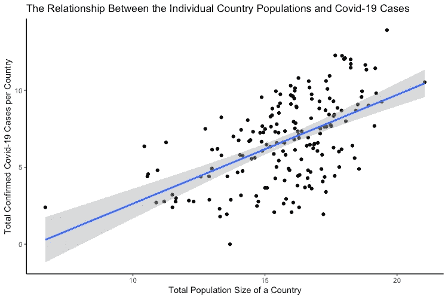

Masha Rutenberg 写的这篇[帖子](https://cdmuir.netlify.app/post/2020-05-27-biol297-masha-covid19/)关注的是一个国家的人口和该国确诊感染人数之间的相关性。

所有作者都是克里斯·缪尔教授的学生。

# 对流行病学的再认识

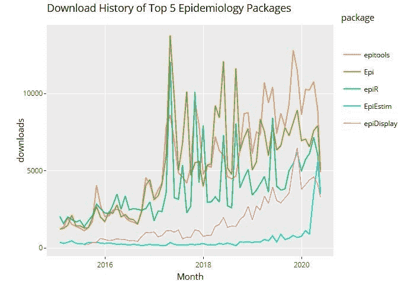

由 Joseph Rickert 在 [R Views](https://rviews.rstudio.com/) 中撰写的这篇[博客文章](https://rviews.rstudio.com/2020/05/20/some-r-resources-for-epidemiology/)追踪了有助于流行病学研究的 R 包，并显示了最近几个月五个最受欢迎的包的下载数量。

# 罗布·J·海曼的文章

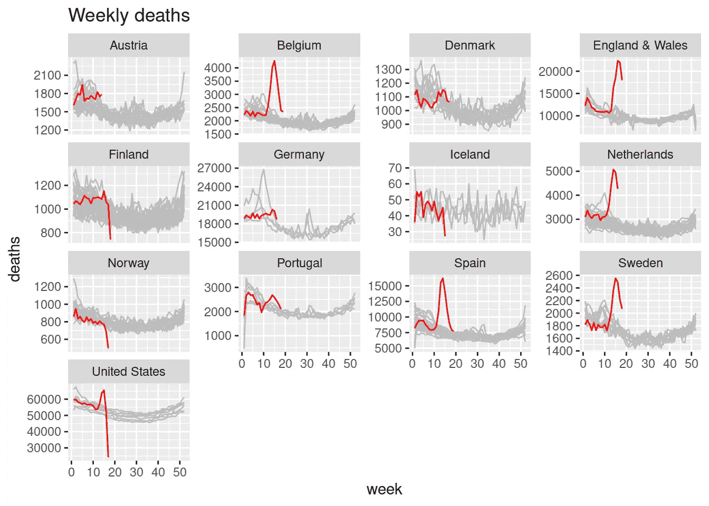

莫纳什大学(澳大利亚)统计学教授兼计量经济学和商业统计系主任 Rob J Hyndman 发表了一系列与 Covid19 相关的文章:

*   预测新冠肺炎:这篇博客文章没有使用 R，尽管 Hyndman 教授是这方面的专家，但它确实解释了时间序列预测或其他预测方法的一些问题
*   [为什么对数比率对追踪新冠肺炎有用](https://robjhyndman.com/hyndsight/logratios-covid19/):这篇文章展示了报告对数比例图形的好处
*   [2020 年超额死亡人数](https://robjhyndman.com/hyndsight/excess-deaths/):各国报告的 COVID19 死亡人数往往被低估。探究疫情对死亡率的真实影响的一个方法是看“超额死亡”——今年和往年同期死亡率之间的差异
*   [季节性死亡率](https://robjhyndman.com/hyndsight/seasonal-mortality-rates/):这篇文章展示了如何利用人类死亡率数据库发布的每周死亡率数据来探索死亡率的季节性。由于温度和其他与天气相关的影响，死亡率被认为是季节性的

# 土耳其对德国:新冠肺炎

这篇[文章](https://datageeek.wordpress.com/2020/05/31/turkey-vs-germany-covid-19/)比较了土耳其和德国控制疫情的努力，并测试了几个回归模型。

# 实践:如何在 R-Shiny 中构建交互式地图:以新冠肺炎仪表板为例

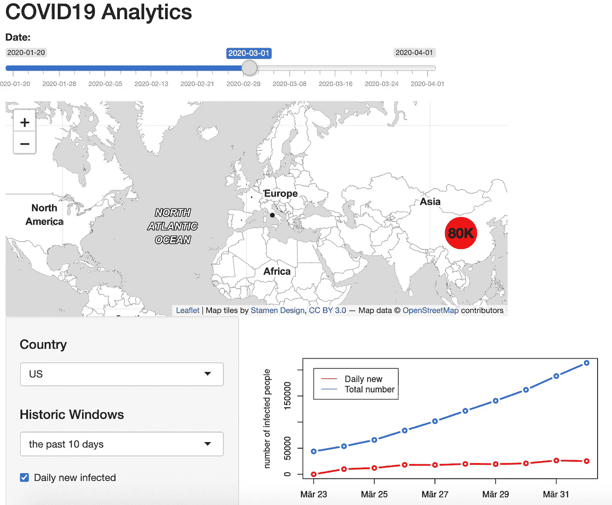

这篇[帖子](https://r-posts.com/hands-on-how-to-build-an-interactive-map-in-r-shiny-an-example-for-the-covid-19-dashboard/)由桑萌撰写，以[新冠肺炎仪表盘](https://sangmeng.shinyapps.io/COVID19/)为例，解释了如何用 Shiny 构建一个交互式仪表盘。

# 在摩洛哥做新冠肺炎模特

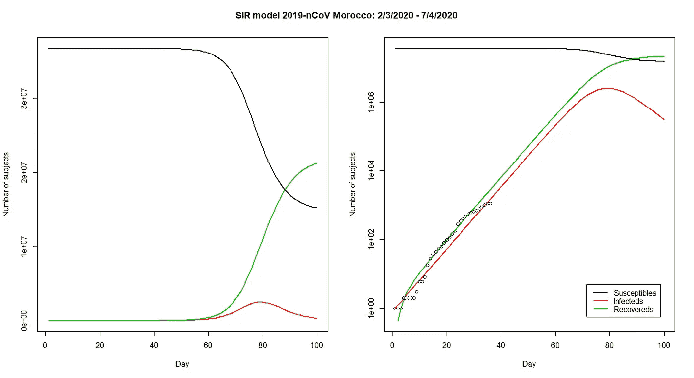

由[扎卡里亚·加萨塞](https://www.linkedin.com/in/zakgas/)撰写的这篇[博文](https://www.internationalmorocco.com/modelling-covid-19-in-morocco/)展示了摩洛哥 Covid19 病例的数据，并将 [SIR 模型](https://www.statsandr.com/blog/covid-19-in-belgium/)应用于这些数据。

最近，作者发表了另外两篇文章。第一篇[文章](https://www.linkedin.com/pulse/100-days-covid-19-arima-zakariah-gassasse/)通过使用简单但有效的时间序列分析提供了对摩洛哥新冠肺炎病例和死亡的短期预测。第二篇[文章](https://www.linkedin.com/pulse/part-3-mapping-outbreak-zakariah-gassasse/)绘制疫情地图，看看哪些地区疫情最严重。

# 爵士与克马克和麦肯德里克的模型

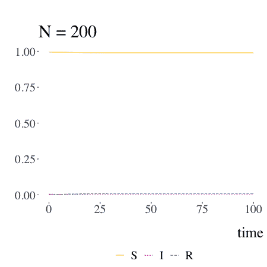

由 Pierre Jacob 撰写的这篇博文主要是对广泛使用的 SIR 模型的起源的回顾。

# 约翰霍普金斯大学新冠肺炎数据和研究中心

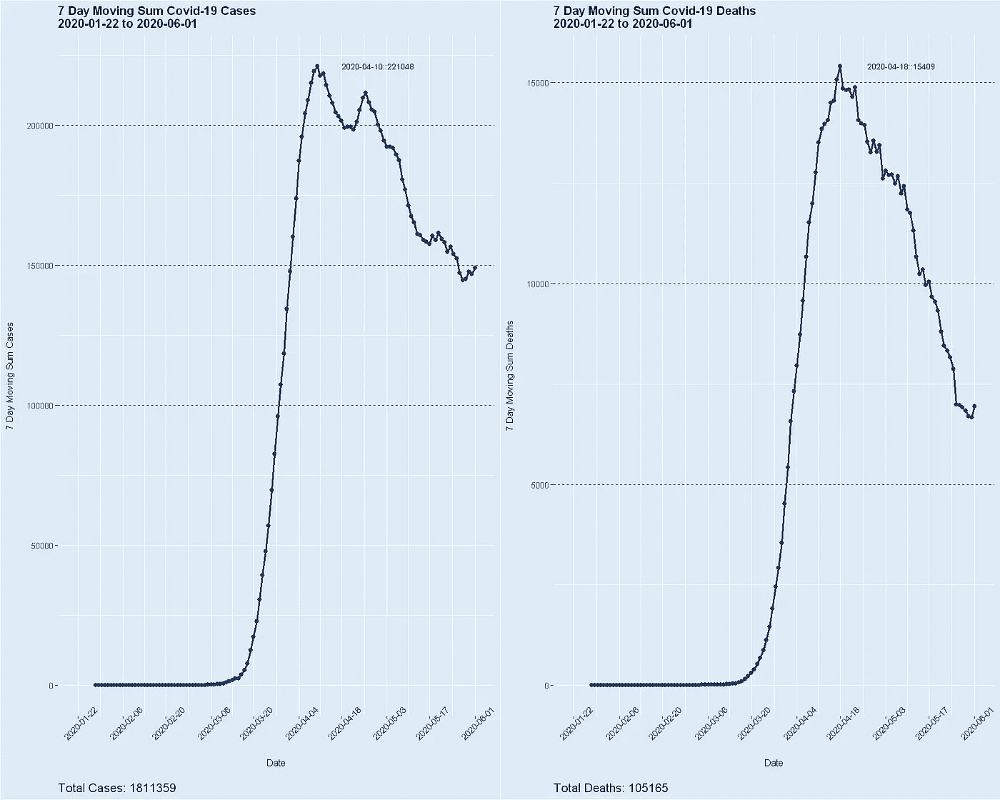

由[史蒂夫·米勒](http://svmiller.com/)撰写的这些博文([part 1](https://st5.ning.com/topology/rest/1.0/file/get/4791290285?profile=original)&[part 2](https://st1.ning.com/topology/rest/1.0/file/get/5518972265?profile=original))展示了对约翰·霍普金斯大学公布的美国新冠肺炎每日病例/死亡数据的处理，并可视化了病例和死亡的移动平均数。

作者还发表了一篇博客文章，对美国的失业申请进行了透视。

# 实时估计新冠肺炎的反应时

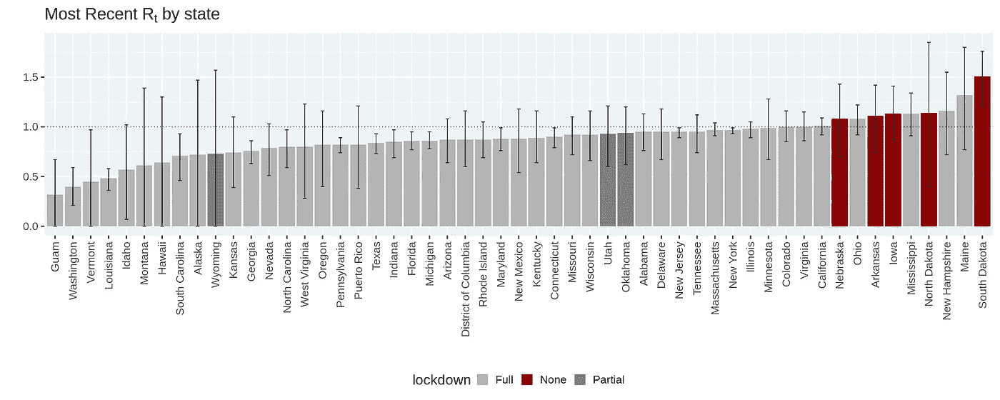

由 [Ramnath Vaidyanathan](https://twitter.com/ramnath_vaidya) 撰写的这篇[教程](https://www.datacamp.com/community/tutorials/replicating-in-r-covid19)展示了如何估计 Rt，这是一种被称为有效繁殖数的度量，它是在 t 时刻每个感染者被感染的人数

# 从静态到动态时间序列:潮流之路

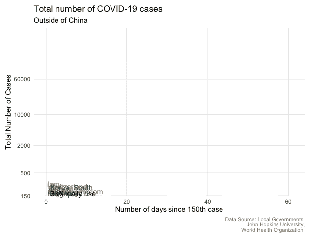

由 [Giulia Ruggeri](https://github.com/gruggeri) 撰写，这篇[帖子](https://medium.com/epfl-extension-school/from-static-to-animated-time-series-the-tidyverse-way-d696eb75f2fa)讲述了创建新冠肺炎时间系列动画情节的必要步骤。

# 先睹为快:新的峰会数据工具帮助客户可视化美国受新冠肺炎病毒影响最严重的地区

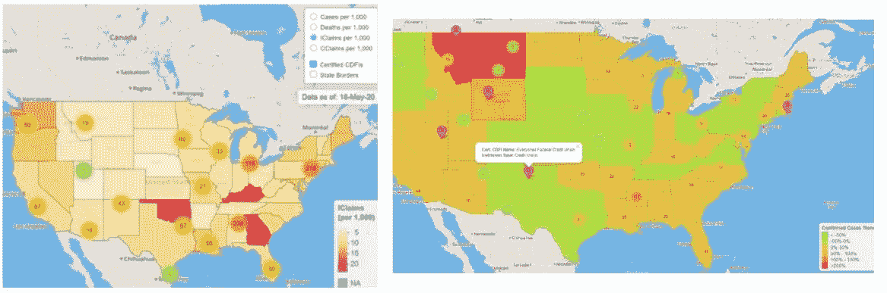

由 [Colby Ziegler](https://www.linkedin.com/in/colby-ziegler/) 撰写的这篇[博客文章](https://www.summitllc.us/blog/sneak-peek-new-summit-data-tool-helps-clients-visualize-us-areas-that-are-most-heavily-impacted-by-the-covid-19-virus)描述了一个工具(主要在 R 中使用`{leaflet}`、`{tidyverse}`和`{tigris}`包构建),该工具跟踪并显示美国各县确诊的新冠肺炎病例和死亡总数，并覆盖了经认证的社区发展金融机构(CDFIs)的位置。

# 如何再现金融时报风格 COVID19 每日报道？

由 Peyman Kor 撰写的这篇博客文章展示了如何按国家复制英国《金融时报》的内容。

# 关于接触追踪应用的推文能告诉我们对公共卫生数据共享的态度是什么？

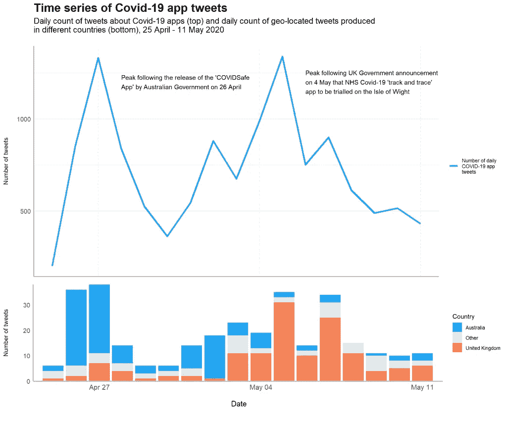

由 [Holly Clarke](https://twitter.com/HollyEClarke) 撰写的这两篇博文([第一部分](https://www.cdrc.ac.uk/what-can-tweets-about-contact-tracing-apps-tell-us-about-attitudes-towards-data-sharing-for-public-health/) & [第二部分](https://www.cdrc.ac.uk/what-can-tweets-about-contact-tracing-apps-tell-us-about-attitudes-towards-data-sharing-for-public-health-part-2/))讨论了人们对接触者追踪应用的态度，这些应用使用推文、文本分析和自然语言处理来管理新冠肺炎的传播和公共卫生的数据共享。

# 可视化比利时的 COVID 案例

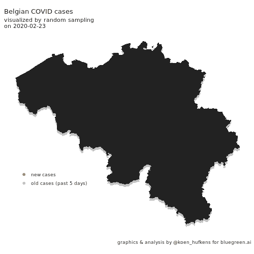

在这篇[博文](https://bluegreen.ai/post/covid-cases-belgium/)中， [Koen Hufkens](https://khufkens.com/) 绘制了比利时的案例，并解决了地理空间绘制中的一个挑战。

# 西班牙新冠肺炎发病率环境相关性的时空分析

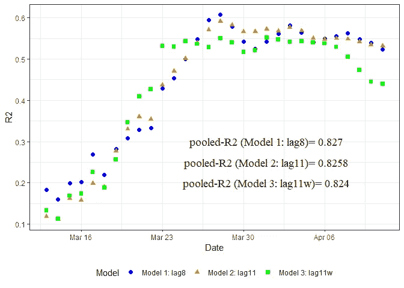

由安东尼奥·帕埃斯人和几位合著者撰写的这篇博客文章着眼于西班牙的天气、湿度和其他因素来创建一个 SUR 模型。

安东尼奥·帕埃斯人的另一篇文章使用谷歌社区移动报告调查了新冠肺炎在美国的发病率。

# 新冠肺炎分析

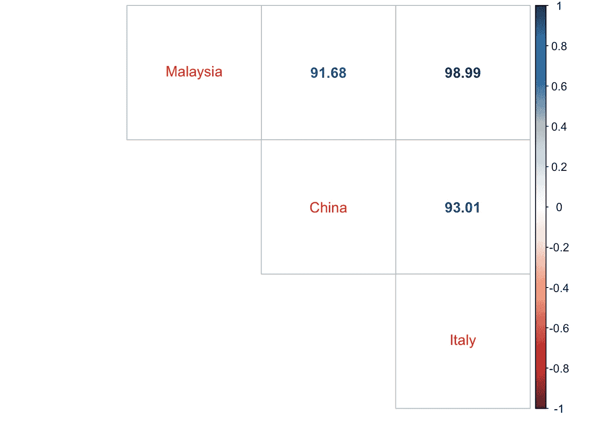

由 Rizami Annuar 撰写的这篇[帖子](https://rizami.com/covid-19/)比较了马来西亚和其他国家的病例和死亡数据，包括相关性。

# 用 R 收集所有冠状病毒相关数据的简单方法

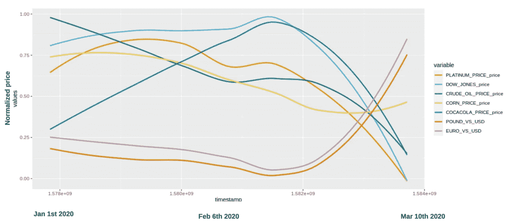

由[费德里科·里弗罗尔](https://medium.com/@federicoriveroll)撰写的这篇[帖子](https://medium.com/swlh/a-simple-way-to-gather-all-coronavirus-related-data-with-r-b1e7ecb74346)展示了如何在 r 中组合关于 Covid19 案例、新闻引用(比如中国)和经济指标的数据(对于 Python 用户，请参见本[版本](/gather-all-the-coronavirus-data-with-python-19aa22167dea))。)

# 澳大利亚政府可以选择减缓冠状病毒的传播，但他们需要立即采取行动

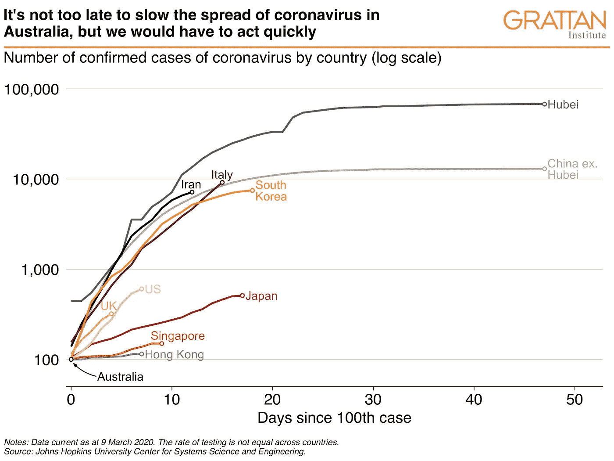

由[马特·考吉尔](https://grattan.edu.au/people/bio/matt-cowgill/)撰写的这篇[博客文章](https://blog.grattan.edu.au/2020/03/australian-governments-can-choose-to-slow-the-spread-of-coronavirus-but-they-must-act-immediately/)显示澳大利亚早期的病例相对较少，但是文章认为澳大利亚需要紧急行动。数据来自`{gtrendsR}`包。

在最近的[帖子](https://blog.grattan.edu.au/2020/04/why-we-wont-know-the-full-effect-of-covid-19-on-jobs-in-australia-for-at-least-another-month/)中，作者使用谷歌趋势数据搜索与失业相关的关键词，追踪了 COVID19 在澳大利亚最初几个月的影响。

除了这些帖子，斯蒂芬·达克特[和布伦丹·科茨](https://twitter.com/stephenjduckett)[还发表了一系列其他帖子:](https://blog.grattan.edu.au/author/brendan-coates/)

*   [澳大利亚应加入新西兰，全力消灭冠状病毒](https://blog.grattan.edu.au/2020/04/australia-should-join-new-zealand-and-shoot-for-eliminating-coronavirus/)
*   新冠肺炎的杯子是半满还是半空？
*   [澳洲的新冠肺炎病例仍在快速增长。我们的医院可能很快就会达到饱和](https://blog.grattan.edu.au/2020/03/australias-covid-19-are-still-growing-rapidly-our-hospitals-may-soon-hit-capacity/)
*   随着越来越多的澳大利亚人感染新冠肺炎，我们会有足够的医院床位吗？
*   新冠肺炎:我们最脆弱的工人需要更多的帮助
*   [随着新冠肺炎危机的加深，很少澳大利亚人在银行有很多现金](https://blog.grattan.edu.au/2020/03/as-the-covid-19-crisis-deepens-few-australians-have-much-cash-in-the-bank/)

# Covid 是否将每个人死亡的相对风险提高了相似的量？更多证据

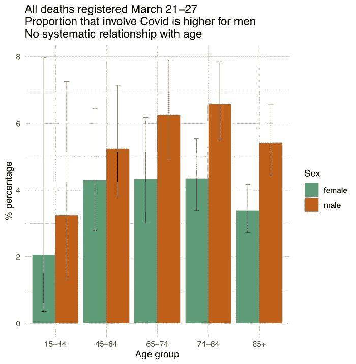

由[大卫·斯皮格哈尔特](https://twitter.com/d_spiegel)(巨著《[统计艺术](https://dspiegel29.github.io/ArtofStatistics/)》的作者)教授撰写，这篇[帖子](https://medium.com/wintoncentre/does-covid-raise-everyones-relative-risk-of-dying-by-a-similar-amount-more-evidence-e7d30abf6821)使用英国国家统计局的数据，研究了年龄和性别的相对死亡率。

# 追踪冠状病毒:构建参数化报告以分析不断变化的数据源

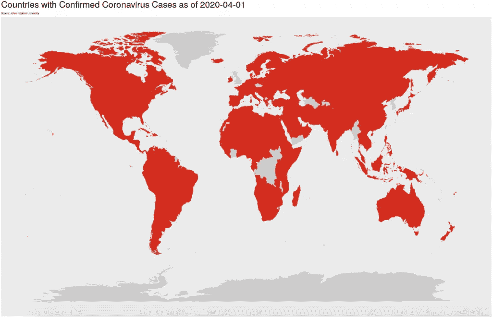

在这篇[帖子](https://redoakstrategic.com/tracking-coronavirus-building-parameterized-reports-to-analyze-changing-data-sources/)中， [Tyler Sanders](https://www.linkedin.com/in/tyler-sanders-8275b5150/) 使用 Johns Hopkins 的数据构建了一个病毒仪表板，只需点击一个按钮就可以每天更新，作为如何使用 [R Markdown](https://www.statsandr.com/blog/getting-started-in-r-markdown/) 构建参数化报告的示例。

# 绘制新冠肺炎的新西兰案例

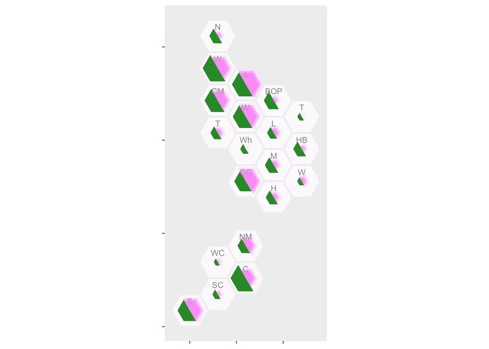

在这篇文章中，Thomas Lumley 用他自己的 choropleth 包(`{DHBins}`)和它的六边形盒子绘制了新西兰卫生局的 COVID19 病例。

# 用 R #新冠肺炎想象疫情

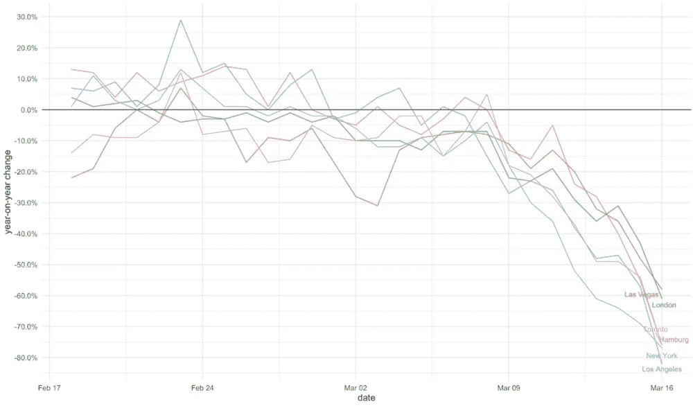

在这篇[帖子](/visualize-the-pandemic-with-r-covid-19-c3443de3b4e4)，[钱](https://towardsdatascience.com/@q615300694)用 Covid19 的数据进行了多方面的探索，包括美国电影票房收入和餐厅预订量的急剧下降。

# 探索美国新冠肺炎病例的时间演变

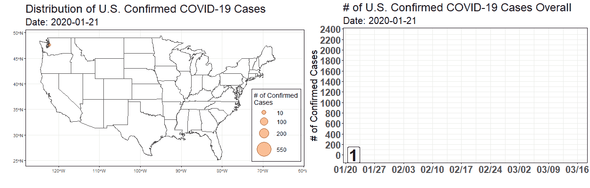

由[罗伯特·温克尔曼](https://twitter.com/rdwinkelman)和[科林·瓦尔兹](https://twitter.com/cwaltz38)撰写的这篇[帖子](https://rpubs.com/rdwinkelman/covid19_us_spread_gif)清晰地展示了如何创作美国艾滋病传播的动画情节。

# r 数据分析:新冠肺炎

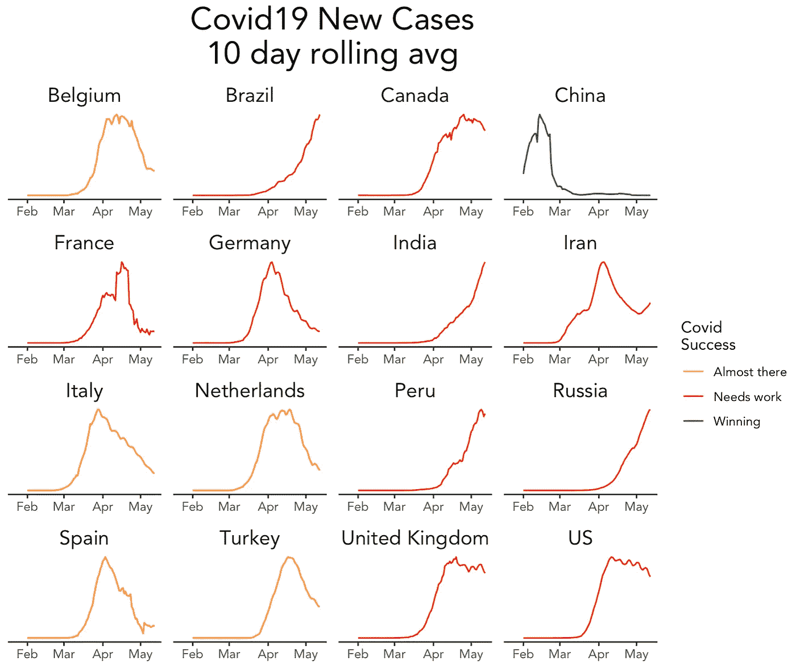

发表在[锐视](https://www.sharpsightlabs.com/)的博客上的这一系列博文(部分 [1](https://www.sharpsightlabs.com/blog/r-data-analysis-covid-19-part1-data-wrangling/) 、 [2](https://www.sharpsightlabs.com/blog/r-data-analysis-covid-19-part-2-merge-datasets/) 、 [3](https://www.sharpsightlabs.com/blog/r-data-exploration-covid19-part3/) 、 [4](https://www.sharpsightlabs.com/blog/r-data-visualization-covid19-part4/) 、 [5](https://www.sharpsightlabs.com/blog/r-covid19-analysis-part5-data-issues/) 和 [6](https://www.sharpsightlabs.com/blog/r-data-analysis-covid19-part6-successful-countries/) )解释了如何重命名和重新排序列、标准化日期(用`{lubridate}`包)、合并数据集、采取其他准备步骤、用`{ggplot2}`包绘图，最后在 R 中再现一个显示 16 的相对进度的图

所有帖子都使用了约翰霍普金斯大学的数据和该公司自己收集的数据。

# GA 新冠肺炎报道

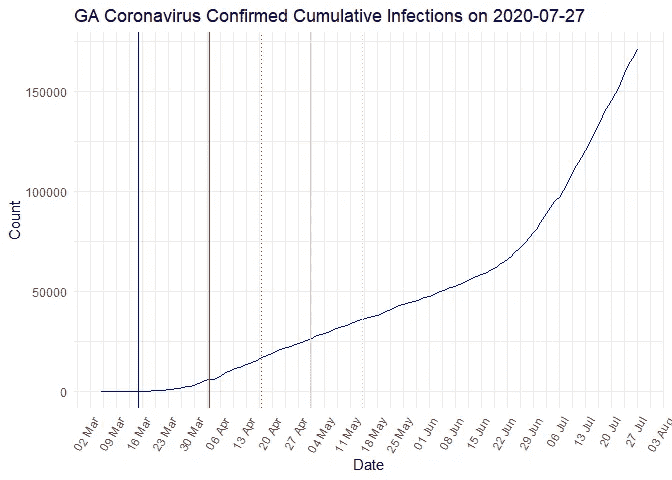

根据佐治亚州公共卫生部报告中的数据， [Andrew Benesh](https://twitter.com/andrew_benesh) 发布了对美国佐治亚州的病例、死亡、ICU 使用率等的每日分析。

他所有的报告都发布在[媒体](https://medium.com/@andrewbenesh)上，代码可在[这里](https://bitbucket.org/asb12f/covid19-ga/src/master/)获得。

# 比利时的科罗纳

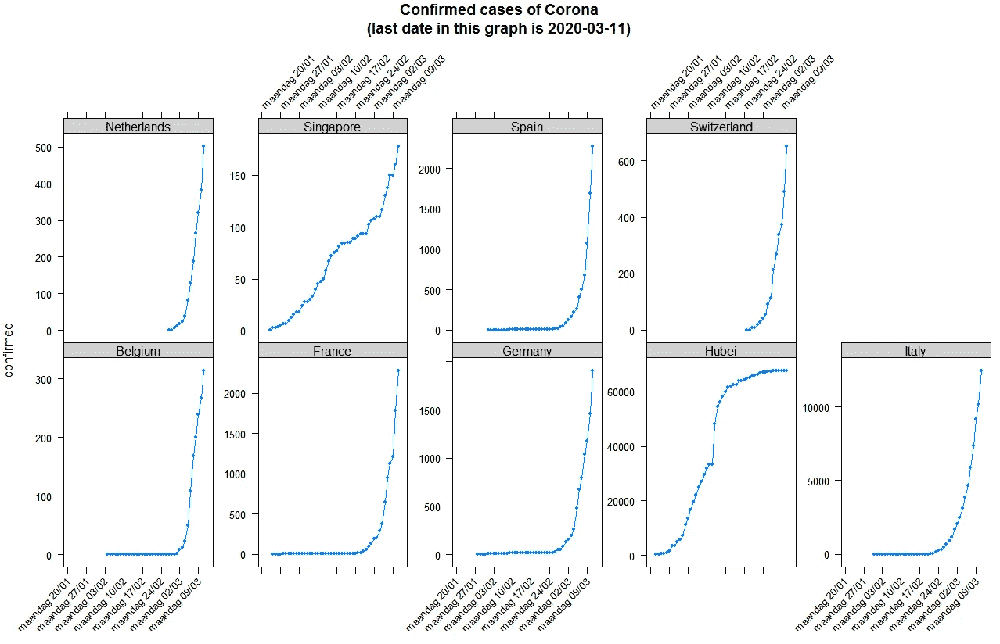

发表在 [bnosac.be](http://www.bnosac.be/) 上的这篇[帖子](http://www.bnosac.be/index.php/blog/97-corona-in-belgium)涵盖了对 Covid19 指数传播的早期探索，重点关注比利时和荷兰。

# 从推特的角度看意大利的冠状病毒

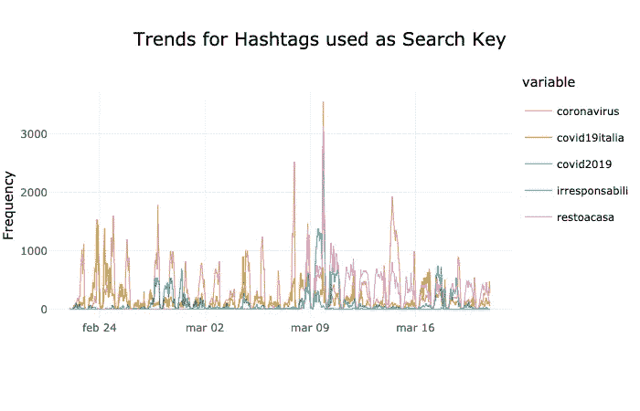

由 [Kode 团队](http://tech.kode-datacenter.net:11000/covid19/)撰写的这两篇帖子([在此](http://tech.kode-datacenter.net:11000/covid19/articles/twitter-analysis-overview/)和[在此](http://tech.kode-datacenter.net:11000/covid19/articles/twitter-analysis-sentiment/))使用文本挖掘技术来分析意大利疫情早期的推文以及意大利总理关于 Covid19 的讲话。

他们还发布了一个[交互式仪表盘](http://tech.kode-datacenter.net:10200/covid-dashboard/)，允许探索[民防](http://www.protezionecivile.gov.it/)每天发布的数据。

# 使用 R 和 Tidycensus 分析新冠肺炎风险因素

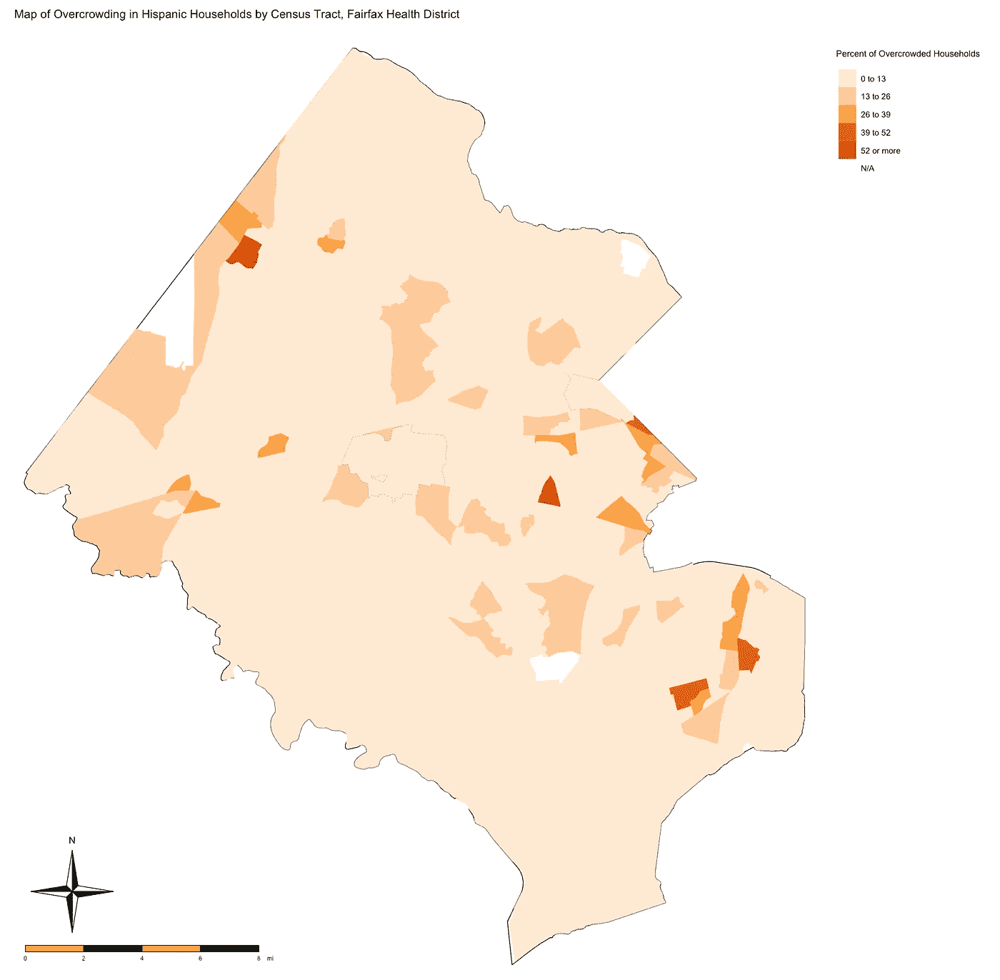

由 René F. Najera 撰写的这篇文章使用美国人口普查数据来确定“过度拥挤”的地区，并从 Covid19 风险的角度来考虑这些地区。

# 随着时间的推移制作美国新冠肺炎热点的动画

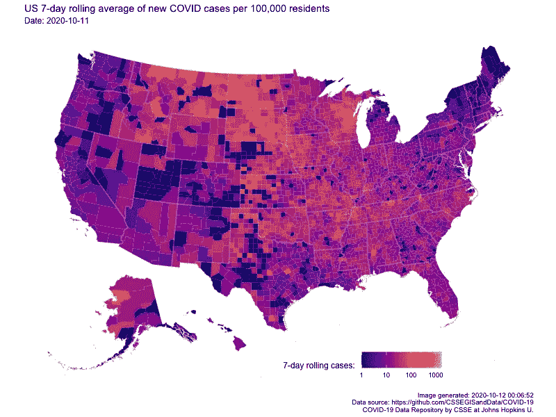

由内森·邱晨撰写的这篇文章展示了美国新新冠肺炎病例 7 天移动平均值的动画地图。动画地图的代码可以在文章的最后直接找到。

这篇文章是他之前关于可视化阿肯色州新冠肺炎的文章的延伸。

# 了解康涅狄格州的 COVID19。它需要一个城镇

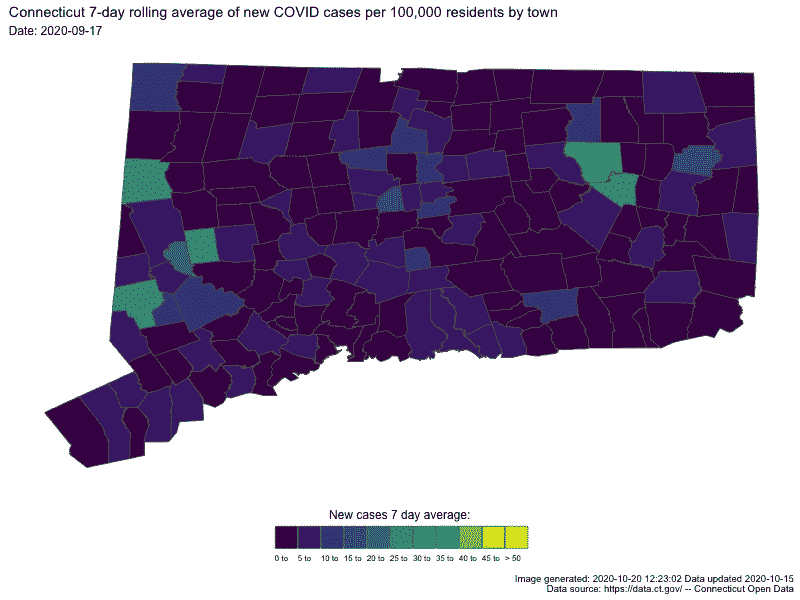

基于内森·邱晨的这两篇[帖子，](https://www.statsandr.com/blog/top-r-resources-on-covid-19-coronavirus/#animating-u.s.-covid-19-hotspots-over-time)[查克·鲍威尔](https://ibecav.netlify.app/)在他的[帖子](https://ibecav.netlify.app/post/understanding-covid19-in-connecticut-it-takes-a-town/)中展示了如何创建康涅狄格州(按城镇)每 100，000 人中新增 COVID19 例的 7 天滚动平均值的动画地图。

# 数据

*   [约翰霍普金斯大学 CSSE 分校的 2019 年新型冠状病毒新冠肺炎(2019-nCoV)数据仓库](https://github.com/CSSEGISandData/COVID-19):该数据集被本文提到的许多资源使用，并已成为新冠肺炎建模的黄金标准
*   [世界卫生组织(世卫组织)](https://covid19.who.int/)。另见他们附带的[闪亮的应用](https://www.statsandr.com/blog/top-r-resources-on-covid-19-coronavirus/#who-covid-19-explorer)
*   [新冠肺炎公开研究数据集挑战赛(CORD-19)](https://www.kaggle.com/allen-institute-for-ai/CORD-19-research-challenge) (via Kaggle)
*   [新型冠状病毒 2019 数据集:新冠肺炎受影响病例的日水平信息](https://www.kaggle.com/sudalairajkumar/novel-corona-virus-2019-dataset) (via Kaggle)
*   [来自欧洲疾病控制中心的新冠肺炎数据](https://www.ecdc.europa.eu/en/publications-data/download-todays-data-geographic-distribution-covid-19-cases-worldwide)
*   [COVID 跟踪项目](https://covidtracking.com/)
*   [整理约翰·霍普斯金新冠肺炎数据为长格式，合并部分世行数据](https://joachim-gassen.github.io/2020/03/tidying-the-new-johns-hopkins-covid-19-datasests/)
*   [新冠肺炎数据来源简介](/a-short-review-of-covid-19-data-sources-ba7f7aa1c342)
*   esri 的新冠肺炎数据集
*   [beoutbreakprepared/ncov 2019](https://github.com/beoutbreakprepared/nCoV2019/tree/master/latest_data):网上极少数非聚合数据集之一。这种关于确诊新冠肺炎患者的个体水平信息(包括他们的旅行史、地点、症状、报告的发病和确诊日期以及基本人口统计数据)的数据集，对于理解传染性、地理传播风险、传播途径和感染风险因素等非常重要
*   [抗击新冠肺炎:所有的数据集和数据都在一个地方](/fighting-the-covid-19-all-the-datasets-and-data-efforts-in-one-place-4d6aeb0157ab):这篇文章收集了许多相关的数据集和数据
*   一张[谷歌表单](https://sourceful.co.uk/doc/533/public-covid-19-data-table-lower-tier-regional-bre)，帮助追踪英国当地的封锁

# 其他资源列表或集合

有了这么多关于冠状病毒的伟大资源，其他人也收集和组织了类似的列表。 [3](https://www.statsandr.com/blog/top-r-resources-on-covid-19-coronavirus/#fn3) 以下是我有幸发现的一些收藏:

*   [新冠肺炎建模资源、数据和挑战](https://idea.rpi.edu/covid-19-resources)由 IDEA(不仅仅是 R)
*   切廷卡亚-伦德尔矿山公司的 GitHub repo [covid19-r](https://github.com/mine-cetinkaya-rundel/covid19-r)
*   [放大我在新冠肺炎信任的人](https://simplystatistics.org/2020/04/29/amplifying-people-i-trust-on-covid-19/):由来自[simple Statistics](https://simplystatistics.org/)的 Jeff Leek 撰写，这篇文章收集了值得信赖的人和专家，他们分享了关于新冠肺炎疫情的好信息
*   [一些精选新冠肺炎建模资源](https://rviews.rstudio.com/2020/04/07/some-select-covid-19-modeling-resources/)和[更多精选新冠肺炎资源](https://rviews.rstudio.com/2020/06/03/more-select-covid-19-resources/)由 Joseph Rickert 提供，汇集仪表板、闪亮的应用程序、博客帖子、软件包、数据集、视频和与 Covid19 疫情相关的会议记录
*   [CovidR 竞赛](https://milano-r.github.io/erum2020-covidr-contest/index.html):由[欧洲 R 用户会议(eRum)](https://2020.erum.io/) 发起，该竞赛是一项开源竞赛和会前活动，展示 R 围绕新冠肺炎疫情主题所做的任何工作
*   [将新冠肺炎变成你学生的数据可视化练习](https://ocean.sagepub.com/blog/tools-and-tech/turning-covid-19-into-a-data-visualization-exercise-for-your-students):由[丹妮拉·杜卡](http://danieladuca.com/)撰写，这篇博文介绍了各种可视化数据的方法，借鉴了几篇博文、闪亮的应用程序和仪表盘

我希望，除了我的收集，这些别人做的富豪榜，能给你足够的背景材料，让你自己去分析新冠肺炎的爆发(或者至少有一些思路)！

# 非英语资源

这一部分可能只对有限的几个人感兴趣，但是除了英语，还有很多其他语言的资源。请看下面按语言列出的一些例子:

日语:

*   [冠状病毒感染通报](https://covid-2019.live/):这个[仪表盘的原版](https://www.statsandr.com/blog/top-r-resources-on-covid-19-coronavirus/#covid-19-bulletin-board)

德语:

*   由[教授赫尔穆特·屈臣霍夫博士](https://www.stablab.stat.uni-muenchen.de/personen/leitung/kuechenhoff1/index.html)开发的这张[冠状地图](https://corona.stat.uni-muenchen.de/)通过地图和表格展示了冠状病毒在世界、欧洲和德国的情况

西班牙语:

*   GitHub 存储库，包含政府官方数据和用于提取这些数据的 R 代码，请参见此处的[和此处的](https://github.com/rubenfcasal/COVID-19)[和](https://github.com/datadista/datasets/tree/master/COVID%2019)
*   [智利新冠肺炎](https://commonsense.shinyapps.io/CovidChile/):这个闪亮的应用程序显示了累计确诊的传染病病例，并提供了每个城市的估计增长率
*   这款[闪亮的应用](https://queoferton.shinyapps.io/covid19/_w_b59da639/)由 Que Oferton 开发，提供了 2019 年中美洲新型冠状病毒新冠肺炎疫情的概况，包括统计、预测、SIR 和 SEIR 模型。数据和控制面板每天都会刷新

法语:

*   由 Arthur Charpentier 撰写的这篇博文展示了如何使用法国死亡率数据来量化超额死亡率

感谢阅读。我希望你会发现这些关于新冠肺炎冠状病毒的资源很有用。如果我错过了，请在评论中告诉我。

特别感谢里斯·莫里森在收集和组织几篇文章方面所做的大量工作，这些工作极大地帮助了关于博客文章部分的改进。阅读他的文章([第一部分](https://medium.com/@rees_32356/blog-posts-about-covid19-that-use-r-c10e4a96fdf9)和[第二部分](https://medium.com/@rees_32356/covid19-related-blog-posts-and-the-r-packages-they-use-f0b82a4d07eb))，对收集到的所有帖子进行描述性分析。

虽然我已经仔细阅读了所有的资料，但被列入名单并不意味着我赞同这些发现。此外，一些分析、代码、仪表板、包或数据集可能已经过时，因此默认情况下，这些不应该被视为当前的发现。如果你是其中一个资源的作者，如果你看到任何不一致或者你想从这篇文章中删除它，请不要犹豫[联系我](https://www.statsandr.com/contact/)。

和往常一样，如果您有与本文主题相关的问题或建议，请将其添加为评论，以便其他读者可以从讨论中受益。如果您发现了错误或 bug，可以通过在 GitHub 上提出问题来通知我。对于所有其他要求，你可以与我联系。

# 参考

德·弗拉斯、日本清酒和吕克·克丰。2020.“分阶段解除控制:在国家一级实现抗新冠肺炎群体免疫的实用策略。” *medRxiv* 。

Kissler，Stephen M .，Christine Tedijanto，Edward Goldstein，Yonatan H Grad 和 Marc Lipsitch。2020."预测 Sars-Cov-2 在大流行后时期的传播动态."*理科*368(6493):860–68。

彭、梁荣、吴越阳、张东延、诸葛长泾、。2020."中国新冠肺炎疫情的动力学模型分析." *arXiv 预印本 arXiv:2002.06563* 。

**相关文章:**

*   [比利时的新冠肺炎](https://www.statsandr.com/blog/covid-19-in-belgium/)
*   比利时的新冠肺炎:结束了吗？
*   [如何创建针对贵国的简单冠状病毒仪表板](https://www.statsandr.com/blog/how-to-create-a-simple-coronavirus-dashboard-specific-to-your-country-in-r/)
*   [如何发布一款闪亮的应用:以 shinyapps.io 为例](https://www.statsandr.com/blog/how-to-publish-shiny-app-example-with-shinyapps-io/)
*   [在新冠肺炎隔离期间免费下载斯普林格书籍的套装](https://www.statsandr.com/blog/a-package-to-download-free-springer-books-during-covid-19-quarantine/)

1.  该软件包也是一个[预印本](https://doi.org/10.1101/2020.02.25.20027433)的主题。 [↩](http://127.0.0.1:4321/blog/top-r-resources-on-covid-19-coronavirus/#fnref1)
2.  在 Marc Choisy 的[帖子](https://rpubs.com/choisy/sir)中可以看到更多关于这个流行病学模型的信息。 [↩](http://127.0.0.1:4321/blog/top-r-resources-on-covid-19-coronavirus/#fnref2)
3.  请注意，与我的列表不同，其他人的收藏可能包括使用 R. [↩](https://www.statsandr.com/blog/top-r-resources-on-covid-19-coronavirus/#fnref3) 之外的其他工具的新冠肺炎上的资源

*原载于 2020 年 3 月 12 日 https://statsandr.com***。**