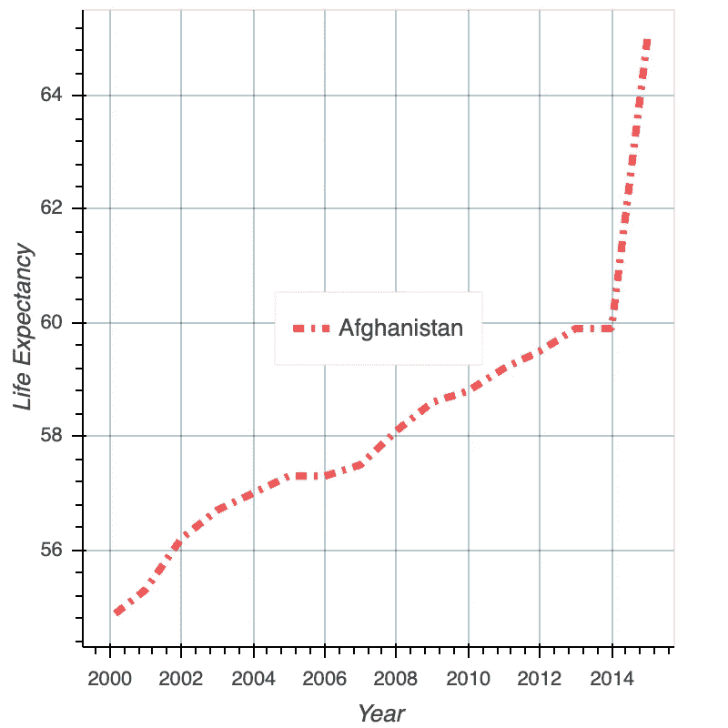
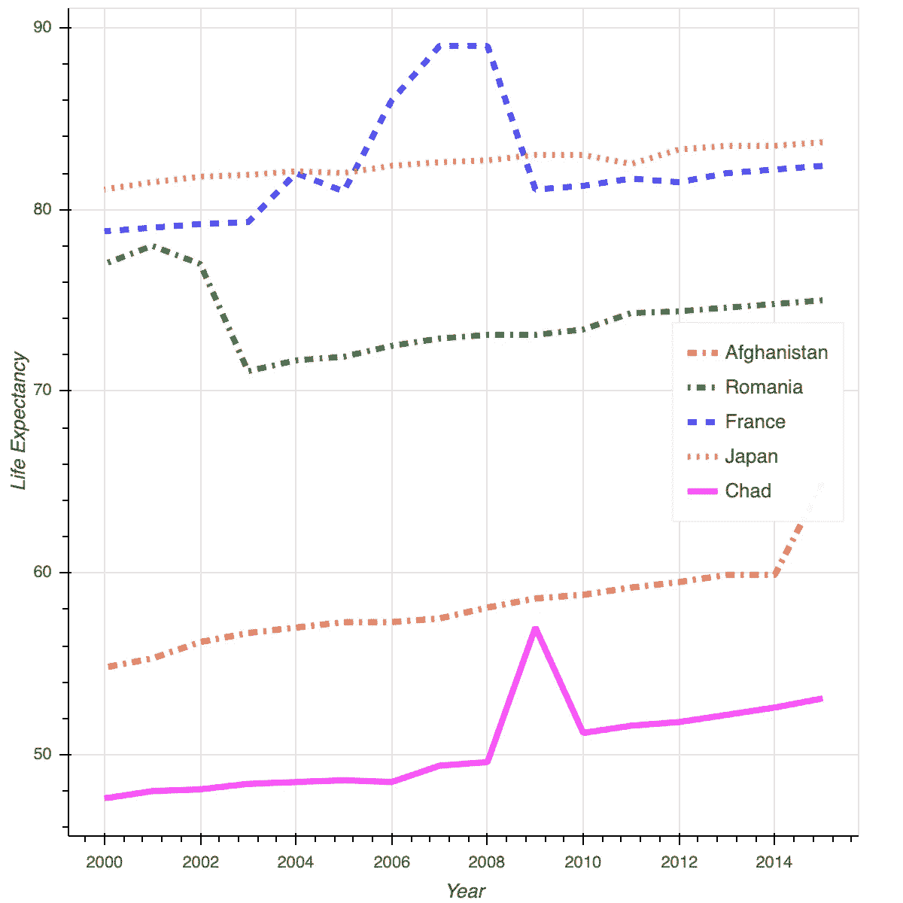
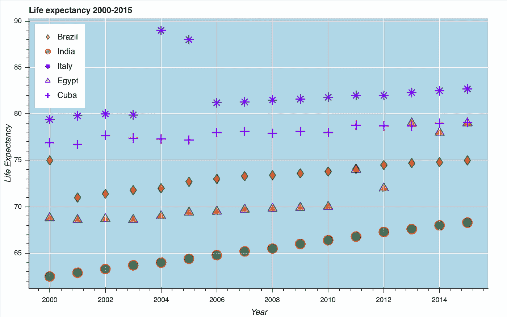
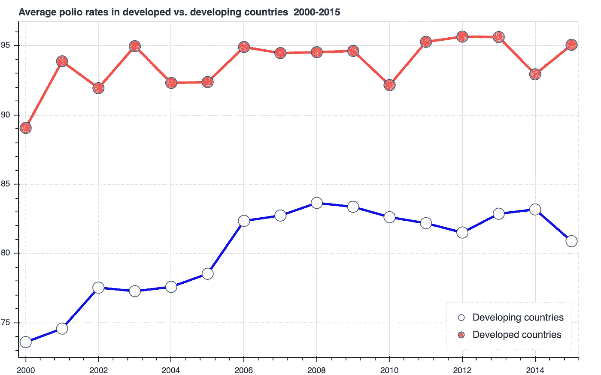
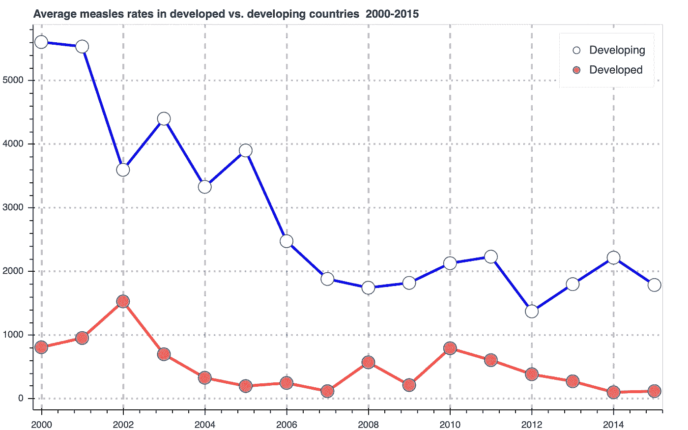
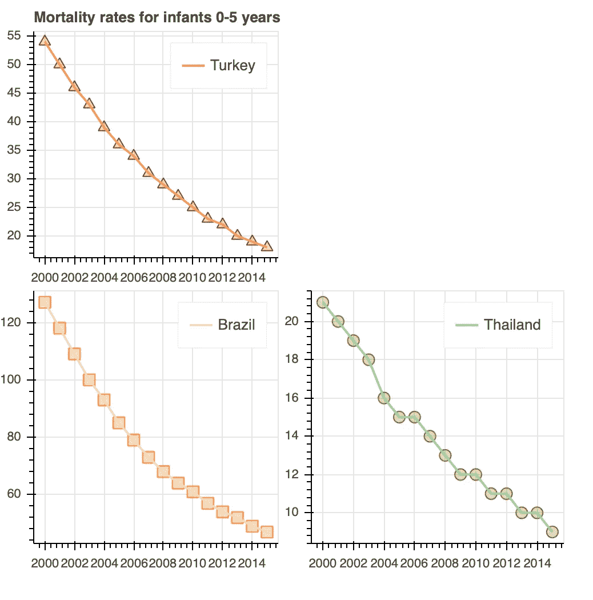

# 使用散景的简单数据可视化技术

> 原文：<https://towardsdatascience.com/top-5-simple-techniques-for-data-visualization-using-bokeh-a7fa4e05d6e6?source=collection_archive---------56----------------------->


[Dil](https://unsplash.com/@thevisualiza?utm_source=medium&utm_medium=referral) 在 [Unsplash](https://unsplash.com?utm_source=medium&utm_medium=referral) 上拍摄的照片

## 使用散景库快速总结 5 种最简单、最有效的交互式可视化技术

没有恰当的形象化，任何故事都是死的。只有少数已知的(但不总是来自可靠的来源)被称为“古鲁”、“圣人”、“老师”，有时是“主”，经常是“殉道者”的超人，因为能够在没有适当视觉支持的情况下讲述一个鼓舞人心的故事而获得了不朽的名声。其他人必须使用不同的支持技术来传达他们的故事。

有很多方法可以让你的故事变得有趣并吸引观众。你可以把语言和非语言的技巧结合起来使用，但是只有一样东西是真正重要的——一张好照片。一点不错，胜过千言万语！而数据科学绝对不是例外。这就是为什么我们大多数人从一开始就在学习基本的可视化库(Matplotlib、Plotly、Seaborn——这只是个开始)。

我最近偶然发现了一个叫做散景的图书馆，我非常喜欢它！它非常直观，非常简单，学习曲线非常平缓。但是从一开始，人们就开始创造很酷的交互式可视化。这篇文章是我的散景爱情故事的开始。完整的故事(包括 Jupyter 笔记本和所有文件)在我的 [Github](https://github.com/ikviatkovski/bokeh_demo.git) 上。


照片由 [JJ 英](https://unsplash.com/@jjying?utm_source=medium&utm_medium=referral)在 [Unsplash](https://unsplash.com?utm_source=medium&utm_medium=referral) 上拍摄

我们大多数人都见过并喜欢这样的照片，照片前面的许多明亮的颜色与一些模糊的背景结合在一起。这被称为“bokeh”(有时拼写为“boke”)——一个日语单词，意思是“模糊”。在摄影中，这是一种很受欢迎的方法，可以让照片看起来更有吸引力。它也成为了一个 Python 交互式可视化库的好名字！

让我们来看看 5 个最简单的散景可视化技术，它们代表了一个温和渐进的散景学习曲线。我在[联合国开放数据源](https://data.un.org)找到了一个相对较小的世界社会经济发展数据集。在其他指标中，它代表了 2000-2015 年全球传染性疾病流行率的数据，这是前新冠肺炎时代的美好时光。

## 单线图

对于每个熟悉 Python 基础的人来说，代码看起来非常简单。为了简单起见，我只包含了有意义的块，省略了辅助和技术部分(导入库等)。).

```
*#Initializing our plot with the 400x400 dimensions and standard tools (zoom, save, etc.)*p = figure(plot_width=400, plot_height=400, tools=TOOLS)*#We need to set the axis and pass the values from the dataset.
#Our horizontal axis X will be years, and our vertical axis Y will be life expectancy*x = data[data['country']=='Afghanistan']['year']
y = data[data['country']=='Afghanistan']['life expectancy']*#Initializing our glyph. Only two parameters are necessary - x and y*p.line(x,                            #horizontal axis
       y,                            #vertical axis
      line_alpha = .7,               #line opacity                   
      line_color = 'red',            #line color
      line_width = 4,                #line width
      line_dash = 'dashdot',         #line type(dotted,dashed, etc)
       legend_label='Afghanistan'    #line legend
      )*#Additional visualization parameters*p.xaxis.axis_label = "Year"                #horizontal axis' label
p.yaxis.axis_label = "Life Expectancy"     #vertical axis' label
p.legend.location = "center"               #legend's location
p.xgrid.grid_line_color = 'green'          #horizontal axis' color
p.xgrid.grid_line_alpha = .3               #horizontal axis opacity
p.ygrid.grid_line_color = 'blue'           #vertical axis' color
p.ygrid.grid_line_alpha = .3               #vertical axis' opacity*#Finally, we want to see our visual and we need to ask Bokeh to show it to us.*show(p)
```

结果是:



就这么简单，而且代码注释比代码本身还要长！

## 同一地块上的多个依赖项

同样，编码部分非常简单直观。让我们看看 2000 年至 2015 年几个随机国家的预期寿命数据。

```
*#Initializing our plot*p = figure(plot_width=600, plot_height=600, tools=TOOLS)*#Horizontal axis - year*x = data[data['country']=='Afghanistan']['year']*#Vertical axis for several countries' life expectancies*y = data[data['country']=='Afghanistan']['life expectancy']
y1 = data[data['country']=='Romania']['life expectancy']
y2 = data[data['country']=='France']['life expectancy']
y3 = data[data['country']=='Japan']['life expectancy']
y4 = data[data['country']=='Chad']['life expectancy']*#Drawing our 5 curves. Each line has its own style and label*p.line(x , y, 
       line_alpha = .7, line_color = 'red', line_width = 4, line_dash = 'dashdot',
       legend_label="Afghanistan")p.line(x , y1, 
       line_alpha = .7, line_color = 'green', line_width = 4, line_dash = 'dotdash',
       legend_label="Romania")p.line(x , y2, 
       line_alpha = .7, line_color = 'blue', line_width = 4, line_dash = 'dashed', 
       legend_label='France')p.line(x , y3,
       line_alpha = .7, line_color = 'orange', line_width = 4, line_dash = 'dotted',
       legend_label='Japan')p.line(x , y4, 
       line_alpha = .7, line_color = 'magenta', line_width = 4, 
       legend_label='Chad')*#Additional visualization parameters*p.xaxis.axis_label = "Year"
p.yaxis.axis_label = "Life Expectancy"
p.legend.location = "center_right"       #Choosing legend's location*#Showing the visualization*show(p)
```

渲染的结果是:



同样，非常简单。我们也可以为我们的情节和不同的字形选择不同的风格。散景中的字形是表示数据的可用符号(象形文字)之一。请看下面的代码，并绘制同一时间段内不同随机国家的预期寿命数据。

```
*#Initializing the plot*p = figure(plot_width=800, plot_height=500,      #plot size
           background_fill_color='lightblue',    #background color
           background_fill_alpha=.2,             #background opacity
           title = 'Life expectancy 2000-2015',  #visual's title
           title_location='above',               #title's location
           tools=TOOLS                           #standard tools
           )*#Horizontal axis*x = data[data['country']=='Afghanistan']['year']*#Vertical axis for several countries' life expectancies*y = data[data['country']=='Brazil']['life expectancy']
y1 = data[data['country']=='India']['life expectancy']
y2 = data[data['country']=='Italy']['life expectancy']
y3 = data[data['country']=='Egypt']['life expectancy']
y4 = data[data['country']=='Cuba']['life expectancy']*#Drawing our 5 curves. Each line has its own style and label*p.diamond(x , y, size =15, fill_alpha = .5, fill_color = 'red',
          line_alpha = .5, line_color = 'green', line_width = 1.5, 
          legend_label="Brazil")p.circle(x , y1, size =15, fill_alpha = .5, fill_color = 'green',
         line_alpha = .5, line_color = 'red', line_width = 1.5, 
         legend_label="India")p.asterisk(x , y2, size =15,  line_color = 'blue', line_width = 1.5,
           legend_label="Italy")p.triangle(x , y3, size =15, fill_alpha = .5, fill_color = 'orange',
           line_alpha = .5, line_color = 'blue', line_width = 1.5, 
           legend_label="Egypt")p.cross(x , y4, size =15,  line_color = 'magenta', line_width = 2, 
        legend_label="Cuba")*#Additional visualization parameters*p.xaxis.axis_label = "Year"
p.yaxis.axis_label = "Life Expectancy"
p.legend.location = "top_left"*#Showing the visualization*show(p)
```

结果是:



简单、直观、直截了当。

## 聚合字段和组合绘图样式

散景功能的美妙之处在于，我们可以传递 Panda 的 groupby 结构(以及许多其他结构)作为绘图的参数。我们还可以直观地为相同的图形组合多种样式。让我们以发达国家和发展中国家的平均脊髓灰质炎发病率比较为例来说明这一点。

```
*#Plotting a line for developing countries by passing Pandas groupby aggregate structure
#directly to the plotting finction*p.line(
        data[data['status']=='Developing'].groupby(['year']).mean()[['polio']].index,
       data[data['status']=='Developing'].groupby(['year']).mean()['polio'],
        line_color='blue',
        line_width = 3
        )*#Plotting datapoint circles for developing countries* p.circle(
        data[data['status']=='Developing'].groupby(['year']).mean()[['polio']].index,
       data[data['status']=='Developing'].groupby(['year']).mean()['polio'],
        size = 15,
        fill_color='azure',
        legend_label = 'Developing countries'
        )
*#Plotting a line for developed countries* p.line(
        data[data['status']=='Developed'].groupby(['year']).mean()[['polio']].index,
       data[data['status']=='Developed'].groupby(['year']).mean()['polio'],
        line_color='red',
        line_width = 3
        )*#Plotting datapoint circles for developed countries
* 
p.circle(
        data[data['status']=='Developed'].groupby(['year']).mean()[['polio']].index,
       data[data['status']=='Developed'].groupby(['year']).mean()['polio'],
        size = 15,
        fill_color='salmon',
        legend_label = 'Developed countries'
        )*#Setting the legend's location*p.legend.location = 'bottom_right'*#Showing the visualization*show(p)
```

我们在这里:



轻松、简单、省事。通过使用可用的散景字形、颜色和样式以及这种“超集”技术的任何可能的组合，我们可以在同一个地块上绘制无限数量的图形。

## 多线绘图

Bokeh 还为我们提供了减少使用多行绘图功能在同一绘图上绘制多个依赖项所需的代码量的方法。让我们以发达国家和发展中国家的麻疹综合统计数据为例，看看这是如何工作的。

多行绘图功能根据以下方案工作:

```
 p.milti-line([x[0]:x[i]], #list of horizontal values for each curve
            [y[0]:y[i]],  #list of vertical values for each curve
            ...........,  #lists of properties for the lines) 
```

代码看起来像这样:

```
p.multi_line(
            [data[data['status']=='Developing'].groupby(['year']).mean()[['measles']].index,
            data[data['status']=='Developing'].groupby(['year']).mean()[['measles']].index],

            [data[data['status']=='Developing'].groupby(['year']).mean()['measles'],
            data[data['status']=='Developed'].groupby(['year']).mean()['measles']],

            color=['blue','red'],

            width=[3,3]

            )
```

结果如下:



同样，简单直观。有无数种方法可以增强视觉细节。

## 网格图

对于许多可视化库来说，同时创建大量的图并将它们排列在网格中是一项非常艰巨的任务。不适合散景。让我们来看看几个随机国家及其历年 0-5 岁婴儿死亡率。

```
*#Choosing the data*y1 = data[data['country']=='Turkey']['under-five deaths']
y2 = data[data['country']=='Brazil']['under-five deaths']
y3 = data[data['country']=='Thailand']['under-five deaths']*#Creating the first plot*p1 = figure(width=250, height=250)
p1.triangle(x, y1, size=10, color="firebrick", fill_alpha=0.25)
p1.line(x,y1, color='salmon', line_width=2, legend_label='Turkey')
p1.title.text='Mortality rates for infants 0-5 years 2000-2015'*#Creating the second one*p2 = figure(width=250, height=250)
p2.square(x, y2, size=10, color="orange", fill_alpha=0.25)
p2.line(x,y2, color='pink', line_width=2, legend_label='Brazil')*#Create another one*p3 = figure(width=250, height=250)
p3.circle(x, y3, size=10, color="olive", fill_alpha=0.25)
p3.line(x,y3, color='lightgreen', line_width=2, legend_label='Thailand')*#Arranging all the plots in a gridplot*p = gridplot([[p1, None], [ p2, p3]], toolbar_location=None)*#Showing the results*show(p)
```

结果就在这里:



我们可以永远用散景的简单技术做实验。该软件包提供了真正无限数量的方法来创建有吸引力的和互动的视觉效果。

这个故事的下一部分将是一些散景的中间技术。