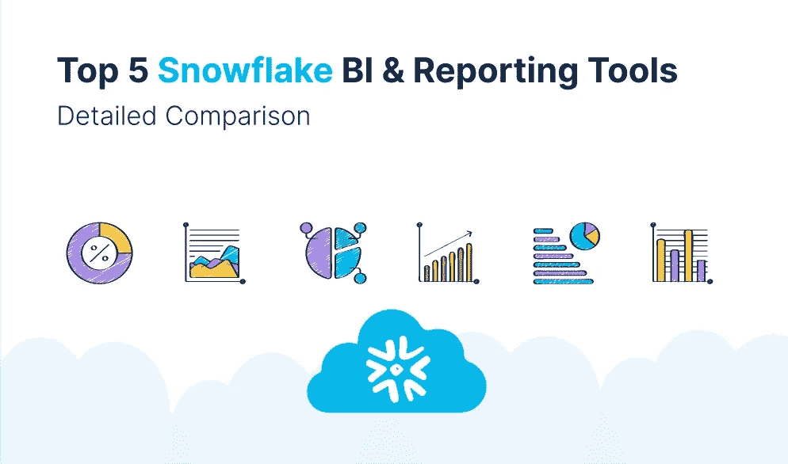
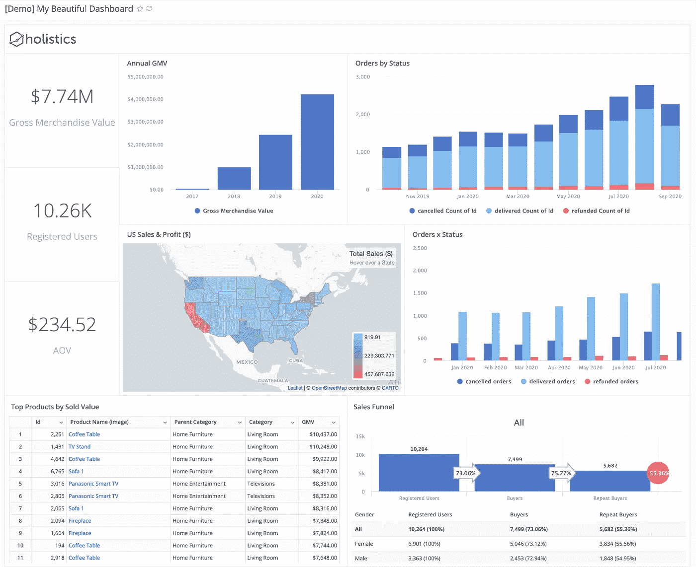
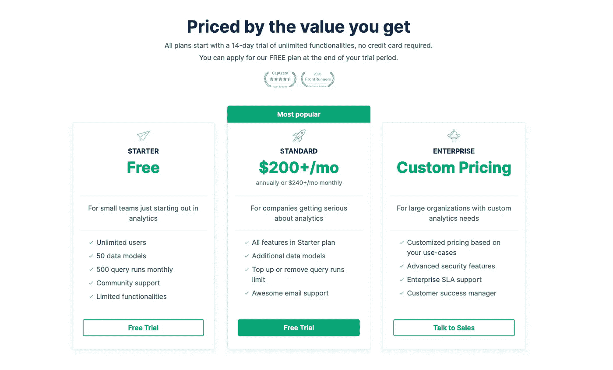
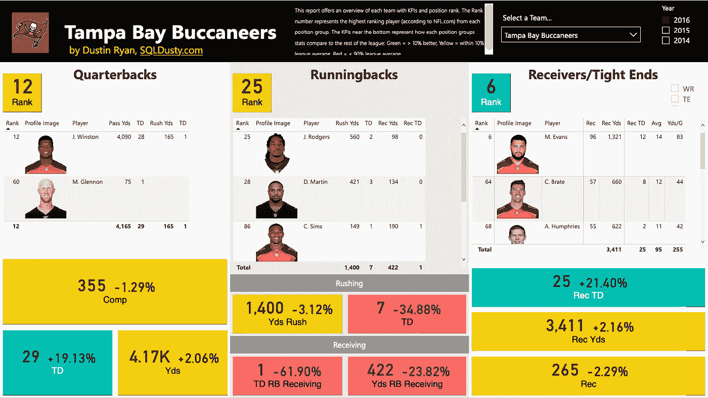
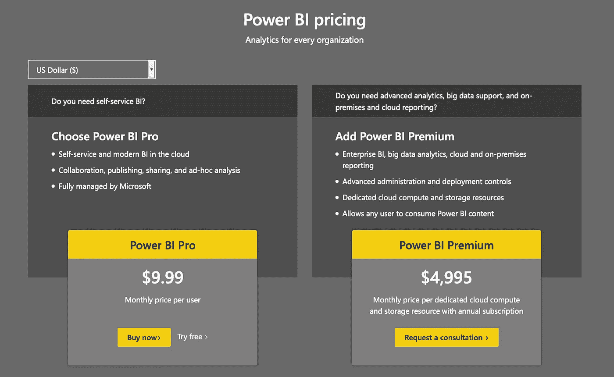
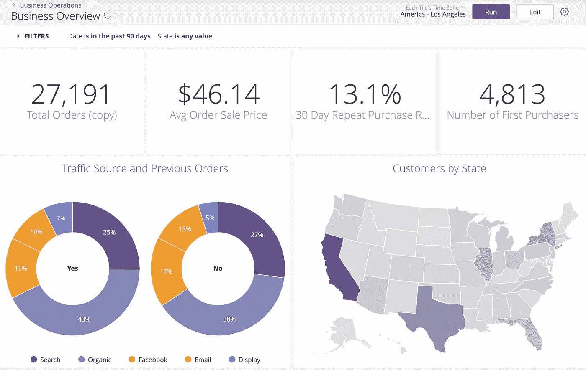
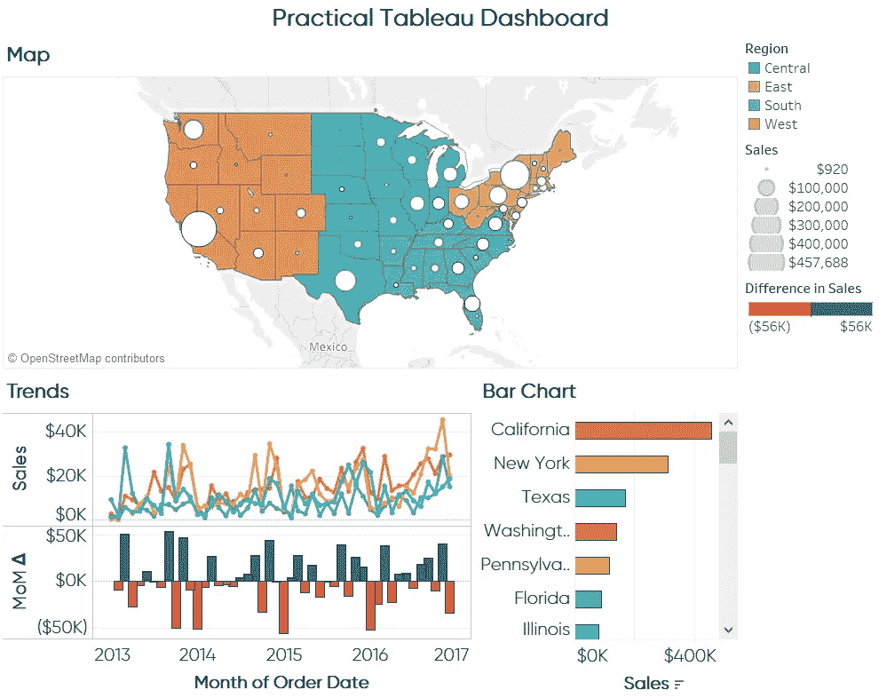
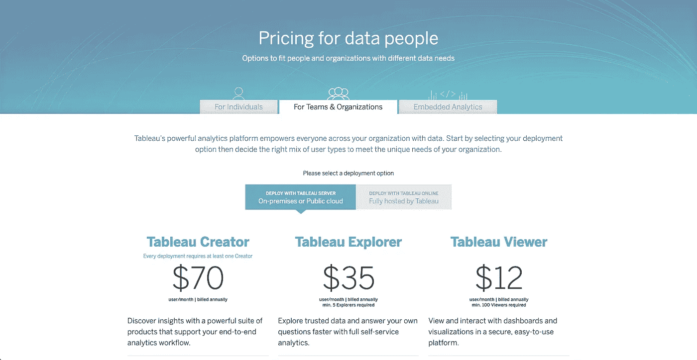
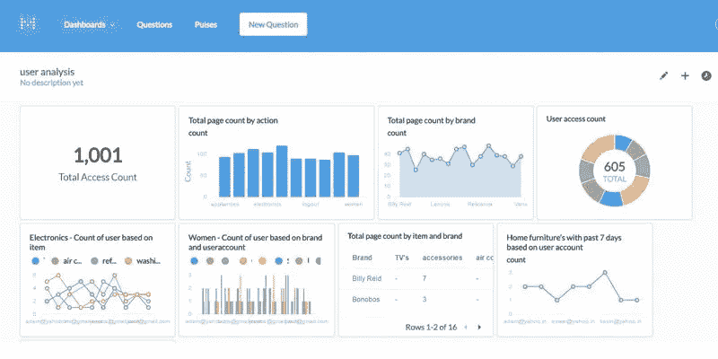

# 五大雪花 BI 和报告工具:详细比较

> 原文：<https://towardsdatascience.com/top-5-snowflake-bi-reporting-tools-detailed-comparison-110f7792ae42?source=collection_archive---------22----------------------->

## 数据爱好者/工具

作者图片

随着最近席卷整个华尔街的首次公开募股，数据市场领域的每个人都在谈论雪花——一种基于云的数据仓库即服务。

随着公司急切地从传统的基于服务器的数据仓库转向现代的无服务器数据仓库(正如 Lars Kamp 在[写给投资者的信](https://medium.com/@larskamp/why-we-sold-intermix-io-to-private-equity-in-a-shifting-market-5bdb3e4e30a4)中详细描述的)，很有可能你的公司正在考虑采用雪花并改造互补的数据堆栈。

作为一名数据分析师/工程师，为了应对这一趋势，您着手为该数据源寻找最兼容的 BI 和报告工具。

虽然雪花[已经友好地列出了所有可以互操作的 BI 工具](https://docs.snowflake.com/en/user-guide/ecosystem-bi.html)，但是我们仅仅决定哪一个适合我们公司的数据需求是不够的。

这篇博客将为您提供五大雪花 BI 和报告工具的详细比较，希望能为您选择最适合您当前数据堆栈的工具提供一些指导。

# 整体主义

[Holistics](https://holistics.io) 是一个自助式 BI 工具，让数据分析师在雪花和[许多其他 SQL 数据仓库](https://www.holistics.io/integrations/)中建模和转换数据。然后，非技术用户可以自己对 insights 进行分析，而不必再依赖分析师。

作者图片

Holistics 最著名的是其[数据建模功能](https://www.holistics.io/product/data-modeling/)，它可以帮助分析师创建一个单一的事实来源，您可以在其中将业务逻辑应用于您自己的数据，并确保它是准确的、可维护的和可重用的。

你可以在他们的[详细指南中学习如何将 Holistics 连接到 Snowflake。](https://docs.holistics.io/docs/connect-database)

## **定价**

Holistics 慷慨地在你的 14 天试用期到期后提供了一个免费计划，它不是根据用户数量向你收费，而是根据查询运行次数收费。这意味着，如果你是一家预算有限的自举式创业公司，那么 Holistics 就是你的合适工具。只有当您的公司及其分析需求扩大时，它才会开始收费。

与市场上几乎所有的竞争对手相比，Holistics 每月 200 美元的起价令人印象深刻，尤其是当它的功能同样强大和丰富时。即使您的公司随着更多分析师加入数据团队而扩大规模，您也无需担心每增加一个人的成本。

作者图片

## **优点**

*   允许您使用可定制的 SQL 查询来查询雪花数据库，并通过其缓存层快速获得结果
*   查询结果的物化视图存储回您自己的 SQL 数据库，以便立即访问和快速可视化和报告。
*   自动安排报告和仪表板，将最新数据以雪花形式直接发送到您的电子邮件收件箱。
*   高级 SQL 编辑器:版本历史，自动完成，SQL 片段，突出显示，自动格式化，查询历史，自定义高级逻辑…
*   供业务用户浏览数据并生成报告以回答特定问题的拖放式界面。
*   具有竞争力的现收现付定价模式，只能随着您公司的发展而发展。

## **缺点**

*   虽然功能强大，但对市场而言， [Holistics](http://holistics.io) 是一个相当新的工具。许多高级功能仍在他们的路线图上。
*   Holistics 不支持 Git 集成和版本控制，这是许多高级分析师和数据工程师更喜欢的。
*   仪表板不如其他竞争对手的交互式。目前，Holistics 仅支持按日期向下钻取和钻取到另一个仪表板。

# PowerBI

[PowerBI](https://powerbi.microsoft.com/en-us/) 在 BI 行业相当知名，尤其是对于采用微软生态系统的企业。它支持数量惊人的数据源，使公司能够将数据集中在一个地方。

PowerBI 有一个用户友好的界面，具有惊人的数据可视化功能，从分析电子商务指标的简单仪表板到高度复杂的仪表板，如下面的 NFL 足球分析。

图片来源:[https://sqldusty . com/2017/07/28/power-bi-NFL-football-stats-comparisons-and-analysis-report-is-now-available/](https://sqldusty.com/2017/07/28/power-bi-nfl-football-stats-comparisons-and-analysis-report-is-now-available/)

将 PowerBI 连接到雪花相当简单。你可以按照[这里的说明](https://docs.microsoft.com/en-us/power-bi/connect-data/desktop-connect-snowflake)。

## **定价**

对于拥有小型数据团队的小规模公司来说，PowerBI 定价也很有吸引力。如果你是个人，只需要在本地计算机上安装 PowerBI 来进行分析，那么你可以免费下载桌面版。然而，如果你想使用更多的 Power BI 服务，并在云上发布你的报告，你可以选择 Power BI 云服务解决方案，每个用户每月 9.99 美元。

请注意，如果您的公司担心安全性和内部部署，价格会大幅上涨到每月**4，995 美元**，并按年订阅。

图片来源:【https://powerbi.microsoft.com/en-us/pricing/ 

## **优点**

*   支持数百个数据源，从雪花这样的云服务到 Excel 这样的离线文件
*   强大的数据可视化功能。除了基本的可视化类型之外，PowerBI 还允许高级用户从定制可视化市场中进行选择，或者使用著名的 Javascript 库创建自己的可视化
*   频繁的更新和创新。关注 PowerBI 的博客，你会看到这个团队在推动新功能和变化方面非常积极。
*   PowerBI 有一个活跃的超级用户和员工社区，他们愿意深入研究您的用例来帮助您。

## **缺点**

*   PowerBI 有一个陡峭的学习曲线。数据分析师必须学习 DAX(数据分析表达式)语言，才能充分利用 PowerBI 的力量，这有时很复杂，也很死板。
*   有限的数据传输能力。如果要查看 PowerBI 报表，必须安装 PowerBI desktop 或已经安装了 PowerBI 报表服务器。这对于 Mac 用户来说很困难，因为 PowerBI 只能安装在 Windows 设备上。

# 检查员

最近作为谷歌云平台的一部分， [Looker](https://looker.com/) 是一个强大的 BI 工具，为实时数据探索和分析提供了一种创新的方法。

Looker 拥有强大的仪表板功能，可以涵盖大多数数据发现用例。然而，与 Power BI 不同，它需要一个完整的语义模型来存储所有的业务逻辑和指标，而不必向数据库表添加一个略有不同的指标的多个版本。这意味着你不能只拿着 Looker，对着数据库，然后在几分钟内得到你的可视化。它需要使用他们自己的语言 LookML 进行预先定义，这将需要相当长的时间来掌握。

图片来源:[https://docs . looker . com/dashboards/creating-lookml-dashboards](https://docs.looker.com/dashboards/creating-lookml-dashboards)

要将 Looker 连接到雪花，请遵循此处的说明。

## **定价**

Looker 不会公开发布其定价信息，因为他们会为每家公司定制。根据我与一些 Looker 用户的交谈，价格可能在每月 3000 美元到 5000 美元之间(T4)，10 个用户每年订阅一次。正如我上面提到的，Looker 是为拥有成熟和专门的数据团队的公司设计的，这些公司愿意采用一种全新的建模语言，并花时间设置 Looker 以适应他们的整个数据堆栈。

## **优点**

*   Looker 完全在浏览器中运行，因此不需要桌面安装，更适合内部和外部用户之间的协作和数据传输
*   Looker 完全对数据库中的数据进行操作。这意味着你直接在你的完整数据集上操作，并得到你的数据库的所有马力，无论是像 Vertica，Redshift，Bigquery 这样的 MPP 像 Impala 或 Spark 这样的基于 Hadoop 的 SQL 设置；或者像 MySQL 或 Postgres 这样的标准 RDBMS
*   自动报告— Looker 允许您为每日/每周/每月报告安排电子邮件，或者在数据出现异常时发送警报。
*   Looker 集成了 GitHub，因此您可以看到对建模层所做的每个更改，并无缝地结合多个开发人员的工作

## **缺点**

*   当采用一种新语言(LookML)时，Looker 有一个陡峭的学习曲线&面向最终用户的模型-视图方法。你肯定需要有一个内部团队，专门负责设置它，并让其余的人参与进来。
*   被锁在站台里。LookML 接管了准备可视化表格的大部分工作。从 Looker 迁移到另一个可视化工具将需要额外的工作来迁移由 LookML 定义的所有内容。
*   虽然 Looker 提供了一个很大的自定义图表库，但是很难根据您的具体需求定制可视化效果。

# （舞台上由人扮的）静态画面

[Tableau](https://www.tableau.com/) 以其无与伦比的可视化信息能力而闻名。该应用程序的数据可视化质量优于 Tableau 软件竞争对手提供的产品。如果你想创建具有无缝交互性的复杂仪表盘，Tableau 绝对是必备工具。

要将 Tableau 与雪花联系起来，[点击此处阅读更多内容](https://help.tableau.com/current/pro/desktop/en-us/examples_snowflake.htm)。

图片来源:[https://www . ryansleaper . com/practical-tableau-3-creative-ways-use-dashboard-actions/practical-tableau-sample-dashboard/](https://www.ryansleeper.com/practical-tableau-3-creative-ways-use-dashboard-actions/practical-tableau-sample-dashboard/)

## **定价**

Tableau 定价相当复杂，根据您的使用案例和团队成员数量收费。此外，Tableau 还根据用户的角色收费，创建者每月 70 美元，探索者 35 美元，查看者 12 美元。由于这个数字取决于你的业务，如果你决定购买 Tableau，你真的应该提前计划，并为额外费用的激增做好准备。

图片来源:【https://www.tableau.com/pricing/individual 

## **优点**

*   强大的可视化功能:庞大的图表库和高度交互的仪表盘
*   Tableau 的友好界面允许所有经验水平的数据分析师快速开始产生引人注目的和有用的分析和可视化。
*   Tableau 可以轻松处理来自各种数据源的数百万行数据，包括电子表格和 SQL 数据库。这允许用户集成不同的数据源，否则这些数据源可能很难连接。

## **缺点**

*   像 PowerBI 一样，Tableau 不能处理太大的数据集。它会变得非常慢。如果您从多个来源导入数据，并且数据非常庞大，有时会出现延迟崩溃。
*   缺乏商业智能能力。Tableau 缺乏成熟的商业智能工具所需的功能，例如大规模报告、构建数据表和静态布局。
*   Tableau Desktop 缺少清理和准备要导入 Tableau Desktop 的数据的基本功能。这是它缺少的主要特性之一，你需要 Tableau 的额外支持来添加这些东西。

# 元数据库

[Metabase](https://www.metabase.com/) 不像 Holistics、PowerBI 或 Tableau 那样受欢迎，它是一个开源工具，旨在为非技术用户提供大数据洞察和可视化。

Metabase 最适合希望部署基于云或内部版本的各种规模的企业。您可以将元数据库用于 KPI 监控、数据库管理、错误跟踪、记录过滤、调试和查询生成器。

图片来源:[https://AWS . Amazon . com/blogs/startups/analytics-is-simple-than-you-think-with-metabase/](https://aws.amazon.com/blogs/startups/analytics-is-simpler-than-you-think-with-metabase/)

Metabase 确实支持连接到 Snowflake，但是您可能需要考虑一些事情。

## **定价**

自由的

## **优点**

*   Metabase 是免费和开源的。Metabase 在 GPLv3 下获得许可，其源代码可以在 GitHub 上获得，您可以使用它在您自己的服务器上进行部署和维护。
*   元数据库易于安装。
*   UI 简单友好，因此只需很少的培训就能有效地使用该工具。

## **缺点**

*   元数据库仅适用于单个 SQL 数据源。如果您有来自多个来源的数据，那么您可能想要找到另一个工具，因为它不允许您连接表数据。
*   尽管有桌面版本，Metabase 有时会出现很多错误，并且渲染结果很慢。
*   与 Tableau 相反，Metabase 在定制图表外观方面有一些限制。
*   因为它是自托管的，公司必须自己处理管理问题和应用程序更新，这可能需要大量的时间和精力。

# 结论

上面提到的五个工具中的任何一个都可以很好地与雪花一起工作，但并不是所有的工具都适合你的公司。

有时候，最强大、功能最丰富的工具可能不是最佳选择，因为它的价格太高，或者学习曲线太陡。

因此，如果你是一个负责寻找这种工具的分析师，一个好的建议是让你的许多同事和最终用户在免费试用期间集中使用该产品。然后，您将了解每个工具的真正瓶颈，并做出最明智的选择。

如果您需要更多的指导来选择合适的工具，您可能想要查看分析设置指南的第 4 章，该章将详细讨论如何[导航商业智能工具空间](https://www.holistics.io/books/setup-analytics/navigating-the-business-intelligence-tool-space/)。

*原载于 2020 年 9 月 23 日*[*https://www . holistics . io*](https://www.holistics.io/blog/top-snowflake-bi-reporting-tools-detailed-comparison/)*。*