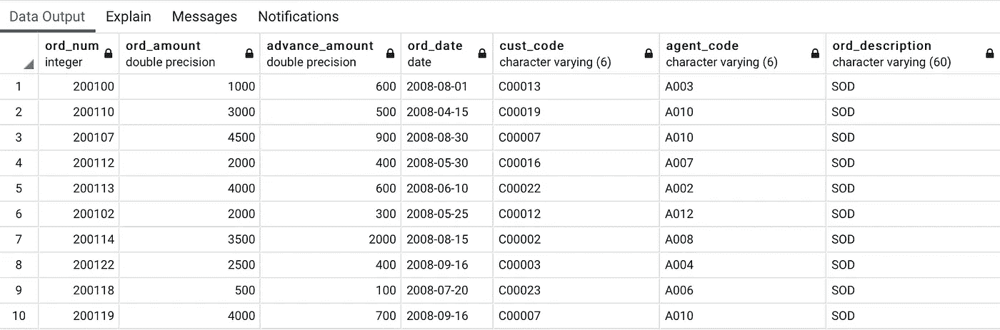
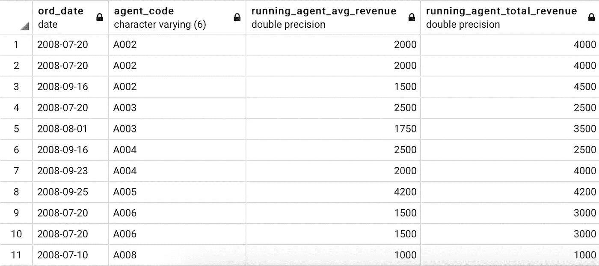
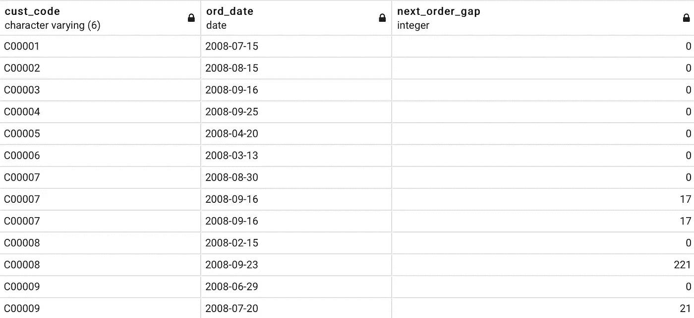
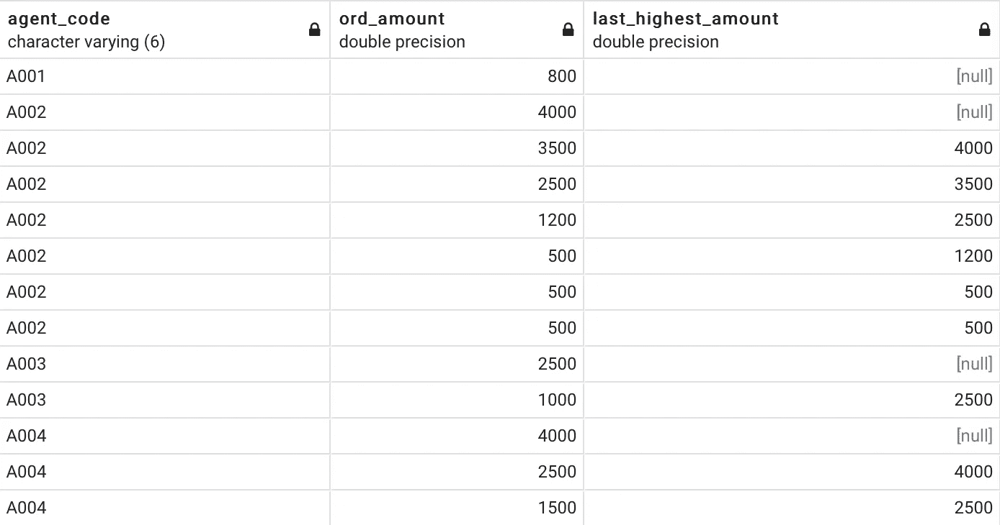
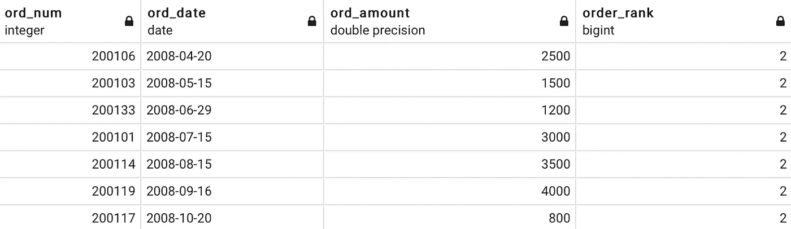
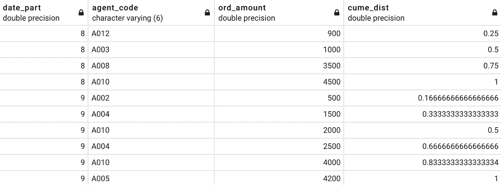

# 每个数据分析师都需要知道的五大 SQL 分析函数

> 原文：<https://towardsdatascience.com/top-5-sql-analytic-functions-every-data-analyst-needs-to-know-3f32788e4ebb?source=collection_archive---------1----------------------->

## SQL 分析函数，让您的分析技能更上一层楼

分析功能是 BI/数据分析师中用于执行复杂数据分析的最受欢迎的工具之一。这些函数对多行执行计算，并返回多行。今天，我们将讨论我认为最有用的 5 个函数，以及大量的实际例子。


帕特里克·卡尔在 [Unsplash](https://unsplash.com?utm_source=medium&utm_medium=referral) 上拍摄的照片

对于外行来说，带有分析功能的查询的相对大小可能有点吓人。别担心，我们会保护你的。这些函数大多遵循一个基本语法:

```
analytic_function_name([argument_list])
OVER (
[PARTITION BY partition_expression,…]
[ORDER BY sort_expression, … [ASC|DESC]])
```

这个语法有三个部分，即*函数*、划分的*和*排序的*。让我们简要介绍一下每种方法的作用:*

*   `analytic_function_name`:功能名称——如`RANK()`、`SUM()`、`FIRST()`等
*   `partition_expression`:创建分区或窗框所依据的列/表达式
*   `sort_expression`:对分区中的行进行排序所依据的列/表达式

好了，到目前为止，我们已经介绍了基础知识。对于实际部分，我们将使用存储在 *PostgreSQL* 数据库中的[订单表](https://www.w3resource.com/sql/sql-table.php):



现在让我们从实际部分开始，好吗？

# AVG()和求和()

我们都在我们的`GROUP BY`子句中使用了聚合函数，比如`SUM`、`AVG`、`MIN`、`MAX`和`COUNT`。但是当这些函数用于一个`ORDER BY`子句时，它们可以给出运行总和、平均值、总数等。

下面的例子将使它变得更加清晰— *我们要计算每个代理在第三季度的运行平均收入和总收入:*

```
SELECT ord_date, agent_code, AVG(ord_amount) OVER (
    PARTITION BY agent_code
    ORDER BY ord_date
) running_agent_avg_revenue, 
    SUM (ord_amount) OVER (
        PARTITION BY agent_code
        ORDER BY ord_date
    ) running_agent_total_revenue
FROM orders
WHERE ord_date BETWEEN ‘2008–07–01’ AND ‘2008–09–30’;
```

结果如下:



厉害！这些功能很简单，不需要额外的解释。我们继续吧。

# 第一个值()，最后一个值()，第 n 个值()

`FIRST_VALUE()`是一个分析函数，从窗口框架的第一行返回指定列的值。如果你已经理解了上一句话，`LAST_VALUE()`不言自明。它从最后一行获取值。

*PostgreSQL* 为我们提供了另一个名为`NTH_VALUE(column_name, n)`的函数，它从第 n 行获取值。是不是很棒？不再有复杂的自连接。

让我们来回答以下问题— *客户第一次购买后多少天进行下一次购买？*

```
SELECT cust_code, ord_date, ord_date — FIRST_VALUE(ord_date) OVER (
    PARTITION BY cust_code 
    ORDER BY ord_date) next_order_gap
FROM orders
ORDER BY cust_code, next_order_gap;
```

结果如下:



这个函数在很多情况下都是有用的。此外，很高兴知道结果可以直接从数据库中获得，所以我们不必用 Python/R 手动进行这种计算。

让我们进行下一个。

# 超前()和滞后()

`LEAD()`函数，顾名思义，从下一行取出特定列的值，并将取出的值返回当前行。在 *PostgreSQL* 中，`LEAD()`采用两个参数:

*   `column_name`必须从中提取下一个值
*   `index`相对于当前行的下一行。

`LAG()`正好相反。它从前面的行中获取值。

让我们来回答以下问题，让这个概念更清楚一点— *代理销售订单的最后最高金额是多少？*

```
SELECT agent_code, ord_amount, LAG(ord_amount, 1) OVER (
    PARTITION BY agent_code
    ORDER BY ord_amount DESC
) last_highest_amount
FROM orders
ORDER BY agent_code, ord_amount DESC;
```

结果如下:



上面您可以看到`last_highest_amount`如何清楚地显示每个代理的数据——这就是为什么代理 A001 没有结果，而其他代理的第一个值为空。

# 秩()和密集秩()

`RANK()`和`DENSE_RANK()`是编号功能。它们根据分区和排序将整数值赋给一行。在查找表中的第 n 个最高/最低记录时，我不能过分强调这些函数的重要性。

`DENSE_RANK()`和`RANK()`的区别在于，前者得到连续的等级，而后者是跳过一个平局后的等级。例如，使用`DENSE_RANK()`的排名将类似于(1，2，2，3)，而使用`RANK()`的排名将是(1，2，2，4)。希望你明白其中的区别。

无论如何，让我们在这些函数的帮助下回答以下问题— *每个月的第二高阶值是多少？*

```
SELECT * FROM (
    SELECT ord_num, ord_date, ord_amount, DENSE_RANK() OVER(
        PARTITION BY DATE_PART(‘month’, ord_date) 
        ORDER BY ord_amount DESC) order_rank 
    FROM orders
) t
WHERE order_rank = 2
ORDER BY ord_date;
```

结果如下:



酷！让我们进行下一个。

# DIST CUME()

`CUME_DIST()`函数用于计算给定分区内值的累积分布。它计算分区中小于或等于当前行的行的比例。当我们必须只获取结果的前 n%时，这非常有用。

让我们用它来*计算八月和九月每个订单的收入百分比*:

```
SELECT DATE_PART(‘Month’,ord_date), agent_code, ord_amount, CUME_DIST() OVER(
   PARTITION BY DATE_PART(‘Month’,ord_date)
    ORDER BY ord_amount
)
FROM orders
WHERE ord_date BETWEEN ‘2008–08–01’ AND ‘2008–09–30’;
```

结果如下:



这不是我日常使用的功能，但很高兴知道它的存在。

# 在你走之前

这就是我在数据库中执行分析时使用的 5 个最常见的分析函数。对我来说，这不像用 Python 和 Pandas 做分析那么常见，但我仍然发现这有时很有用——尤其是对于仅限于 SQL 的分析师。

希望这 5 款能很好的适合你，可以随意自己多研究研究。感谢阅读。

*喜欢这篇文章吗？成为* [*中等会员*](https://medium.com/@radecicdario/membership) *继续无限制学习。如果你使用下面的链接，我会收到你的一部分会员费，不需要你额外付费。*

[](https://medium.com/@radecicdario/membership) [## 通过我的推荐链接加入 Medium-Dario rade ci

### 作为一个媒体会员，你的会员费的一部分会给你阅读的作家，你可以完全接触到每一个故事…

medium.com](https://medium.com/@radecicdario/membership) 

[**加入我的私人邮件列表，获取更多有用的见解。**](https://mailchi.mp/46a3d2989d9b/bdssubscribe)