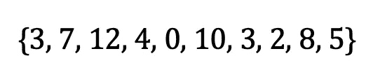
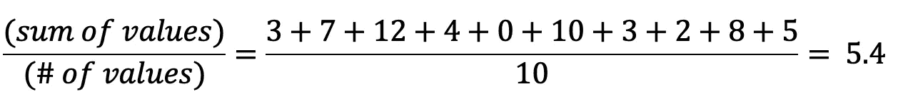
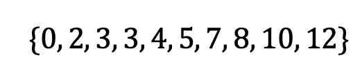
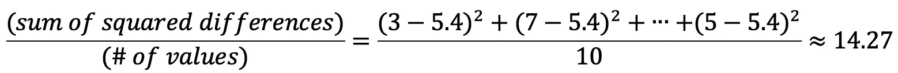
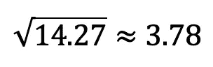
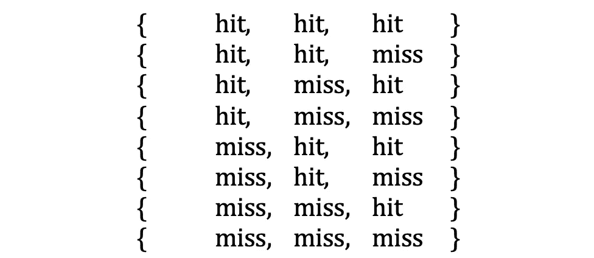
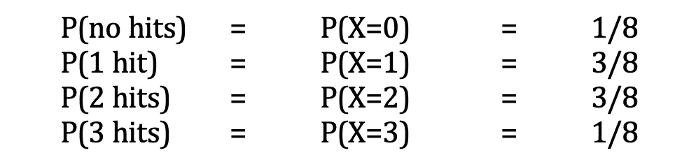
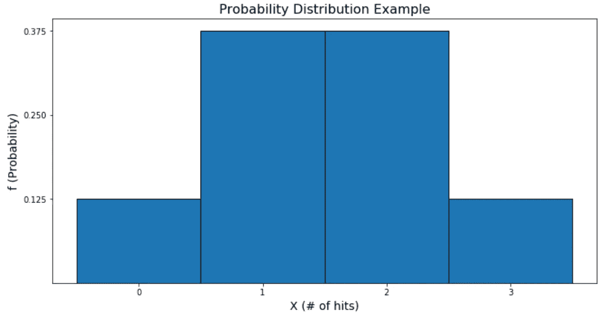
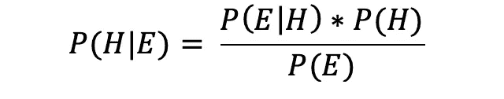

# 每个数据科学家都必须知道的 5 大统计概念

> 原文：<https://towardsdatascience.com/top-5-statistical-concepts-every-data-scientist-must-know-d4bc8740a55d?source=collection_archive---------1----------------------->

## 统计和数据科学的基本支柱

任何数据科学家都可以从数据集收集信息，任何优秀的数据科学家都知道，收集有用和可靠的信息需要坚实的统计基础。没有它，就不可能进行高质量的数据科学。

在 [Unsplash](https://unsplash.com?utm_source=medium&utm_medium=referral) 上由 [Tachina Lee](https://unsplash.com/@chne_?utm_source=medium&utm_medium=referral) 拍摄的照片

*但是统计学是一个巨大的领域！我从哪里开始？*

以下是每个数据科学家都应该知道的五大统计概念:描述统计、概率分布、降维、过采样和欠采样以及贝叶斯统计。

先说最简单的。

# 描述统计学

你正坐在一个数据集前。你如何从高层次上描述你所拥有的东西？描述性统计是答案。你可能听说过其中的一些:*表示*、*中位数*、*众数*、*方差*、*标准差* …

这些将快速识别数据集的关键要素，并为您的方法提供信息，无论任务是什么。让我们来看看一些最常见的描述性统计数据。

## 平均

平均值(也称为“期望值”或“平均值”)是值的总和除以值的个数。以这个例子为例:

平均值计算如下:

## 中位数

按升序(或降序)列出您的值。中位数是将数据分成两半的点。如果有两个中间数，则中间数是这两个数的平均值。在我们的例子中:

中位数是 4.5。

## 方式

众数是数据集中出现频率最高的值。在我们的例子中，模式是 3。

## 差异

方差衡量数据集相对于平均值的分布。要计算方差，从每个值中减去平均值。平方每个差异。最后，计算这些结果的平均值。在我们的例子中:

## 标准偏差

标准差衡量总体分布，通过计算方差的平方根来计算。在我们的例子中:

其他描述性统计包括*偏度*、*峰度*和*四分位数*。

# 概率分布

概率分布是一个函数，它给出了一个实验的每一个可能的结果发生的概率。如果你在描绘一个钟形曲线，你就在正确的轨道上。它一目了然地显示了随机变量的值是如何分散的。随机变量及其分布可以是离散的，也可以是连续的。

## 分离的

约翰是一名棒球运动员，每次球投给他时，他都有 50%的概率击中球。让我们给约翰投三次球，看看他击球多少次。以下是所有可能结果的列表:

设 X 是我们的随机变量，约翰在三次投球实验中击中的次数。约翰得到 *n* 个命中的概率用 P(X= *n)来表示。*所以，X 可以是 0，1，2，或者 3。如果上述所有八种结果的可能性相等，则我们有:

用 *f* 代替 P，我们就得到概率函数了！让我们用图表表示它。

从图中，我们看到约翰更有可能获得 1 或 2 次点击，而不是 0 或 3 次，因为对于那些值 *X* ，图更高。常见的离散分布有*伯努利*、*二项式*和*泊松*。

## 连续的

连续的情况自然地从离散的情况中产生。我们的随机变量可以是棒球在空中的时间，而不是计算击中次数。我们可以使用像 3.45 秒或 6.98457 秒这样的值，而不仅仅是一秒、两秒或三秒。

我们在谈论一组无限多的可能性。连续变量的其他例子有高度、时间和温度。常见的连续分布有*正态*、*指数*、*卡方*。

# 降维

如果你有太多的输入变量或者你的数据在计算上很难处理，你可能会转向降维。这是将高维数据投影到低维空间中的过程，但是一定要注意不要丢失原始数据集的重要特征。

例如，假设您正试图确定哪些因素最能预测您最喜爱的篮球队今晚是否会赢得比赛。你可以收集数据，如他们的胜率，他们在打谁，他们在哪里打，他们的首发前锋是谁，他晚饭吃了什么，教练穿什么颜色的鞋。

你可能会怀疑这些特征中的某些与获胜的关联比其他的更大。降维可以让我们自信地丢弃对预测没有意义的信息，同时保留最有预测价值的特征。

主成分分析(PCA) 是一种流行的方法，它通过夸大称为主成分的新特征组合的方差来工作。这些新的组合是原始数据点在一个新空间中的投影——仍然是相同的维度——其中的变化被放大了。

总的想法是，在这些新组件中，变化最小的组件可以最安全地丢弃。删除单个组件会将原始维度减少一个，删除两个组件会将原始维度减少两个，依此类推。

如果你想了解更多，这里有一整篇文章专门介绍 *PCA* :

 [## Python 中从头开始的主成分分析(PCA)

### 以及一些低维空间的可视化。

towardsdatascience.com](/principal-component-analysis-pca-from-scratch-in-python-7f3e2a540c51) 

# 欠采样和过采样

观察值的集合称为“样本”，集合的收集方式称为“抽样”。在需要平等表示少数类和多数类的分类情况下，欠采样或过采样可能会有用。对多数类进行欠采样或对少数类进行过采样有助于平衡不平衡的数据集。

随机过采样(或者，随机欠采样)涉及随机选择和复制少数类中的观察值(或者随机选择和删除多数类中的观察值)。

这很容易实现，但您应该小心行事:过采样会对重复的观察值进行加权，如果它们不是无偏的，这可能会严重影响结果。类似地，欠采样有删除关键观察值的风险。

对少数类进行过采样的一种方法是*合成少数过采样技术(SMOTE)* 。这通过创建现有观测值的新组合来创建(合成的)少数类观测值。对于少数类中的每个观察值， *SMOTE* 计算其 *k* 最近邻；也就是说，它会找到与观察值最相似的 *k* 个少数类观察值。

将观察结果视为向量，它通过用 0 到 1 之间的随机数对任何一个 *k* 最近邻进行加权，并将其添加到原始向量中，从而创建随机线性组合。

对多数类进行欠采样的一种方法是使用聚类质心。理论上类似于 *SMOTE* ，它用矢量组的 *k* 最近邻簇的质心来代替矢量组。

# 贝叶斯统计

谈到统计推断，有两个主要的思想流派:频率主义统计和贝叶斯统计。频繁统计让我们做有意义的工作，但也有不足之处。当你有理由相信你的数据可能不能很好地代表你期望在未来观察到的情况时，贝叶斯统计做得很好。

这允许你将你自己的知识结合到你的计算中，而不是仅仅依赖于你的样本。它还允许你在新数据进来后更新你对未来的想法。

**考虑一个例子:**A 队和 B 队交手 10 次，A 队赢了其中的 9 次。如果这两个队今晚比赛，我问你你认为谁会赢，你可能会说 A 队！如果我也告诉你 B 队贿赂了今晚的裁判呢？嗯，那你可能会猜 B 队会赢。

贝叶斯统计允许你将这些额外的信息整合到你的计算中，而 frequentist 统计只关注 9/10 的胜率。

贝叶斯定理是关键:

给定 *E* 的 *H* 的条件概率，写成 P( *H* | *E* )，表示给定 *E* 也发生(或已经发生)的情况下 *H* 发生的概率。在我们的例子中， *H* 是 B 队会赢的假设， *E* 是我给你的关于 B 队贿赂裁判的证据。

P( *H* )是常客概率，10%。P( *E* | *H* )是我告诉你的贿赂是真的概率，假设 B 队赢了。(如果今晚 B 队赢了，你会相信我跟你说的话吗？)

最后，P( *E* )是 B 队事实上贿赂裁判的概率。我是一个值得信赖的信息来源吗？你可以看到这种方法包含了更多的信息，而不仅仅是两队之前 10 场比赛的结果。

今天就到这里。让我们在下一部分总结一下。

# 在你走之前

学习这 5 个概念不会让你成为统计学或数据科学的大师，但如果你不能理解数据科学项目的基本流程，这是一个很好的起点。

如果这听起来仍然像是高级的东西，我的建议是从小处着手。以下是我和许多人投票选出的最佳统计学入门书籍:

 [## 数据科学的最佳入门统计学书籍

### 了解数据科学最重要的支柱

towardsdatascience.com](/the-single-best-introductory-statistics-book-for-data-science-a2601ea7c0be) 

我们结束了——感谢阅读。

加入我的私人邮件列表，获得更多有用的见解。

喜欢这篇文章吗？成为 [*中等会员*](https://medium.com/@radecicdario/membership) *继续无限制学习。如果你使用下面的链接，我会收到你的一部分会员费，不需要你额外付费。*

 [## 通过我的推荐链接加入 Medium-Dario rade ci

### 作为一个媒体会员，你的会员费的一部分会给你阅读的作家，你可以完全接触到每一个故事…

medium.com](https://medium.com/@radecicdario/membership) 

*原载于 2020 年 8 月 29 日 https://betterdatascience.com**[*。*](https://betterdatascience.com/top-5-statistics-concepts-for-data-science/)*