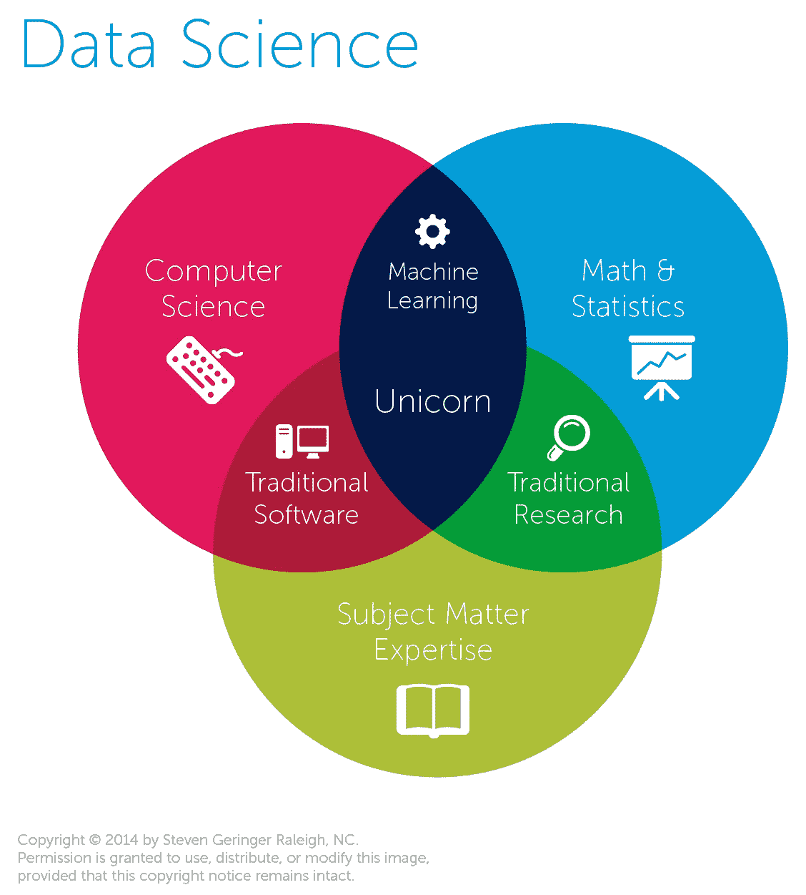

# 在数据科学项目中取得成功必须知道的 5 件事

> 原文：<https://towardsdatascience.com/top-5-things-you-must-know-to-succeed-in-your-data-science-program-8fdc831c2ef0?source=collection_archive---------40----------------------->

## [办公时间](https://towardsdatascience.com/tagged/office-hours)

## 有抱负的数据科学家的简单指南

由[马文·迈耶](https://unsplash.com/@marvelous?utm_source=unsplash&utm_medium=referral&utm_content=creditCopyText)在 [Unsplash](https://unsplash.com/s/photos/technology?utm_source=unsplash&utm_medium=referral&utm_content=creditCopyText) 上拍摄的照片

2019 年 3 月，我被 NYU 大学数据科学硕士项目录取。我非常兴奋，但不确定我需要知道什么，以及将会发生什么，因为我之前没有数据科学方面的经验。我在第一年之前花了一个夏天做准备，现在我已经是最后一年了，我有一些建议给其他参加类似项目的人。即使考虑到 2020 年前所未有的情况，像这样的一篇文章也可以更好地为我的第一年做准备。

如果你觉得你在同一个地方，按照以下 5 个步骤准备你的数据科学课程。这些建议中的一些对每个人来说可能不是新闻，但对缺乏经验的人来说可能是全新的。如果你被录取了，那意味着你具备成功的条件；你现在必须投入工作！

# 1.复习微积分、线性代数、概率和统计。

如果你想从这篇文章中学到什么，那就是**这篇**。如果你像我一样，你可能在所有这些科目上都得了高分，但是你已经很多年没有碰它们了，所以你需要温习一下。概率和统计是数据科学的核心驱动力，所以要非常熟悉贝叶斯和频率统计。对于线性代数，刷新矩阵变换、乘法和特征向量/值。复习微积分，复习导数，积分，对数规则，以及这些在多元空间中的应用。所有这三个主题都出现在你的基本机器学习课上。以下是一些有助于您复习的资源:

*   曼迪·顾的《数学与统计评论》
*   [每个数据科学家都应该知道 Maurizio Sluijmers 的《线性代数基础》](/basics-of-linear-algebra-for-data-science-9e93ada24e5c)
*   [斯坦福线性代数复习](http://cs229.stanford.edu/section/cs229-linalg.pdf)
*   [基础微积分复习](http://pages.stat.wisc.edu/~ifischer/calculus.pdf)

照片由史蒂文·格林格拍摄

## 2.练习你的编码技能

Python 是数据科学中最受欢迎的语言之一，因为它的内置包可以让您轻松建模。不仅用 Python 编程是必不可少的，而且能够快速解决基本的编程问题将是非常有益的，尤其是在完成实习的技术面试时。练习这类问题的最好方法是在像**和 [**LeetCode**](https://leetcode.com/) **这样的网站上。**你可能想关注的一些常见问题包括:**矩阵、数组和字典。**解决这些问题的一种常见方法是先过滤出容易的问题，然后再过滤出中等难度的问题。我整个夏天都在这些网站上练习，直到上课，这让我在 NYU 大学的数据科学课程中获得了优势。**

**另一个有用的资源是 Eric Matthes 的 [**Python 速成班**](https://amzn.to/2IfJ3C5)**；**这是一本信息丰富的 Python 编程入门指南！**

# **3.完成数据科学项目**

**实习面试的一个巨大优势是之前的数据科学经验。如果你的简历上没有任何数据科学项目，你可以花时间在数据科学竞赛网站上做一个项目，或者自己想一个项目。有些项目网站是 [Kaggle](https://www.kaggle.com/) 和 [CodaLab](https://codalab.org/) 。避免常见的项目，如[泰坦尼克](https://www.kaggle.com/c/titanic)问题；雇主见过太多次了。如果你担心你的专业水平影响你完成项目的能力，从一个你能找到指导的简单项目开始(Github，Medium 等。).然后，把你学到的东西应用到新的领域。所有的资源都可以提供帮助；你需要利用它们。**

**你自己想出的项目应该是你充满热情的事情；想想你的兴趣(运动、健康、新闻等)。)，并创建一个解决题目内某个问题的项目。你可能需要从现有的项目中寻找灵感，但这是值得的，因为大多数雇主更喜欢自己动手的项目。这个自制的项目将展示你的激情，你可以轻松地谈论它。一旦你的简历上有了一个项目，你在课堂上和面试中都有优势。第一学期结束后，你很可能会有小组项目，并将它们添加到你的简历中，但有了这个初始项目，你将有一个良好的开端。**

# **4.仔细阅读最佳实践**

**NYU 政府推荐了乔尔·格鲁的《从零开始的 T2 数据科学》，这是我第一年最有用的资源。我不知道没有它我会做什么！第一次看的时候，你可能不太懂，但是你可以参考这本书，在课堂上获得对难懂的数据科学概念的简单解释。这本书还提供了对 [Github](https://github.com/joelgrus/data-science-from-scratch) 上代码的访问，这些代码展示了数据科学概念的基本实现。我推荐阅读这本书，并在互联网上寻找其他一些简单的数据科学介绍；让你的好奇心带着你。下面是 Grus 的书的链接和其他一些帮助你开始的链接。**

*   **[**数据科学从零开始:Python 的基本原理第二版**](https://amzn.to/2UfrGU4)Joel Grus 著**
*   **Ignacio Montegu 的 [**数据科学新手绝对入门指南**](/the-absolute-beginners-guide-for-data-science-rookies-736e4fcbff0a)**

# **5.建立你的关系网**

**我从本科商学院获得的最大收获是，你和你的人脉一样好。每天花一点时间建立你的人际网络。与你期望的职业道路或公司的专业人士联系；LinkedIn 让这变得非常容易。联系这些专业人士，请求一个联系的机会，甚至是一个简短的电话。询问他们是如何走到今天这一步的，让他们谈谈自己。然后求推荐；也许你需要一个课程的建议或者一个关注的特定主题(自然语言处理，大数据等)。)成为那家公司的数据科学家。每个数据科学部门都不一样，对数据科学家有不同的定义。如果你想在他们特定的公司工作，了解他们的工作需要什么是很好的。**

**与专业人士联系没有坏处，在一天结束时，你已经留下了一个好印象，并有了一个新的联系。在第一学期开始前建立你的职业关系网会让你在寻找实习机会的过程中领先一步，并帮助你决定选什么课。**

**除了与行业专业人士建立关系网，与你的同学建立关系网也很重要。请花些时间在 LinkedIn 上找到那些简历中有你的项目的人。这些学生将很快成为你的队友、学习伙伴和支持者；和他们联系很好，因为我相信他们会很开心。**

**重要的是要明白，你的同龄人是你的同学，会成为你的职业人脉。这些学生毕业后会找到工作，谁知道呢，也许这将是你梦想工作的一扇门！工作前景不应该是和你的同学联系的主要原因，但这是需要记住的。**

**现在，您已经为您的数据科学计划做好了准备！通过将你的时间分配给上面的提示，你将为你的数据科学专业做更好的准备，并且已经是比以前更好的数据科学家。请随意评论我错过的任何其他有用的资源或主题。祝你好运！**