# 6 大查询可视化工具

> 原文：<https://towardsdatascience.com/top-6-bigquery-visualization-tools-aa0e520a4549?source=collection_archive---------39----------------------->

来源:[沉积照片](https://ru.depositphotos.com/8470542/stock-photo-blue-ocean-wave.html)

## 在本文中，我们考虑六种最流行的 BigQuery 可视化工具。​

让我们从好消息开始——市场上有很多数据可视化服务。有免费的在线服务、付费的离线服务、移动设备服务、桌面服务、允许协作编辑报告的服务、支持不同数据源组合的服务——营销专家(和预算)想要的一切。但是哪种服务最适合您的任务呢？​

# 如何借助 Data Studio 可视化数据

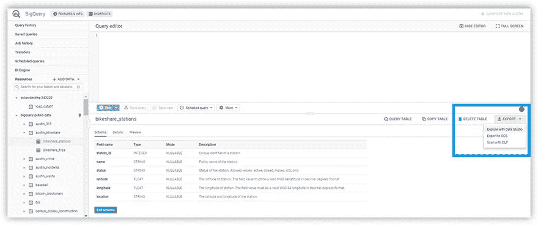

图片由作者提供

要开始在谷歌数据工作室工作，登录你的谷歌账户，去 https://datastudio.google.com。

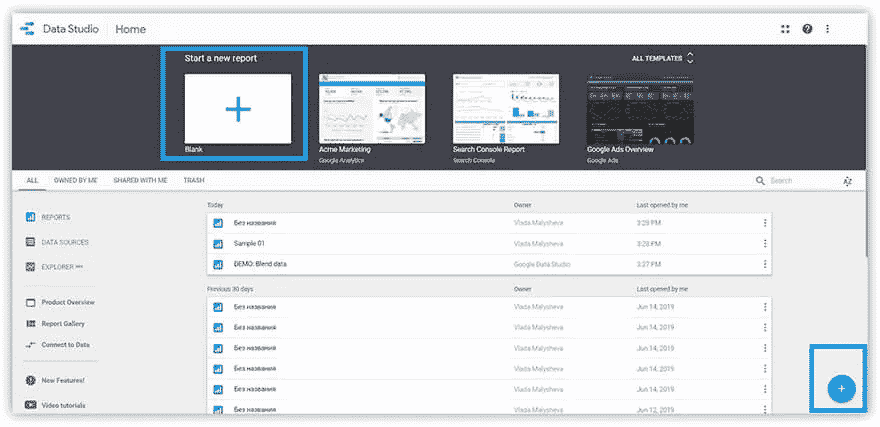

图片由作者提供

1.  在首页左上角或右下角选择**开始一个新的报告**(如上图所示)。
2.  要将数据从 GBQ 加载到 Data Studio，单击**创建数据源**按钮，并从连接器列表中选择 Google–>big query。

注意:使用 GBQ 中的数据需要一个 Google 云平台帐户。

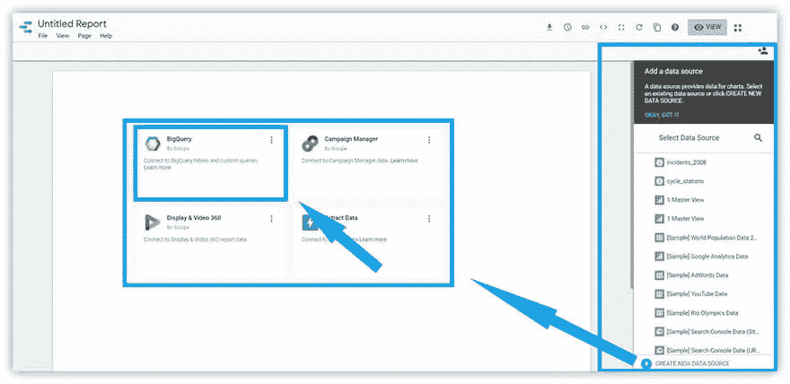

图片由作者提供

在选择数据源时，决定应该与报表连接的项目、数据集和表。然后编辑器窗口将打开，您可以:

*   更改数据存储的周期
*   允许访问第三方可视化工具
*   编辑报告中的字段

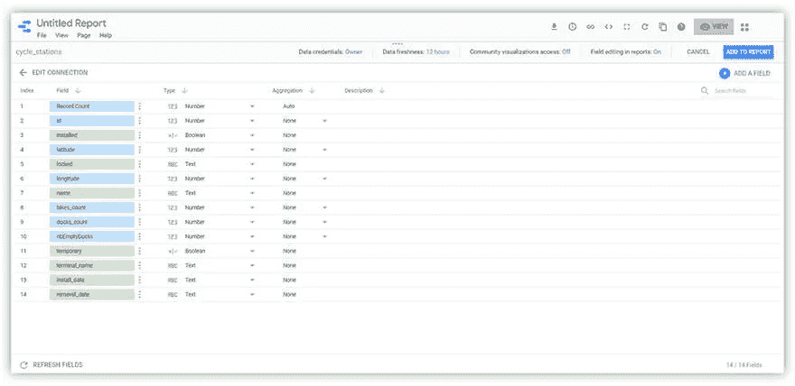

图片由作者提供

您可以在 [Data Studio 帮助](https://support.google.com/datastudio/table/6379764?hl=en)中心阅读更多关于在 Data Studio 中处理数据的可能性。

现在您可以可视化您的数据。一旦您为报告选择了一个表，报告编辑器的窗口就会打开。Data Studio 编辑器的界面非常易于理解和使用。

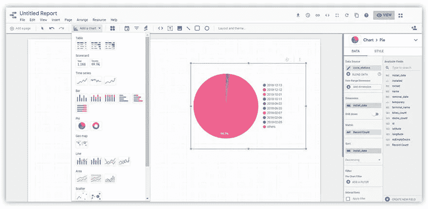

图片由作者提供

该编辑器支持 11 种类型的可视化，包括表格和报告、图表和图形、动态排名和地图。报告可视化还有单独的元素:

*   日期范围
*   过滤
*   数据管理
*   内置元素的 URL

要向报表添加一个可视化元素，只需从下拉菜单中选择它并将其拖到工作区即可。任何元素都可以使用右侧的设置菜单进行编辑。在此菜单中，有两个选项卡，可以在其中更改显示的数据及其显示样式。

在编辑器的最新更新中，有一个深刻的图表规范。例如，现在您可以从显示的国家转到城市。但最重要的是，最新的更新带来了在一个图表中组合不同数据源的机会。

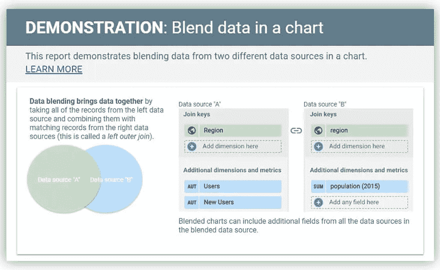

图片由作者提供

谷歌不仅准备了简单解释其工作原理的信息图表，还准备了 T2 的 YouTube 视频。

Data Studio 的一个与众不同的特性是可以在报告上进行协作。您可以使用在 Google Drive 中看到的标准共享对话框来访问报告。简单易行！

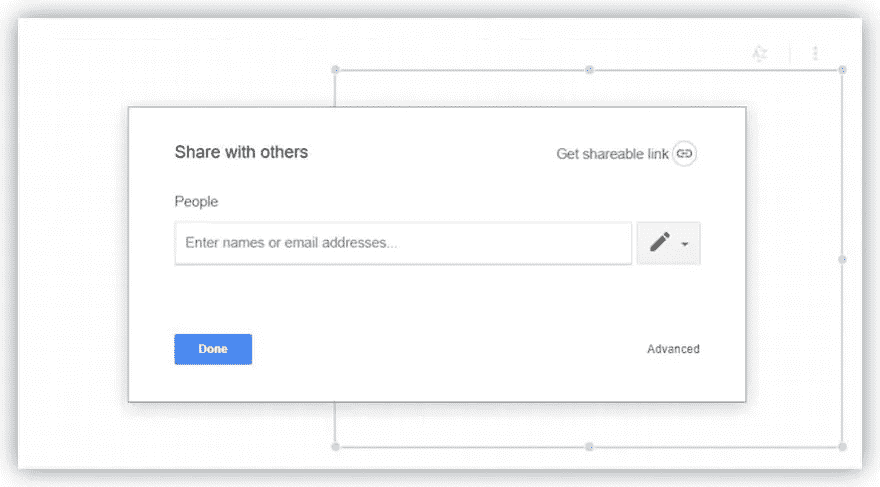

图片由作者提供

如果需要，您可以从任何报告创建模板。为此，菜单中有一个复制报告的选项。若要基于此模板创建新报表，请选择新的数据源。

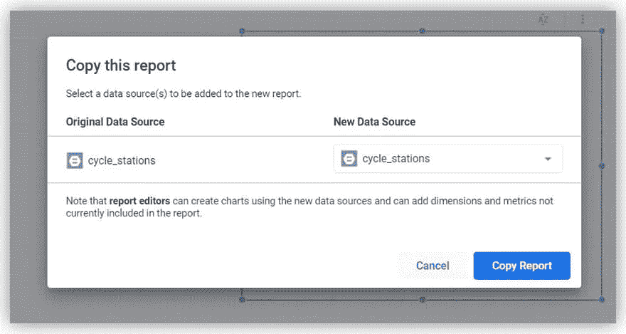

图片由作者提供

Google Data Studio 的优势:

*   自由的
*   直观的界面
*   报告的协作编辑
*   逐页格式化
*   在一个报告中使用多个数据源的机会
*   如果出现错误，可以使用版本历史回滚到报告的前一个版本

Google Data Studio 的缺点:

*   缺乏广泛的数据准备工具
*   移动设备没有报告预览

Google Data Studio 使用起来极其简单。它的免费功能、与 Google 产品的集成以及 150 多个连接器足以满足中小型企业的需求。

# 在 OWOX BI 插件的帮助下导入数据后，在 Google Sheets 中可视化数据

您是否希望在 Google Sheets 中以表格、图表和图形的形式可视化报告，并基于 Google BigQuery 中存储的数据这样做？

如果是这样，OWOX BI BigQuery Reports 插件就是您所需要的。它允许您快速加载数据，安排报告，并将结果发送到 GBQ 中的新表。

您可以从 [Chrome 网上商店](https://chrome.google.com/webstore/detail/owox-bi-bigquery-reports/fepofngogkjnejgcbdmmkddnpeojbbin?utm_source=owox_bi)获取附加组件，或者直接在 Google Sheets 中选择**附加组件→获取附加组件** …:

图片由作者提供

OWOX BI BigQuery Reports 插件的优势:

*   不需要登录 Google BigQuery。
*   您的表不会变慢，所有计算都将在 GBQ 存储中进行。
*   您只需打开附加组件并创建一个新报告。就这么简单:)

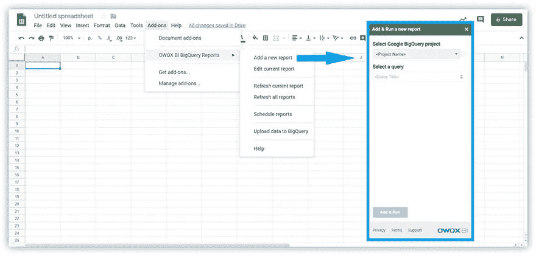

图片由作者提供

在 Google Sheets 加载了选择的表之后，您就可以开始可视化数据了。例如，您可以添加一个图表:

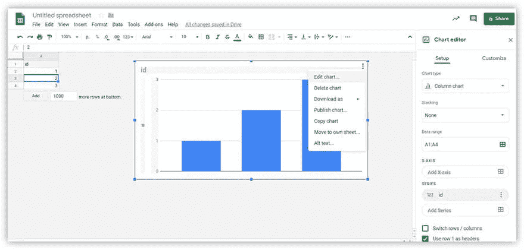

图片由作者提供

要选择图形和图表，请打开右上角的菜单并选择第一项。在右边，将会有一个带有元素设置的菜单。可以改变图表的类型或选择数据的范围。

注意:Sheets 显示了对于特定数据集应该使用什么类型的图表的建议。

借助标准的 Google access 设置，您可以轻松共享报告。

*   Google Sheets 的优势:
*   对报告访问的简单控制
*   报告的协作编辑
*   与 Excel 兼容

Google Sheets 的缺点:

*   可视化的最小集合
*   不可能统一数据源

毫无疑问，Google Sheets 已经成为 Excel 的云替代品。这个工具是移动的，在任何有网络连接的地方都可以使用。如果您不需要复杂的数据可视化，那么这个免费选项绝对适合您。

对于合并来自不同数据源的数据的问题的解决方案，有 [OWOX BI](https://www.owox.com/products/bi/pipeline/) 。

# 使用就绪连接器的 BI 系统中的可视化

# 功率 BI

微软的这个工具遵循分而治之的逻辑。要使用 Power BI，您需要同时设置该产品的两个版本:

1.  用于创建报告的 Power BI 桌面
2.  用于监控和分析报告的 Power BI 服务。此外，处理数据的机会也很有限。

注意:Power BI 不支持 Linux 或 macOS。

内置的 Google BigQuery 连接器只能在 Power BI 的桌面版中找到。第二个选择是使用来自 [Simba 驱动](https://cloud.google.com/bigquery/providers/simba-drivers/)的独立连接器。

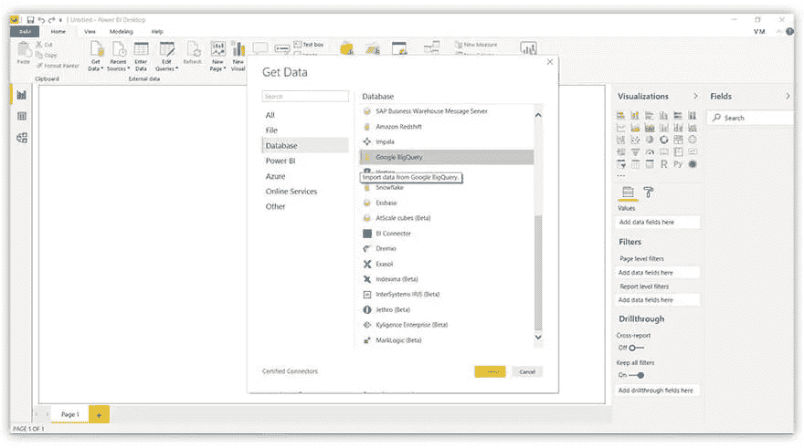

图片由作者提供

当使用连接器时，Power BI 将请求访问您的 Google BigQuery 帐户，经过身份验证后，用户就可以开始加载数据了。

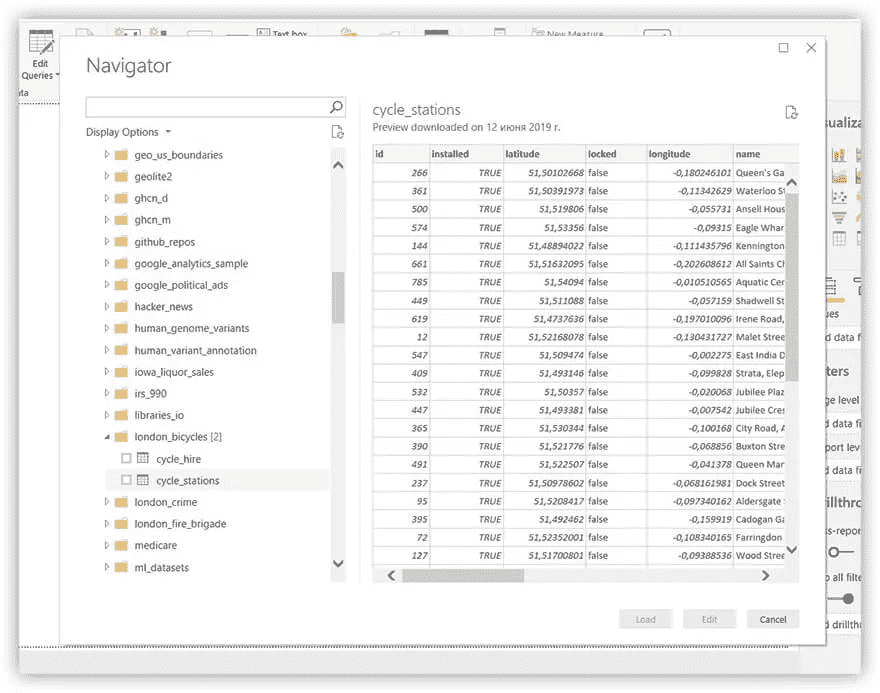

图片由作者提供

加载数据时，可以在两个连接参数之间进行选择:

1.  导入—传输数据的副本；导入 Power BI Desktop 将使用的所选表和列。
2.  DirectQuery —创建动态连接。不复制或导入数据；要求基本数据源。

使用 DirectQuery 的优势之一是能够处理最新数据，并且数据集没有 1 GB 的限制。

DirectQuery 的缺点:

*   在编辑器中请求过于复杂的查询时出现错误
*   所有表必须来自一个数据库
*   没有基于时间的操作逻辑(日期列的处理:日、月、年)

你可以在官方文档中找到更多关于如何使用 [DirectQuery](https://docs.microsoft.com/en-us/power-bi/desktop-use-directquery) 的细节。

加载数据后，我们可以进入报告编辑器。

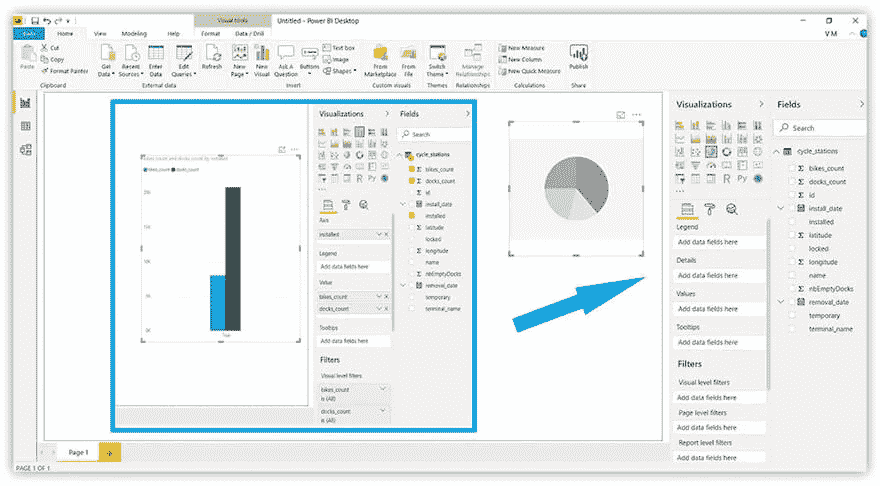

图片由作者提供

就像在 Google Data Studio 中一样，Power BI 中带有可视元素设置的菜单在右边。您可以从几种类型的可视化效果中进行选择:

*   简单图表
*   堆叠图表
*   聚类图表
*   地图、传感器和漏斗
*   表格和矩阵
*   r 脚本和 Python 脚本

您可以基于其构建可视化效果的字段列表也位于右侧。如果您不确定使用哪个图表，只需指定您想要在报告中显示的字段，Power BI 将为您选择合适的数据可视化形式。

注意:如果您添加了太多的值，服务将报告一个错误，并提供更正。

使用 Power BI，您可以直接在请求编辑器界面中准备数据(您可以使用 **Change Requests** 按钮访问该界面)。您可以对数据执行以下操作:

*   干净的
*   重新命名
*   删除
*   合并

在 Power BI 中有两种关联请求的方法:

1.  merge(association)-如果需要向表中添加一列或多列，此选项非常有用
2.  添加(adding)-如果需要将一行数据添加到表中，此选项非常有用

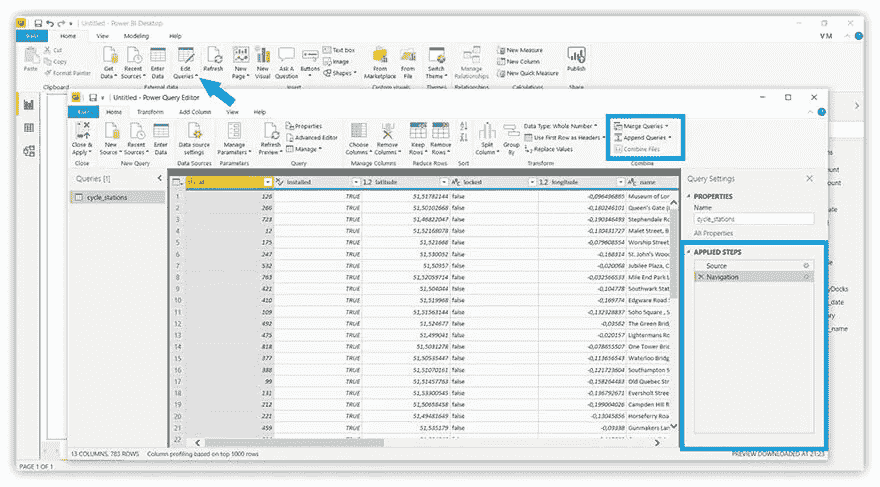

图片由作者提供

不幸的是，要共享您创建的报告，您不仅需要该产品的两个版本(正如我们提到的)，还需要一个名为 Power BI Pro 的付费服务包。

Power BI 的优势:

*   数据准备的广泛机会
*   应用的步骤允许您取消请求编辑器中的步骤
*   报告预览。可以看到移动设备的报告改编。

电源 BI 的缺点:

*   免费增值模式:仅在专业版中可以直接共享报告
*   从 GBQ 缓慢加载数据
*   不适用于 Linux 或 macOS

Power BI 与微软产品的完全集成可能是您选择该服务的决定性因素。但是，如果你不喜欢 Excel，你可以在操作的界面和执行上发现一些困难。此外，Power BI 在加载大量数据方面表现不佳。

# （舞台上由人扮的）静态画面

要开始处理 Tableau 中的数据，请从服务器菜单中选择 Google BigQuery 连接器。

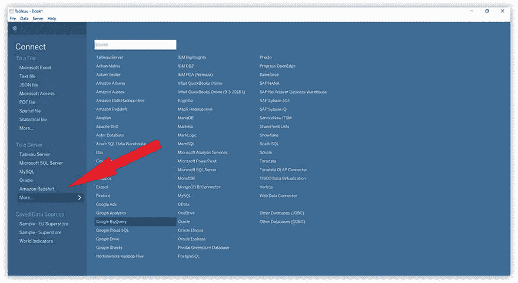

图片由作者提供

在打开的窗口中，选择项目、数据集和包含要在报告中可视化的数据的表格。

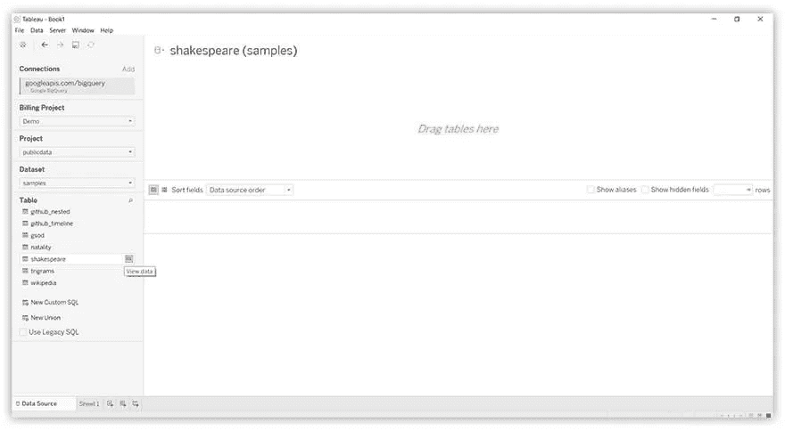

图片由作者提供

在下级菜单中，转到报告的第一页(表 1)。这将带您到报告编辑器。

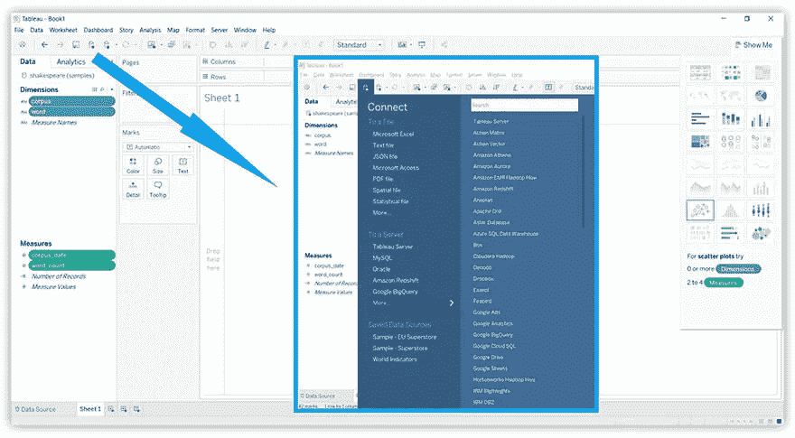

图片由作者提供

右侧菜单中可用的元素将取决于左侧所选参数和指标的数量。除了标准类型的可视化，您还可以找到:

*   树形地图
*   散点图和包装气泡图
*   甘特图表

注意:如果您将光标放在一个元素上，Tableau 将显示它需要哪些参数和度量。

该服务还允许从菜单向报告添加一个数据源。因此，将来自不同数据库的数据结合起来是可能的。

报告可以导出(作为 PowerPoint 或 PDF)并在 Tableau Online 或 Tableau Server 中共享。

Tableau 的优势:

*   直接从菜单访问视频记录和详细说明
*   合并数据源的能力
*   许多报告的机会:可以在报告页面的基础上创建仪表板。

Tableau 的缺点:

*   使用困难的数据模型时的常见问题

Tableau 因其简单的界面和活跃的用户社区而有别于其他服务。另一个好处是支持 R 语言；但是，在使用此服务之前，需要准备好数据。

# QlikView

与 Power BI 一样，在 QlikView 的云版本中，没有与 Google BigQuery 的直接连接器。
要将桌面版 QlikView 连接到 GBQ，您需要设置 [ODBC 连接器包](https://help.qlik.com/en-US/connectors/Subsystems/ODBC_connector_help/Content/Connectors_ODBC/Install-ODBC-connector.htm)。
注意:GBQ 的访问权限仅提供给拥有 QlikView 付费许可证的用户。

当您第一次开始使用报表时，您只能选择一种可视化类型:

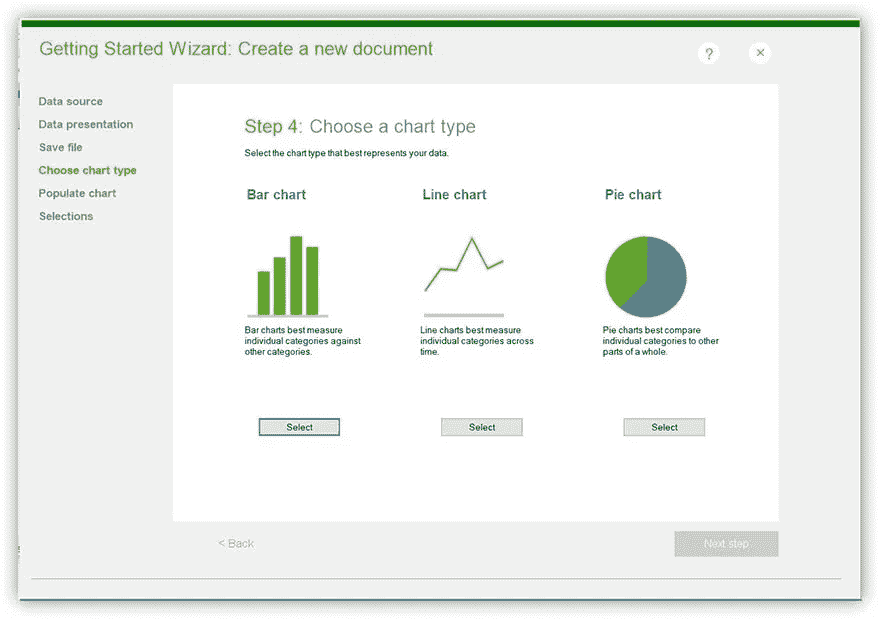

图片由作者提供

然后，您需要定义哪些字段将出现在这个图形或图表中。之后，可以添加第二个图形或图表，也可以继续报告。

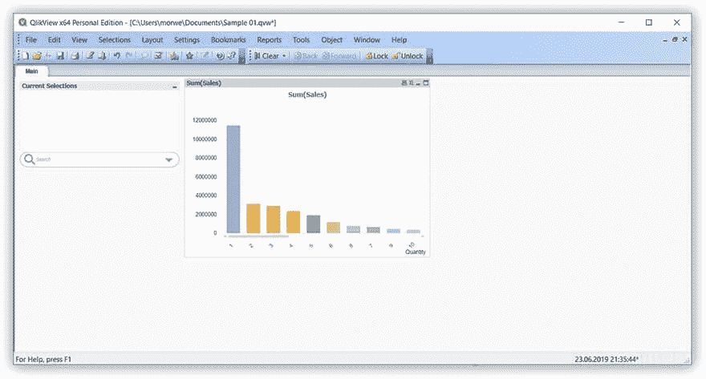

图片由作者提供

要获得更多可视化效果，您可以从“工具”菜单中选择:

*   快速图表向导
*   时间图向导
*   统计图表向导
*   方框图向导

创建的报告可以作为附件通过电子邮件发送，或者加载到 QlikView server 上的存储库中。只有经过身份验证的用户才能访问这些报告。

QlikView 的优势:

*   互动培训和视频记录
*   内置的 ETL 函数(提取、转换、加载)
*   快速数据加载和处理

QlikView 的缺点:

*   如果没有额外的连接器，无法从 GBQ 连接数据
*   可视化的最小项目数

QlikView 是一种企业工具，其制造商也提供 QlikView sense，这是为个人用户设计的。QlikView 凭借其快速的数据处理和协作开发的可能性脱颖而出。但要成功使用，用户要有技术培训。

# OWOX BI 智能数据

这个创建报表的工具是专门为不懂 SQL 的人开发的。智能数据处理来自 Google BigQuery 的数据；因此，可以在选择项目和数据集之后立即创建可视化。

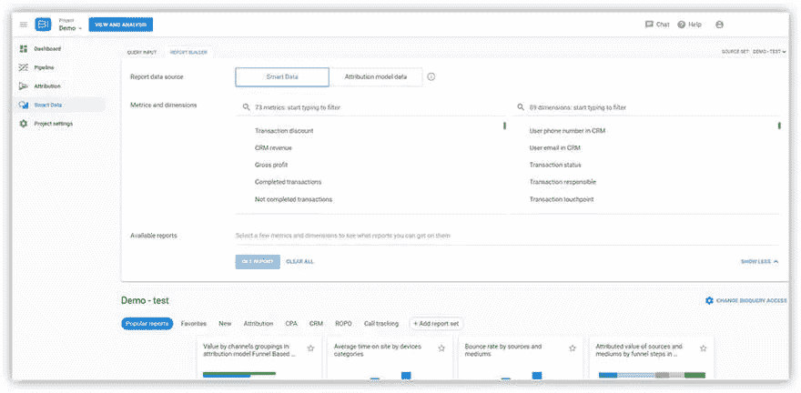

图片由作者提供

使用智能数据构建报表有三种方式:

*   从常用模板库中选择一种报告类型
*   在报表生成器中构建报表，选择参数和指标
*   在搜索栏中直接请求服务

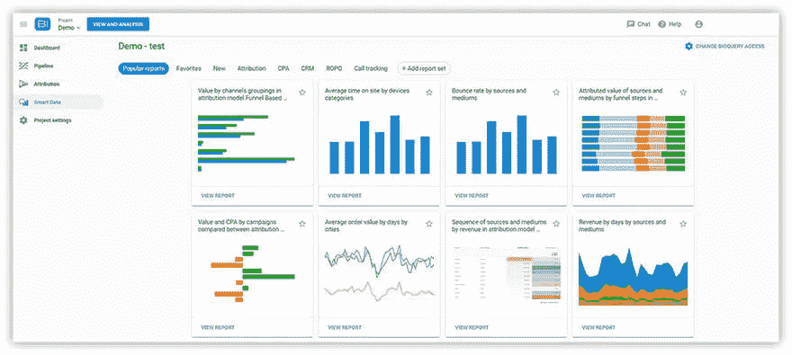

图片由作者提供

在模板库中，报告分为多个主题块。例如，关于归因的报告、关于 CRM 数据库的报告、关于 ROPO 效应的报告。

可以通过多种方式使用报告:

1.  导出到 Google 工作表
2.  另存为 CSV 文件
3.  将 SQL 请求复制到剪贴板

还提供了轻松导出到 Google Data Studio 的功能。为此，菜单中有一个单独的按钮。

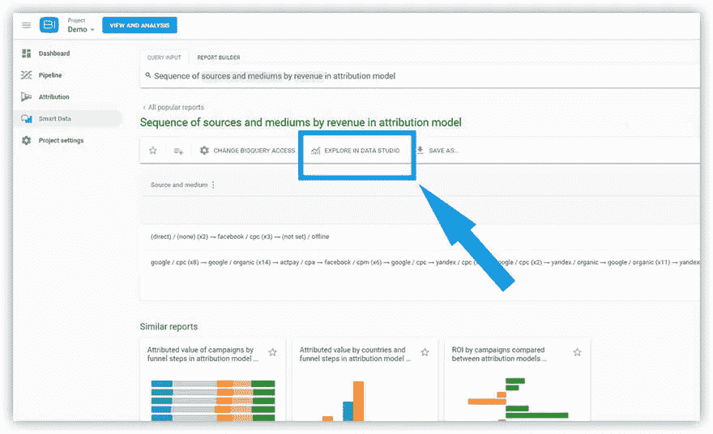

图片由作者提供

OWOX BI 智能数据的优势:

*   直接连接到 Google BigQuery 中的数据
*   符合 PCI DSS、ISO 27001 和 SOC 2.3 标准的高级数据保护
*   详细 [OWOX 帮助中心](https://support.owox.com/hc/en-us)

OWOX BI 智能数据的缺点:

*   用于创建报告的有限组合集
*   可视化的最小项目数

OWOX BI 的关键特性是为非技术专家构建的友好界面。构建报告不需要 SQL 知识。这个过程相当简单:输入一个请求，系统本身就会选择合适的报告。

# 关键要点

如何决定哪种可视化服务最适合您的报告？以下问题将帮助您选择最佳选项:

1.  你打算借助报告解决哪些问题？
2.  你的哪些员工会使用这项服务？
3.  您希望收到多复杂的报告和图表？
4.  你对可视化服务的技术要求是什么？