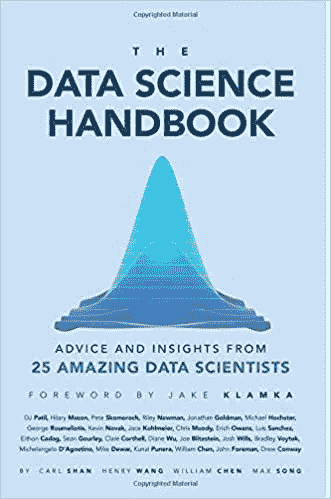
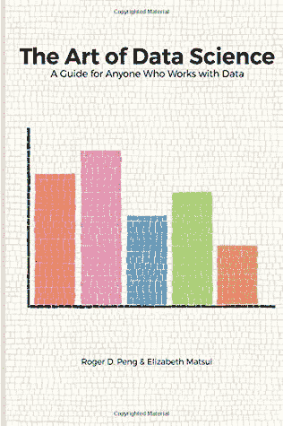
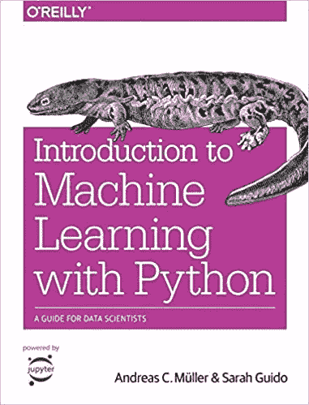
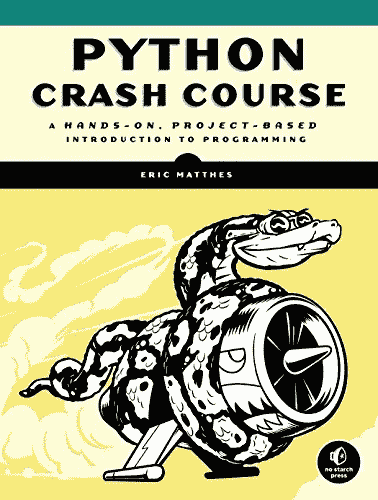
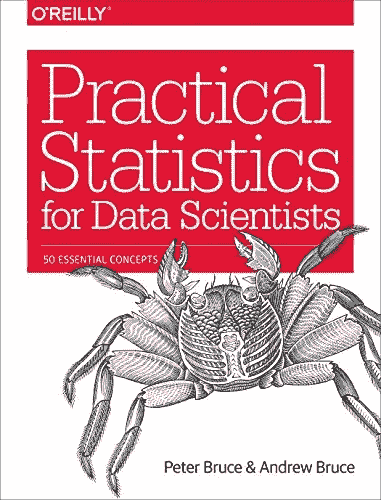
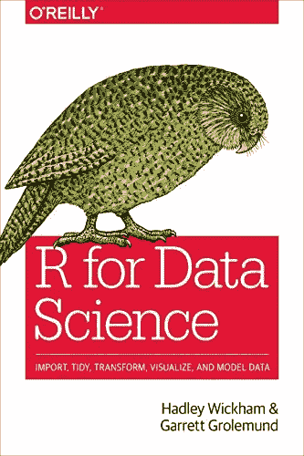

# 2020 年必读的 6 本数据科学书籍

> 原文：<https://towardsdatascience.com/top-6-data-science-books-that-you-must-study-in-2020-22aec57ea6a9?source=collection_archive---------8----------------------->

## 数据科学家需要书籍就像剑需要磨刀石一样！！

前几年，公众对数据科学的热情泛滥。曾经是一个真正深奥的领域，现在成了新闻、政府问题和国际法以及我们社交媒体的常见话题。

在每个行业中，数据熟练程度正在变成一项特别需要的技能，消费者不断地将数据点输入到巨大的商业智能框架中。

[一个正在选书的女孩——Unsplash Image](https://unsplash.com/photos/tzsUJD0TGkk)

无论您只是需要在数据热潮中继续接受教育，还是希望开始您的数据科学或数据熟练之旅，本文都包括一个书籍列表，可以帮助新手探索数据科学的世界。

## [因为你想成为一名数据科学家！](https://techvidvan.com/tutorials/what-is-data-science/)

虽然许多人希望开始学习数据科学，但认识到从哪里开始是一个挑战。现在，我将带您浏览一些有帮助的最佳数据科学书籍，您可以阅读这些书籍来掌握数据科学。

# **排名前六的数据科学书籍:**

## **1。**《数据科学手册:来自 25 位了不起的数据科学家的建议和见解》，作者:Carl Shan、William Chen、Henry Wang 和 Max Song:

通常，最理想的获取数据的方法是直接从该领域的个人那里获取，那么与 25 位企业顶级专家交谈的更好途径是什么呢？“**《数据科学手册**”采访了顶级驱动数据科学家，从美国前首席数据官到知名组织的团队领导，再到正在开发自己项目的新兴数据科学家，从而提供对该行业的独特视角。

面试的决定将引导新人通过业务，提供数据生活建议、学习错误、职业发展提示和在数据科学领域占上风的技术。这本书没有深入研究该主题的技术部分，也没有试图成为一个全面的指南。或者，它提供了大量实用的建议和知识。

## 2.**《数据科学的艺术》，作者 Roger D. Peng 和 Elizabeth Matsui :**

"**数据科学的艺术**"投身于在任何现成的数据湖中探索和发现的行为。它以分析数据和筛选数据来找出隐藏的故事为中心。作者利用他们自己的遭遇，通过分析数据科学来指导这两位初学者和管理者。

作者参与监督数据项目本身，就像在专家环境中管理分析师一样。他们讲述了自己的经验，即什么会可靠地产生成功的结果，什么陷阱会使数据项目注定失败。

## **3。Python 机器学习简介:数据科学家指南——作者 Andreas Muller :**

对于期待将 Python 真正应用于机器学习的 Python 初学者来说，这本书将会给他们所需要的一切。这本书的中心是向客户介绍 Python，以帮助他们构建自己的机器学习解决方案。

这本书将向您展示主流的机器学习算法，并将向您展示 scikit-learn 库的基础知识，该库在 Python 中非常有名。它不仅会教你 Python，还会教你机器学习的基础知识，目标是让你成为一名熟练的数据科学家。您将了解如何评估您的模型，并为您提供建议，让您成为一名数据科学家。

## **4。Python 速成班——作者 Eric Matthes :**

这本书是为完全的 Python 初学者准备的。虽然 Python 比较容易学，但是很难掌握。这本书是为那些需要快速学习 Python 以便进入数据科学的人准备的。

这本书分为两个部分:第一部分通过不同的概念向你展示 Python，比如条件、循环、字典、列表等等。第二部分围绕利用 Python 构建不同的项目。

[***关于 Python 编程你需要知道的一切！***](https://techvidvan.com/tutorials/python-tutorial/)

通过这本书，你不仅可以学习 Python，还可以了解如何用 Python 解决问题。同样，您还会发现在分析、可视化和 web 应用程序开发中使用的不同 Python 库。总的来说，这本书非常适合那些希望一次性学习 Python，并在真实环境中实现其知识的人。

## 5.数据科学家实用统计学—作者 Peter Bruce:

这本书是为没有受过适当统计培训的有抱负的数据科学家而写的。这本书消除了过量的统计数据，只给数据科学家重要的想法。

此外，这本书是为那些已经考虑了统计学的基本信息的个人。此外，这本书给出了利用 R 的统计实例。这将允许你练习必要的概念，提高你的 R 技能。这本书的结构是根据数据科学的实际应用。

## **6。数据科学的 r——Hadley Wickham 和 Garrett Grolemund :**

这本书利用 R 来展示数据科学。它指导您成为数据科学家所需的所有技能，如数据清理、可视化、辩论，并进一步向您介绍 RStudio。它让你熟悉 R 的重要包，比如在数据科学中有用的 tidy verse。

这本书是给读过过去的书《用 R 动手编程》的个人看的。这本书是专门为数据科学家在日常工作中必须完成的任务而设计的。

它将帮助你通过 R 的软件包利用智力资源来争论和设想数据。与《用 R 编程实践》一书非常相似，这本书可以在网上公开获得。

# **概要:**

虽然数据科学是一个非常广阔的领域。一个人必须认识到正确的资源，才能精通这个领域的广度和深度。虽然我们需要统计学作为解决数据科学问题的基本公式，但不同的编程语言和工具是基本的解决方案。

最后，我得出结论，要掌握数据科学，必须阅读上述书籍，以掌握统计学和编程。

## [探索你必须知道的 8 个惊人的数据科学工具！！](https://medium.com/@aakash.bachheriya123/8-amazing-data-science-tools-that-you-must-know-13dd42abd340)