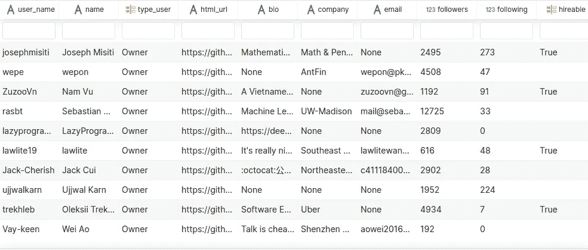
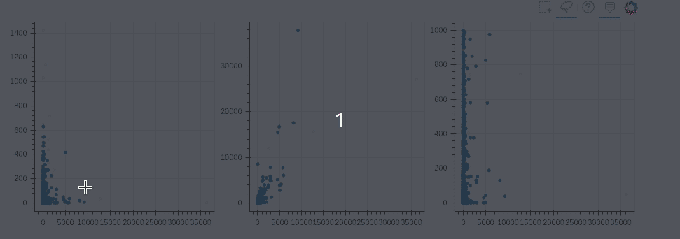

# 可视化的 6 大 Python 库:使用哪一个？

> 原文：<https://towardsdatascience.com/top-6-python-libraries-for-visualization-which-one-to-use-fe43381cd658?source=collection_archive---------2----------------------->

## 对使用哪种可视化工具感到困惑？我为你分析了每个图书馆的利弊


由 [Unsplash](https://unsplash.com?utm_source=medium&utm_medium=referral) 上的[奥克萨娜 v](https://unsplash.com/@arttravelling?utm_source=medium&utm_medium=referral) 拍摄的照片

> 本指南更新了一些更深入的示例。你可以在这里找到最新版本的博客。

# 动机

如果您从 Python 可视化开始，您可能会被大量的库和示例所淹没:

*   Matplotlib
*   海生的
*   Plotly
*   散景
*   阿尔泰尔
*   薄层

如果你有一个数据帧等待可视化，你应该选择哪一个？在特定情况下，有些库可能比其他库更好。本文将展示每种方法的优缺点。到本文结束时，您应该能够**区分每个库**的不同特性，并且能够更容易地**选择最佳库**。

为此，我们将使用一个样本数据集，并使用每个库来探索它，重点关注几个特定的属性:

**交互性**

你希望你的可视化是交互式的吗？

一些库，如 Matplotlib，将可视化呈现为图像；因此，它们有利于**解释**概念(在论文、幻灯片或演示中)。

另一方面，像 Altair、Bokeh 和 Plotly 这样的库允许你创建交互式图形，用户可以自己深入其中并进行探索

**语法和灵活性**

每个库的语法有何不同？像 Matplotlib 这样的低级库可以让你做任何你想做的事情——但是代价是更复杂的 API。一些库比如 Altair 是非常声明性的，这使得映射到你的数据更加容易。

**数据类型和可视化**

您是在使用一个专门的用例，比如一个有大量数据的地理图，还是使用一个只有某个库支持的图类型？

# 数据

为了便于比较，我将在本文中使用我从 Github 收集的真实数据:

[](/i-scraped-more-than-1k-top-machine-learning-github-profiles-and-this-is-what-i-found-1ab4fb0c0474) [## 我收集了超过 1k 的顶级机器学习 Github 配置文件，这就是我的发现

### 从 Github 上的顶级机器学习档案中获得见解

towardsdatascience.com](/i-scraped-more-than-1k-top-machine-learning-github-profiles-and-this-is-what-i-found-1ab4fb0c0474) 

我将使用 Datapane 嵌入来自每个库的可视化，data pane 是一个用于发布和共享 Python 报告的 Python 框架和 API。如果你想看到更多真实世界的例子，请查看[数据面板图库](https://datapane.com/gallery/)中用户贡献的报告。

要阅读本文，您可以从[这里](https://datapane.com/khuyentran1401/reports/github_data_dd10c22b/)下载 csv 文件，或者从 [Datapane Blob](/how-to-share-your-python-objects-across-different-environments-in-one-line-of-code-f30a25e5f50e) 获取直接数据。

```
import datapane as dpdp.Blob.get(name='github_data', owner='khuyentran1401').download_df()
```

如果你想使用 Blob，记得事先用你的令牌登录到 [Datapane](https://datapane.com/) 。这应该不到 1 分钟

# Matplotlib

Matplotlib 可能是最常见的可视化数据的 Python 库。每个对数据科学感兴趣的人可能都至少使用过一次 Matplotlib。

## 赞成的意见

1.  **便于查看数据的属性**

分析数据时，快速浏览一下分布可能是理想的。

例如，如果我想快速查看拥有最多追随者的前 100 名用户的分布，使用 Matplotlib 通常就足够了。

尽管 Matplotlib 的 x 轴看起来不太好，但通过查看图表，我们可以更好地了解数据的分布情况。

**2。可以策划任何事情**

Matplotlib 是非常通用的，这意味着它可以绘制任何类型的图形。Matplotlib 的[网站](https://matplotlib.org/tutorials/introductory/sample_plots.html)在[图库](https://matplotlib.org/gallery/index.html)中包含了非常全面的文档和各种图形，这让你很容易找到你能想到的任何疯狂情节的教程。

像这样的一些文字:

## 骗局

Matplotlib 可以绘制任何东西，但绘制非基本的图形或调整图形以使其看起来漂亮可能会很复杂。

即使该图足以可视化分布，但如果您想向他人展示您的数据，您将需要固定 x 轴、y 轴，这需要很大的努力。这是因为 Matplotlib 有一个极其**低级的接口**。

## 要点:Matplotlib 可以绘制任何东西，但是复杂的绘图可能比其他库需要更多的代码

# 海生的

[Seaborn](https://seaborn.pydata.org/) 是基于 Matplotlib 的 Python 数据可视化库。它在库上提供了一个更高级的包装器，这使得它更容易使用。

## 赞成的意见

1.  **少码**

为类似的情节提供了更高层次的接口。换句话说，seaborn 通常提供与 matplotlib 类似的绘图，但代码更少，设计更好。

我们使用与之前相同的数据来绘制类似的热图。

我们不用设置 x 和 y 标签就能得到更好的热图！

## 2.使常用地块更漂亮

许多人选择 seaborn 来绘制流行的图，如条形图、箱线图、计数图、直方图等，不仅因为它们可以用更少的代码创建，而且它们看起来更漂亮。正如我们在上面的例子中看到的，颜色看起来也比 Matplotlib 的默认颜色要好。

## 骗局

Seaborn 更受限制，没有 matplotlib 那样广泛的集合

**外卖:Seaborn 是 Matplotlib 的更高级版本。尽管它没有 Matplotlib 那样广泛的集合，但 seaborn 用更少的代码就使流行的图，如条形图、箱线图、热图等看起来很漂亮。**

# Plotly

[Plotly 的 Python](https://plotly.com/python/) 图形库使得创建交互式的、出版物质量的图形变得容易。它还可以创建类似 Matplotlib 和 seaborn 的图表，如折线图、散点图、面积图、条形图等。

## 赞成的意见

1.  **喜欢 R**

如果您是 R 中的 plots 的粉丝，并且在切换到 Python 时错过了它的特性，Plotly 使用 Python 为您提供了同样质量的 plots！

我最喜欢的是[**Plotly Express**](https://plotly.com/python/plotly-express/)，因为它让从一行 Python 代码创建伟大的情节变得非常容易，甚至更快。

## 2.轻松创建互动情节

Plotly 还可以轻松创建交互式剧情。互动图不仅漂亮，而且让观众更容易仔细观察每个数据点。

还记得我们之前用 matplotlib 做的柱状图吗？让我们看看 Plotly 的结果如何

用差不多相同的代码行，我们生成了一个交互图，我们可以将鼠标悬停在每个栏上，以查看该栏代表的用户和关注者数量。这意味着你的可视化的消费者可以自己探索它。

**3。复杂的情节变得简单**

使用 Plotly，一些通常很难创建的情节可以轻松创建。

例如，如果我们想要创建一个地图来可视化 Github 用户的位置，我们可以找到他们的纬度和经度，如这里的[所示](/i-scraped-more-than-1k-top-machine-learning-github-profiles-and-this-is-what-i-found-1ab4fb0c0474?source=your_stories_page---------------------------)，然后使用这些数据在地图上定位用户的位置，就像这样

只需几行代码，所有用户的位置就可以漂亮地呈现在地图上。泡泡的颜色代表叉子的数量，大小代表星星的总数

**要点:Plotly 非常适合用几行代码创建交互式和出版物质量的图形。**

# 阿尔泰尔

[Altair](https://altair-viz.github.io/) 是一个基于 vega-lite 的 Python 的声明式统计可视化库，这使得它非常适合需要大量统计转换的绘图。

## 赞成的意见

**1。简单的可视化语法**

用于创建可视化的语法很容易理解。它只需要提到数据列到编码通道之间的链接，其余的绘图是自动处理的。这听起来很抽象，但当你处理数据时，这是一件大事，它使信息可视化变得非常快速和直观。

例如，使用上面的泰坦尼克号数据，我们想计算每个班级的人数，我们只需要在 y 轴上使用`count()`

**2。易于转换数据**

Altair 还使得在创建图表时转换数据变得非常容易

例如，如果我们想找到泰坦尼克号中每种性别的平均年龄，而不是像 Plotly 那样提前进行转换，我们可以在代码中执行转换来创建图表。

这里的逻辑是用`transform_aggregate()`取每个性别(`groupby=[‘sex’]` )的年龄(`mean(age)`)的平均值，并将平均值保存到变量`mean_age)`。我们把这个变量作为 y 轴。

我们还可以使用`:N`确保该类是一个名义数据(没有任何顺序的分类数据),或者使用 `:Q`确保 mean_age 是一个定量数据(数值的度量，如数字)

查看数据转换的完整列表[这里](https://altair-viz.github.io/user_guide/transform/index.html)

**3。轻松链接情节**

Altair 还允许您在图之间进行一些令人印象深刻的链接，例如使用区间选择来过滤附加直方图的内容。

例如，如果我们想要可视化在我们选择年龄和费用之间的点图表的时间间隔内每个班级的人数，我们可以这样做。

当我们拖动鼠标选择散点图中的间隔时，我们可以在下面的条形图中看到变化。当与前面的变换和计算结合使用时，这意味着您可以创建一些非常交互式的绘图，进行即时计算——甚至不需要运行 Python 服务器！

## 骗局

除非指定自定义样式，否则条形图等简单图表看起来不会像 seaborn 或 Plotly 那样有样式。Altair 也不推荐超过 5000 个样本的数据集，而是建议您在可视化之前聚集数据。

**要点:Altair 是显示统计数据的复杂图表的理想选择。Altair 无法处理 5000 个样本以上的数据，一些简单的图表看起来不如 Plotly 或 Seaborn 的风格。**

# 散景

Bokeh 是一个灵活的交互式可视化库，面向 web 浏览器进行表示。

## 赞成的意见

1.  **Matplotlib 的交互版本**

如果我们在上面的交互式可视化库中排名，Bokeh 可能会在与 Matplotlib 的相似性方面排名第一。

Matplotlib 可以创建任何图，因为它是一个低级的可视化库。散景既可以作为高级界面，也可以作为低级界面；因此，它可以创建许多 Matplotlib 创建的复杂绘图，但代码行更少，分辨率更高。

比如 Matplotlib 的圆形图

也可以使用散景以更好的分辨率和更多的实用性创建

**2。图之间的链接**

散景也使情节之间的联系变得非常容易。在一个图中应用的改变将被应用到具有相似变量的另一个图中。

例如，如果我们并排创建 3 个图形，并希望观察它们的关系，我们可以使用链接刷



`ColumnDataSource`使数据在各图之间共享。因此，当我们将变化应用于一个图时，其他图也相应地变化。

## 骗局

因为 Bokeh 是一个具有中级接口的库，它通常比 Matplotlib 需要更少的代码，但需要更多的代码来产生与 Seaborn、Altair 或 Plotly 相同的绘图。

例如，要使用 titanic 数据创建相同的计数图，除了需要预先转换数据之外，如果我们希望图形看起来更好，我们还需要设置条形的宽度和颜色

如果我们不增加条形图的宽度，该图将如下所示

因此，我们需要手动调整尺寸，使情节更好

如果你想用更少的代码创建一个漂亮的条形图，这可能是与其他库相比散景的缺点

**导读:Bokeh 是唯一一个界面从低到高的库，可以轻松制作出既通用又优雅的图形。然而，这样做的代价是，散景通常需要更多的代码来创建与其他库质量相似的图。**

# 薄层

[leave](https://python-visualization.github.io/folium/)让数据在交互式传单地图上可视化变得容易。该库有许多来自 OpenStreetMap、Mapbox 和 Stamen 的内置 tilesets

## 赞成的意见

1.  **用标记轻松创建地图**

尽管 Plotly、Altair 和 Bokeh 也使我们能够创建地图，但 Folium 使用开放的街道地图，用最少的代码给你一种更接近谷歌地图的感觉

还记得我们如何使用 Plotly 创建地图来可视化 Github 用户的位置吗？我们可以用叶子让地图看起来更好

最初的位置在纽约布鲁克林。缩小以查看地图上的其他位置。通过几行代码，我们创建了一个显示用户位置的真实地图。

**2。添加潜在位置**

如果我们想添加其他用户的潜在位置，follow 允许用户添加标记，这很容易做到

在地图上单击以查看在您单击的地方生成的新位置。

**3。插件**

Folium 有很多插件可以用于你的地图——包括一个 Altair 插件。如果我们想看全球 Github 用户总星数的热图来识别哪里有总星数高的顶级 Github 用户数高怎么办？that 插件中的热图允许您这样做。

缩小以查看热图的完整图片。

**外卖:Folium 允许你用几行代码创建一个交互式地图。它给你一种接近谷歌地图的体验。**

# 结论

恭喜你！你刚刚学习了六种不同的可视化工具。我希望这篇文章能让你了解每个库做什么以及什么时候使用什么。掌握每个库的关键特性将使您在需要时更快地找到合适的库。

如果您仍然不知道使用哪个库来存储您的数据，请选择一个您认为足够好的库。如果代码太长或者图形没有你想象的那么好，就用另一个库试试吧！

在[这个 Github repo](https://github.com/khuyentran1401/Data-science/blob/master/visualization/top_visualization.ipynb) 中，您可以随意使用本文的代码。

我喜欢写一些基本的数据科学概念，并尝试不同的算法和数据科学工具。你可以在 LinkedIn 和 T2 Twitter 上与我联系。

星[这个回购](https://github.com/khuyentran1401/Data-science)如果你想检查我写的所有文章的代码。在 Medium 上关注我，了解我的最新数据科学文章，例如:

[](/how-to-create-interactive-and-elegant-plot-with-altair-8dd87a890f2a) [## 如何用 Altair 创建交互式剧情

### 在 5 行简单的 Python 代码中利用您的数据分析

towardsdatascience.com](/how-to-create-interactive-and-elegant-plot-with-altair-8dd87a890f2a) [](/i-scraped-more-than-1k-top-machine-learning-github-profiles-and-this-is-what-i-found-1ab4fb0c0474) [## 我收集了超过 1k 的顶级机器学习 Github 配置文件，这就是我的发现

### 从 Github 上的顶级机器学习档案中获得见解

towardsdatascience.com](/i-scraped-more-than-1k-top-machine-learning-github-profiles-and-this-is-what-i-found-1ab4fb0c0474) [](/how-to-leverage-visual-studio-code-for-your-data-science-projects-7078b70a72f0) [## 如何在数据科学项目中利用 Visual Studio 代码

### 直到发现一种新的有效方法，我们才意识到我们是多么低效

towardsdatascience.com](/how-to-leverage-visual-studio-code-for-your-data-science-projects-7078b70a72f0) [](/how-to-share-your-python-objects-across-different-environments-in-one-line-of-code-f30a25e5f50e) [## 如何在一行代码中跨不同环境共享 Python 对象

### 为建立与他人分享你的发现的环境而感到沮丧？以下是如何让它变得更简单

towardsdatascience.com](/how-to-share-your-python-objects-across-different-environments-in-one-line-of-code-f30a25e5f50e) [](/how-to-accelerate-your-data-science-career-by-putting-yourself-in-the-right-environment-8316f42a476c) [## 如何通过将自己置于合适的环境中来加速您的数据科学职业生涯

### 我感到增长数据科学技能停滞不前，直到我有了一个飞跃

towardsdatascience.com](/how-to-accelerate-your-data-science-career-by-putting-yourself-in-the-right-environment-8316f42a476c)