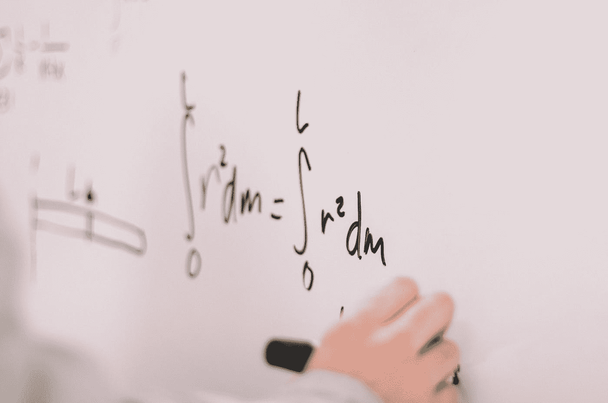

# 常春藤大学的 7 大免费人工智能课程

> 原文：<https://towardsdatascience.com/top-7-free-artificial-intelligence-courses-from-the-ivy-league-universities-7c951f787a55?source=collection_archive---------27----------------------->

## 顶级人工智能课程精选列表。向该领域最优秀的人学习——有选择地分配你的时间、精力和注意力。


德尔菲·德拉鲁阿在 [Unsplash](https://unsplash.com?utm_source=medium&utm_medium=referral) 上拍摄的照片

这些天，感觉每周都有新的人工智能课程。面对如此庞大的工作量，我们需要对我们的时间、精力和重点进行真正的选择。一个简单而有效的策略是参加该领域最优秀人才的课程。

> 有效地利用你的时间，参加该领域最优秀人才的课程。

在我的数据科学家同事的帮助下，我们整理了一份来自常春藤联盟大学的 7 门顶级人工智能课程的列表。该课程必须是免费的，才能被列入清单。

我没有参加清单上的所有课程，但我得到了同事们的高度赞扬。在我的课程清单上，下一个我希望参加的是强化学习课程。

# 常春藤联盟是什么？

常春藤联盟由八所私立大学组成:**哈佛、耶鲁、普林斯顿、布朗、达特茅斯、哥伦比亚、康奈尔和宾夕法尼亚大学。**

虽然斯坦福大学和麻省理工学院显然是名校，但它们不是常春藤联盟学校，因为它们不是常春藤联盟的成员。

**这里有几个你可能会感兴趣的链接:**

```
- [Labeling and Data Engineering for Conversational AI and Analytics](https://www.humanfirst.ai/)- [Data Science for Business Leaders](https://imp.i115008.net/c/2402645/880006/11298) [Course]- [Intro to Machine Learning with PyTorch](https://imp.i115008.net/c/2402645/788201/11298) [Course]- [Become a Growth Product Manager](https://imp.i115008.net/c/2402645/803127/11298) [Course]- [Deep Learning (Adaptive Computation and ML series)](https://amzn.to/3ncTG7D) [Ebook]- [Free skill tests for Data Scientists & Machine Learning Engineers](https://aigents.co/skills)
```

*上面的一些链接是附属链接，如果你通过它们购买，我会赚取佣金。请记住，我链接课程是因为它们的质量，而不是因为我从你的购买中获得的佣金。*

**如果你错过了我关于这个主题的另外两篇文章:**

[](/7-free-ebooks-every-data-scientist-should-read-in-2020-32508ad704b7) [## 2020 年每个数据科学家都应该阅读的 7 本免费电子书

### 学习一项新技能不一定要很贵。2020 年你只需要时间和付出就能学会一项新技能。

towardsdatascience.com](/7-free-ebooks-every-data-scientist-should-read-in-2020-32508ad704b7) [](/7-free-programming-books-every-data-scientist-should-read-in-2020-608c00d7cf3c) [## 2020 年每个数据科学家都应该阅读的 7 本免费编程书籍

### 这些书将向你展示如何培养许多数据科学家缺乏的技能。都是免费的！

towardsdatascience.com](/7-free-programming-books-every-data-scientist-should-read-in-2020-608c00d7cf3c) 

# 1.强化学习

大学:佐治亚理工学院
导师:查尔斯·伊斯贝尔教授


蒂姆·莫斯霍尔德在 [Unsplash](https://unsplash.com?utm_source=medium&utm_medium=referral) 上拍摄的照片

[](https://www.udacity.com/course/reinforcement-learning--ud600) [## 强化学习| Udacity 免费课程

### 免费课程由佐治亚理工学院提供，编号为 CS 8803。关于本课程的免费课程，如果你需要，你应该选修本课程

www.udacity.com](https://www.udacity.com/course/reinforcement-learning--ud600) 

强化学习是机器学习中最热门的话题之一。如果你想从理论的角度学习这门课程，你应该选这门课。

在本课程中，你将从计算机科学的角度，通过结合经典论文和最近的工作来探索自动化决策。你将研究有效的算法，如果它们存在的话，用于单代理和多代理计划，以及从经验中学习接近最优决策的方法。在课程结束时，你将复制一篇发表在《强化学习》上的论文的结果。

# 2.计算机视觉

大学:麻省理工学院导师:贝特霍尔德·霍恩教授


由[列宁·艾斯特拉达](https://unsplash.com/@lenin33?utm_source=medium&utm_medium=referral)在 [Unsplash](https://unsplash.com?utm_source=medium&utm_medium=referral) 拍摄的照片

[](https://ocw.mit.edu/courses/electrical-engineering-and-computer-science/6-801-machine-vision-fall-2004/) [## 计算机视觉

### 机器视觉对生成环境的符号描述的过程提供了深入的介绍…

ocw.mit.edu](https://ocw.mit.edu/courses/electrical-engineering-and-computer-science/6-801-machine-vision-fall-2004/) 

这门麻省理工学院的课程提供了从图像生成环境符号描述的过程的深入介绍。

在讲座中，你将学习图像形成的物理学，运动视觉，以及从阴影中恢复形状。二值图像处理和滤波作为预处理步骤提出。

进一步的主题包括摄影测量，物体表示对齐，模拟超大规模集成电路和计算视觉。讨论了机器人和智能机器交互的应用。

# 3.机器学习的数学

大学:麻省理工学院
导师:菲利普·里戈莱特教授


照片由[this engineering RAEng](https://unsplash.com/@thisisengineering?utm_source=medium&utm_medium=referral)在 [Unsplash](https://unsplash.com?utm_source=medium&utm_medium=referral)

[](https://ocw.mit.edu/courses/mathematics/18-657-mathematics-of-machine-learning-fall-2015/) [## 机器学习的数学

### 广义而言，机器学习是指自动识别数据中的模式。因此，这是一个…

ocw.mit.edu](https://ocw.mit.edu/courses/mathematics/18-657-mathematics-of-machine-learning-fall-2015/) 

广义而言，机器学习是指自动识别数据中的模式。因此，它是新的统计和算法发展的沃土。

本课程的目的是为这些发展提供一个数学上严谨的介绍，重点是方法及其分析。


机器学习数学中涵盖的主题

# 4.数据科学:概率

大学:哈佛大学导师:拉斐尔·伊里扎里教授



杰斯温·托马斯在 [Unsplash](https://unsplash.com?utm_source=medium&utm_medium=referral) 上的照片

[](https://www.edx.org/course/data-science-probability) [## 数据科学:概率

### 在这门课程中，我们的数据科学专业证书课程的一部分，你将学到有价值的概念…

www.edx.org](https://www.edx.org/course/data-science-probability) 

在这门课程中，你将学到概率论中有价值的概念。这门课程的动机是围绕 2007-2008 年金融危机的环境。

导致这场金融危机的部分原因是金融机构出售的一些证券的风险被低估了。为了开始理解这个非常复杂的事件，我们需要理解概率的基础。

本课程将介绍一些重要的概念，如随机变量、独立性、蒙特卡罗模拟、期望值、标准误差和中心极限定理。这些统计概念是对数据进行统计测试和理解您正在分析的数据是否可能由于实验方法或偶然事件而出现的基础。

概率论是统计推断的数学基础，统计推断对于分析受偶然性影响的数据是必不可少的，因此对于数据科学家来说是必不可少的。

# 5.人工智能

大学:ColumbiaX
导师:Ansaf Salleb-Aouissi 博士


[亚历山大·奈特](https://unsplash.com/@agkdesign?utm_source=medium&utm_medium=referral)在 [Unsplash](https://unsplash.com?utm_source=medium&utm_medium=referral) 上拍照

[](https://www.edx.org/course/artificial-intelligence-ai) [## 人工智能

### 自动驾驶汽车、人脸识别、网络搜索、工业机器人、导弹制导、肿瘤检测有什么…

www.edx.org](https://www.edx.org/course/artificial-intelligence-ai) 

自动驾驶汽车、人脸识别、网页搜索、工业机器人、导弹制导、肿瘤检测有什么共同点？

它们都是复杂的现实世界问题，正在通过智能(AI)的应用来解决。

本课程将提供对构建智能计算机系统的基本技术的广泛理解，以及对人工智能如何应用于问题的理解。

你将学习人工智能的历史、智能代理、状态空间问题表示、无信息和启发式搜索、玩游戏、逻辑代理和约束满足问题。

您将通过构建一个基本的搜索代理获得实践经验。对抗性搜索将通过创建一个游戏来探索，机器学习的介绍包括线性回归的工作。

# 6.机器学习

大学:哥伦比亚
导师:约翰·w·佩斯利博士


照片由 [Unsplash](https://unsplash.com?utm_source=medium&utm_medium=referral) 上的 [h heyerlein](https://unsplash.com/@heyerlein?utm_source=medium&utm_medium=referral) 拍摄

[](https://www.edx.org/course/machine-learning) [## 机器学习

### 机器学习是当今数据分析领域最激动人心的职业的基础。你会学到模型和方法…

www.edx.org](https://www.edx.org/course/machine-learning) 

机器学习是当今数据分析领域最激动人心的职业的基础。您将学习模型和方法，并将它们应用到现实世界中，从识别趋势新闻话题到构建推荐引擎、给运动队排名和绘制电影僵尸的路径。

涵盖的主要观点包括:

*   概率与非概率建模
*   监督与非监督学习

主题包括分类和回归、聚类方法、序列模型、矩阵分解、主题建模和模型选择。

方法包括线性和逻辑回归、支持向量机、树分类器、boosting、最大似然和 MAP 推断、EM 算法、隐马尔可夫模型、卡尔曼滤波器、k 均值、高斯混合模型等。

# 7.算法，1

大学:普林斯顿
导师:凯文·韦恩，博士


照片由[克里斯里德](https://unsplash.com/@cdr6934?utm_source=medium&utm_medium=referral)在 [Unsplash](https://unsplash.com?utm_source=medium&utm_medium=referral) 上拍摄

[](https://www.coursera.org/learn/algorithms-part1) [## 算法，第一部分

### 由普林斯顿大学提供。本课程涵盖了每个认真的程序员需要的基本信息…

www.coursera.org](https://www.coursera.org/learn/algorithms-part1) 

如果你想提高你的编程技能，这个课程是为你准备的。虽然它与机器学习没有严格的联系，但是你将会建立强大的计算机科学基础。

本课程涵盖了每个严肃的程序员需要了解的关于算法和数据结构的基本信息，重点是 Java 实现的应用和科学性能分析。

第一部分介绍了基本的数据结构、排序和搜索算法。第二部分着重于图形和字符串处理算法。

# 很少值得一提

## 机器学习教程 a

大学:斯坦福大学
导师:吴恩达教授

[](https://www.coursera.org/learn/machine-learning) [## 机器学习

### 机器学习是让计算机在没有明确编程的情况下行动的科学。在过去的十年里…

www.coursera.org](https://www.coursera.org/learn/machine-learning) 

吴恩达的 Coursera 课程是我最喜欢的机器学习课程。这是我在这个领域的第一门课。通过听本课程，您将为机器学习打下坚实的基础

本课程提供了机器学习、数据挖掘和统计模式识别的广泛介绍。该课程还将借鉴大量的案例研究和应用，以便您也可以学习如何将学习算法应用于构建智能机器人、文本理解、计算机视觉和其他领域。

## **扑克理论和实践简介**

大学: **J** ohns Hopkins
导师:阿维·鲁宾教授


迪伦·克利夫顿在 [Unsplash](https://unsplash.com?utm_source=medium&utm_medium=referral) 上的照片

[](https://hopkinspokercourse.com/) [## 约翰·霍普金斯扑克课程

### 这个课程旨在让学生从对扑克一无所知的新手到高于平均水平的玩家…

hopkinspokercourse.com](https://hopkinspokercourse.com/) 

约翰霍普金斯大学的扑克课程与机器学习并没有太大的关系，但在处理统计数据时还是有点关系的。这是一种学习数学和组合学的有趣方式。

这个间歇期课程的目的是在两周内让学生从可能对扑克一无所知的新手到高于平均水平的玩家。本课程将利用手的例子和常见扑克情况的讨论来研究游戏的基本原理。

# 在你走之前

在 [Twitter](https://twitter.com/romanorac) 上关注我，在那里我定期[发布关于数据科学和机器学习的](https://twitter.com/romanorac/status/1328952374447267843)消息。


照片由[Courtney hedge](https://unsplash.com/@cmhedger?utm_source=medium&utm_medium=referral)在 [Unsplash](https://unsplash.com/?utm_source=medium&utm_medium=referral) 拍摄