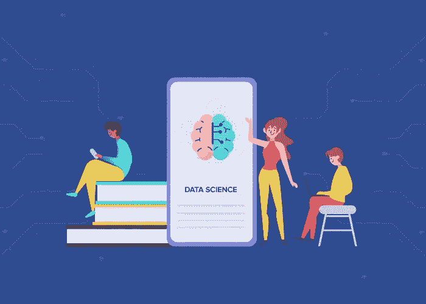
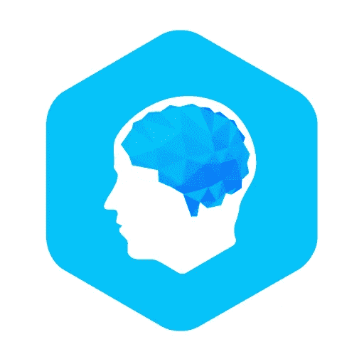
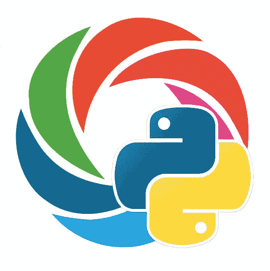
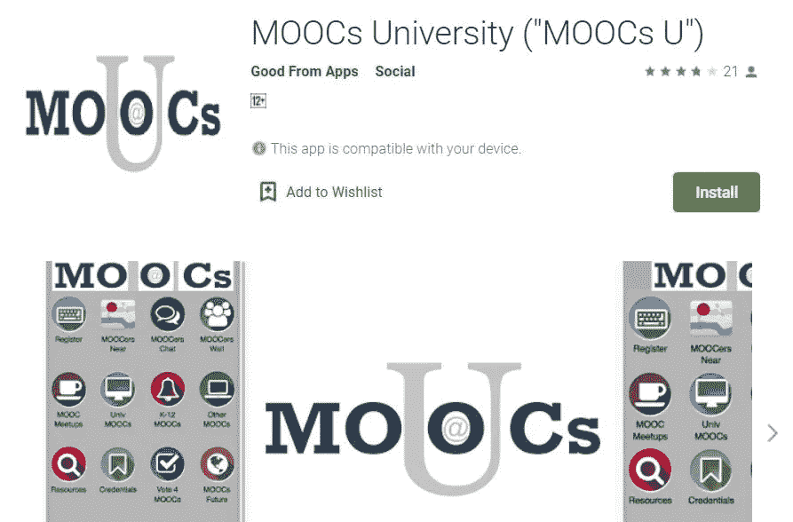
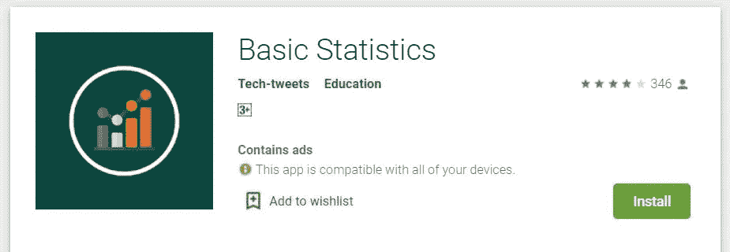
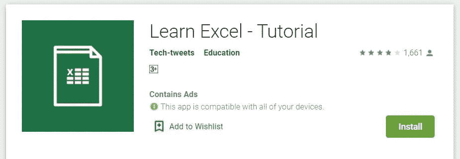

# 学习和实践数据科学的 7 大移动应用

> 原文：<https://towardsdatascience.com/top-7-mobile-apps-for-learning-and-practicing-data-science-46db26e862c6?source=collection_archive---------20----------------------->

移动应用已经成为人类生活不可或缺的一部分。大多数人只是将时间浪费在使用消息应用程序或听音乐上，但他们不知道他们可以通过使用这些应用程序来利用时间，这些应用程序可以学习和实践最新的技术和新的编码语言，从长远来看，这些技术和语言可以使人们受益。

数据科学被认为是最关键、最具趋势和高收入的行业。这是一个使用算法从收集的大量数据中提取见解的行业垂直领域。有许多应用程序可以让您在移动设备上运行 Python 脚本。虽然大部分移动应用程序可供 Android 用户使用，但只有 iOS 用户可以从一些提供免费在线教程的平台上学习。

移动应用改变了学习方式。这些应用为教育和学习领域增添了全新的体验。在开发用于实践数据科学的应用程序之前，企业应检查开发人员的技能组合，并应[雇用最好的移动应用程序开发人员](https://www.appdexa.com/blog/essential-tips-to-hire-best-mobile-app-developer/)，他们了解什么是数据科学，并拥有移动应用程序开发方面的专业知识。

[提升 ](https://www.elevateapp.com/)

举起

一个个性化的大脑训练应用程序，以提高人的智力。这个应用程序可以让你树立信心，提高工作效率。该应用程序为用户设计了个性化的练习——每天 3 次练习，根据你在这三次练习中的表现，你将在第二天被分配一次新的练习。通常，它会根据你的薄弱环节分配练习来帮助你提高。这个应用程序分析你的表现，并会帮助你提升你的表现。

[**Qpython**](https://www.qpython.com/)

量子 python

[Qpython 应用可以让你在手机上运行编程语言](http://edu.qpython.org/qpython-webapp/index.html?form=web)。你可以随时随地使用它，并开始编码。该应用程序是强烈建议初学者尝试编码和实验来学习。该应用程序仅适用于 android 设备。开发者也可以使用这款应用开发 android 应用。它是数据分析师和数据科学家最喜欢的语言。

**学习 Python**

学习 Python

该应用程序仅适用于 android 用户。如果有人[想提高自己的技能](https://www.kdnuggets.com/2020/01/10-python-tips-tricks-learn-today.html)或者从头开始学习，这是最好的平台。该应用程序提供实践课程和有相同兴趣的人的社区。它提供了不同的测验和练习，用户还可以与其他社区成员进行竞赛并从中学习。

[**MOOC 应用**](https://www.my-mooc.com/en/)

MOOCs

数据科学家总是需要让他们了解所在领域的最新趋势和技术。通过 MOOC 应用程序，用户可以访问课程材料，并从该领域最好的教师那里获得指导。人们可以随时随地使用该应用程序。
这些类型的平台使初学者能够轻松了解数据科学领域的新技术和最新进展。

[**Coursera**](https://play.google.com/store/apps/details?id=org.coursera.android&hl=en_IN)

Coursera

这是一个平台，提供对世界各地许多大学和学院开发的成千上万的课程材料和不同课程的访问。只需下载应用程序，进入一个新的学习世界。

[**基本统计**](https://play.google.com/store/apps/details?id=com.techtweets.basicstatistics&hl=en_IN)

基本统计

这方面的初学者可以使用这个应用程序来掌握统计部分。通常情况下，开发人员停留在编程和开发部分，没有足够的时间研究基本的统计数据。这个应用程序将帮助您修改统计的概念，如频率分布，图形，图表和假设。统计是任何数据科学项目的基础，因此下载应用程序，并使用 play store 上的基本统计应用程序来改进您的统计。

[**Excel 教程**](https://play.google.com/store/apps/details?id=com.techtweets.exceltutorial&hl=en)

Excel 教程

现在，您可以学习如何在移动设备上脱颖而出。该应用程序仅适用于 android 用户。该应用程序有初学者到高级用户的视频教程。该应用程序将涵盖每个主题，向您介绍 MS-Excel 的工作原理以及如何将其用于数据科学和数据分析。该应用程序将帮助您掌握 MS-Excel，您将了解一些最先进的功能，如宏、数据透视表。

**结论**

教育和学习领域的技术进步使得用户可以很容易地了解任何领域的最新发展。你不需要每时每刻都带着你的笔记本电脑，现在所有的东西都可以通过手机获得。

随着移动应用程序开发行业的发展，您将会看到更多的应用程序，[将会增强用户体验](https://www.mobileappdaily.com/how-can-data-science-improve-ux-design)，并将为现场教育和电子学习提供一个全新的维度。数据科学最好的一点是，我们只是触及了表面，这个行业还有很多值得探索的地方！