# 学习 Python 最好的 7 个 Github 库

> 原文：<https://towardsdatascience.com/top-7-repositories-on-github-to-learn-python-44a3a7accb44?source=collection_archive---------6----------------------->

## 编程；编排

## 流行的存储库，要么学习基础知识，要么掌握 Python


艺术由[西斯卡德尔斯](https://www.instagram.com/siscadraws/)

条条大路通 GitHub。

你可能还记得我发表的一篇类似的文章，名为“GitHub 上学习熊猫的四大知识库[”。在那里，我说我害怕使用任何超过`git commit` + `git push`的东西，因为 GitHub 很吓人。我已经取得了一点进步:现在我记得每次有新工作时点击`git pull`(而不是当我试图推动我的编辑并意识到我的本地存储库没有与主分支保持同步时在内部尖叫)。](/top-4-repositories-on-github-to-learn-pandas-1008cb769f77?source=friends_link&sk=d3acc38062490a86ecb46875342224e6)

这次我决定为 Python 编一个类似的学习资源列表！其中一些包含教程风格的 Jupyter 笔记本，而另一些则以广泛收集编程问题为特色。所有这些都有可能有用，这取决于你喜欢的学习方式。

如果您以前从未使用过 Python，那么您可能会从为完全初学者准备的资源库中受益。如果你已经对 Python 很熟悉了，并且想重温某个特定的主题，比如说算法，这里也有一个专门为你准备的资源库！

# 学习-python3 —初级到中级(1.8k 星)

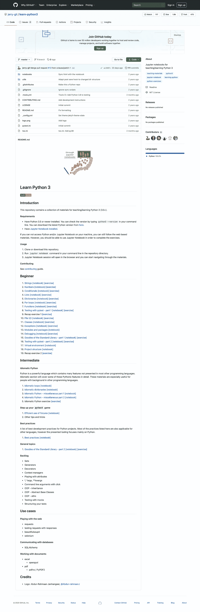

[Jerry-git](https://github.com/jerry-git/learn-python3)在 GitHub 上学习 python-3

在初学者部分，这个资源库将带您浏览 19 个 Jupyter 笔记本。它涵盖了基础级别的内容，如字符串和条件，然后通过讨论类(面向对象编程的快速入门)、异常(它们是什么以及如何处理它们)以及 Python 标准库中包含的一些特性(日期时间、正则表达式等等)进行了更深入的讨论。

每个主题都有一个“笔记本”链接，它将带您进入主题介绍和一些示例代码。在你完成这些之后，有一个“练习”链接，它会带你到一个笔记本，里面有你可以填写和测试的问题样本。

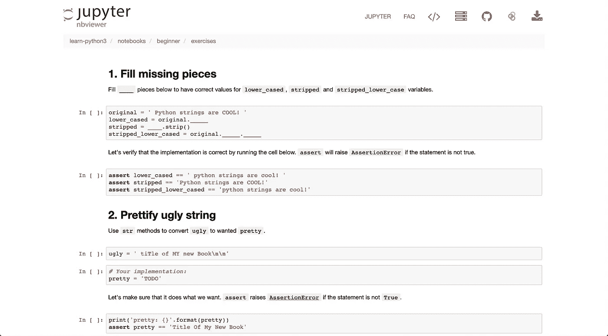

来自 [jerry-git](https://github.com/jerry-git) 的[练习笔记本](https://nbviewer.jupyter.org/github/jerry-git/learn-python3/blob/master/notebooks/beginner/exercises/strings_exercise.ipynb)样本

然后，有一个中间的“惯用”部分。本节描述“Python 特性”，这是 Python 中的特性，在许多其他编程语言中没有。如果您已经熟悉了一种不同的语言，那么您可能希望查看本节，了解专门使用 Python 的技巧和诀窍。例如，有一节介绍了如何以不同于其他语言的方式处理 Python 中的循环。

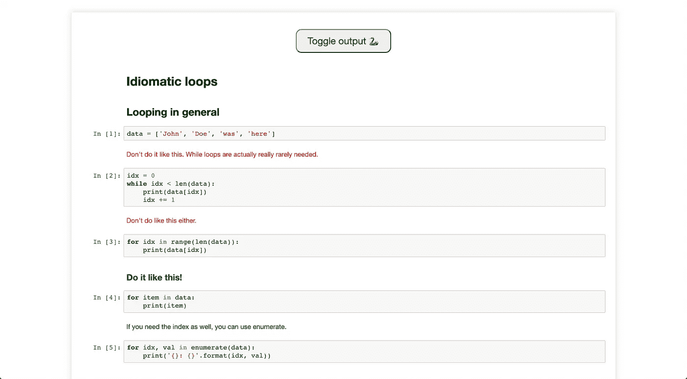

样品[惯用笔记本](https://jerry-git.github.io/learn-python3/notebooks/intermediate/html/idiomatic_loops.html)来自[偷工减料](https://github.com/jerry-git)

这个存储库还有一个到方便的“最佳实践”笔记本的链接，您可以使用它来了解在创建 Python 项目时应该实现哪些实践。它涵盖了用`pipenv`建立一个虚拟环境和使用`pytest`进行(你猜对了)测试。

# 学习-python —初级到中级(3.9k 星级)

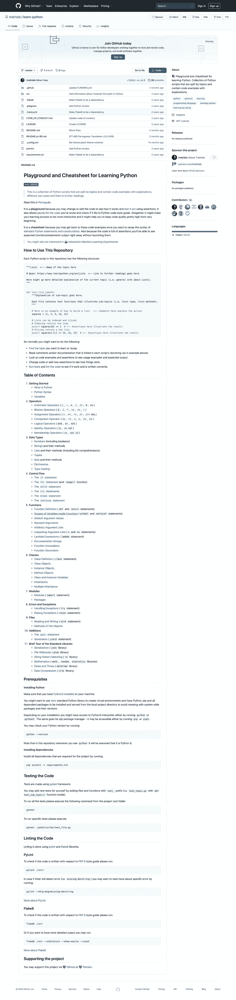

[通过](https://github.com/trekhleb/learn-python) [trekhleb](https://github.com/trekhleb) 在 GitHub 上学习 python

这个库也是 Python 的入门，可以带你从初学者到中级(我说的中级是指除了简单的循环和算术之外的语言的使用)。存储库不是使用笔记本，而是 Python 脚本的集合，每个脚本都是核心类别的子主题，如“操作符”、“数据类型”和“控制流”。

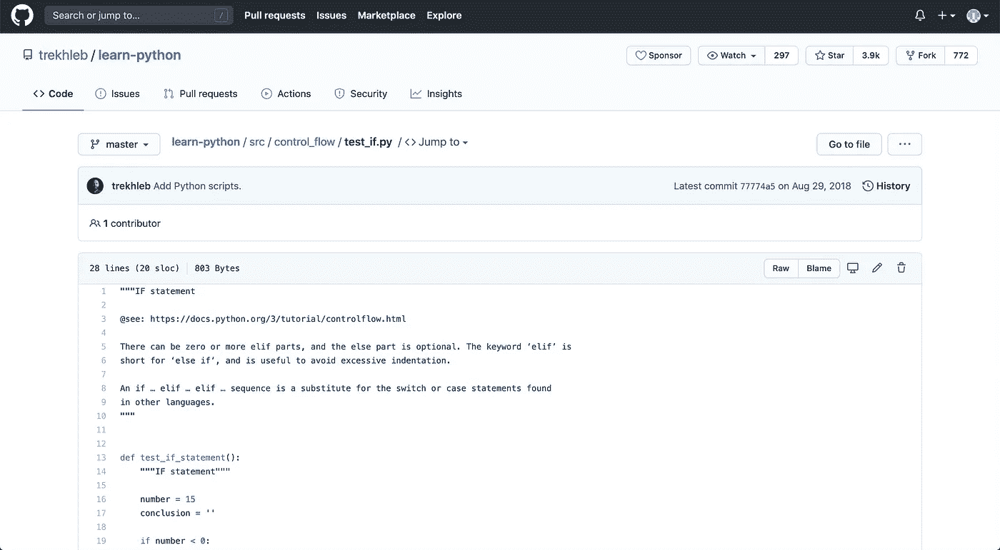

[样本子主题 Python 文件](https://github.com/trekhleb/learn-python/blob/master/src/control_flow/test_if.py)作者 [trekhleb](https://github.com/trekhleb)

每个 Python 文件都展示了相关的子主题以及一个有用的链接，您可以访问该链接以获取更多信息。如果您不清楚代码是做什么的，并且需要快速回顾一些理论，这可能会很有帮助。

使用 Python 文件时，存储库中包含的两个重要功能是测试和样式检查。您可以在“如何使用这个存储库”下看到完整的细节，但是为了测试，作者在主函数的底部添加了带有`assert`的行，以查看该函数是否按照预期执行。如果您想对代码进行更改并查看它是否仍然正常工作，这可能会很有用。这里有关于如何使用`pytest`运行测试的说明。此外，为了养成遵循 Python 的主要风格指南(PEP 8)的习惯，还有进一步的说明让你在代码上运行`pylint`，看看 Python 文件是否符合风格指南。

你不必完整地学习这门课程，因为作者指出，你也可以把知识库当作备忘单来使用。您可以简单地找到您正在寻找的部分，查看文档，摆弄代码，然后运行测试并嵌入代码，看看它是否工作正常，是否如预期那样编写。

# 全速 python —初级到中级(2.6k 星级)

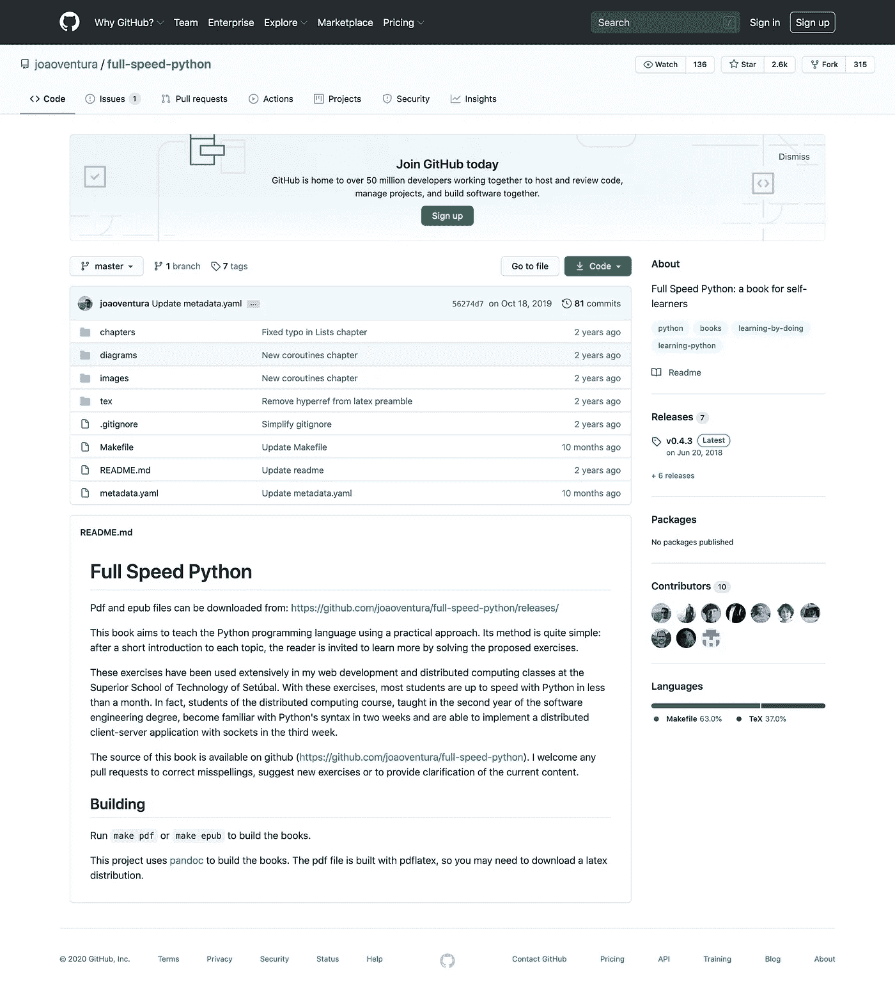

[全速巨蟒](https://github.com/joaoventura/full-speed-python)上 GitHub 由[jooventura](https://github.com/joaoventura)

这个资源库的特色是有一本书，它快速浏览字符串和列表的基础知识，然后快速深入到相对更高级的主题，如“类”、“协同程序”和“异步编程”。作者写这本书时考虑到了实用的方法，用代码示例简要介绍了每个主题，然后直接跳到读者可以自己尝试的实践问题。

您可以从链接 Readme 下载 pdf/epub 文件，也可以克隆存储库并自己构建。

[作者](https://github.com/joaoventura)写道“获得软件工程学位的分布式计算学生在两周内熟悉了 Python，并能在第三周实现带有套接字的分布式客户机-服务器应用程序”。如果你已经有了一些使用另一种语言的软件工程经验，或者如果这不是你的第一种编程语言，使用这本书可以帮助你快速掌握 Python。

# python _ reference 中级(2.3k 星)

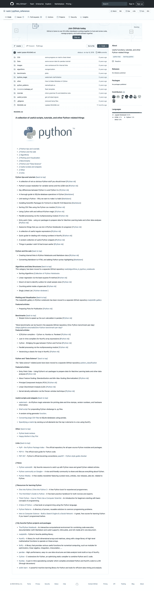

[rasbt](https://github.com/rasbt) 在 GitHub 上 [python_reference](https://github.com/rasbt/python_reference)

这个存储库不像以前的存储库那样是包含概念组的教程式资源。相反，这个存储库更多的是关于中级主题的不同笔记本的集合，比如“Python 中的 SQLite 数据库操作”和“通过多处理模块的并行处理”。如果您已经有了坚实的 Python 基础，这个资源可能会有助于您真正利用该语言的不同特性。与以前的存储库一样，这个存储库也包括笔记本，其中包含您可以编辑和运行的代码。

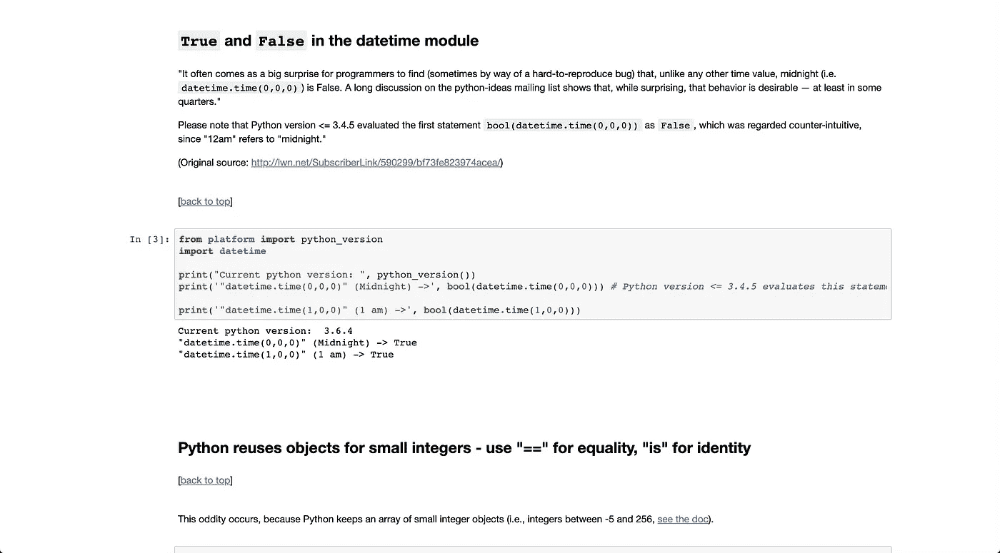

[样本提示笔记本](https://nbviewer.jupyter.org/github/rasbt/python_reference/blob/master/tutorials/not_so_obvious_python_stuff.ipynb?create=1)作者 [rasbt](https://github.com/rasbt)

名副其实的“不那么明显的 Python 素材”笔记本(上面的片段)给出了各种 Python 和 Python 模块特性的概要，这些特性在学习绝对基础知识时可能没有学到。你永远不知道那个随机的提示什么时候会对你未来的工作有所帮助。虽然当您刚开始使用 Python 时，加深理解是很好的，但是一旦您已经学习了足够的基础知识，它可以帮助您浏览一系列不相关的技巧，例如拓宽和填补您的知识空白。

还有一些有用的非代码资源，作者链接到了这些资源，它们更像是“理论资源”。例如，作者创建了一个名为“Python 中的单元测试——为什么我们要让它成为一种习惯”的项目。

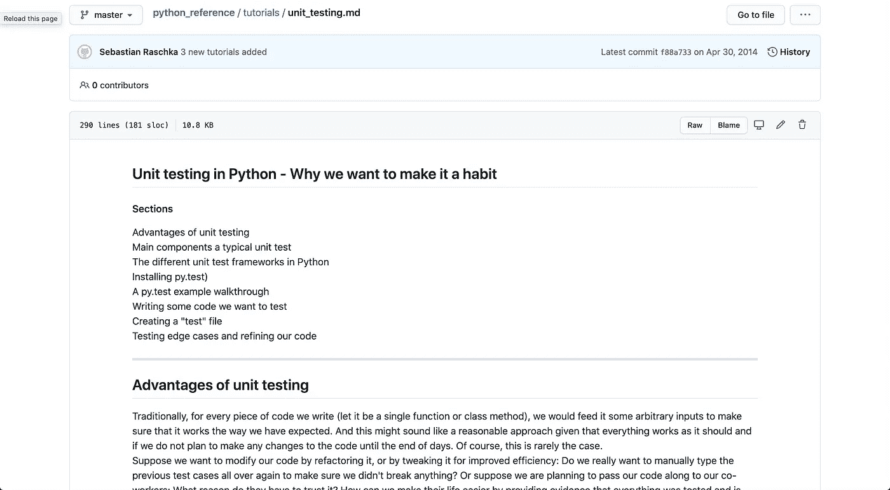

[样本理论资源](https://github.com/rasbt/python_reference/blob/master/tutorials/unit_testing.md)由 [rasbt](https://github.com/rasbt) 提供

作者还链接了许多其他对学习 Python 有用的外部资源，包括论坛、书籍和现有的 Python 项目。例如，Reddit 上的 r/Python 是一个很好的地方，可以找到有用的 Python 技巧以及社区成员展示的个人项目。

# python-编程-练习-从初级到高级(10.8k 星级)

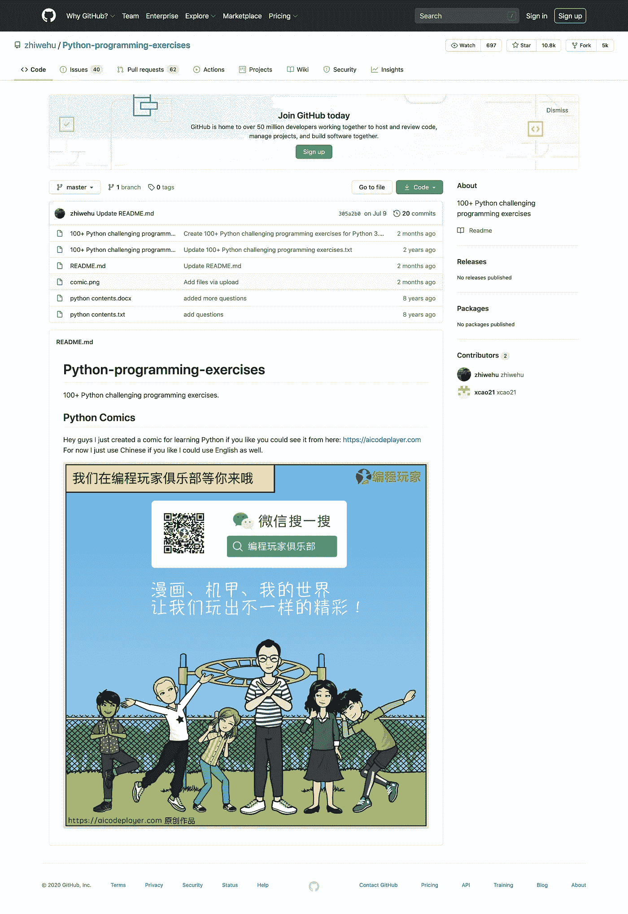

[Python-编程 GitHub 上的练习](https://github.com/zhiwehu/Python-programming-exercises)由 [zhiwehu](https://github.com/zhiwehu)

这个库目前有 100 个 Python 编程练习，难度从初级到高级不等。这些问题和解决方案最初是用 Python 2 编写的，但作者后来更新了所有 100 个问题，以包括用 Python 3 编写的解决方案。

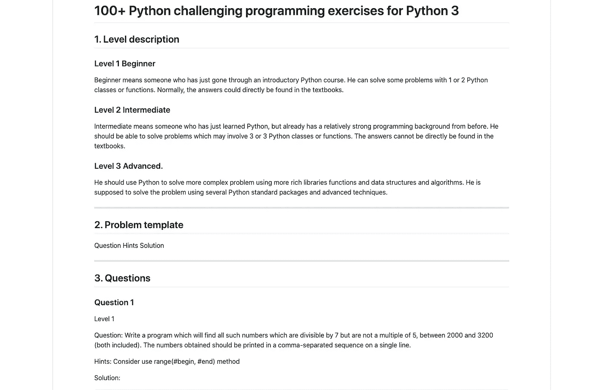

[样本练习](https://github.com/zhiwehu/Python-programming-exercises/blob/master/100%2B%20Python%20challenging%20programming%20exercises%20for%20Python%203.md)由[知乎](https://github.com/zhiwehu)

如果您已经熟悉 Python，这些问题中的一些可能看起来太简单了。我会说能够解决简单的问题是一回事，但是能够快速解决是另一回事。仔细研究所有这些问题，也许与你参加的在线课程或这里的 GitHub 资源库的资源一起，可以帮助你准备和训练解决编程练习。

如果你被卡住了，你可以在每个问题上使用“提示”行，尝试找出解决问题的方法。尽量不要对每个问题向下滚动太多，这样你就不会马上看到解决方案，因为试图找出问题解决方案的过程有助于你真正记住解决方案(而不是仅仅试图阅读和记忆解决方案)。

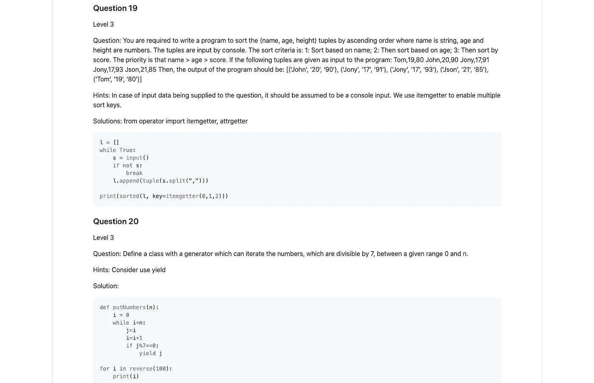

[样题练习](https://github.com/zhiwehu/Python-programming-exercises/blob/master/100%2B%20Python%20challenging%20programming%20exercises%20for%20Python%203.md)由[知乎](https://github.com/zhiwehu)

还有一个不同作者的“扩展版”知识库，有相同的问题和替代解决方案。在这个扩展的知识库中，作者试图展示解决一个问题的不同方法，这些方法可能比原始解决方案更有效或更“Pythonic 化”。

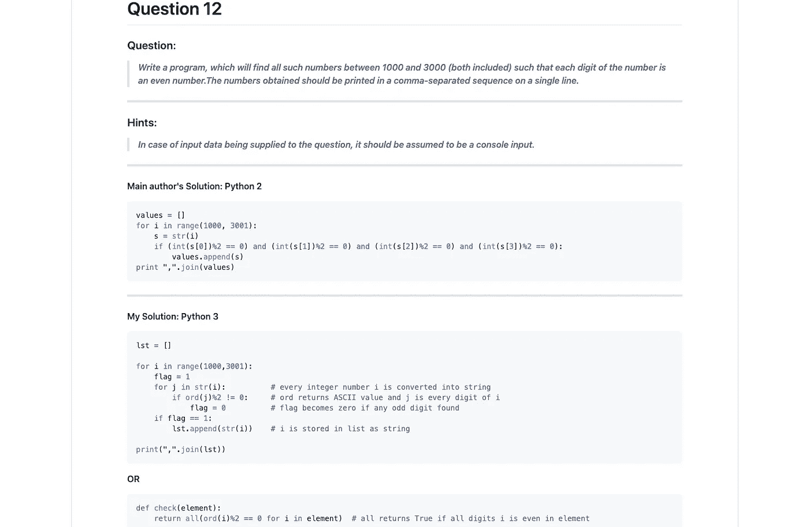

[示例练习](https://github.com/darkprinx/100-plus-Python-programming-exercises-extended/blob/master/Status/Day%203.md)由 [darkprinx](https://github.com/darkprinx) 完成

# 编码问题—中级到高级(2.6k 星)

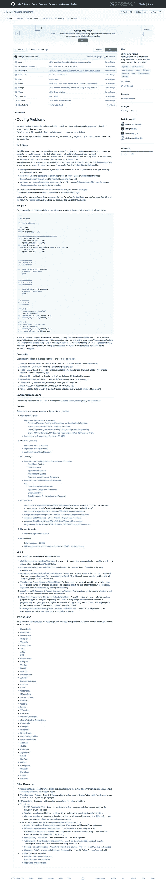

[MTrajK](https://github.com/MTrajK/coding-problems)在 GitHub 上的编码问题

就像之前的库一样，这个库包含了你可以解决的编程和算法练习的完整列表。然而，这个存储库并没有将所有的练习都记录在一个笔记本中，而是为每个练习都准备了一个 Python 文件，其中包含了问题的描述以及解决方案。

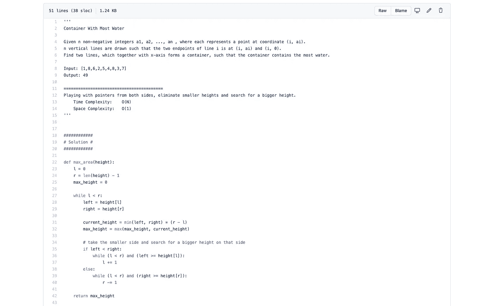

[示例练习](https://github.com/MTrajK/coding-problems/blob/master/Arrays/container_with_most_water.py)由 [MTrajK](https://github.com/MTrajK) 完成

这些问题并不是从完全初级的难度开始的，所以我建议在你已经牢固掌握了基础知识(使用函数、控制流等)之后再来回答这些问题。).

[作者](https://github.com/MTrajK)也写道“算法和结构与语言无关”。正因为如此，他用 Python 编写了解决方案，因为这种语言可读性很好，但是熟悉其他语言的人也应该能够使用这个库来了解如何处理算法问题。

这个库中的问题不是作者原创的，因为他明确指出它们来自 LeetCode 这样的问题解决网站。他的贡献是提供解决方案和解释，帮助人们学习如何解决这类问题。

你会发现许多问题都可以归为一个主题，所以解决这些问题的方法可能有些相似。当你在一个主题中不断练习相同类型的问题时，你会发现它们对你来说变得越来越容易解决。

除了包含算法问题和解决方案的 Python 文件之外，他还提供了一个完整的其他资源列表供您使用。对于编程问题，有许多在线课程、推荐书籍和热门网站的链接。

# 算法—中级到高级(82.4k 恒星)

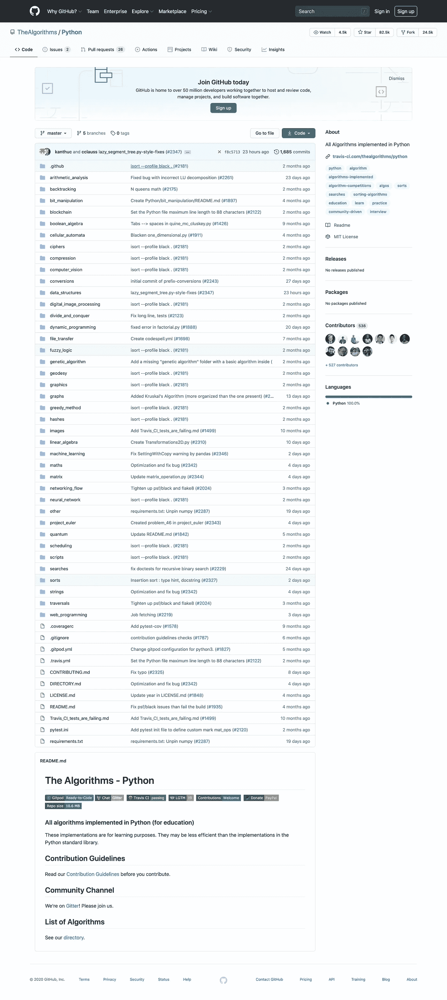

[Python](https://github.com/TheAlgorithms/Python) 上 GitHub 由[算法](https://github.com/TheAlgorithms)

这个存储库还提供了一组文件，向您展示如何用 Python 实现不同的算法。这些算法分为从“算术分析”到“区块链”到“数据结构”甚至更多的类别。没有太多关于如何解决每个问题的解释，因为这个库可以作为实现不同算法的解决方案指南。

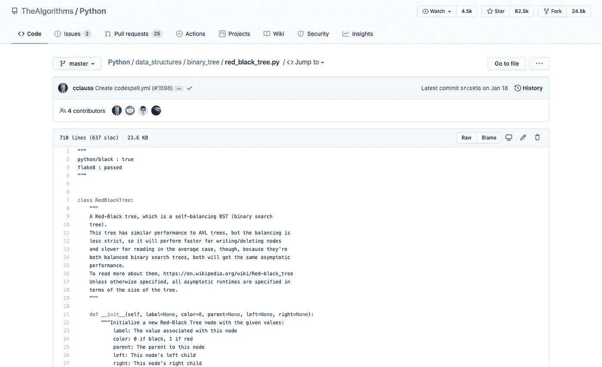

[样本算法解](https://github.com/TheAlgorithms/Python/blob/master/data_structures/binary_tree/red_black_tree.py)由[算法解](https://github.com/TheAlgorithms)

有些文件确实给了你一些背景知识(和一两个帮助你开始的链接)，但是在你尝试解决这些算法之前，你可能需要自己做一些研究。如果你对 Python 完全陌生，我建议你先建立你的基础知识，因为这个库实际上是为那些已经熟悉这种语言并希望加深算法知识的人准备的。

作者还为其他几种主要语言(Java、C++、C、Go、Javascript)创建了类似的“学习算法”存储库，您可以在概要文件的 pinned 存储库中查看。

GitHub 资源库包含大量有价值的学习资源，但这并不意味着你需要使用所有的资源。我的建议是首先选择一个“初级到中级”类型的存储库，并研究其中的所有学习材料。您应该通过最适合您的学习风格的存储库来工作。例如，如果你想通过可编辑的 Jupyter 笔记本来学习从基础到中级的主题，你应该尝试本文中的第一个资源库。

此外，这两个 100+ Python 问题非常适合作为解决编程问题的入门。你可以选择要么开始每天尝试几个，要么等到你有了更扎实的 Python 基础再说。这些最终可以帮助你建立一些在技术性工作面试中可能出现的编程问题的基本知识。你可以从这些网站发展到像 HackerRank 和 LeetCode 这样的网站，这些网站每天都会给你各种各样的编程问题来解决。他们还可以帮助你准备特定公司的面试，比如脸书、亚马逊和谷歌。

学习 Python(和其他任何东西)都是为了保持动力和练习。Python 并不神奇——制定一个计划，如果合适就使用其中一个库(如果不合适就使用完全不同的库),然后*坚持使用它*。

你能行的！

```
**More by me:** - [2 Easy Ways to Get Tables From a Website](/2-easy-ways-to-get-tables-from-a-website-with-pandas-b92fc835e741?source=friends_link&sk=9981ddaf0785a79be893b5a1dd3e03dd)
- [An Introduction to the Cohort Analysis With Tableau](https://medium.com/swlh/how-to-group-your-users-and-get-actionable-insights-with-a-cohort-analysis-b2b281f82f33?source=friends_link&sk=8b672c3feb79e194804f2a1c33660e19)
- [How to Quickly Create and Unpack Lists with Pandas](/how-to-quickly-create-and-unpack-lists-with-pandas-d0e78e487c75?source=friends_link&sk=32ea67b35fe90382dc719c1c78c5900c)
- [Rename Screenshots on Mac with 21 Lines of Python](/how-to-rename-screenshots-on-mac-with-21-lines-of-python-c3c2366f6eec?source=friends_link&sk=ee7e2c04f068855b5b7dfffa7e54152b)
```