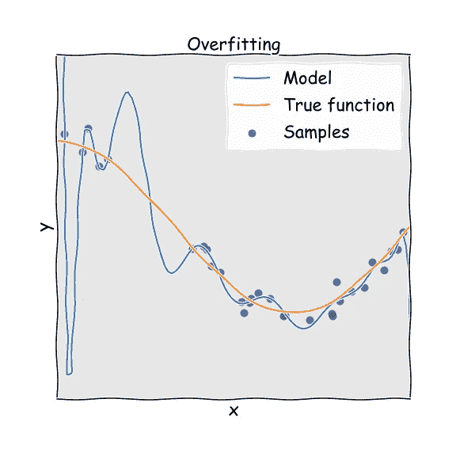
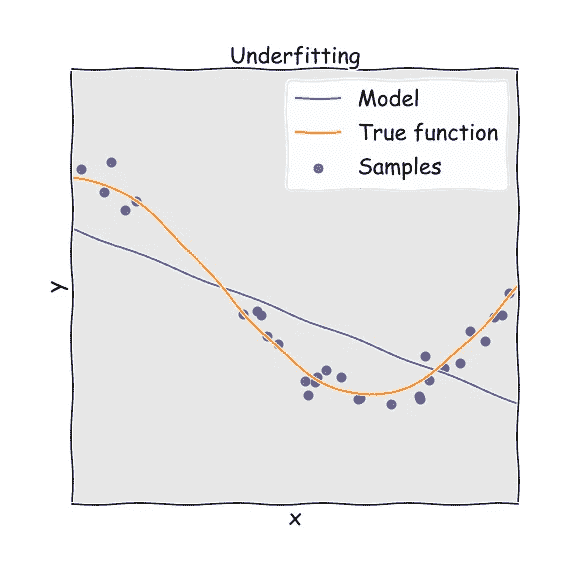
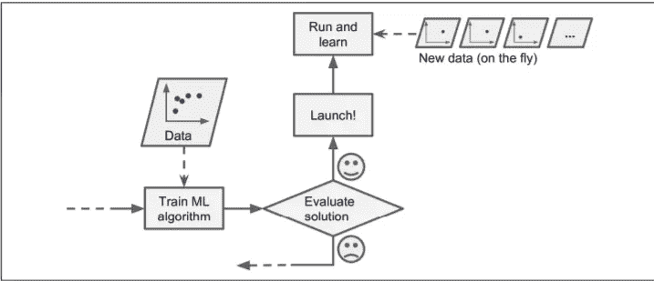

# 机器学习从业者面临的 8 大挑战

> 原文：<https://towardsdatascience.com/top-8-challenges-for-machine-learning-practitioners-c4c0130701a1?source=collection_archive---------12----------------------->

## 开发机器学习应用程序时需要克服的主要挑战

照片由来自 [Pexels](https://www.pexels.com/photo/man-wearing-hoodie-and-black-pants-climbing-up-pile-of-rocks-1058958/) 的[尿布](https://www.pexels.com/@nappy)拍摄

许多人在听到**机器学习(ML)** 或**人工智能(AI)** 的风声时，会想到机器人或终结者。然而，它们不是电影中的东西，它绝不是一个尖端的梦想。已经到了。我们生活在一个使用机器学习开发大量尖端应用的环境中，尽管在开发一个从零开始到投入生产的应用的过程中，ML 从业者可能会面临某些挑战。

这些挑战是什么？我们来看看吧！

# 1.数据收集

数据在任何用例中都扮演着关键角色。数据科学家 60%的工作在于收集数据。对于尝试机器学习的初学者来说，他们可以很容易地从 Kaggle、UCI ML Repository 等网站找到数据。

照片由 [Pixabay](https://www.pexels.com/@pixabay) 从[像素](https://www.pexels.com/photo/business-charts-data-document-259006/)拍摄

为了实现真实的案例场景，您需要通过网络搜集或(通过像 twitter 这样的 API)收集数据，或者为了解决业务问题，您需要从客户那里获得数据(这里 ML 工程师需要与领域专家协作来收集数据)。

一旦收集了数据，我们需要构造数据并将其存储在数据库中。这需要大数据(或数据工程师)的知识，这在这里起着重要作用。

# 2.较少的训练数据量

一旦收集了数据，您需要验证数量是否足够用于用例(如果是时间序列数据，我们至少需要 3-5 年的数据)。

我们在做机器学习项目时做的两件重要的事情是**选择学习算法**和**使用一些获得的数据训练模型。**所以作为人类，我们自然倾向于犯错，结果事情可能会出错。在这里，错误可能是选择了错误的模型或选择了不好的数据。现在，我说的坏数据是什么意思？让我们试着去理解。

来自[佩克斯](https://www.pexels.com/photo/people-holding-siamese-cat-and-short-coat-black-dog-1909802/)的[莎伦·麦卡琴](https://www.pexels.com/@mccutcheon)的照片

想象你的机器学习模型是一个婴儿，你打算教婴儿区分猫和狗。所以我们从指着一只猫说‘这是一只**猫’**开始，对一只**狗**做同样的事情(可能重复这个过程很多次)。现在，孩子将能够通过识别形状、颜色或任何其他特征来区分狗和猫。而就这样，宝宝变成了天才(在辨别方面)！

同样，我们用大量数据训练模型。一个孩子可能用较少数量的样本来区分动物，但一个机器学习模型需要成千上万的样本，即使是简单的问题。对于像图像分类和语音识别这样的复杂问题，可能需要数百万的数据。

因此，有一点是明确的。我们需要用足够的**数据来训练一个模型。**

# 3.非代表性训练数据

训练数据应该代表新案例，以便很好地概括，即，我们用于训练的数据应该覆盖所有已经发生和将要发生的案例。通过使用非代表性的训练集，经过训练的模型不可能做出准确的预测。

被开发来对商业问题视图中的一般化情况进行预测的系统被认为是好的机器学习模型。这将有助于模型运行良好，即使对于数据模型从未见过的数据也是如此。

照片由[鲁伯特·布里顿](https://unsplash.com/@rupert_britton)从 [Unsplash](https://unsplash.com/photos/l37N7a1lL6w) 拍摄

如果训练样本的数量很少，我们有*采样噪声*这是不具有代表性的数据，同样，如果用于训练的策略有缺陷，无数的训练测试会带来**采样偏差**。

1936 年美国总统选举期间发生了一个调查抽样偏差的流行案例(Landon 对 Roosevelt)，由*文学文摘*通过向大约 1000 万人发送邮件进行了一次非常大的民意调查，其中有 240 万人回答，并预测 Landon 将以很高的可信度获得 57%的选票。尽管如此，罗斯福还是以 62%的选票获胜。

这里的问题在于抽样方法，为了获得进行民意调查的地址，*literal Digest*使用杂志订阅、俱乐部成员名单等，这些都被那些注定要投票给共和党人(因此是 Landon)的富裕个人所利用。此外，*不回答*也是偏见，因为只有 25%的人回答了调查。

为了准确预测而没有任何偏差，训练数据集必须具有代表性。

# 4.数据质量差

照片由[**Jeppe Hove Jensen**](https://unsplash.com/@jayhaywire)****来自 [Unsplash](https://unsplash.com/photos/b3eaH1hguOA)****

****在现实中，我们不直接开始训练模型，分析数据是最重要的一步。但是我们收集的数据可能还没有准备好用于训练，例如，一些样本与其他样本相比是异常的，具有异常值或缺失值。****

****在这些情况下，我们可以移除异常值，或者使用中值或平均值填充缺失的特征/值(以填充高度)，或者简单地移除具有缺失值的属性/实例，或者使用和不使用这些实例来训练模型。****

****我们不希望我们的系统做出错误的预测，对吗？因此，数据质量对于获得准确的结果非常重要。数据预处理需要通过过滤缺失值，提取和重新排列模型需要的内容来完成。****

# ****5.不相关/不想要的特征****

********

****照片由 [Gary Chan](https://unsplash.com/@gary_at_unsplash) 从 [Unsplash](https://unsplash.com/photos/YzSZN3qvHeo) 拍摄****

> ****垃圾进，垃圾出****

****如果训练数据包含大量无关特征和足够多的相关特征，机器学习系统就不会给出预期的结果。机器学习项目成功所需的一个重要方面是选择好的特征来训练模型，也称为特征选择。****

****假设我们正在进行一个项目，根据我们收集的输入特征(年龄、性别、体重、身高和位置，即他/她住在哪里)来预测一个人需要锻炼的**小时数**。****

1.  ****在这 5 个特征中，l **位置**值可能不会影响我们的输出函数。这是一个不相关的特性，我们知道没有这个特性我们可以有更好的结果。****
2.  ****此外，我们可以将两个特征结合起来产生一个更有用的特征，即*特征提取。在我们的示例中，我们可以通过消除重量和高度来生成一个名为**身体质量指数**的特征。我们也可以在数据集上应用变换。*****
3.  ****通过收集更多数据来创建新功能也有所帮助。****

# ****6.过度拟合训练数据****

********

****照片由 [Pexels](https://www.pexels.com/photo/man-about-to-lift-barbell-2261477/) 的 [Victor Freitas](https://www.pexels.com/@victorfreitas) 拍摄****

****假设你去了一个新城市的餐馆。你看着菜单点菜，发现费用或账单太高。你可能会忍不住说“*这个城市的所有餐馆都太贵了，负担不起”。*过度概括是我们经常做的事情，令人震惊的是，框架同样会陷入类似的陷阱，在人工智能中，我们称之为过度适应。****

********

****过度拟合****

****这意味着模型表现良好，对训练数据集做出了可能的预测，但它没有很好地泛化。****

****假设您正在尝试实现一个图像分类模型，分别使用 3000、500、500、500 个训练样本对苹果、桃子、橙子和香蕉进行分类。如果我们用这些样本训练模型，系统更有可能将橙子分类为苹果，因为苹果的训练样本数量太多了。这可以称为过采样。****

********

****照片由[像素](https://www.pexels.com/photo/questions-answers-signage-208494/)的 [Pixabay](https://www.pexels.com/@pixabay) 拍摄****

****当模型与训练数据集的噪声相比过于不可预测时，会发生过度拟合。我们可以通过以下方式避免这种情况:****

1.  ****收集更多的训练数据。****
2.  ****选择具有较少特征的模型，与线性模型相比，更高次的多项式模型不是优选的。****
3.  ****修复数据错误，移除异常值，并减少训练集中的实例数量。****

# ****7.欠拟合训练数据****

****与过度拟合相反的欠拟合通常发生在模型过于简单而无法理解数据的基本结构时。就像试着穿小号的裤子。这通常发生在我们拥有较少的信息来构建一个精确的模型时，以及当我们试图用非线性信息构建或开发一个线性模型时。****

********

****欠拟合****

****减少拟合不足的主要选择有:****

1.  ****特征工程——为学习算法提供更好的特征。****
2.  ****从数据中去除噪声。****
3.  ****增加参数并选择强大的模型。****

# ****8.模型的离线学习和部署****

********

****照片由 [Rakicevic Nenad](https://www.pexels.com/@rakicevic-nenad-233369) 从 [Pexels](https://www.pexels.com/photo/man-holding-ice-cream-cone-under-cloud-1262302/) 拍摄****

****机器学习工程在构建应用程序时遵循以下步骤 1)数据收集 2)数据清理 3)功能工程 4)分析模式 5)训练模型和优化 6)部署。****

****哎呀！！我说**部署了吗？**是的，许多机器学习实践者可以执行所有步骤，但缺乏部署技能，由于缺乏实践和依赖性问题、对业务基础模型的理解不足、对业务问题的理解以及不稳定的模型，将他们的酷应用程序投入生产已成为最大的挑战之一。****

****通常，许多开发人员从 Kaggle 等网站收集数据，并开始训练模型。但在现实中，我们需要为数据收集创建一个动态变化的源。离线学习或批量学习可能不适用于这种类型的可变数据。该系统经过培训，然后投入生产，无需学习即可运行。在这里，数据可能会随着动态变化而漂移。****

********

****在线学习****

****总是首选建立一个管道来收集、分析、构建/训练、测试和验证任何机器学习项目的数据集，并批量训练模型。****

> ******参考文献******

**** [## 使用 Scikit-Learn、Keras 和 TensorFlow 进行机器实践学习，第二版

### 通过最近的一系列突破，深度学习推动了整个机器学习领域。现在，甚至…

www.oreilly.com](https://www.oreilly.com/library/view/hands-on-machine-learning/9781492032632/)  [## 基本统计| Coursera

### 理解统计学对于理解社会和行为科学的研究是必不可少的。在本课程中，您…

www.coursera.org](https://www.coursera.org/learn/basic-statistics/) 

## 结论

如果训练集太小，或者如果数据没有被一般化、有噪声并且被不相关的特征破坏，则系统不能很好地执行。我们经历了初学者在练习机器学习时面临的一些基本挑战。

如果你有什么建议，我很乐意听听。我很快会带着另一个有趣的话题回来。在那之前，呆在家里，保持安全，继续探索！

如果您想联系，**请在**[**LinkedIn**](https://www.linkedin.com/in/ritheesh-baradwaj-yellenki-8a6988173/)**上联系我。******