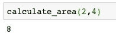

# Jupyter 笔记本中的 8 大魔法命令

> 原文：<https://towardsdatascience.com/top-8-magic-commands-in-jupyter-notebook-c1582e813560?source=collection_archive---------13----------------------->

## 通过学习最有用的命令来提高您的生产力


**有哪些神奇的命令？**

神奇命令是特殊的命令，可以帮助您运行和分析笔记本中的数据。它们添加了一个特殊的功能，这是 python 代码或 jupyter notebook 接口无法直接实现的。

在代码中很容易发现神奇的命令。如果它们在一行代码中，则按%处理；如果它们写在几行代码中，则按%%处理。

在本文中，我将列出最常用的神奇命令，并展示如何利用它们提供的功能的实际例子。

**1。列出所有魔法命令。**

让我们从列出所有你可以在笔记本上使用的魔法命令开始。

```
%lsmagic
```

如果您在笔记本中运行上面的行，您应该会得到一个类似于下面截图的列表。这些是您可以使用的所有命令。在本文中，我们将只讨论其中的一小部分。


**2。运行一个文件。**

您可以使用以下代码从 jupyter 笔记本中运行 python 文件。

```
%run <file name>
```

假设您有一个包含以下内容的文件 [hello.py](http://hello.py/) :

```
def hello_world():
    print('Hello, world')hello_world()
```

您可以在笔记本中运行以下命令来运行该文件。

```
%run hello.py
```


**3。得到一个执行时间。**

您可以使用 time 命令为代码的执行计时。

```
%%time<your code>
```

让我们生成 1 000 000 个随机数，看看需要多长时间。

```
%%time
import random
for i in range(0, 1000000):
    random.random()
```


**4。列出所有变量。**

有一个神奇的命令允许你列出当前笔记本中定义的所有变量。

```
%who
```

您可以在命令名后传递一个数据类型，以便只列出特定数据类型的变量。

为了说明这一点，让我们定义一个字符串变量和两个整型变量。

```
var_1 = 1
var_2 = 'hello'
var_3 = 100
```

现在我们可以列出所有字符串:

```
%who str
```


或所有带有以下符号的整数:

```
%who int
```


**5。获取变量的详细信息。**

一旦我们知道了变量名，我们就可以检查存储在特定变量名中的对象的详细信息。为了做到这一点，您可以使用以下命令。

```
%pinfo <variable>
```

让我们回到上一节中使用的三个变量的例子，以便更好地说明它。

```
var_1 = 1
var_2 = 'hello'
var_3 = 100
```

现在让我们检查 var_1。

```
%pinfo var_1
```


如您所见，您获得了关于变量的所有重要信息，如类型、字符串形式和 docstring。

让我们检查一个字符串变量。

```
%pinfo var_2
```


你得到的信息细节和 int 一样，另外还有字符串的长度。

**6。获取和设置环境变量。**

您可以使用以下命令获得环境变量的列表。

```
%env
```


此外，您还可以通过指定变量名及其值来设置笔记本的环境变量。

让我们添加一个名为 NEW_VAR 的新环境变量:

```
%env NEW_VAR=Users/konki
```


现在让我们检查一下它是否设置正确。您可以在%env 后面添加一个变量名，以便只检查指定的变量，而不是显示所有变量。

```
%env NEW_VAR
```


7 .**。在 jupyter 笔记本中显示 matlpotlib 图形**

如果您使用的是旧版本的 Jupyter 笔记本，您需要添加这一行代码，以便用 matplotlib 创建的图形可以在笔记本本身中呈现。

```
%matplotlib inline
```

在较新的版本中，不再需要这样做。设置它的代码在 Jupyter 笔记本启动时运行。

你仍然可以在其他人的代码中看到这个神奇的命令，因为不是每个人都知道这个更新。

**8。加载外部文件。**

您可以使用 load 命令将外部文件加载到单元格中。

```
%load <file_name>
```

如果您已经有一个定义了某些函数的 python 文件，并且需要在当前笔记本中使用它们，那么这是一个非常有用的命令。

为了进行说明，我们以文件 rectangle.py 为例，它由以下代码组成。

```
def calculate_area(len, height):
    return len * height * 2
```

您可以通过执行下面的代码来加载文件内容。

```
%load rectangle.py
```

一旦你运行了这个单元，你应该得到这个单元中文件的内容。


现在只需运行加载了代码的单元格，您就可以使用在原始文件中定义的函数了。现在可以计算矩形面积了。

```
calculate_area(2,4)
```



**总结**

在本文中，您已经了解了 jupyter 笔记本中最常用的魔法命令。现在是你的时间了，打开笔记本，练习你在这里学到的东西。编码快乐！

*原载于 about data blog . com:*[jupyter 笔记本中的 8 大魔法命令](https://www.aboutdatablog.com/post/top-8-magic-commands-in-jupyter-notebook)，*2020 年 11 月 11 日。*

*PS:我正在 Medium 和*[***aboutdatablog.com***](https://www.aboutdatablog.com/)*上撰写深入浅出地解释基本数据科学概念的文章。你可以订阅我的* [***邮件列表***](https://medium.com/subscribe/@konkiewicz.m) *在我每次写新文章的时候得到通知。如果你还不是中等会员，你可以在这里加入*[](https://medium.com/@konkiewicz.m/membership)**。**

*下面还有一些你可能喜欢的帖子*

*[](/9-things-you-did-not-know-about-jupyter-notebook-d0d995a8efb3) [## 关于 jupyter 笔记本你不知道的 9 件事

### 用这些建议提高你的工作效率

towardsdatascience.com](/9-things-you-did-not-know-about-jupyter-notebook-d0d995a8efb3) [](/top-9-jupyter-notebook-extensions-7a5d30269bc8) [## 9 大 Jupyter 笔记本扩展

### 改进笔记本电脑功能，提高您的工作效率

towardsdatascience.com](/top-9-jupyter-notebook-extensions-7a5d30269bc8) [](/9-pandas-visualizations-techniques-for-effective-data-analysis-fc17feb651db) [## 9 熊猫有效数据分析的可视化技术

### 学习如何使用折线图、散点图、直方图、箱线图和其他一些可视化技术

towardsdatascience.com](/9-pandas-visualizations-techniques-for-effective-data-analysis-fc17feb651db)*