# 2020 年需要了解的 9 大数据科学认证

> 原文：<https://towardsdatascience.com/top-9-data-science-certifications-in-2020-40b0192ade43?source=collection_archive---------1----------------------->

## 值得考虑的一些最佳数据科学认证计划

路易斯·基冈-Skillscouter.com 在 [Unsplash](https://unsplash.com/s/photos/certificate?utm_source=unsplash&utm_medium=referral&utm_content=creditCopyText) 上的照片

MOOCs 越来越受欢迎是不可否认的事实。有证据表明，越来越多的企业将 MOOCs 用于员工培训发展。在我看来(也是我见过的招聘人员)，在线认证是你在标准参考平台上超越课本知识的能力证明。

学习者利用 MOOCs 是出于个人兴趣或增强他们的工作前景和技能。然而，首要目标仍然是在当前时代获得技能的可信度或相关性。

"*潜在雇主如何看待课程和证书？在我与招聘人员讨论这个问题时，我有机会说，底线是:证书让你有了一个共同的基础，你的表现和技能会得到称赞。证书展示了你磨练技能的额外努力。*

## 为什么要参加在线认证？

1.  在简历或作品集上夸耀你的技能
2.  获得更好的就业机会
3.  利用对其他服务的访问—职业服务、招聘实验室、评论
4.  在职业道路上做出转变

说到这里，让我们来看看今年你可以完成的数据科学的 9 大在线认证！

# 1.IBM 数据科学专业认证

持续时间— 3 个月(灵活)
级别—初级
平台— Coursera

你得到:证书和数字徽章

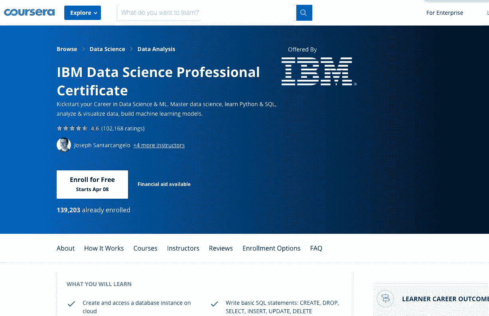

图片来源:Coursera

完成此认证后，我可以向你们保证，对于希望开始其专业数据科学职业生涯的爱好者来说，这是最好的初级数据科学认证计划。

从解释什么是数据科学以及为什么它如此受欢迎，到让学习者完成 API 集成的顶点课程，我强烈建议接受这个 9 门课程的挑战！

## 课程

1.  什么是数据科学？
2.  数据科学的开源工具
3.  数据科学方法论
4.  用于数据科学和人工智能的 Python
5.  用于数据科学的数据库和 SQL
6.  使用 Python 进行数据分析
7.  用 Python 实现数据可视化
8.  用 Python 进行机器学习
9.  应用数据科学顶点

认证不需要任何先决条件。然而，如果你希望更好地掌握学习，我建议你先完成 Python 速成课程。到了课程 6，你将开始从零开始构建项目，这是在简历中加入一些奇特项目的绝佳方式！

访问认证: [*链接*](https://www.coursera.org/professional-certificates/ibm-data-science#courses)

# 2.Tableau 数据科学家|桌面专家

持续时间— 3 个月(灵活)
级别—初学者
平台— Tableau 在线学习
免费

您将获得:数字角色徽章

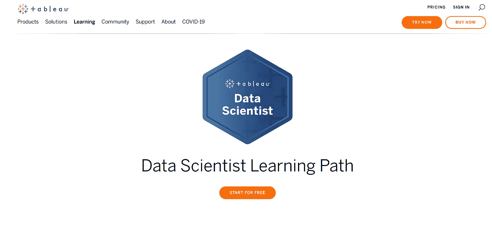

图片来源:Tableau 官网

Tableau 在其许多认证上提供折扣，但这一项——数据科学家学习路径是免费的。一个姐妹认证是 Tableau 数据分析师。

Tableau 数据科学家路径包括—

1.  Tableau 桌面入门
2.  桌面 I:基础
3.  桌面 II:中级
4.  桌面 III:高级
5.  数据准备
6.  视觉分析
7.  数据科学与 Tableau
8.  数据科学家技能评估

Tableau 提供三种主要的付费认证—

1.  桌面认证助理(600 美元)
2.  桌面认证专家(250 美元)
3.  服务器认证助理(250 美元)

进入认证: [*链接*](https://www.tableau.com/learn/learning-paths/data-scientist)

## Tableau 桌面专家

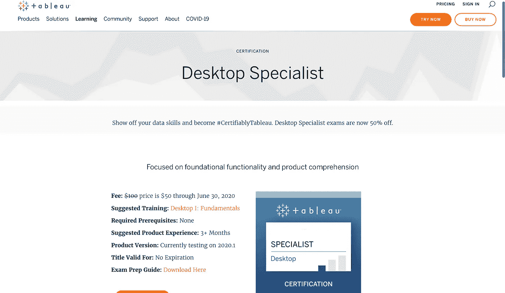

图片来源:Tableau 官网

这个考试是为那些有基本的，基本的技能和 Tableau 桌面的理解和至少三个月的应用理解，和 Tableau 的经验。

*费用=* $50 截止到 2020 年 6 月 30 日(6 月 30 日之后$ 100)
时间限制:60 分钟
问题形式:多项选择，多项回答
问题数量:30
及格分数:70%

## 衡量的技能

1.  探索和准备数据
2.  探索和分析数据
3.  分享见解
4.  理解 Tableau 概念
5.  及时

# 3.HarvardX 的数据科学专业证书

持续时间— 1 年 5 个月(灵活)
级别—初级
平台— edX
费用= 441 美元

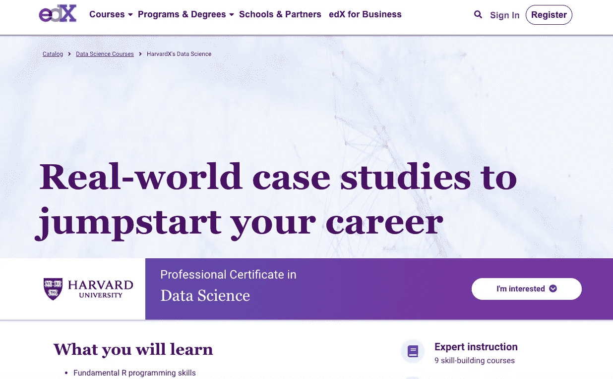

图片来源:edX

与 edX 合作的哈佛大学拥有数据科学认证，涵盖基本的 R 编程技能、概率、推理和建模等统计概念，以及使用 *tidyverse、ggplot2、*和 *dplyr* 等软件包的经验。

关于这个认证最好的部分是课程接触基础的基本工具，为实践数据科学家，如 Unix/Linux，Git 和 GitHub，和 RStudio

该认证的另一个亮点是它的真实性——课程向学习者介绍了激励现实世界的案例研究，例如——

1.  世界卫生和经济趋势
2.  美国犯罪率
3.  2007-2008 年的金融危机
4.  选举预测
5.  组建一支棒球队(受 Moneyball 启发)
6.  电影推荐系统。

## 课程

1.  数据科学:R 基础
2.  数据科学:可视化
3.  数据科学:概率
4.  数据科学:推理和建模
5.  数据科学:生产力工具
6.  数据科学:争论
7.  数据科学:线性回归
8.  数据科学:机器学习
9.  数据科学:顶点

进入认证:[链接](https://www.edx.org/professional-certificate/harvardx-data-science)

# 4.商业分析专业化

平台— Coursera
级别—初学者
持续时间— 6 个月(3 小时/周)

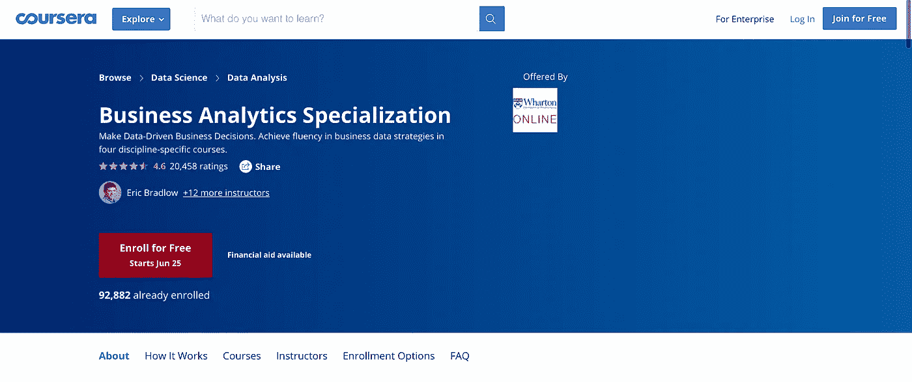

图片来源:Coursera

商业分析专业由宾夕法尼亚大学沃顿商学院*开发的 Coursera 托管。*它为跨市场营销、人力资源、运营和财务等商业专业的大数据分析提供了良好的基础介绍。这些课程不需要之前的分析经验。

网站上的一项统计显示，46%的学员在完成专业学习后开始了新的职业生涯，21%的学员获得了加薪或升职。

在旁听了课程并完成课程后，我可以说它确实让我们了解了作为数据分析师，我们应该并且能够如何描述、预测和告知特定业务领域的业务决策。我确信，在完成专业化后，任何学习者都将形成一种分析思维，以帮助根据数据做出比以前更好的战略决策。

## 课程

1.  客户分析
2.  人员分析
3.  会计分析
4.  运营分析
5.  商业分析顶点

顶点课程要求学习者将四门课程的知识结合起来，并鼓励他们针对谷歌、脸书和雅虎等全球科技巨头面临的实际商业挑战做出数据驱动的决策。

进入认证: [*链接*](https://www.coursera.org/specializations/business-analytics#courses)

# 5.高级商业分析专业化

平台— Coursera
级别—中级
持续时间— 5 个月(3 小时/周)

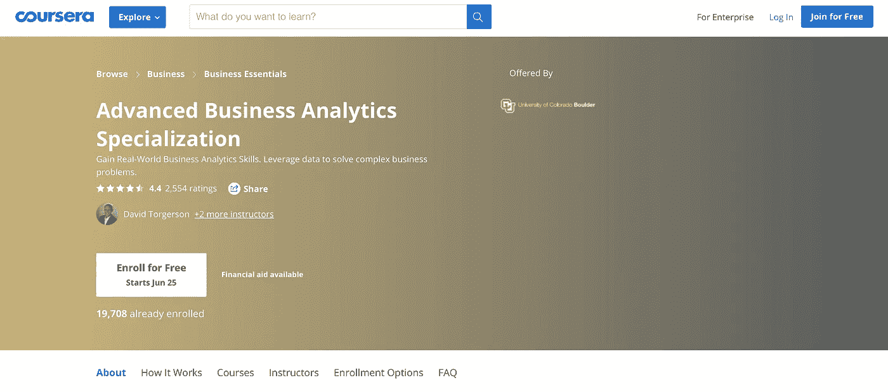

图片来源:Coursera

高级商业分析专业托管在 Coursera 上，由科罗拉多大学博尔德分校*开发。*专业化融合了学术界和商界之间的细微差别，将来自两个领域的经验丰富的从业者的知识结合起来，与学习者分享现实世界的数据分析技能。

网站上的一项统计显示，50%的学习者在完成这个专业后开始了新的职业生涯！那是我们正在谈论的事情！

同样，在完成这一专业化后，我肯定我现在可以更好地起草和认识到股东的最大价值。该课程让我对使用 SQL 进行数据提取和操作有了全面的体验，并利用统计技术对不同的业务领域进行描述性、预测性和规范性分析。更重要的是，该课程有效地教授了如何解释和展示分析结果，以便做出有效的决策。

## 课程

*   高级业务分析顶点
*   用于决策的商业分析
*   交流业务分析结果
*   商业数据分析简介
*   预测建模和分析

访问认证: [*链接*](https://www.coursera.org/specializations/data-analytics-business)

# 6.亚马逊 AWS 大数据认证

持续时间— 170 分钟完成考试
级别—高级
平台— AWS
费用—300 美元
类型—多项选择，多个答案

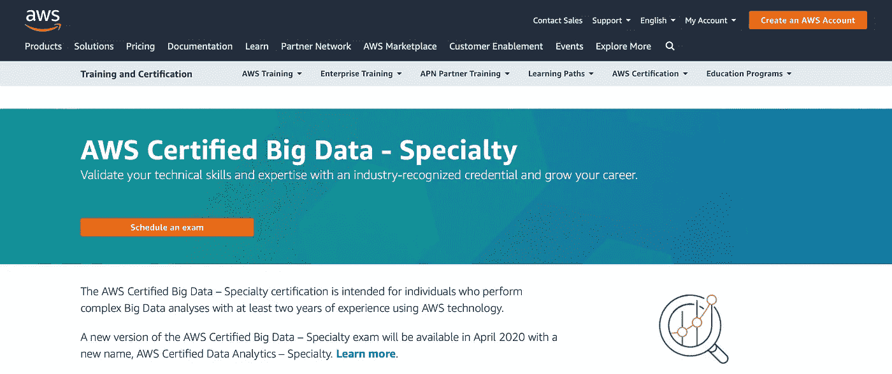

图片来源:AWS 官网

AWS 大数据认证是另一项艰难的认证，要求考生持有其中一项认证

1.  AWS 认证云从业者
2.  AWS 认证解决方案架构师助理
3.  AWS 认证开发人员-助理
4.  AWS 认证系统运行管理员—助理

该测试要求在数据分析领域至少有五年的实践经验(这对大学毕业生来说不是一个简单的挑战！)

## 衡量的技能

1.  功能化核心 AWS 大数据服务
2.  使用 AWS 设计和维护大数据
3.  利用工具自动化 AWS 中的数据分析

进入认证: [*链接*](https://aws.amazon.com/certification/certified-big-data-specialty/)

# 7.SAS 数据科学学院

持续时间—几个月到几年
成本—250 美元
级别—高级
平台— SAS 数据科学学院

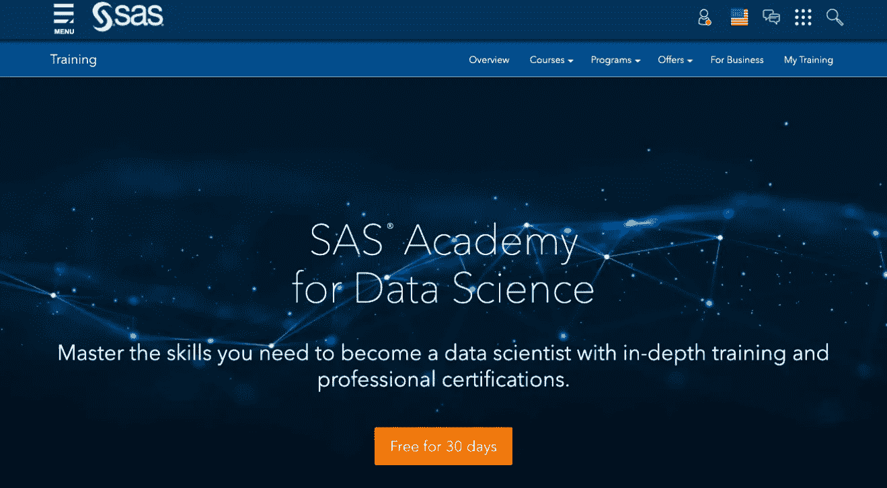

图片来源:SAS 数据科学研究院

SAS 数据科学学院是学习 SAS 数据科学的著名平台之一。它提供数据监管、高级分析、人工智能和机器学习方面的课程，以推动你在数据领域的职业发展。请注意，对于初学者来说，SAS 本身是一个棘手的领域。如果你准备参加下面的考试之一，请确保你完全了解先决条件。

SAS 学院有三条基本途径

1.  数据管理专家(4 门课程| 1 门考试| 5 个徽章| $ 1295/年)
2.  高级分析(9 门课程| 3 门考试| 7 个徽章|＄1295/年)
3.  人工智能和机器学习(5 门课程| 3 门考试| 7 个徽章| $ 1295/年)

SAS 学院专注于以下概念—

1.  访问、操作和转换数据
2.  分析和统计基础
3.  提高分析和报告的数据质量
4.  探索和可视化数据
5.  Hadoop、Hive、Pig 和 SAS
6.  机器学习
7.  优化技术
8.  模式检测
9.  预测建模技术及其应用
10.  时间数列预测法

进入认证: [*链接*](https://www.sas.com/en_us/training/academy-data-science.html)

# 8.MCSE:数据管理和分析

时长— 180 分钟考试
水平—高级
平台—微软
价格—165 美元
总题— 45 至 55 道
类型—单项和多项选择题

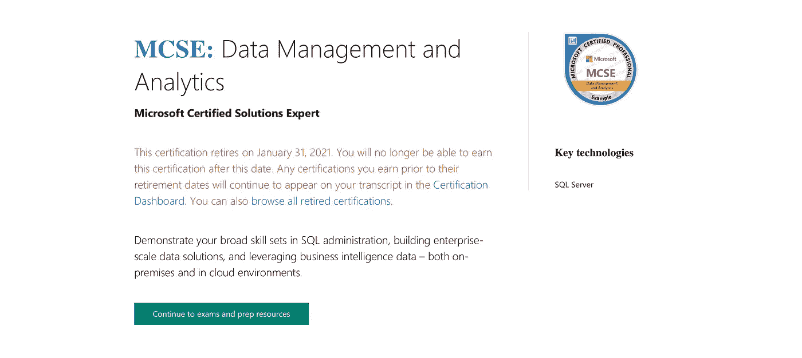

借助微软认证解决方案专家(MCSE)，您可以展示在数据库管理、SQL、构建企业级数据解决方案和利用商业智能数据方面的广泛技能。

## 你会学到什么？

1.  BI 报告
2.  使用 Azure 的数据工程
3.  机器学习
4.  SQL 2016 商务智能开发
5.  SQL 2016 数据库管理
6.  SQL 2016 数据库开发
7.  SQL Server 2012/2014

## 获得该认证需要 3 个步骤

1.  与 SQL Server 2012/2014/2016 数据库管理合作，并获得针对 SQL Server 的微软认证解决方案助理。使用 Azure 获得关于数据库开发、商业智能开发、机器学习、商业智能报告或数据工程的知识
2.  通过 1 门必修考试。
    认证门户还包含考试准备资源
3.  获得您的认证

访问认证: [*链接*](https://www.microsoft.com/en-us/learning/mcse-data-management-analytics.aspx)

# 9.微软认证 Azure 数据科学家助理

持续时间— 180 分钟考试
级别—高级
平台—微软

价格— $165
总问题— 51
类型—单项和多项选择题(~50%问题来自 ML studio，40%来自 ML service & 10%通用数据科学问题。)

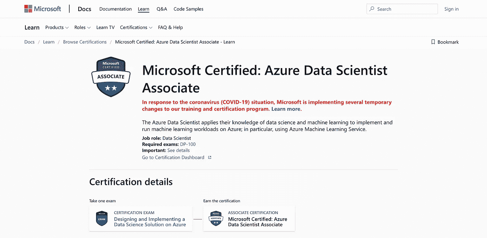

到目前为止，微软 Azure 数据科学家认证是我遇到的最薄弱的认证，因此也是我名单上的最后一个，它旨在为那些希望应用他们的数据科学和机器学习知识在 Azure 上实现和运行机器学习模型的学习者提供服务。

这个认证的好处在于，您可以通过部署模型即服务来完成考试。有什么比产品就绪项目更好的呢！？

方法很简单:参加一次考试，获得证书

## 衡量的技能

1.  建立 Azure 机器学习工作区(30–35%)
2.  在 Azure 中运行实验和训练模型(25–30%)
3.  优化和管理 Azure 构建的模型(20–25%)
4.  部署和使用生产就绪型模型(20–25%)

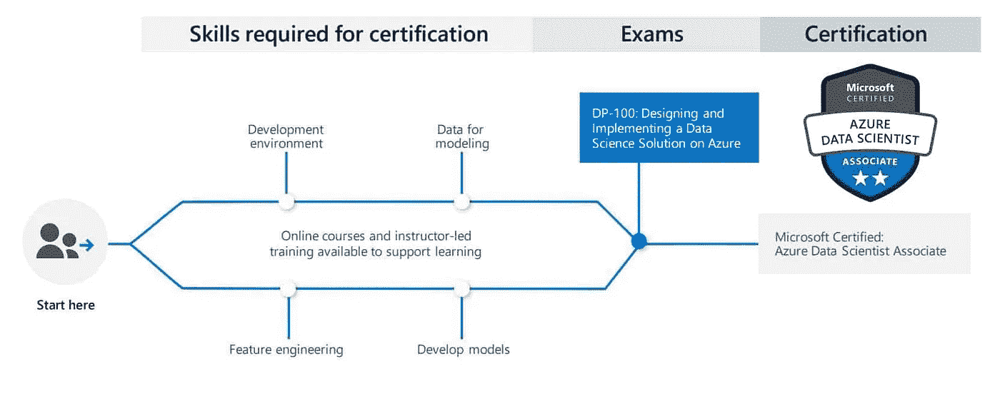

来源: [K21 学院](https://k21academy.com/microsoft-azure/dp-100/microsoft-certified-azure-data-scientist-associate-dp-100-all-you-need-to-know/)

进入认证: [*链接*](https://docs.microsoft.com/en-us/learn/certifications/azure-data-scientist)

这就是我的博客的结尾。感谢您的阅读！我希望你喜欢这篇文章。请务必告诉我，在您今年夏天的数据科学之旅中，您期待学习或探索哪些认证？

数据帐篷快乐！

*免责声明:本文表达的观点仅代表我个人，不代表严格的观点。*

# 了解你的作者

拉什是芝加哥伊利诺伊大学的研究生。她喜欢将数据可视化，并创造有见地的故事。当她不赶着赶学校的最后期限时，她喜欢喝一杯热巧克力，写一些关于技术、UX 等的东西。