# 9 大 Jupyter 笔记本扩展

> 原文：<https://towardsdatascience.com/top-9-jupyter-notebook-extensions-7a5d30269bc8?source=collection_archive---------17----------------------->

## 改进笔记本电脑功能，提高您的工作效率


图片由 [Syaibatul Hamdi](https://pixabay.com/users/Syaibatulhamdi-13452116/?utm_source=link-attribution&utm_medium=referral&utm_campaign=image&utm_content=4875339) 来自 [Pixabay](https://pixabay.com/?utm_source=link-attribution&utm_medium=referral&utm_campaign=image&utm_content=4875339)

**简介**

Jupyter Notebook 可能是数据科学家最常用的工具。它允许在一个文档中混合代码、文本和检查输出。

这在其他一些编程 ide 中是不可能的。然而，Jupyter 笔记本的普通版本并不完美。

在本文中，我们将向您展示如何通过安装一些有用的扩展来稍微改善它。

**什么是 Jupyter 笔记本扩展？**

Jupyter 笔记本扩展是在后台运行并扩展笔记本功能的 JavaScript 代码。一个扩展将负责一个特定的特性，并且可以根据需要安装或删除。

**启用扩展**

为了开始使用扩展，您需要通过运行 pip 命令来安装功能:

```
pip install jupyter_contrib_nbextensionspip install jupyter_nbextensions_configuratorjupyter contrib nbextension install
```

现在，您已经完成了该操作，可以启动 Jupyter 笔记本并转到 Nbextension 选项卡。

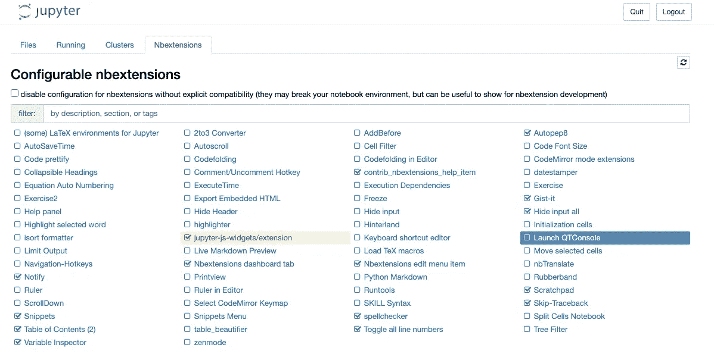

我现在要分享我最喜欢的扩展，所以一定要检查它们的盒子并试用它们。

**拼写检查器**

这个扩展是 markdown 代码的拼写检查器。它只会突出拼写错误的单词。

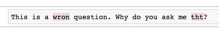

**目录**

这个扩展向笔记本添加了一个目录。可以通过下面屏幕截图中以红色突出显示的按钮来激活和停用它。

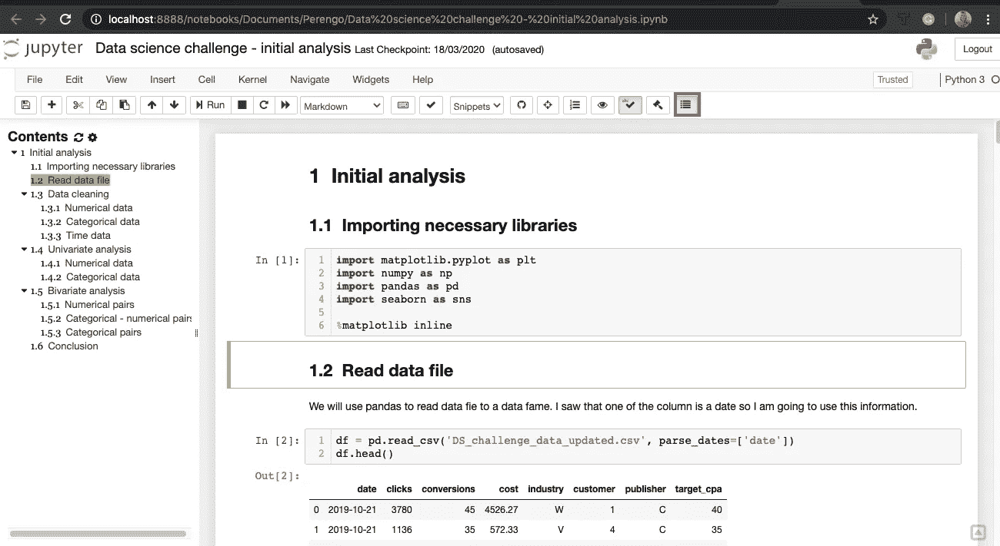

您可以单击目录中的任何标题，然后您将被带到笔记本的相应部分。

当您使用包含大量内容的笔记本电脑时，这是一个非常好的功能。

**可折叠标题**

这是另一个帮助你浏览笔记本的扩展。

一旦您安装了它，您将能够折叠或展开标题下的部分，切换出现在标题文本旁边的右侧。

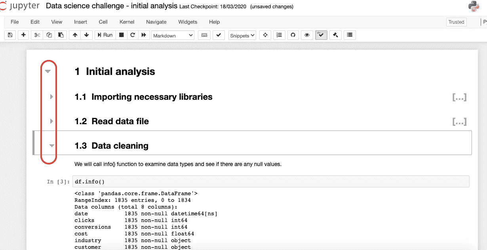

**自动编程 8**

这是一个帮助你根据 PEP 8 标准格式化你的代码的扩展。它将删除不需要的空格，或者在需要时添加空行，或者应用 PEP8 中概述的任何其他格式。

为了安装，您必须安装 autopep8 库。您可以通过运行以下命令来实现:

```
pip install autopep8
```

现在，为了使用它，您需要选择需要格式化的单元格，并单击菜单中的锤子按钮。

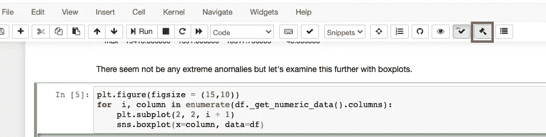

因此，应用格式后，上面单元格中的代码将如下所示。

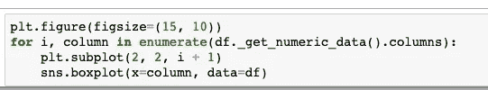

请注意，等号周围的空格在参数 figsize=(15，10)中被删除。

此外，在 for 循环中“I”变量之前偶然出现的额外空格也被删除。

**执行时间**

这个扩展允许您计时运行一个单元需要多长时间，并通知您最近一次执行的时间。信息显示在每个单元格的下方。

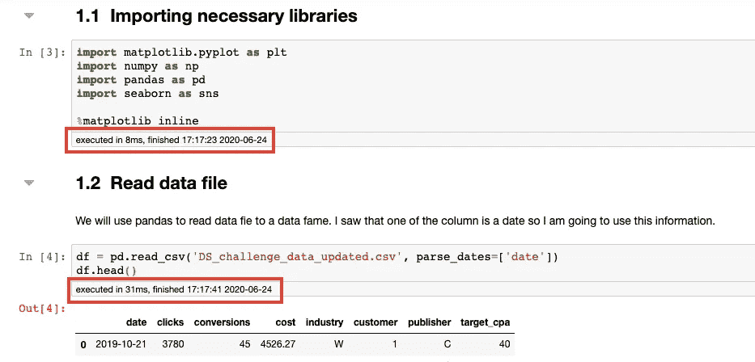

这是一个非常有用的功能。在重新运行细胞之前，你知道需要多长时间。

这将帮助您避免在不需要的情况下重新运行需要很长时间执行的单元。

**切换所有行号**

这是一个非常简单的扩展，允许你使用面板菜单中的一个按钮来打开和关闭代码单元格中的行号。

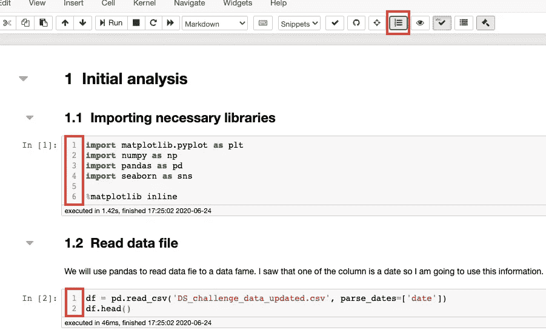

**可变督察**

启用后，可以通过选择面板菜单中标记为红色的按钮来使用该扩展(在下面的屏幕截图上)。

一旦您选择了它，您将看到关于您在当前名称空间中的所有变量的信息。您将能够看到变量的名称、类型、大小、形状和值。

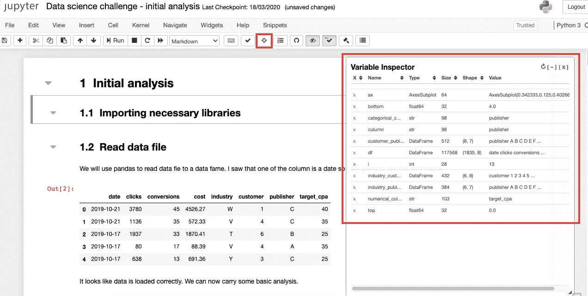

**隐藏代码**

这个扩展允许你隐藏笔记本中的所有代码，这样你就可以只关注输出。

为了隐藏和恢复代码，您可以使用面板中的眼睛按钮。

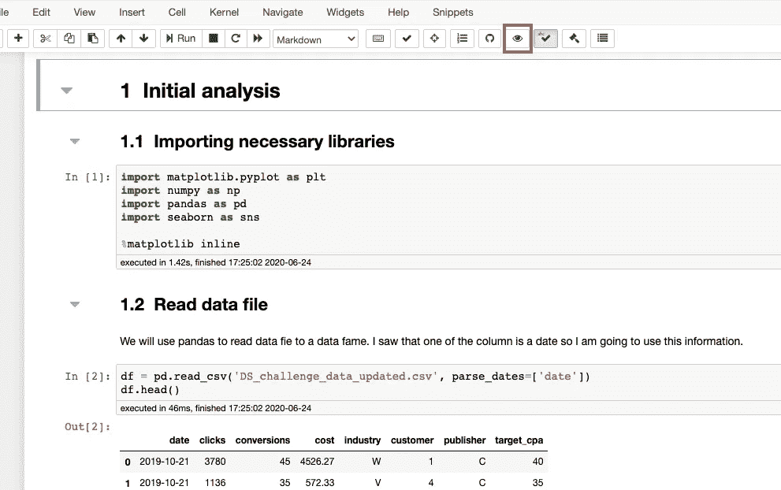

**跳过追溯**

这个扩展允许您在代码中抛出错误时跳过回溯。它显示的不是完整的回溯，而是错误名称和简短的错误描述。

这就是没有扩展的 Jupyter 的正常误差。

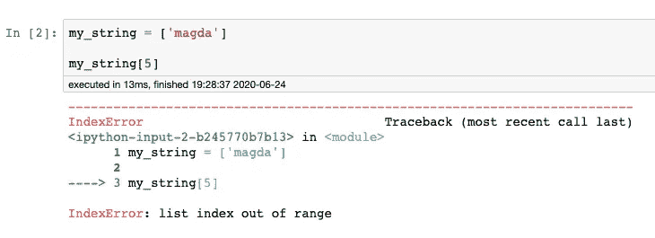

这就是跳过追溯扩展的样子。

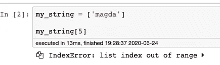

它允许您快速确定错误的原因，如果回溯时间很长，它尤其有用。

它还允许您扩展回溯并查看整个版本。

**总结**

我已经使用这些扩展有一段时间了，有些是绝对的救星。

试用它们，设置它们真的不需要很多时间，它们肯定会让你的笔记本更实用，提高你的工作效率。

此外，如果你想学习一些更高级的扩展，请查看这篇文章。这是你现在正在阅读的文章的后续。

[](/jupyter-notebook-extensions-part-2-55fdb2c38348) [## Jupyter 笔记本扩展(第二部分)

### 安装这些 jupyter 笔记本扩展来提高您的工作效率。

towardsdatascience.com](/jupyter-notebook-extensions-part-2-55fdb2c38348) 

*原载于 about data blog . com:*[9 大 Jupyter 笔记本扩展](https://www.aboutdatablog.com/post/top-9-jupyter-notebook-extensions)，*2020 年 6 月 24 日。*

*PS:我正在 Medium 和*[](https://www.aboutdatablog.com/)**上撰写深入浅出地解释基本数据科学概念的文章。你可以订阅我的* [***邮件列表***](https://medium.com/subscribe/@konkiewicz.m) *每次我写新文章都会收到通知。如果你还不是中等会员，你可以在这里加入**[***。***](https://medium.com/@konkiewicz.m/membership)**

**下面是一些你可能会喜欢的帖子**

**[](/9-pandas-visualizations-techniques-for-effective-data-analysis-fc17feb651db) [## 9 熊猫有效数据分析的可视化技术

### 学习如何使用折线图、散点图、直方图、箱线图和其他一些可视化技术

towardsdatascience.com](/9-pandas-visualizations-techniques-for-effective-data-analysis-fc17feb651db) [](/what-are-lambda-functions-in-python-and-why-you-should-start-using-them-right-now-75ab85655dc6) [## python 中的 lambda 函数是什么，为什么你现在就应该开始使用它们

### 初学者在 python 和 pandas 中开始使用 lambda 函数的快速指南。

towardsdatascience.com](/what-are-lambda-functions-in-python-and-why-you-should-start-using-them-right-now-75ab85655dc6) [](/jupyter-notebook-autocompletion-f291008c66c) [## Jupyter 笔记本自动完成

### 数据科学家的最佳生产力工具，如果您还没有使用它，您应该使用它…

towardsdatascience.com](/jupyter-notebook-autocompletion-f291008c66c)**