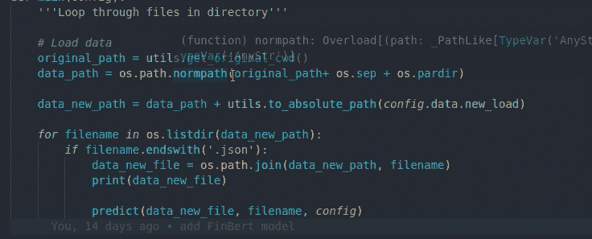
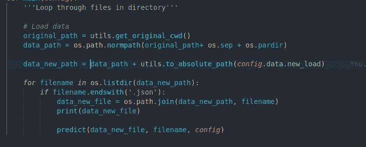
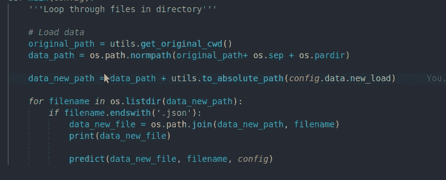
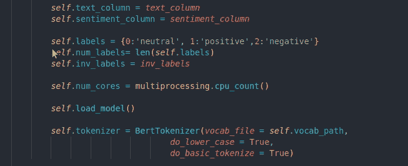
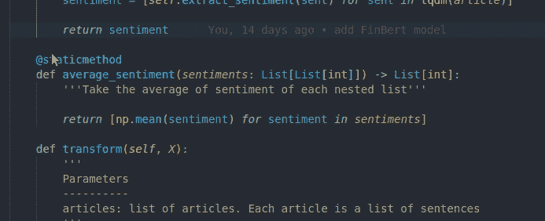
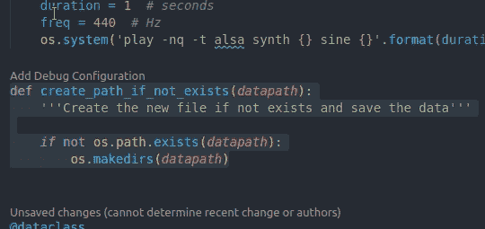
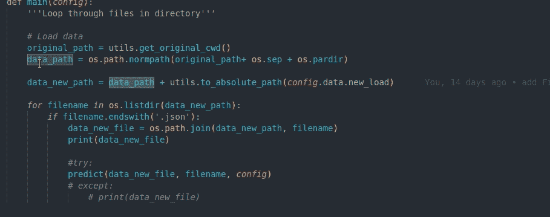
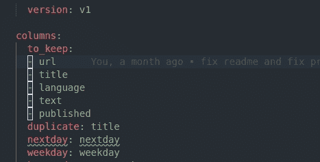
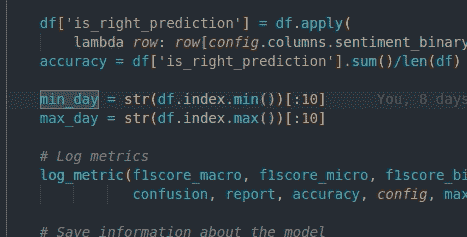
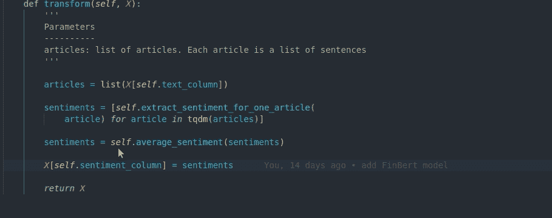

# VSCode 中面向数据科学家的 9 大键盘快捷键

> 原文：<https://towardsdatascience.com/top-9-keyboard-shortcuts-in-vscode-for-data-scientists-468691b65ebe?source=collection_archive---------15----------------------->

## 用这 9 个键盘快捷键提高你的编码速度

[乔丹·欧宝](https://unsplash.com/@opeleye?utm_source=medium&utm_medium=referral)在 [Unsplash](https://unsplash.com?utm_source=medium&utm_medium=referral) 上的照片

# 动机

作为一名数据科学家，你可能会发现自己在电脑和键盘上花了很多时间。如果建筑工人有他的电动工具，数据科学家有他们的键盘作为他们的随身工具。如果你能找到一种方法来更有效地使用你的工具，你将为自己节省很多时间。这就是为什么我是键盘快捷键的忠实粉丝。

如果你不经常使用键盘快捷键，是时候换一个了。掌握键盘快捷键可能需要一点时间，但是一旦你掌握了它们，你会发现自己不用鼠标就能更快地编码。如果你用键盘快捷键每天节省 30 分钟，你就可以每周有 **3.5 小时**！

VSCode 是我最喜欢的 IDE，因为它有用的键盘快捷键和扩展。我介绍了对 [**视图代码**](/top-4-code-viewers-for-data-scientist-in-vscode-e275e492350d) 和 [**的一些扩展，其中包含了 Python**](/incorporate-the-best-practices-for-python-with-these-top-4-vscode-extensions-3101177c23a9)**的最佳实践，但我还没有深入研究键盘快捷键。**

**VSCode 中有许多键盘快捷键，它们可能会让你不知所措。在本文中，我将缩小范围，只列出我最常用的 9 个键盘快捷键。**

> **如果你觉得要记的东西太多，就把这些键盘快捷键写在一张小纸上，当你学习这些键盘快捷键时，把它作为一个提醒。即使你能从这篇文章中学到 1 个键盘快捷键，那也已经比不使用任何键盘快捷键帮助你更快地编码了。**

# **基本编辑**

> ****注:**本节列出的快捷键可用于不同的编辑器，如 Medium 或 Word。**

## ***将选择扩展到下一个或上一个单词***

**使用 **Shift + Ctrl +左/右**扩展选择到下一个或上一个**单词**比使用鼠标选择特定文本或使用 Shift +左扩展选择到下一个或上一个字符更快。**

**对于 Mac 用户: **Option + Shift +左/右****

****

## **选择从当前光标到行尾或行首的单词**

**如果你想选择从当前光标到行尾的单词，你可以使用 Shift + Ctrl + Left/Right 来扩展选择到下一个或上一个单词，就像上面提到的，但是有一个更快的方法。**

**使用下面的 **Shift + End** 将选择从当前光标扩展到行尾。**

****

**要将选择从当前光标扩展到行首，使用 **Shift + Home** 。**

****

# **虚拟代码快捷方式**

## **删除该行而不突出显示整行**

**如果你一直通过高亮显示整行来删除该行，然后键入 Backspace，有一种比这更快的方法。只需键入 **Ctrl + X** 。现在整行都删了！**

**对于 Mac 用户: **Command + Shift + K****

****

## **缩进/突出行**

**当然，您可以使用 Tab 来缩进一行，但是如果您想要突出一行呢？这时候 Ctrl +左/右就变得得心应手了。**

**只需选择您想要缩进或突出的行，然后键入 **Ctrl +左/右。****

**对于 Mac 用户: **Command + Left/Right****

****

## **加注释**

**如果您一次手工注释掉每一行，那么是时候向上切换了。使用 **Ctrl + /** 注释掉和取消注释您突出显示的代码。**

**对于 Mac 用户:**命令+ /****

****

## **立刻改变相似的单词**

**当您想要更改变量的名称时，您可能想要一次更改所有变量，而不是手动更改每个变量。突出显示您想要更改的变量，然后键入 **Ctrl + Shift + L** 来一次选择相似的变量。**

**对于 Mac 用户: **Command + Fn + F2****

****

## **在上方或下方插入光标**

**你有没有想过像下面这样在光标上方或下方固定几行？一个快速的方法是使用 **Shift + Alt + Up/Down。****

**对于 Mac 用户: **Command + Option + Shift +上/下****

****

## **在选定的每一行的末尾插入光标**

**如果您想从行尾开始一次修改几行代码，突出显示您想修改的代码行，并使用 **Shift + Alt + I****

**对于 Mac 用户: **Option + Shift + I****

****

## **向上或向下移动线条**

**要上下移动该行，不要复制整行，删除该行，最后粘贴到另一个位置，如果新位置不远，使用 **Alt + Up/Down** 代替。**

**对于 Mac 用户:**选项+向上/向下****

****

# **结论**

**恭喜你！您刚刚在普通编辑器和 VSCode 中学习了 9 个键盘快捷键！一旦你掌握了这些键盘快捷键，你会看到你的手指在键盘上飞舞。你不仅可以更快地编码，还会发现它很有趣！**

**特别感谢[帕特里克·达席尔瓦](https://medium.com/u/a3e71af8caa6?source=post_page-----468691b65ebe--------------------------------)为 Mac 用户提供键盘快捷键。**

**我喜欢写一些基本的数据科学概念，并尝试不同的算法和数据科学工具。你可以在 LinkedIn 和 [Twitter](https://twitter.com/KhuyenTran16) 上和我联系。**

**星[这个回购](https://github.com/khuyentran1401/Data-science)如果你想检查我写的所有文章的代码。在 Medium 上关注我，了解我的最新数据科学文章，例如:**

** [## 我收集了超过 1k 的顶级机器学习 Github 配置文件，这就是我的发现

### 从 Github 上的顶级机器学习档案中获得见解

towardsdatascience.com](/i-scraped-more-than-1k-top-machine-learning-github-profiles-and-this-is-what-i-found-1ab4fb0c0474)  [## 可视化的 6 大 Python 库:使用哪一个？

### 对使用哪种可视化工具感到困惑？我为你分析了每个图书馆的利弊

towardsdatascience.com](/top-6-python-libraries-for-visualization-which-one-to-use-fe43381cd658)  [## Hydra.cc 简介:配置数据科学项目的强大框架

### 尝试不同的参数和模型，而无需花费数小时来修改代码！

towardsdatascience.com](/introduction-to-hydra-cc-a-powerful-framework-to-configure-your-data-science-projects-ed65713a53c6)  [## 模式介绍:验证数据的 Python 库

### 验证您的数据变得更加复杂！

towardsdatascience.com](/introduction-to-schema-a-python-libary-to-validate-your-data-c6d99e06d56a)**