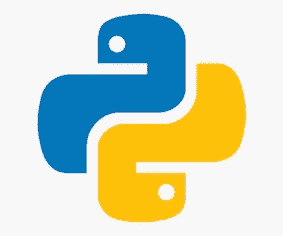
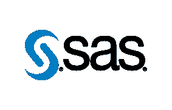
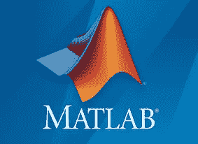

# 2020 年数据科学的 9 大语言

> 原文：<https://towardsdatascience.com/top-9-languages-for-data-science-in-2020-824239f930c?source=collection_archive---------10----------------------->

## 在 256 种编程语言中，要知道哪一种是用于数据科学的！

照片由[克莱门特·H](https://unsplash.com/@clemhlrdt?utm_source=unsplash&utm_medium=referral&utm_content=creditCopyText)在 [Unsplash](https://unsplash.com/s/photos/coding?utm_source=unsplash&utm_medium=referral&utm_content=creditCopyText) 上拍摄

很长一段时间以来，数据科学一直是一件大事。在当今快速发展的技术世界中，当人类倾向于生成大量数据时，我们知道如何分析、处理和使用这些数据来获得更深刻的商业见解是至关重要的。

关于数据科学的*Python vs R*已经说得够多了，但是我在这里不讨论它。我们需要他们两个，仅此而已。我为数据科学创建了一个 10 大编程语言的列表，你可以在 2020 年学习，同时还有一些时间回到户外😐

根据语言的受欢迎程度、Github 提及次数、利弊以及它们与 2020 年数据科学的相关性，这些语言被列入了名单。

# 1.计算机编程语言

> 你需要的只是 Python。Python 就是你需要的全部。

来源: [Python 软件基础](https://www.python.org/community/logos/)

关于为什么 Python 是数据科学的语言，我可以写几十个故事。

由于其多功能性，数据科学家可以使用 *Python* 解决几乎所有与数据科学过程相关的问题。

## 为什么是 Python？

Python 面向对象的特性有助于数据科学家以更好的稳定性、模块化和代码可读性来执行任务。虽然数据科学只是多样化的 Python 生态系统的一小部分，但 Python 拥有丰富的专业深度学习和其他机器学习库以及流行的工具，如 *scikit-learn、Keras 和 TensorFlow。*毫无疑问，Python 使数据科学家能够开发出可以直接插入生产系统的复杂数据模型。

根据 [Python 开发者的调查结果](https://www.jetbrains.com/research/python-developers-survey-2018/)，84%的受访者将 Python 作为他们的主要语言，而 16%的受访者将 Python 作为他们的第二语言。

## Python 中的数据

对于 ***数据采集*** ，Python 支持 CSV、JSON、SQL 表，以及美汤的 web 报废。

***数据分析*** 库为 Python，*熊猫*是你能得到的最好的数据探索。熊猫被组织成数据框架，可以轻松地过滤、分类和显示数据。

对于 ***，*** 的数据建模

1.  NumPy —数值模拟分析
2.  科学计算和计算
3.  sci kit-learn-访问众多强大的机器学习算法。它还提供了一个直观的界面，允许数据科学家利用机器学习的所有功能，而不需要太多的复杂性

对于 ***数据可视化*** ，matplotlib、plot.ly、nbconvert 将 Python 文件转换为 HTML 文档，拼出漂亮的图形和仪表盘，帮助数据科学家用力量和美感表达研究结果。

# 2.稀有

来源: [R 基金会](https://www.r-project.org/logo/)

r 是一个开源工具，允许数据科学家跨平台使用许多操作系统。统计是这项技术的核心优势。r 不仅仅是一种语言，而是一个完整的生态系统来执行统计计算。它有助于执行数据处理、数学建模、数据可视化等操作。

## R 中的数据

r 支持 Excel，CSV，text 文件，Minitab 或 SPSS 文件格式，用 Rvest 进行 web 报废，以及此类文件格式用于 ***数据采集。***

r 是为了对大型数据集进行统计和数值分析而构建的，因此，有大量的操作可用于*【数据探索】—排序数据、转置表、创建图表、生成频率表、采样数据、概率分布、合并数据、变量转换等等。探索 dplyr，tidyr 以获得最佳结果。*

*r 是一个适合科学可视化的健壮环境，它有许多专门为 ***数据可视化*** 的结果提供图形显示的软件包。我们可以使用图形模块获得基本图形、图表和绘图。可视化也可以保存为图像格式，如 jpg。，或单独的 pdf。ggplot2 是高级图的福音，例如具有回归线的复杂散点图。*

## *R vs Python*

*对于数据科学来说，Python 和 R 之间的争论永无止境，但是我们作为数据科学家需要明白，虽然两者都有优点，但也有缺点。*

*大多数程序员认为这种或那种编程语言是他们的“首选”。比方说，R 用户有时渴望 Python 语言内置的面向对象特性。类似地，一些 Python 用户梦想在 r 中获得大范围的统计分布。这意味着很有可能在一个项目中结合这两种领先的技术来获得一组独特的互补函数。*

# *3.斯卡拉*

**

*来源:[Scala 编程 Language.org](https://www.scala-lang.org)*

*Scala 是面向对象和函数式编程在一种简洁的高级语言中的结合。这种语言最初是为 Java 虚拟机(JVM)而构建的，Scala 的优势之一是它使与 Java 代码的交互变得非常容易。*

## *为什么选择 Scala？*

*学习 Scala 进行数据科学研究的主要原因之一可以归功于 Apache Spark。Scala 与 Apache Spark 结合使用来处理大数据量(大数据),这对数据科学家来说是非常宝贵的。*

*许多构建在 Hadoop 之上的高性能数据科学框架通常是用 Scala 或 Java 编写和使用的。在这些环境中使用 Scala 的原因是因为它的快速并发支持。由于 Scala 运行在 JVM 上，所以当它与 Hadoop 配对时几乎是显而易见的。*

## *为什么不是 Scala？*

*Scala 唯一的缺点是它的学习曲线。此外，社区并不广泛，因此，在出现错误的情况下，自己寻找问题的答案变得很乏味。*

*当数据量足以实现技术的全部潜力时，Scala 非常适合项目。*

# *4.斯堪的纳维亚航空公司*

**

*来源: [SAS 品牌标识](https://brand.sas.com/en/home/our-identity/visual-elements/logo.html)*

*SAS —统计分析系统*

*就像 R 一样，SAS 是为高级数据分析和复杂统计操作而开发的工具。它是一个闭源的专有工具，提供了各种各样的统计功能来执行复杂的建模。由于其高可靠性，SAS 主要由大型组织和专业人员使用。*

## *为什么选择 SAS？*

*请注意，SAS 不是最适合初学者和独立数据科学爱好者的工具，因为 SAS 是为满足高级业务需求而定制的。然而，如果你打算将数据科学作为你的职业，那么拥有 SAS 的操作知识是一个很好的实践。*

*SAS 擅长通过 SAS Base 执行统计建模 SAS Base 是运行 SAS 环境的主要编程语言。*

## *为什么不是 SAS？*

*虽然 SAS 已经成为企业分析领域无可争议的市场领导者，但要将其功能与 Python 或 R 进行比较，SAS 似乎很难对数据进行建模和可视化。学习曲线很复杂，通常被预算庞大的大公司使用。*

*SAS 为数据科学家提供多种认证计划。他们中的一些人:*

* [## SAS 数据科学学院

### SAS 数据科学学院提供数据管理，高级分析，人工智能和机器学习的课程，所以你…

www.sas.com](https://www.sas.com/en_us/training/academy-data-science.html)  [## SAS 程序员专业证书| Coursera

### 用 SAS 证书开始你的职业生涯。掌握 SAS 基础程序员认证所需的技能。基础…

www.coursera.org](https://www.coursera.org/professional-certificates/sas-programming) 

# 5.朱莉娅

来源:[GitHub](https://github.com/JuliaLang/julia-logo-graphics)ViralBShah

Julia 语言处理数据的速度比 Python、JavaScript、Matlab、R 快，性能上略逊于 Go、Lua、Fortran、c，数值分析是技术的强项，但 Julia 也能很好地应对通用编程。

## 为什么是朱莉娅？

Julia 比其他脚本语言更快，允许数据科学家快速开发 Python/MATLAB/R，同时生成快速的代码。

有了 Julia 数据生态系统，多维数据加载就变得很快。它并行执行聚合、连接和预处理操作。Julia 包括各种数学库、数据操作工具和通用计算包。除此之外，与 Python、R、C/Fortran、C++和 Java 的库集成也非常容易。

## 为什么不是朱莉娅？

由于 Julia 不是一个完全成熟的工具，所以社区仍然很窄。在查找错误或故障时，有限的选项或解决方案可能会成为障碍。行业专家非常希望，当 Julia 变得更加成熟时，它将能够与 Python 和 R 充分竞争。

# 6.a MATLAB

来源:[MathWorks Logo—MATLAB&Simulink](https://www.mathworks.com/brand/visual-design/mathworks-logo.html)

MATLAB 是第一个用于数据科学的工具。我在 2017 年开始学习数据科学，吴恩达在 Coursera 上开设了机器学习课程，他在课堂上使用了 Octave。与此同时，我在本科班学习 MATLAB，在 Coursera 班练习 MATLAB。

我知道 MATLAB 是执行深奥数学运算的最佳编程语言。虽然数据科学也与数学有关，但它使这项技术成为数学建模、图像处理和数据分析的强大工具。

## 为什么是 MATLAB？

它拥有一个庞大的数学函数库，用于线性代数、统计、傅立叶分析、滤波、优化、数值积分和求解常微分方程。MATLAB 提供了用于可视化数据的内置图形和用于创建自定义绘图的工具。

## 为什么不是 MATLAB？

现在，数据科学家很少使用 MATLAB，尽管他们说它非常适合数学和建模。随着 R 和 Python 在数据科学领域的出现，MATLAB 一直在走下坡路。鉴于高昂的许可费用，它在学术界也更受欢迎。

数据科学使用的语言很大程度上取决于您正在解决的问题。如果您的问题需要复杂的数学计算，没有比 MATLAB 更好的起点了，至少对于最初的数据探索和初步结果来说是这样。

# 6.b 八度

来源:【Octave.org GNU

它是 MATLAB 的主要替代品。总的来说，这两种技术没有非常根本的区别，只是一些小的例外。和 MATLAB 一样，如果需要强大的算术计算，Octave 可以用在数据量相对较小的项目中。

# 7.Java 语言(一种计算机语言，尤用于创建网站)

来源: [Java —徽标下载](https://logos-download.com/10695-java-logo-download.html)

Java 可能是用于编程和商业开发的最古老的面向对象语言之一。Hive、Spark 和 Hadoop 等大多数知名大数据工具都是用 Java 编写的。Java 有大量我们可能不知道的用于数据科学的库和工具，比如 *Weka、Java-ML、MLlib 和 Deeplearning4j。*

## 为什么是 Java？

对于数据科学来说，Java 可能肯定不是一种显而易见的语言，但由于运行在 Java 虚拟机(JVM)上的 Hadoop 等数据科学框架，它是数据科学的顶级编程语言之一。

Hadoop 是一个流行的数据科学框架，用于管理大数据应用程序的数据处理和存储。鉴于其一次处理无限任务的能力，Hadoop 支持存储和处理大量数据。

总之，如果您想享受 Hadoop 框架的功能，Java 是最好的数据科学编程语言之一。

# 8.Perl 语言

来源: [PNGWing](https://www.pngwing.com/en/free-png-xpdup)

Perl 是由两种高级、通用、解释型、动态编程语言组成的家族。Perl 能够更有效地处理数据查询，因为该语言依赖于轻量级数组，这不需要程序员太多的关注。

为什么是 Perl？

由于其作为通用脚本语言的多功能性，它与 Python 有很多共同之处，是一种动态类型的脚本语言。Perl 在生物信息学、金融和统计分析等定量领域都有应用。

随着 Perl 5 的发布，处理大型数据集的能力比以前的版本好得多。它正在成为 Perl 6 的“大数据精简版”。波音、西门子和更多的财富 500 强公司已经准备好为数据科学积极尝试 Perl。

Perl 通过编排大规模的数据插入和查询，用简单、可维护的体系结构映射或减少万亿字节的数据。对于 Perl 6，计划是提供一个模块化、可插拔的架构，具有大数据管理的灵活性和可定制性。

## 为什么不是 Perl？

Perl 不是一种语言，学习它本身就能让你成为一名高效的数据科学家。它不够快，语法也不友好。由于它是一种相对冷门的语言，社区对数据科学的支持一直较少。值得一提的是,“Perl 开发人员”社区正在变得越来越富裕。总的来说，还没有将 Perl 开发成数据科学语言的动力。

# 9.哈斯克尔

来源:[哈斯克尔标识—哈斯克尔维基](https://wiki.haskell.org/Haskell_logos)

Haskell 是一种通用的、静态类型的、带有类型推断的纯函数式编程语言。

## 为什么是哈斯克尔？

Haskell 拥有强大的金融代码基础，而 Haskell 可以轻松地与 Excel 交互进行计算。它对数学概念的编码很有好处。更一般地说，Haskell 擅长于*抽象*，所以数据科学从 Haskell 的一致抽象中获益，就像其他数学或软件工具一样多。

Haskell 还可以用 HaskellR 直接对 R 中的值进行*操作。*

Haskell 拥有 D *ataHaskell* ，这是一个开源资源，通过利用 Haskell 编程语言来进行可靠且可重复的数据科学和机器学习开发。Haskell 中的数据科学社区肯定会随着 DataHaskell 的发展而发展。请务必在这里查看！

Target [的首席人工智能科学家说](https://www.forbes.com/sites/quora/2018/01/24/when-is-haskell-more-useful-than-r-or-python-in-data-science/#3f0e6f3669e4)“*Haskell 更富表现力，更快，更安全。Haskell 传统上没有被用于数据科学，因此库的选择是有限的。Haskell 对数学有一种亲切感，但最终它的类型系统和数学性对特定领域的业务代码帮助最大。*

## 为什么不是哈斯克尔？

Haskell 有一个作为数据科学语言的应用程序，然而，像 Python 或 r 一样，仅仅了解 Haskell 是不够的。Haskell 在数据科学能力方面不够健壮。学习曲线本质上是困难和耗时的。

感谢您的阅读！我希望你喜欢这篇文章。请务必让我知道您一直在使用哪种语言，以及您希望在这个夏天的数据科学之旅中发现哪种语言？

*快乐数据 Tenting！*

*免责声明:本文表达的观点仅代表我个人，不代表严格的观点。*

# 了解你的作者

拉什是芝加哥伊利诺伊大学的研究生。她喜欢将数据可视化，并创造有见地的故事。当她不赶着赶学校的最后期限时，她喜欢喝一杯热巧克力，写一些关于技术、UX 等的东西。*