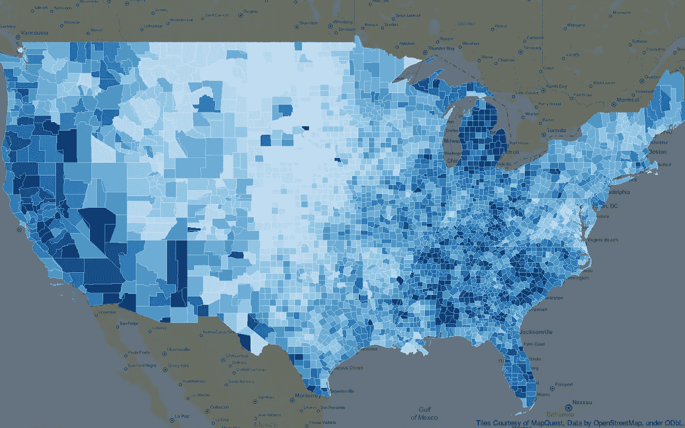

# Python 和 R 中数据可视化的 9 大库

> 原文：<https://towardsdatascience.com/top-9-libraries-for-data-visualization-in-python-and-r-51bdf08e5d54?source=collection_archive---------18----------------------->

## 为你的下一个项目选择正确的数据 viz 库...

[粘土银行](https://unsplash.com/@claybanks?utm_source=unsplash&utm_medium=referral&utm_content=creditCopyText)在 [Unsplash](https://unsplash.com/s/photos/visualization?utm_source=unsplash&utm_medium=referral&utm_content=creditCopyText) 拍摄的照片

在当今快速发展的世界中，技术正以前所未有的速度发展，大数据正迅速走进人们的生活。虽然人们可能有获得数据的方法，但当涉及到用它得出见解或结论时，存在一个令人挠头的问题，因为数据太多了。

正如他们所说，一张图片胜过千言万语，高管和非技术决策者严重依赖并偏好可视化和信息图表来理解潜在的业务见解，并向利益相关方传达/推介。数据驱动的决策正在走向顶端，我们需要确保对艺术工具保持乐观。

话虽如此，本周我还是整理了我使用过、发现过或听说过的最棒的库，这些库提供了很好的数据可视化和额外的好处！让我们来了解一下这些库，*，排名不分先后。*

# 1.matplotlib

OG Python 库，用数据创造故事。SciPy 堆栈中的另一个库 Matplotlib 主要绘制 2D 图形。

*什么时候使用？Matplotlib 是 Python 的典型绘图库，它提供了一个面向对象的 API，用于将绘图嵌入到项目文件或应用程序中。我发现 Matplotlib 与嵌入 Python 编程语言的 MATLAB 非常相似。*

## 你能用 Matplotlib 做什么？

直方图，条形图，散点图，面积图到饼图，Matplotlib 可以描绘各种各样的 2D 可视化。使用 Matplotlib，只需一点努力和可视化功能，您就可以创建任何可视化效果:

1.  线形图
2.  散点图
3.  面积图
4.  条形图和直方图
5.  饼图
6.  树干图
7.  等高线图
8.  颤动图
9.  光谱图

Matplotlib 还通过 Matplotlib 简化了标签、网格、图例和其他一些格式化实体。基本上能画的都画了！

作者:[约翰·d·亨特](https://en.wikipedia.org/wiki/John_D._Hunter)
了解更多:[matplotlib.org](https://matplotlib.org/)

# 2.海生的

当你阅读 Seaborn 的官方文档时，它被定义为基于 Matplotlib 的数据可视化库，为绘制有吸引力和信息量大的统计图形提供了高级接口。简单来说， *seaborn* 是 Matplotlib 的扩展，具有高级特性。

那么，Matplotlib 和 Seaborn 有什么区别呢？
*Matplotlib* 用于基本绘图；条形图、饼图、线图、散点图等等，而 *seaborn* 提供了各种高级可视化模式，具有更少的复杂性和语法。

## 你能用 Seaborn 做什么？

1.  确定多个变量之间的关系(相关性)
2.  观察聚合统计的分类变量
3.  分析单变量或双变量分布，并在不同的数据子集之间进行比较
4.  绘制因变量的线性回归模型
5.  提供高级抽象、多绘图网格

创作人:[迈克尔·瓦斯科姆](https://twitter.com/michaelwaskom)，可用[模式](https://mode.com/help/articles/notebook/#python)
哪里了解更多:[http://web . Stanford . edu/~ mwaskom/software/seaborn/index . html](http://web.stanford.edu/~mwaskom/software/seaborn/index.html)

# 3.Plotly

Plotly 又是一个 Python 的图形绘制库。用户可以导入、复制、粘贴或流式传输要分析和可视化的数据。

Python 中的每个数据 viz 库互不相同，同时在一些特性上也有重叠。就可用的 viz 范围而言，Plotly 与 *matplotlib* 有许多重叠，就高级功能而言，plotly 与 *seaborn* 有许多重叠。

何时使用 Plotly？
如果您想要创建和显示图形、更新图形、悬停在文本上查看详细信息，您可以使用 Plotly。Plotly 还有一个额外的功能，就是把数据发送到云服务器。真有意思！

## 你能用 Plotly 做什么？

Plotly 图形库提供了大量可供绘制的图形:

1.  ***基本图表:*** 折线图、饼图、散点图、气泡图、圆点图、甘特图、旭日图、树形图、填充区域图
2.  ***统计和 Seaborn 风格*** :误差、方框、直方图、面和格子图、树形图、小提琴图、趋势线
3.  ***科学图表:*** 等高线、三元图、对数图、箭图、地毯图、雷达图、风玫瑰图和极坐标图
4.  财务图表
5.  地图
6.  支线剧情
7.  转换
8.  Jupyter Widgets 交互

想想可视化和 Plotly 可以做到这一点！

创建者: [Plotly](https://plot.ly/) ，可用[模式](https://mode.com/help/articles/notebook/#python)
哪里了解更多:[https://plot.ly/python/](https://plot.ly/python/)

# 4.散景

另一个来自 Python 家族的例子，我想称之为交互式数据可视化库——Bokeh 允许用简单的命令快速构建复杂的统计图。

散景受欢迎的原因和它在我的列表中的位置是因为散景使数据在视觉上有吸引力，迫使人们关注可视化的特定区域。Bokeh 还可以很好地与 D3.js 配合使用，为非常大的数据集或流数据集创建高交互性的交互式可视化。

有趣的事实:【Bokeh(也叫“boke”)这个词来自日语，翻译过来就是*模糊*。

## 你能用散景做什么？

1.  优雅、简洁的多功能图形结构
2.  在大型或实时数据集上扩展高性能交互性
3.  快速轻松地创建交互式绘图、仪表板和数据应用程序
4.  利用 HTML、笔记本或服务器输出
5.  将散景可视化集成到 Flask 和 Django 应用程序或其他库中编写的可视化，如 matplotlib、seaborn、ggplot。

创建者:【http://bokeh.pydata.org/en/latest/】连续统分析
哪里了解更多:

# 5.geoplotlib

*Choropleth (* [*安德里亚·卡顿*](https://github.com/andrea-cuttone/geoplotlib) *)*

*geoplotlib，*主要用于创建地图和绘制地理数据的工具箱可用于创建各种地图类型，如柱状图、热图或点密度图。因为大多数 Python 数据可视化库不提供地图，所以最好有一个专门用于它们的库，而不要从 Tableau 中查找外部的 viz。

我最喜欢的一个特性是*色图*——将真实值转换成颜色。

我不知道你能用 geoplotlib 做什么，因为它本质上是一个地图绘制库。

创建者:【https://github.com/andrea-cuttone/geoplotlib】安德里亚·卡通
了解更多信息

# 6.D3.js

说到数据可视化，怎么能不谈 [D3](http://d3js.org/) 。js，SVG 矢量图形的主流工具！有了 SVG，无论你放大到多深，图形看起来都不会像素化——这是最畅销的报告。

D3.js 为数据向导提供了各种图形。D3 是一个将信息加载到浏览器中并基于数据元素生成报告的框架。D3.js 并没有建议一种特定类型的图形，而是建议一种如何创建可视化的方法(根据我的最佳理解)。

## 用 D3.js 可以做什么？

1.  分布图—小提琴图、密度图、直方图、箱线图、脊线图
2.  相关性—散点图、热图、相关图、气泡图、密度图
3.  排名—条形图、蜘蛛图、词云、平行图、棒棒糖图、圆形图
4.  整体的一部分—树状图、甜甜圈、饼图、树状图、圆形包装
5.  演变-折线图、面积图、堆积面积图、流图
6.  地图-地图、choropleth、十六进制框、图表、连接
7.  流量—弦图、桑基图、弧图
8.  动画片

D3.js 提供了广泛的可视化，更多的可视化可以在这里探索。

# 7.ggplot2

r 丰富的生态系统有许多著名的制作漂亮图形的软件包，但是最流行和最常用的可视化软件包之一是 *ggplot2* 。

*ggplot2* 是 R 编程语言的 Grammar of Graphics 的 Python 实现，用于构建分层的、定制的地块。我没有发现 Tidyverse 的 ggplot2 有 seaborn 那样广泛的绘图集合，但是对于 R 来说，ggplot2 制作了最健壮的数据 viz 库(至少就我的经验而言)。如果了解更多，欢迎在评论中补充！

## 你能用 ggplot2 做什么？

Plotly 图形库提供了大量可供绘制的图形:

1.  ***基本图表:*** 线条、轮廓、密度、抖动、条形、点、栅格、多边形、平铺、地毯、饼图、散点、气泡
2.  ***统计图*** :箱线图、直方图、小提琴图、带状图、分位数图
3.  动画图表
4.  边缘图表

创建者:[http://ggplot.yhathq.com/](http://yhathq.com/)t18】去哪里了解更多:[t20】](http://ggplot.yhathq.com/)

# 8.Plotly for R

Plotly 在 R 中也可用，R 中的 Plotly 使用 plotly.js 库作为基础创建基于 web 的交互式绘图。这里的优点是它可以构建等高线图、蜡烛图、地图和 3D 图表，这些是使用 r 中的大多数包无法创建的。Plotly 还提供了一个与图表互动的机会，改变它们的比例，并指出必要的记录——将它展示给高管看。该库还支持图形悬停，有点类似于 Tableau。此外，在 knitr、R Markdown 或 Shiny 应用程序中添加 Plotly 也很容易。

## 你能用 R 中的 Plotly 做什么？

1.  等值线图表
2.  蜡烛图
3.  3D 散点图(就像吴恩达的 Coursera ML class :p 中的那个)

# 9.臀的

pygal 也是一个创建 SVG 图形/图表的 Python 模块。我没有使用过 Pygal，但我认为它是一个高度可定制的低代码模块，但也非常简单。

像 Bokeh 和 Plotly 一样，pygal 也提供可以嵌入网络浏览器的交互式绘图。它们之间的关键区别在于它能够将图表输出为 SVG。只要您在处理较小的数据集，SVG 就能很好地满足您的需求。然而，当处理具有成千上万个数据点的大型数据集时，问题就来了，它们在渲染时会有困难，速度会变得很慢。

## 你能拿 pygal 怎么办？

1.  曲线图
2.  条形图
3.  饼图
4.  地图
5.  定制图表

创建者:[弗洛里安·穆尼尔](https://github.com/Kozea)
了解更多:[http://www.pygal.org/en/latest/index.html](http://www.pygal.org/en/latest/index.html)

这就是我的博客的结尾。感谢您的阅读！我希望这有所帮助。一定要让我知道你使用过或者正在寻找学习或者探索的图书馆。如果你有更多的库，欢迎在评论中提出来！

*免责声明:本文表达的观点仅代表我个人，不代表严格的观点。*

# 了解你的作者

拉什是芝加哥伊利诺伊大学的研究生。她喜欢将数据可视化，并创造有见地的故事。当她不赶着赶学校的最后期限时，她喜欢喝一杯热巧克力，写一些关于技术、UX 等的东西。