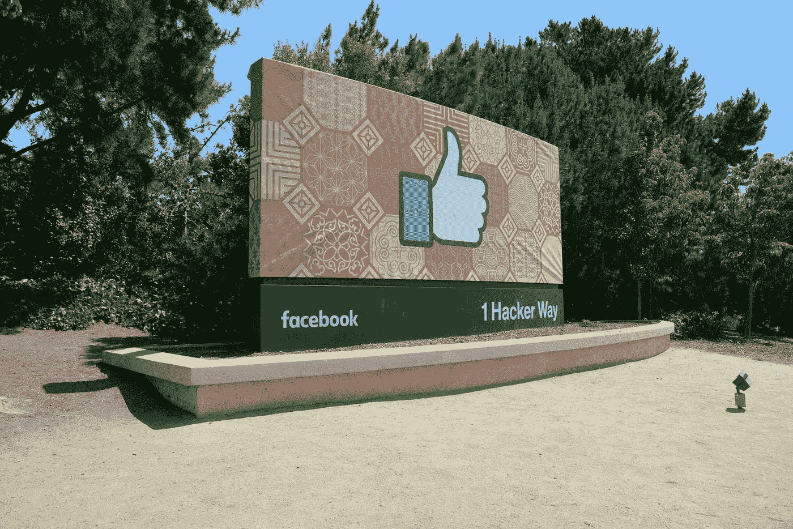
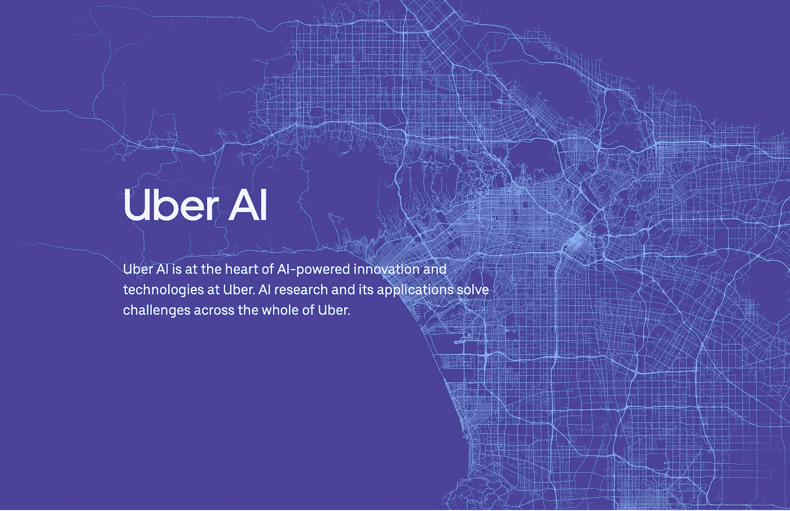
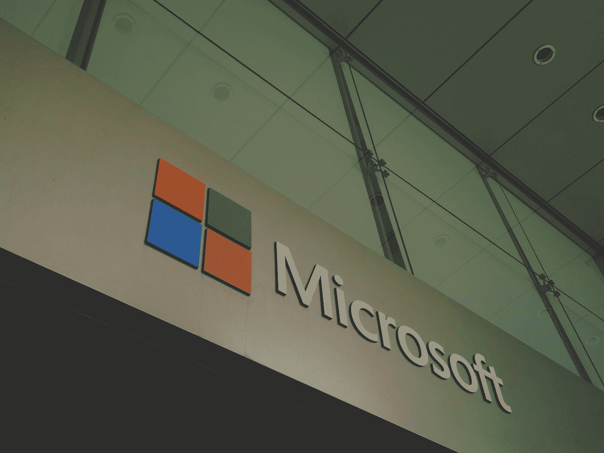
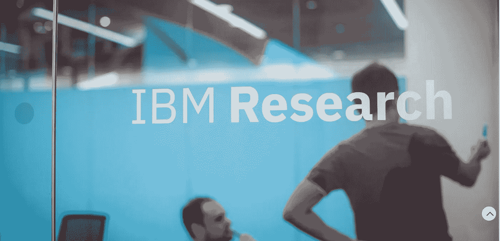

# 值得关注的顶级人工智能奖学金项目

> 原文：<https://towardsdatascience.com/top-ai-fellowship-programs-to-look-out-for-344af565824c?source=collection_archive---------22----------------------->

## 最佳人工智能实习指南。

我明白找到一份实习工作有多难，因为我经历过。尤其是发生了这么多事。今天，我们将谈论一个最好的实习项目，它专注于机器学习和数据科学。参加这些项目不仅会让你从该领域的大多数候选人中脱颖而出，还会让你获得前所未有的学习经验。

系好安全带，你的实习搜索将会有一个新的视角。

# **1。**谷歌人工智能常驻计划

照片由 [Rajeshwar Bachu](https://unsplash.com/@rajeshwerbatchu7?utm_source=medium&utm_medium=referral) 在 [Unsplash](https://unsplash.com?utm_source=medium&utm_medium=referral) 拍摄

谈到最佳实习，不谈谷歌毫无意义。谷歌是所有计算机科学专业人士和学生的梦想。

顾名思义，Google AI residency program 是一项为期 18 个月的 AI 研究计划，目标是支持下一代 AI 研究人员。所有被选中的候选人都有机会接受谷歌科学家和研究人员的指导，并与 alphabet 的团队合作。

开放申请:2021 年秋季项目。

更多信息[此处](https://research.google/careers/ai-residency/)

# **2。**脸书人工智能居留项目

照片由[格雷格·布拉](https://unsplash.com/@gregbulla?utm_source=medium&utm_medium=referral)在 [Unsplash](https://unsplash.com?utm_source=medium&utm_medium=referral) 上拍摄

另一个高薪和知名的程序来自社交媒体巨头脸书的人工智能部门。候选人将学习如何在深度学习中进行研究，发表研究成果，并将学习将学术文献转化为实用代码。

具有 ML 相关专业背景，并在 ICML、ICLR、CVPR、ICCV、ACL、EMNLP 等杂志上发表过研究论文者优先考虑。

开放申请:2021 年秋季项目

更多信息[点击此处](https://ai.facebook.com)

# **3。**优步人工智能居留项目

[来源](https://www.uber.com/in/en/uberai/)

说到鼓励创新的酷科技公司，优步无疑是出了名的。作为全球最大的打车服务之一，在该公司应用 ML 和数据科学的前景非常广阔。

这也是一个为期一年的项目，面向寻求在机器学习研究领域推进职业生涯的个人。

被选中的居民将参与一切事情，从开发新的机器学习算法到训练大规模模型，以改善数百万用户的用户体验。推荐申请的候选人具有“在机器学习或深度学习算法方面的经验，并表现出对相同内容的热情。如果你对 ML 感到兴奋，向我们展示你迄今为止所做的一切！”优步

开放申请:2021 年秋季项目

更多信息[此处](https://www.uber.com/in/en/uberai/)

# **4。**微软人工智能常驻计划

照片由[法兰克诉](https://unsplash.com/@franckinjapan?utm_source=medium&utm_medium=referral)在 [Unsplash](https://unsplash.com?utm_source=medium&utm_medium=referral) 拍摄

微软于 2015 年启动了这项计划，这是另一家在人工智能研究领域领先的公司，将为候选人提供机会，在医疗保健、科学发现、生产力和游戏等一系列领域学习和部署人工智能技术和解决方案。这个项目也是一年。资格要求包括定量领域的学位，从计算机科学、物理学到经济学、人机交互和计算生物学。其他要求包括在编程和深度学习框架方面有很强的背景。

开放申请:2021 年秋季项目

更多信息[此处](https://www.microsoft.com/en-us/ai?activetab=pivot1%3aprimaryr6)

# **5。**开放 AI 学者计划

当谈到人工智能的研究时，不谈论 OpenAI 会超级奇怪。

Elon Musk 的创意公司 OpenAI 负责创建开源人工智能，也是深度学习算法 GPT 的创造者。这种算法非常先进，它可以自己生成图像、文本和编写代码。让这家公司加入你的人工智能投资组合，肯定会为你在这个领域打开多扇大门。

该计划为您提供 10 个月的深度学习研究经验，并提供额外津贴，如参加 ML 会议的全额工资和津贴。

候选人必须具备以下条件才有资格参加该计划:

2 年以上软件工程经验

强大的数学背景

通过项目或经历表现出对 ML 的兴趣。

开放申请:2021 年秋季项目

更多信息[点击此处](https://openai.com/about/)

# **6。** IBM 人工智能派驻计划

[来源](https://www.research.ibm.com/artificial-intelligence/careers/ai-residency/#about)

最后但同样重要的是，IBM 的人工智能计划也是最雄心勃勃的 12 个月人工智能计划之一。他的项目旨在创造和研究人工智能的新方法，以提高应对重大技术和现实世界挑战的能力。居民将与研究科学家密切合作，建立新的人工智能技术，并在顶级研究期刊上发表他们的工作。

开放申请:2021 年秋季项目

更多信息[这里](https://www.research.ibm.com/artificial-intelligence/careers/ai-residency/#about)

**这些不是世界上唯一的人工智能程序，但它们肯定是最好的程序之一，因为它们由在机器学习和人工智能方面拥有惊人经验的人指导。**

# 祝所有致力于推进人工智能的人一切顺利