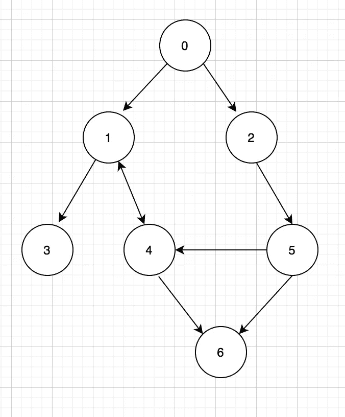

# 顶级编码算法—广度优先搜索

> 原文：<https://towardsdatascience.com/top-coding-algorithms-breadth-first-search-af2cce54c69c?source=collection_archive---------54----------------------->

## 让我们直接进入主题。

# 伪码

```
procedure BFS(G, start_v) is
      let Q be a queue
      label start_v as discovered
      Q.enqueue(start_v)
      while Q is not empty do
          v := Q.dequeue()
          if v is the goal then
              return v
          for all edges from v to w in G.adjacentEdges(v) do
             if w is not labeled as discovered then
                 label w as discovered
                 w.parent := v
                 Q.enqueue(w)
```

广度优先搜索的实现使用**队列**和**，而循环**与其表亲相比，深度优先搜索使用递归，记住这一点，我相信，至少可以在你的编码面试中帮助你建立结构。

# 履行

想想最基本的任务:



找到从 0 到 6 的所有路径。

请注意 1 和 4 的双向箭头，这意味着如果我们在搜索过程中没有跟踪被访问的节点，路径会向后走。

这里有几点需要注意:

*   *注意队列包含 2 个元素，当前节点和当前路径。*根据你遇到的问题，可以是深度或者其他。
*   `queue.pop(0)`确保我们总是考虑队列中的第一个元素，这使得它是广度优先的。
*   如果我们碰到一个没有子节点的离开节点，那么我们继续下一个

```
if curr_node not in self.graph.keys():                
     continue
```

*   `if child not in curr_path`检查我们是否在后退，避免了两次访问一个节点。
*   `curr_path.copy()`一定要去，否则不同孩子的路会被缠住。

# 编码问题

让我们看看如何灵活应用它。

*给定一棵二叉树，求其最小深度。最小深度是从根节点向下到最近的叶节点的最短路径上的节点数。*

**注:** *叶子是没有子代的节*

```
 3
   / \
  9  20
    /  \
   15   7
```

*返回其最小深度= 2。(这是 leetcode 的一个问题)*

这里的主要变化是，根据问题的要求，我们的道路被深度所取代。

现在问题来了，如果我们想要最大深度呢？去试试吧。