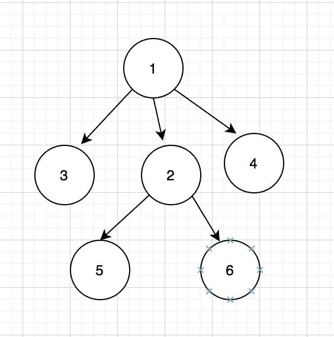

# 顶级编码算法—深度优先搜索

> 原文：<https://towardsdatascience.com/top-coding-algorithms-depth-first-search-38ba378e6093?source=collection_archive---------43----------------------->

所有可以被格式化为树形结构的编码问题都很可能通过广度优先搜索或深度优先搜索来解决。与使用堆栈实现的广度优先搜索不同，深度优先搜索采用分而治之的方法，使用递归实现。

# 伪码

**输入**:一个图 *G* 和 G 的一个顶点 *v*

**输出**:从 *v* 可达的所有顶点被标记为已发现

```
**procedure** DFS(*G*, *v*) **is**
    label *v* as discovered
    **for all** edges from *v* to *w that are* **in** *G*.adjacentEdges(*v*) **do**
        **if** vertex *w* is not labeled as discovered **then**
            recursively call DFS(*G*, *w*)(from [wiki](https://en.wikipedia.org/wiki/Depth-first_search))
```

(注意，只有当顶点 *w* 未被访问时，我们才继续，这避免了图或树中的循环)

**之所以可以用递归来解决问题，是因为一个大问题可以分成多个子问题，每个子问题遵循相同的逻辑和结构。**例如，在这里如果我们想在一个树形结构中找到从 A 点到 B 点的路径，你可以把这个过程总结为一个重复的公式:

```
path = current_path + DFS(sub_tree)
```

# 例子

考虑下面的问题，


找到从*点 0* 到*点 6* 的所有路径。

请注意，图中有一个循环(双箭头)(1 和 4)。

节点连接存储在字典中。递归在到达终点或叶节点时停止。

这给出了结果:

```
find solution path [0, 1, 4, 6]
find solution path [0, 2, 5, 6]
find solution path [0, 2, 5, 4, 6]
```

# 变化

考虑以下问题:

```
Given a n-ary tree, find its maximum depth.The maximum depth is the number of nodes along the longest path from the root node down to the farthest leaf node.Input: root = [1,null,3,2,4,null,5,6]
Output: 3
```



为了将问题分成子问题，它遵循以下公式

```
max_depth = 1 + max(max_depth(child_1), max_depth(child_2), ...)
```

## 解决办法

(结帐代码[此处](https://github.com/MJeremy2017/algorithms/tree/master/depth-first-search))