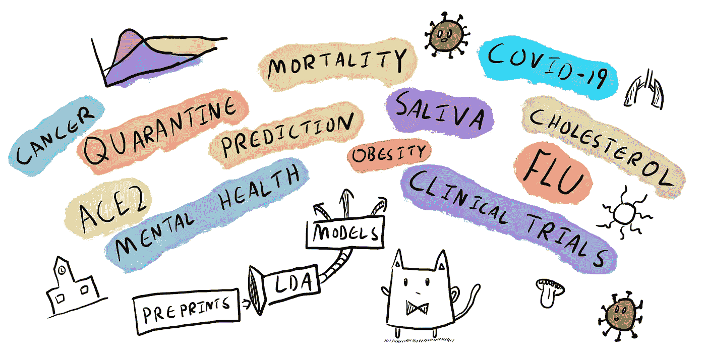
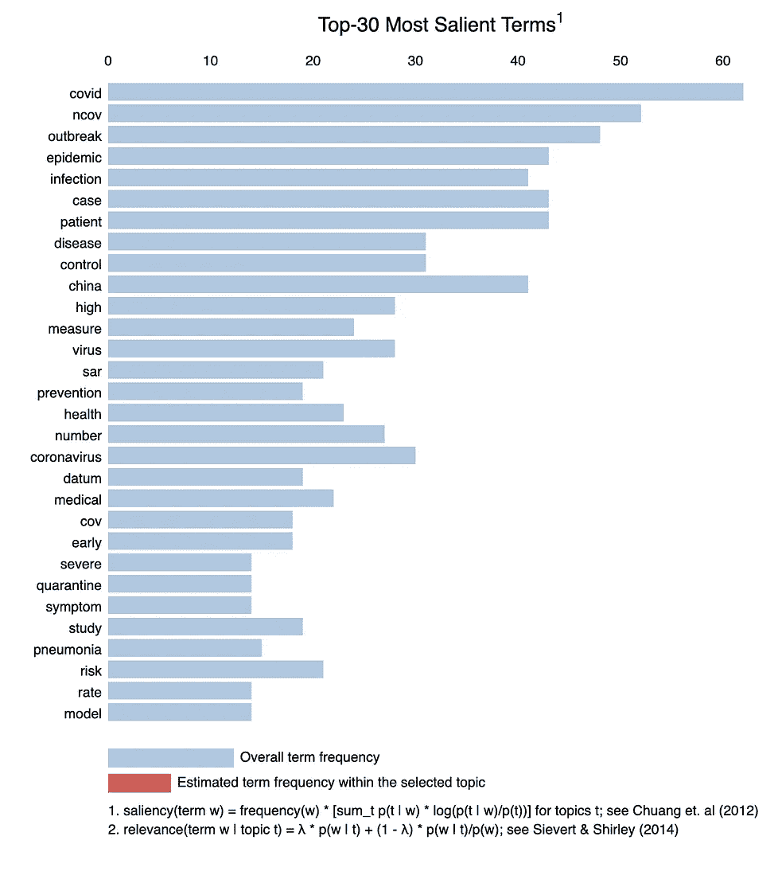
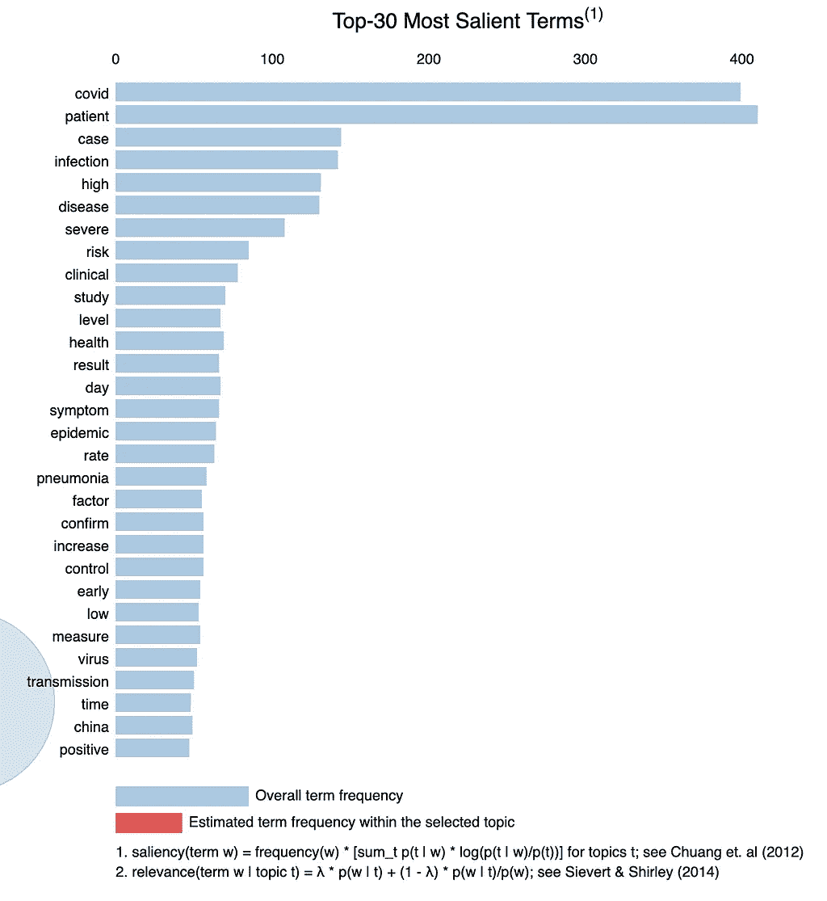
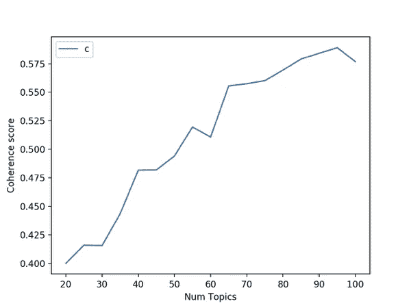
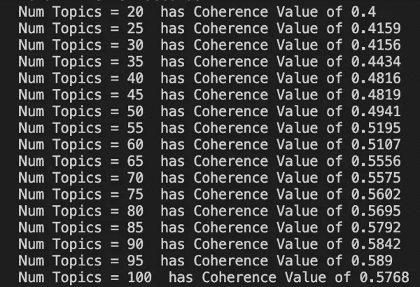

# 使用 NLP 的冠状病毒研究主题:2020 年 5 月

> 原文：<https://towardsdatascience.com/top-coronavirus-research-topics-using-nlp-may-2020-b4166289b728?source=collection_archive---------12----------------------->

## 当你意识到在如此短的时间内发生了如此多的学术工作时，这是令人难以置信的。在这里，我使用最新的预印本深入到一些 LDA 主题建模中。

三月份，当我第一次[试着给所有提交给](/summarising-the-latest-research-on-coronavirus-with-nlp-and-topic-modelling-28b867ad9860) [SSRN](https://www.elsevier.com/connect/coronavirus-information-center) 的新型冠状病毒(新冠肺炎)预印文章做主题模型时，只有 75 篇论文，现在仅仅两个月后，这个数字已经膨胀到 346 篇。我非常有兴趣看看这些论文讨论的主题中是否有新的模式。

2020 年 5 月冠状病毒热门话题。作者插图

之前，我仔细阅读了爱思唯尔冠状病毒中心网页上列出的每一份预印提交材料，然后将标题和主要发现复制并粘贴到一个电子表格中，以运行我的 Gensim [LDA 建模脚本](https://github.com/Raudaschl/coronvavirus_preprint_research_nlp)。

随着新学术论文的激增，我简直跟不上了，现在我有了一个 web scraper 脚本和一些正则表达式来提取特定的部分，如结论和发现，以摄取所有有趣的内容。

二月和五月最显著的术语。患者无疑正在成为一个更加突出的术语，现在有一小部分论文关注中国

我看到过[语义学者](https://www.semanticscholar.org/cord19)有一个跨出版商的新冠肺炎学术数据库，但是看起来不怎么样。上次我检查了他们的索引，包括奇怪的无关内容，如细菌性肺炎和抗生素疗法。我也不确定它是否包含预印材料。

模型困惑和[主题一致性](https://rare-technologies.com/what-is-topic-coherence/)提供了一种方便的方法来判断一个给定的主题模型有多好。作者截图

在任何情况下，就像上次一样，我采用了最新的学术预印内容，在 LDA 主题模型脚本上运行它，并为 346 篇论文确定了 75 个主题，一致性为 0.5602。

这里有一些非常令人兴奋的东西，从预测隔离何时解除到学校关闭给医护人员带来的精神压力，所以让我们开始吧。

**记住这篇文章绝不是科学评论**，而是我想分享的一个小实验。**小心阅读预印本**，因为所做的声明**未经证实**。

# 8 个主导主题

## 1.ACE2 受体与免疫

**话题关键词:**细胞，cd，ace，kirp，表达，阳性，ucec，免疫，减少，突出

**具有主题的文档百分比:** 54%

ACE2 是新型冠状病毒进入细胞的受体。有很多关于 ACE2 表达水平和疾病严重程度的研究。下面最具代表性的论文专门研究了 ACE2 与新型冠状病毒感染后子宫内膜癌(UCEC)和肾乳头状细胞癌(KIRP)的免疫浸润和进展的相关性。

**最具代表性的论文:**[UCEC 新型冠状病毒感染后，与免疫浸润相关的 ACE2 异常表达可能加重病情进展，KIRP](https://papers.ssrn.com/sol3/papers.cfm?abstract_id=3555195)

## 2.新冠肺炎(新型冠状病毒)和其他呼吸道病毒

**主题关键词:**感染、病毒、患者、高、组、流感、诊断、计数、白细胞、呼吸道合胞病毒

**带有主题的文档百分比:** 38%

其他呼吸道病毒也会引起与新冠肺炎相似的症状。这使得初步诊断非常具有挑战性。本文较有代表性地总结了发热门诊患者的病原体构成，并分析了不同呼吸道病毒感染的特点。

**最具代表性论文:**[2019 年北京新型冠状病毒暴发期间呼吸道病毒感染特征。](https://papers.ssrn.com/sol3/papers.cfm?abstract_id=3548768)

## 3.试图预测隔离何时解除

**话题关键词:**比率，场景，湖北，每日，数字，3 月，直接，大约，韩国，韩国

**带有主题的文档百分比:** 38%

有大量的数据挖掘正在发生，以建立模型来预测疫情的全球趋势，这将有望使我们更好地分配国际医疗资源，并指导检疫策略。

**最具代表性的论文:** [利用状态转移矩阵模型，通过中国的经验趋势，预测新冠肺炎在全球主要疫区的发展](https://www.medrxiv.org/content/10.1101/2020.03.10.20033670v1)

## 4.我们不可能跟踪所有的临床试验

**话题关键词:**治疗，研究，试验，中国，阶段，医学，干预，表现，初步，女人

带有主题的文档百分比: 36%

冠状病毒疾病治疗 2019(新冠肺炎)有很多临床试验；然而，人们对新冠肺炎的临床试验缺乏系统的了解。与这一主题相关的论文认为，现有的新冠肺炎患者数量不足以支持已经开始的数百项临床试验。缺乏多中心、随机、双盲、安慰剂对照试验的设计。

**最具代表性的论文:** [聚焦新冠肺炎治疗:对 ClinicalTrials.gov 和 ChiCTR 注册的 226 项试验的综合分析](https://papers.ssrn.com/sol3/papers.cfm?abstract_id=3556671)

## 5.学校关闭给医护人员带来了巨大的压力

**话题关键词:**医疗保健，提供，护理，家庭，参数，学校，医疗，关闭，领先，衰落

**带有主题的文档百分比:** 33%

有学龄儿童的医疗工作者发现自己处于在工作和在家陪孩子之间做出选择的境地。封锁期间儿童保育的费用和机会进一步加剧了这一问题。

**最具代表性的论文:** [新冠肺炎学校关闭对美国医疗劳动力和净死亡率的影响](https://www.thelancet.com/journals/lanpub/article/PIIS2468-2667(20)30082-7/fulltext)

## 6.唾液可能有助于诊断新冠肺炎

**主题关键词:**研究，高，阶段，条件，唾液，患者，检测，演示，危重，病毒

**带主题的文档百分比:** 36%

越来越多的研究发现，危重患者唾液阳性检出率高达 75% (3/4)。唾液可能是危重病人诊断标本的新来源。

**最具代表性论文:** [新冠肺炎患者唾液中 2019-nCov 的检测及口腔症状表征](https://papers.ssrn.com/sol3/papers.cfm?abstract_id=3557140)

## 7.出院后幸存者的心理健康

**话题关键词:**出院、感染、关联、幸存者、医院、帖子、担忧、家庭、范围、复发

**带主题的文档百分比:** 34%

人们越来越关注新冠肺炎感染后幸存的患者的精神健康，并担心残留的呼吸道症状。这篇有代表性的论文发现，大约 10%的新冠肺炎幸存者会出现焦虑或抑郁，因为他们出院后会出现残留的呼吸道症状，担心复发和传染给他人。

**最具代表性的论文:** [中国武汉新冠肺炎幸存者心理健康状况:一项描述性研究](https://papers.ssrn.com/sol3/papers.cfm?abstract_id=3559616)

## 8.预测 COVID 患者的死亡率

**话题关键词:**模型、预测、指标、得分、早期、预测、回归、准确、比率、群组

**带有主题的文档百分比:** 28%

许多论文试图预测哪些患者最有严重感染的风险，以便更早地提供干预。这往往涉及临床特征的分析。尽管如此，一些研究显示，临终病人和出院病人的主要症状没有差异，但生命体征和实验室检查结果有所不同。

**最具代表性的论文:** [预测老年新冠肺炎患者死亡风险的临床特征](https://papers.ssrn.com/sol3/papers.cfm?abstract_id=3569846)

# 结论

这是令人愉快的拉出来的 LDA，并看到事情如何改变了这几个月。与我上次尝试相比，主题的数量变得更加广泛，但有几个真正开始脱颖而出，如围绕 ACE2 受体和严重性预测模型的研究。

> 我们离决策的结果越远，就越容易保持我们当前的观点，而不是更新它们。—伟大的心智模型

文字，文字无处不在。作者插图

**完整免责声明:**我是爱思唯尔的产品经理。这篇博客文章和分析是作者自己的创作，不代表爱思唯尔的想法和观点。

# GitHub 回购

使用 python 脚本的 GitHub Repo 输入数据和输出:

 [## raudashl/coronvavirus _ preprint _ research _ NLP

### 这个脚本对冠状病毒的最新学术预印本进行主题建模，看看是否有任何不寻常的…

github.com](https://github.com/Raudaschl/coronvavirus_preprint_research_nlp) 

# 想要更多吗？

如果您喜欢这篇文章，请务必查看我在二月份发表的上一篇主题模型文章

 [## 9 使用 LDA 和主题建模的冠状病毒研究趋势

### 受到所有公开的新冠肺炎印刷前研究的启发，我想应用一些数据科学…

towardsdatascience.com](/summarising-the-latest-research-on-coronavirus-with-nlp-and-topic-modelling-28b867ad9860) 

# 文献学

*   上面列出的所有预印本都是我在 2020 年 5 月 1 日从[爱思唯尔新型冠状病毒信息中心](https://www.elsevier.com/connect/coronavirus-information-center)收集的，我又从 [SSRN](https://www.ssrn.com/index.cfm/en/) 下载的。
*   冠状病毒:最新信息和建议。gov . uk .[https://www . gov . uk/guidance/Wuhan-novel-coronavirus-information-for-public](https://www.gov.uk/guidance/wuhan-novel-coronavirus-information-for-the-public)2020 出版。2020 年 5 月 1 日访问。