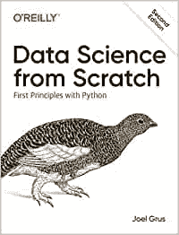
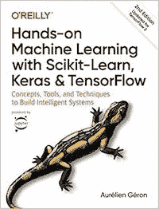
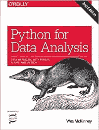
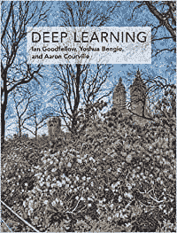

# 帮助您在 2020 年成长的顶级数据科学书籍

> 原文：<https://towardsdatascience.com/top-data-science-books-to-help-you-grow-in-2020-d7fd5ad0638a?source=collection_archive---------25----------------------->

## 这些书将帮助你成为一名数据科学专家。

图片来自 [jking](https://unsplash.com/@jking) on [Unsplash](https://unsplash.com/photos/DOoYFgTQWfs)

很多人问我关于如何开始他们的数据科学之旅的问题。除了在线课程之外，我建议阅读相关书籍。但是，问题是可用的资源太多了。因此，很难判断从哪本书开始。近年来，我浏览了许多书籍，下面是我的清单，应该能帮助你走向数据科学专业人士的道路。

# 从零开始的数据科学:Python 的基本原则

[**从零开始的数据科学**](https://www.amazon.com/Data-Science-Scratch-Principles-Python/dp/1492041130) **是从数据科学**开始的完美书籍，因为它教会你在实践中开始数据科学所需了解的几乎所有基础知识。它包含一个 python 速成班，深入解释了推进您的数据科学之旅所需了解的常见算法和技术。我喜欢这本书，因为它不仅教你如何使用某些库，还解释了幕后发生的事情。这在数据科学家的教育中经常被忽略。每个声称自己是数据科学家的人都应该至少自己编写过一次 k 近邻算法。这就是为什么这本书是初学者的完美开端。

# 使用 Scikit-Learn、Keras 和 TensorFlow 进行机器实践学习

在你学会了基础知识之后，是时候在实践中使用你的一些技能了这是你将在 Aurélien Géron 的 [**动手机器学习书**](https://www.amazon.com/gp/product/1492032646/ref=as_li_qf_asin_il_tl?ie=UTF8&tag=amazonaffi048-20&creative=9325&linkCode=as2&creativeASIN=1492032646&linkId=595a64d942b857cfd493e1e4aac2997b) 中学到的。这本书旨在用最少的理论和大量的实际实现示例和练习来构建生产就绪的机器学习驱动的系统。与**从头开始的数据科学**书不同，您将学习如何使用两个生产就绪的 python 框架 Scikit-Learn 和 Tensorflow。这本书带你一路从线性回归到深度神经网络和强化学习。我认为这是每个数据科学家的必备书籍，应该成为每个办公室书架的一部分。

# 用于数据分析的 Python

Wes McKinney(熊猫的创造者)写的 [**用于数据分析的 Python**](https://www.amazon.com/-/de/dp/1491957662/ref=sr_1_1?__mk_de_DE=%C3%85M%C3%85%C5%BD%C3%95%C3%91&keywords=Python+for+Data+Analysis&qid=1579338683&sr=8-1)**可能是 Python 中数据科学领域阅读量最大的书。它教你如何使用 pandas，numpy 最常用的 python 中数据转换和汇总的库。通过这本书，您可以轻松地开始学习基于 python 的数据分析。数据争论是每个数据科学家日常工作的重要组成部分，本书帮助你建立更好的数据管道。**

# **深度学习(自适应计算和机器学习系列)**

****

**最后但并非最不重要的是，我必须推荐人工智能圣经臭名昭著的[深度学习书籍](https://www.amazon.com/-/de/dp/0262035618/ref=sr_1_1?__mk_de_DE=%C3%85M%C3%85%C5%BD%C3%95%C3%91&crid=19REA20DQPMTE&keywords=deep+learning&qid=1579336025&s=books&sprefix=Deep%2Cstripbooks-intl-ship%2C218&sr=1-1)它给你正确介绍了深度学习的基础知识:前馈神经网络，卷积神经网络(CNN)，序列模型和递归神经网络(RNN)。这本书是对该主题的理论介绍，但如果你想了解过去几年中最具突破性的技术变革背后的理论和原则，这是一本好书。最棒的是:这里有免费的在线版本。**

# **永远坚持学习**

**尤其是在像我们这样一个不断变化的行业，永不停止学习是非常重要的。我认为书籍是深入一个新话题的非常好的方式。我倾向于一个月读一本书，让自己跟上时代。欢迎大家给我一些推荐！**