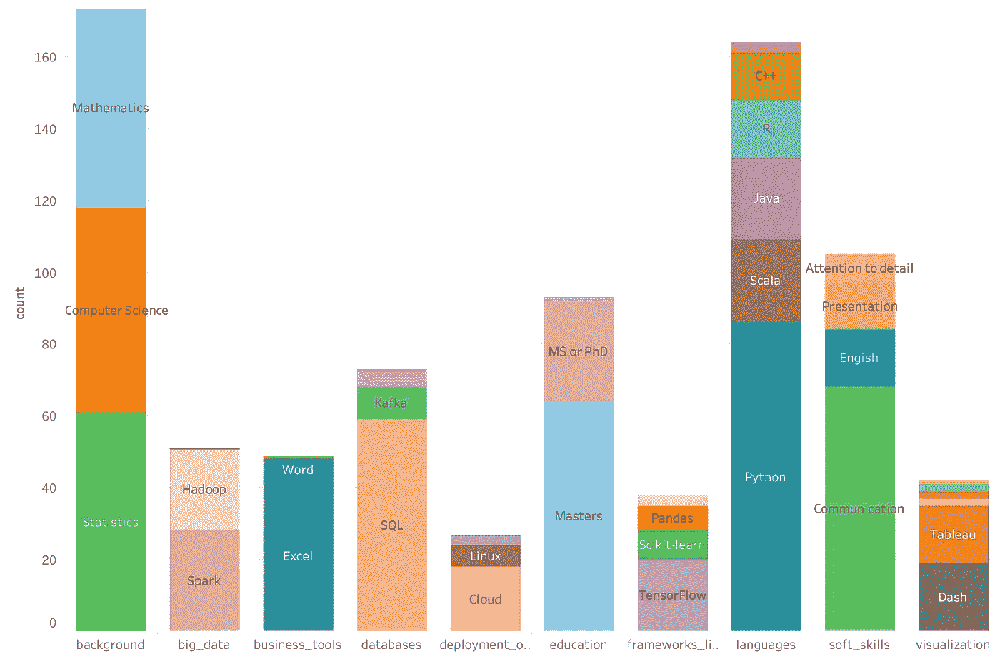

# 招聘公司正在寻找的顶尖数据科学技能

> 原文：<https://towardsdatascience.com/top-data-science-skills-hiring-companies-are-looking-for-7562b09027b6?source=collection_archive---------19----------------------->

## 对来自美国和欧洲的 100 份入门级数据科学职位发布的分析

来自 [Pexels](https://www.pexels.com/photo/woman-sitting-in-front-of-computer-in-office-3861967/?utm_content=attributionCopyText&utm_medium=referral&utm_source=pexels) 的 [ThisIsEngineering](https://www.pexels.com/@thisisengineering?utm_content=attributionCopyText&utm_medium=referral&utm_source=pexels) 摄影

我收到了很多问题，关于获得数据科学工作和成为数据科学家需要学习哪些相关技能。我的经典回答是“学习 Python 或者 R 以及一些常用的用于数据分析的 Python 框架”。这种方法对我来说很有意义，因为我就是这么做的。

我知道对有抱负的数据科学家的一个流行建议是查看招聘信息并调查要求。我认为这是一个很好的主意，可以让你更好地了解要学习的硬技能。酪我还知道，这些招聘信息很多时候是由人力资源人员准备的，他们自己并不真正理解这些要求，只是写下他们公司的专家告诉他们的话。如果有些人使用网上找到的招聘模板，我不会感到惊讶。

为了满足我的好奇心并了解公司对数据科学职位的要求，我主动从互联网上查看了招聘信息。我在 LinkedIn 上挑选了 100 份来自美国和欧洲的招聘信息。都是入门级的，都是讲英语的公司。例如，对于德国，我跳过了德语的工作列表等。在这篇文章中，我将与你分享我的成果。我将展示哪些技能最常出现，并告诉你我对这些需求如何反映现实的看法。也就是说，不要忘记对你在网上读到的所有东西都持保留态度，并考虑它如何适合你的具体情况。

首先，我将需求分成 9 组。我称之为技能类型:

*   背景(数学、统计学、计算机科学和机器学习)
*   教育(硕士、博士、硕士或博士)
*   语言(Python，Scala，Java，R，C++，Julia)
*   数据库(SQL、Kafka、NoSQL)
*   大数据相关技术(Spark、Hadoop、MapReduce)
*   业务工具(Excel、PowerPoint、Word)
*   可视化工具(Dash、D3、Tableau、Qlikview、PowerBI、ggplot)
*   Python 框架(Pandas、Scikit-learn、TensorFlow、Keras)

除了要求之外，我还查看了帖子中提到的常见学科:机器学习、深度学习、分析、自然语言处理、计算机视觉、机器人技术，以了解这些帖子的本质。

先说要求。这是一个图表，显示了在 100 次招聘中，某一类型的要求被提及的总次数。

与其他类型的需求相比，教育和编程语言需求是最常被提及的。我们在这张图表中看到的有趣的事情是，与所有其他硬技能或特定工具(如框架和库)相比，软技能非常重要。这真的把成为一个好的沟通者的重要性放在了正确的位置上。特别是对于那些对自己的技术能力没有 100%信心的人来说，强调你的软技能可能是你在竞争中领先的动力。

下面是划分为特定技能的所有需求类型。

特定技能显示的类型的出现

# 教育

对于教育要求，我统计了申请硕士学位、申请博士学位和申请硕士或博士学位的时间。没有要求博士学位的招聘信息。无论如何，为一个初级职位申请博士学位是很可笑的。

正如你所看到的，93 份工作清单要求计算机科学、统计学或数学相关领域的硕士学位，其中 29 份说博士学位也是可以接受的。).但是如果你没有这些学位，也没有理由失去希望。这些工作列表中的许多都将这一要求描述为必须具备或有利条件。基本上，这些公司在招聘员工时，会检查他们是否符合传统要求，如计算机科学硕士学位，以尽量降低风险。说到底，他们寻找的是能带来最大价值的人。让他们相信你的价值取决于你自己。

# 语言

语言是我最喜欢谈论的事情，因为围绕它们有很多争议。不足为奇的是，Python 是所有列表中 86%的一部分。乍一看，这似乎不够高，但在给出语言要求的情况下，这一比例高达 96.63%。所以我们可以说，如果你必须学习一门编程语言，那就学 Python 吧。不服气？让我们看看其他编程语言。

在很多工作列表中，r 并没有像我想象的那样被提及。只有 16 次提及，几乎和 C++一样低，c++是一种我没想到会在数据科学招聘中出现的编程语言。Julia 是我最近听说的一种编程语言，在 100 个招聘信息中只被提到 3 次。我想我们可以说它仍然是一门正在崛起的语言，还有很长的路要走。最后，Scala 和 Java 似乎在争夺第二的位置，但它们远没有 Python 那么受欢迎。

Python 似乎是数据科学的首选语言。为了更好地理解这一点，让我们来看一个不同的图表，其中包含给出的每个语言需求实例。在这里我们可以看到几乎所有的应用程序都需要 Python。而且每次把另一种语言作为需求给出，Python 也是有的。*Python 丢掉了麦克风*

# 背景

谈到一个人应该接受的背景培训，在 100 份工作清单中有 77 份提到了这一点，统计学背景似乎是非常理想的，紧随其后的是计算机科学和数学。这可能对你来说很可怕，因为在这些领域没有什么可以获得学位的，至少不会很快。我应该提醒你的是，在大多数的工作列表中，背景培训被标记为必须具备的。正如我之前所说，如果你的目标是进入这个你没有合适背景的新工作领域，你需要不要失去希望，用其他技能来弥补。

# 软技能

正如我在以前的帖子中提到的，软技能是申请数据科学职位时最重要的技能之一。75 %的工作清单提到了软技能。75 篇帖子中有 90.67%提到沟通是一项重要的技能。是的，沟通是一个模糊的词，但你可以在这里阅读[对数据科学家来说意味着什么。](https://www.soyouwanttobeadatascientist.com/post/which-soft-skills-data-scientist)

语言技能——确切地说是英语——与表达技能和对细节的关注一起出现在这些列表中。最好调整这些求职信来强调你的软技能，并给出几个你如何在项目中使用它们的例子。

# 其他技能

看看框架和常用的库，我们看到 TensorFlow 是其中最受欢迎的。尤其是与只被提及 3 次的同类产品 Keras 相比。这并不奇怪，如果你正在研究要使用的神经网络/深度学习框架，记住这一点是件好事。

不过，有一件事确实让我感到惊讶，那就是熊猫和 scikit-learn 很少被提及。可能的原因是像 Pandas 和 Scikit-learn 这样极其常见的库被认为是理所当然的。公司可能会假设，作为一名入门级的数据科学家，你知道如何处理和操纵数据，并实现基本的机器学习算法。

SQL 似乎是其中最重要的，在提到数据库技术的 62 次中被提到 59 次。相比之下，NoSQL 被提及 5 次，卡夫卡被提及 9 次。

网上有帖子声称，如果你不处理大数据，你应该也不能称自己为数据科学家。老实说，我很想把这些发现发给那些帖子的作者。根据我和我的许多同事的经验，很多时候，你不会处理非常大量的数据。你有适量的数据，并且你尽你所知，尽你所能使用它。因此，大数据工具总共只被提到 37 次也就不足为奇了，其中 28 次包括 Spark 和 23 次 Hadoop，它们都是处理大数据的工具。他们大多是一起被提及的。这些工作列表中没有提到 MapReduce。

‍

我从有抱负的数据科学家那里得到关于学习 git、Linux 或云解决方案的问题。我总是说，就我目前所见，对 Linux 技能的需求取决于公司。这一点在这里也很明显，因为只有 6 份工作列表提到了这一点。

然而，云仍在被越来越广泛地采用，我认为说你可以在云上工作绝对是一个优势。然而，很多时候，在云上处理部署和集成工具的人是数据工程师，而不是数据科学家。

另一方面，我认为知道如何使用 git，至少是简单的拉和推，以及版本控制的想法，对任何你将在团队中工作的工作都有好处。事实上，即使你独自工作，你也应该使用版本控制。这些年来，我看过一些大型电视剧，仅仅是因为版本控制被忽视了。我建议你不要把提到 git 的频率当回事，学习一下它的基本原理。我相信你未来的团队领导会非常高兴知道你已经知道如何使用它。

有许多可视化工具和库。Dash 和 Tableau 似乎是更受雇主欢迎的。Matplotlib、D3、Qlikview、PowerBI 和 ggplot 显然没有被视为 98%的职位列表中的重要要求。

我想说你可能会在做个人项目甚至是 Kaggle 比赛的时候学会如何使用 Matplotlib。老实说，这是我最常用的方法。

说到 Tableau、QlikView、PowerBI 这样的软件，我想很多数据科学家都在犹豫要不要用。主要是因为你可以很容易地用代码可视化你需要看到的东西。我可以看到，对于严肃的会议和重要的演示，这些软件解决方案准备的更专业的外观和复杂的可视化会有所帮助。

长话短说，我可能不会花太多时间学习如何制作漂亮的可视化，除非你的目标是视觉密集型的数据科学。

令人惊讶的是，即使当我们说到数据科学时，我们总是想到编码，excel 也是一个经常提到的需求。我偶尔会用它来完成简单的任务，比如检查数据是否如我所期望的那样，或者在不启动我的编码环境的情况下根据列对数据进行排序。我真的不知道这些公司认为你会如何使用 Excel，也不知道他们希望你有多深的 Excel 知识。我会说，只要你知道如何编码，你的 Excel 技能将不是超级必要的。

为了完整起见，我查看了其他办公工具被提及的次数。微软 Word 被提及 6 次，PowerPoint 0 次。我想公司终于克服了将微软办公工具列为需求的困扰。

# 这些工作属于哪个学科？

分析是被提及次数最多的学科，有 74 次。机器学习紧跟分析。这并不奇怪，因为数据分析和机器学习是数据科学的核心。

100 个例子中只有 22 个提到了深度学习。这表明它远不是数据科学中的主导学科，但肯定有大量公司使用深度学习开发应用程序。自然语言处理、计算机视觉和机器人技术分别被提及 4、3 和 1 次。根据这些数字，我们可以得出结论，除非你的目标是那特定的 2%，否则你需要在专注于更高级的主题之前，先整理好基本的数据分析和机器学习技能。

当学习一个新的职业时，最重要的事情之一是保持自己的积极性，并明确你的优先事项。我希望这篇文章能帮助你了解公司通常在寻找什么，这样你就能更清楚地决定下一步要做什么。

👉*对数据科学领域以及如何开始学习感到困惑？* [*免费参加数据科学入门迷你课程*](https://www.soyouwanttobeadatascientist.com/courses/data-science-kick-starter-mini-course) *！*