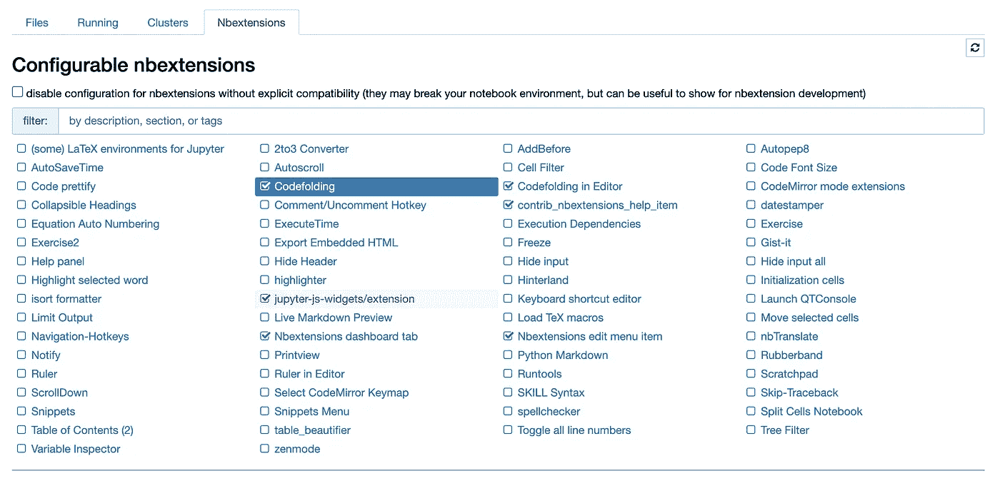
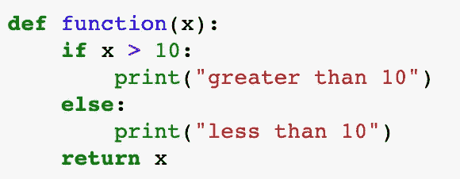
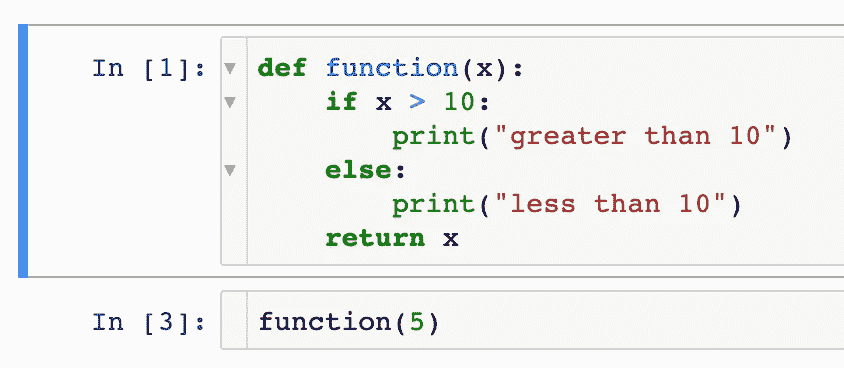
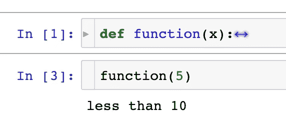
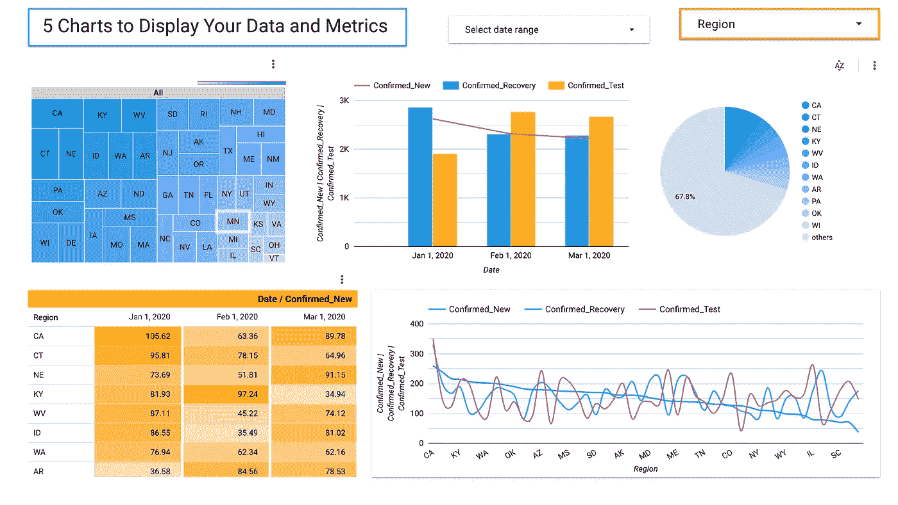
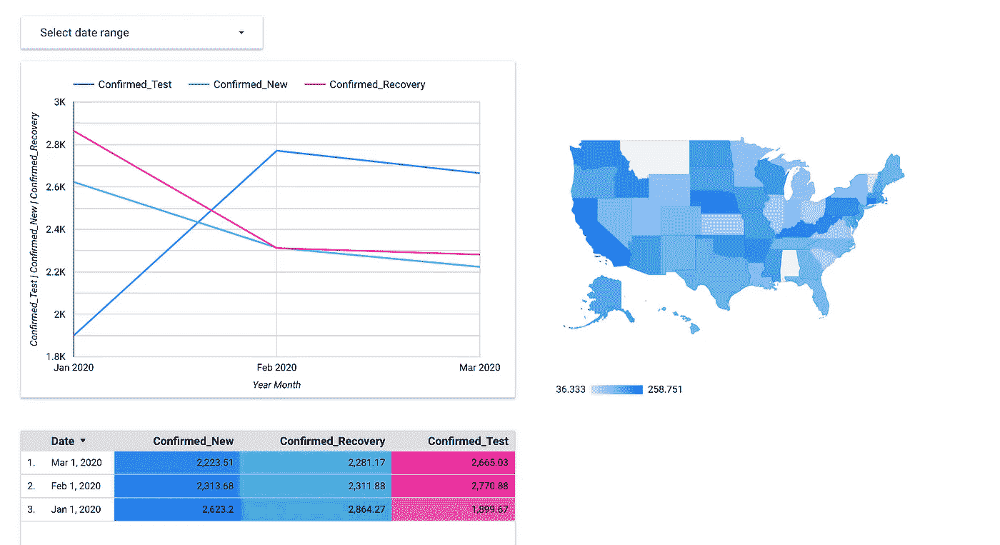

# 顶级数据科学工具和语言

> 原文：<https://towardsdatascience.com/top-data-science-tools-and-languages-b38b88c7669d?source=collection_archive---------12----------------------->

## 意见

## 您应该使用哪一种，为什么？


托德·夸肯布什在[Unsplash](https://unsplash.com/s/photos/tool?utm_source=unsplash&utm_medium=referral&utm_content=creditCopyText)【1】上的照片。

# 目录

1.  介绍
2.  Python、R、SAS 和 SQL
3.  Matplotlib，Seaborn，tqdm
4.  sklearn、NumPy 和熊猫
5.  Jupyter nbextensions
6.  Tableau 和谷歌数据工作室
7.  摘要
8.  参考

# 介绍

本文的目标是给出顶级数据科学工具和语言的概述。我要么是在其他人中最常使用这些工具，要么是和经常使用它们的人一起工作过。有几个独特的工具是非常有益的，不是每个人都知道，另外，我将在稍后讨论。我将为我的例子给出一些用例，这样你就能明白为什么这些工具和语言如此有价值。我以前写过一些关于这些工具和语言的文章，所以在本文中，我将添加更多的信息和新的信息。

如果您想了解更多关于 Data Scientist 的顶级工具和语言，以及为什么应该使用它们，请继续阅读。

# Python、R、SAS 和 SQL


照片由[凯蒂·威尔肯斯](https://unsplash.com/@kateivoryphotoworks?utm_source=unsplash&utm_medium=referral&utm_content=creditCopyText)在[Unsplash](https://unsplash.com/s/photos/python?utm_source=unsplash&utm_medium=referral&utm_content=creditCopyText)【2】上拍摄。

我使用 Python 最多，其次是 R 和 SAS 编程。尤其是在学术环境中，我已经使用了 R 和 sa。我还发现它们在我最初的数据科学角色中有一些很好的用途。对于 SQL，出于数据分析和数据科学的目的，我在几乎每个角色中都使用过它。

> 计算机编程语言

对于每个角色，我看到越来越多的数据科学家使用 Python。我认为这种增长和专注于一种特定语言的原因是这种语言在业务中是可扩展的，同时也倾向于更多的合作机会。

> 例如，当我使用 Python 时，我更有可能不仅能与其他数据科学家合作，还能与机器学习和软件工程师合作。

如果我要使用 R 和 SAS，我很可能不得不重构我的代码，以便它可以被业务中已经存在的软件过程和系统解释和吸收。当然，每个公司都是不同的，有些公司在他们的堆栈中更喜欢 R 或 SAS 而不是 Python。同样需要注意的是，在我的大多数面试中，面试官更喜欢 Python 代码。

> 稀有

当我第一次在学术和研究环境中实践数据科学时，我发现这种语言的用处最大。然而，当我在 R 专业工作时，我从它对统计和测试的关注中受益匪浅。如果你想进行显著性测试、独特的可视化和 A/B 测试，那么 R 可能是首选。

> 斯堪的纳维亚航空公司

我在 SAS 上的经历与 r 类似。我在进行实验和显著性测试时受益于 SAS。它也有一些令人难以置信的独特和强大的可视化汇总统计数据，如 *Q-Q* 图，残差，直方图，和库克的 d。

> 结构化查询语言

SQL 被数据分析师、数据科学家、商业智能分析师、软件工程师和数据工程师广泛使用。为了您的数据科学事业，我强烈建议您对它有一个基本的了解。它与 Python 的相似之处在于，它是一种*跨职能*的方法，为您的业务传达指标。

# Matplotlib，Seaborn，tqdm


照片由 [M. B. M.](https://unsplash.com/@m_b_m?utm_source=unsplash&utm_medium=referral&utm_content=creditCopyText) 在[Unsplash](https://unsplash.com/s/photos/graph?utm_source=unsplash&utm_medium=referral&utm_content=creditCopyText)【3】拍摄。

对于 Python 中的可视化工具，我用得最多的就是这些。Matplotlib 和 seaborn 携手并进，而 tqdm 是一种通过显示进度条来描述代码循环的简单方法。

> Matplotlib

Matplotlib【4】是一个有用的工具和流行的库，用于从数据中创建有益的可视化，甚至可以是交互式的。我通常在开发图表、绘图和直方图以进行快速分析时使用这个库。有时你需要为你自己创建可视化，而不是为其他人，比如利益相关者，所以像 Tableau 这样更复杂的工具在这些情况下是不必要的。

> 海生的

如果我想创建更具视觉吸引力的图形，我会使用 Seaborn。这个库有更多的选项，您可以用更多的统计数据来描述您的数据。Seaborn 制作的图形还让我想起了一些 SAS 图形，这些图形是在调用某些函数时自动创建的，比如回归模型的诊断图。

> tqdm

如果你和我一样好奇并且痴迷于检查你的 Python 循环的状态， [tqdm](https://tqdm.github.io/) [6]也适合你。你可以直观地看到你的进度的实时更新，这样你就可以知道在它完成之前你还有多少时间，并且可以让你知道你可以花多长时间专注于其他事情。

# sklearn、NumPy 和熊猫


照片由[戴安娜帕克豪斯](https://unsplash.com/@ditakesphotos?utm_source=unsplash&utm_medium=referral&utm_content=creditCopyText)在[Unsplash](https://unsplash.com/s/photos/panda?utm_source=unsplash&utm_medium=referral&utm_content=creditCopyText)【7】上拍摄。

这些工具被广泛使用是有原因的。对于使用 Python 的数据科学家来说，它们是必不可少的。

> sklearn

对于简单而强大的机器学习来说，[sk learn](https://scikit-learn.org/stable/)【8】是一条可行之路——也称为 scikit-learn。以下是 sklearn 的一些亮点:

*   *分类*
*   *回归*
*   *聚类*
*   *尺寸缩小*
*   *型号选择*
*   *预处理*

> NumPy

[NumPy](https://numpy.org/)【9】使用起来也很简单，可以用于数据帧计算，这是很多数据科学分析的基础。

NumPy 的常见功能包括但不限于:

*   *阵列*
*   *分度*
*   *切片*
*   *复印*
*   *迭代*
*   *拆分*
*   *排序*

> 熊猫

我想说，大多数数据科学家使用 pandas，因为它是在项目开始时对数据进行数据分析的地方，而最重要的部分是你可以开发 pandas 数据框架。这些数据帧被其他几个库接收，因此您可以更容易地对它们执行机器学习算法。

[熊猫](https://pandas.pydata.org/docs/index.html)【10】的一些有用部分包括但不限于:

```
merginggroupingreshapinghead/tailcalculationsdescriptive statistics
```

# Jupyter nbextensions


[Alexis Antonio](https://unsplash.com/@alexis_antonio?utm_source=unsplash&utm_medium=referral&utm_content=creditCopyText) 在[Unsplash](https://unsplash.com/s/photos/jupiter?utm_source=unsplash&utm_medium=referral&utm_content=creditCopyText)【11】上拍摄的照片

如果你经常使用 Jupyter 笔记本，你可以添加[nb 扩展](https://jupyter-contrib-nbextensions.readthedocs.io/en/latest/install.html)【12】让你的笔记本更有条理。在您的 Jupyter 笔记本中，您可以使用以下代码添加 n 扩展:

```
!pip install jupyter_contrib_nbextensions!jupyter contrib nbextension install
```



nb 扩展选项卡。作者截图[13]。

这是当你重启你的内核/退出你的终端并在你的终端中重新输入 jupyter notebook 来重新启动它后，你的笔记本看起来会是什么样子。上面的截图显示了所有可能的扩展，你可以通过点击它们来添加。您还需要退出笔记本，然后重新打开它以查看所应用的更改。我推荐编辑器中的**代码折叠**和**代码折叠。下面是我的笔记本在 codefolding 扩展之前的样子:**



在代码折叠之前。作者截图[14]。

如你所见，这个函数看起来很正常，但是下图是应用了代码折叠之后的图像。



已应用代码折叠。作者截图[15]。

但是点击这些箭头之后会发生什么呢？他们破坏了功能。现在想象一下，你有一个很长的函数或字典，有几百行，你必须上下滚动，看着你自己的笔记本会有压力。这个代码折叠扩展肯定会给你的笔记本一个更整洁的外观。下面是该函数折叠后的样子:



折叠功能。作者截图[16]。

我希望这个工具是独一无二的。我知道有些人可能会过度讨论其他工具，但总有一些新来的数据科学家可能从未听说过这些工具。但对我来说，这个特殊的工具对我来说是新的，即使在 Jupyter Notebook 中编码多年之后。

# Tableau 和谷歌数据工作室

[Tableau](https://www.tableau.com/)【17】也是一个众所周知的工具，然而，一些数据科学家可能只使用定制编码来创建他们的可视化。[Google Data Studio](https://support.google.com/datastudio/answer/6283323?hl=en)【18】不太常用，但它甚至比 Tableau 更容易使用，而且是免费的。

> （舞台上由人扮的）静态画面

这个工具对于数据分析师和产品经理来说非常有用。对于想要执行非常可视化的探索性数据分析，以及创建显示您的数据科学模型指标的仪表板的数据科学家来说，它也是有益的。

> 谷歌数据工作室

Google Data Studio 易于使用，您可以从连接数据源开始，无论是来自实时 SQL 平台还是 CSV 文件。这里有一些我以前制作的图表，可以作为你可能用自己的数据创建的例子。我用的数据是哑数据。这里有五个你可以想象的例子:



谷歌数据工作室。作者截图[19]。

Google Data Studio 包括许多方法，无论是在模型之前还是之后，您都可以可视化您的数据。

这是另一组你也可以制作的可视化效果:



谷歌数据工作室。作者截图[20]。

使用该工具的另一个很棒的特性是，您可以通过滚动图表和图形，以及点击仪表板中的下拉菜单来使其具有交互性。这些仪表板也易于共享和保存。作为一名数据科学家，当与利益相关者共享您的仪表板时，这将被证明是有益的，因为他们以后会自己使用它们。

# 摘要

我们讨论了数据科学家的一些顶级工具和语言。如果你目前已经在使用它们或者它们对你来说是全新的，我希望你已经学到了一些新的东西。此外，我还包括了一些更独特或更少为人知的工具，如 tqdm、Jupyter nbextensions 和 Google Data Studio。

作为一名数据科学家，您会遇到各种项目，这些项目需要大量的工具和语言。关键是你要学会一些，并成为其他方面的专家。你的工具包将使你从其他数据科学家中脱颖而出，并使你成为更具竞争力的面试申请者和更具合作精神的员工。

*总结一下，这里是数据科学家的顶级工具和语言:*

```
Python, R, SAS, and SQLMatplotlib, Seaborn, tqdmsklearn, NumPy, and pandasJupyter nbextensionsTableau and Google Data Studio
```

*感谢您的阅读！我感谢你的时间。欢迎在下面发表评论，并就您作为数据科学家或机器学习工程师所使用的常用工具和语言展开讨论。请参见参考资料，获取这些数据科学工具文档的快速链接。*

# 参考

[1]由[托德·夸肯布什](https://unsplash.com/@toddquackenbush?utm_source=unsplash&utm_medium=referral&utm_content=creditCopyText)在 [Unsplash](https://unsplash.com/s/photos/tool?utm_source=unsplash&utm_medium=referral&utm_content=creditCopyText) 上拍摄的照片，(2014)

[2]照片由 [Katy Wilkens](https://unsplash.com/@kateivoryphotoworks?utm_source=unsplash&utm_medium=referral&utm_content=creditCopyText) 在 [Unsplash](https://unsplash.com/s/photos/python?utm_source=unsplash&utm_medium=referral&utm_content=creditCopyText) 上拍摄，(2017)

[3]照片由 [M. B. M.](https://unsplash.com/@m_b_m?utm_source=unsplash&utm_medium=referral&utm_content=creditCopyText) 在[Unsplash](https://unsplash.com/s/photos/graph?utm_source=unsplash&utm_medium=referral&utm_content=creditCopyText)(2018)上拍摄

[4][Matplotlib](https://matplotlib.org/)2002–2012 John Hunter、Darren Dale、Eric Firing、Michael Droettboom 和 Matplotlib 开发团队；2012–2020 Matplotlib 开发团队。

[5] [迈克尔·瓦斯科姆](https://www.cns.nyu.edu/~mwaskom)，[海博恩](https://seaborn.pydata.org/)。(2012–2020)

[6]卡斯珀·达·科斯塔-路易斯[@卡斯珀德尔](https://github.com/casperdcl)， [tqdm](https://tqdm.github.io/) ，(2015–2020)

[7]照片由[戴安娜·帕克豪斯](https://unsplash.com/@ditakesphotos?utm_source=unsplash&utm_medium=referral&utm_content=creditCopyText)在[Unsplash](https://unsplash.com/s/photos/panda?utm_source=unsplash&utm_medium=referral&utm_content=creditCopyText)(2018)上拍摄

[8] scikit-learn， [scikit-learn](https://scikit-learn.org/stable/) ，(2020)

[9]2019 年至 2020 年

[10]熊猫开发小组。，[熊猫](https://pandas.pydata.org/docs/index.html)，(2008–2020)

[11] Jupyter Contrib 团队。jupyter _ contrib _ nb extensions(2015–2018)

[12]Alexis Antonio 在 [Unsplash](https://unsplash.com/s/photos/jupiter?utm_source=unsplash&utm_medium=referral&utm_content=creditCopyText) 上拍摄的照片，(2018)

[13] M.Przybyla，nbextensions 截屏，(2020 年)

[14] M.Przybyla，在代码折叠截屏之前，(2020 年)

[15] M.Przybyla，代码折叠应用截屏，(2020 年)

[16] M.Przybyla，折叠功能截图，(2020)

[17] TABLEAU SOFTWARE，LLC，一家 SALESFORCE 公司，[TABLEAU](https://www.tableau.com/)，(2003 年至 2020 年)

[18]谷歌，[谷歌数据工作室](https://support.google.com/datastudio/answer/6283323?hl=en)，(2020)

[19]谷歌数据工作室截屏作者，(2020)

[20]谷歌数据工作室。作者截图，(2020)