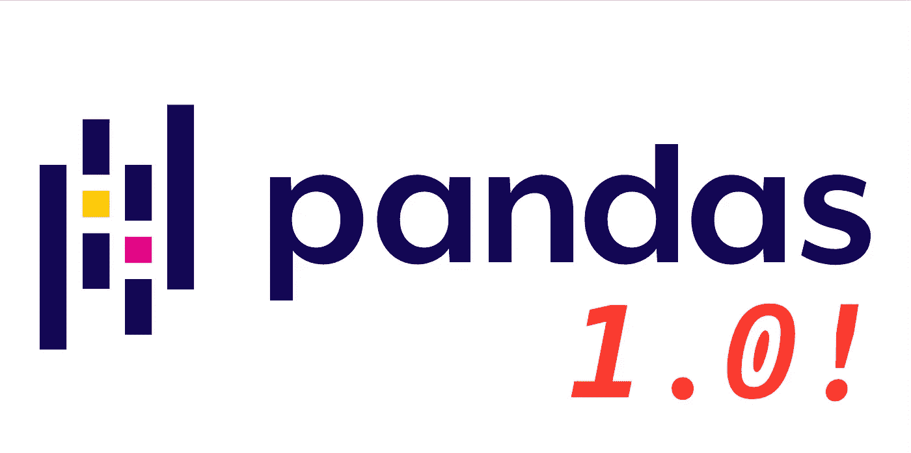

# 熊猫 1.0 的主要特性

> 原文：<https://towardsdatascience.com/top-features-of-pandas-1-0-26abff08d1b6?source=collection_archive---------11----------------------->



## 您今天就可以开始使用的新改进

> 注:熊猫 1.0.0rc 发布于 1 月 9 日。之前的版本是 0.25

Pandas 的第一个新的主要版本包含了许多优秀的特性，包括更好的数据帧自动摘要、更多的输出格式、新的数据类型，甚至还有一个新的文档站点。

完整的发行说明可以在新的文档网站上获得，但是我认为一个不太技术性的概述也会有所帮助。

要使用新版本，你可以使用`pip`轻松升级熊猫。在写这篇文章的时候，Pandas 1.0 仍然是一个*发布候选版本*，这意味着安装它需要明确指定它的版本。

```
pip install --upgrade pandas==1.0.0rc0
```

当然，升级可能会破坏您的一些代码，因为这是一个主要版本，所以您应该小心！

这个版本的 Pandas 也放弃了对 Python 2 的支持。使用熊猫 1.0+至少需要 Python 3.6+，所以要确保你的`pip`和`python`使用的是正确的版本。

```
$ pip --version
pip 19.3.1 from /usr/local/lib/python3.7/site-packages/pip (python 3.7)$ python --version
Python 3.7.5
```

你可以确认一切工作正常，熊猫使用的是正确的版本。

```
>>> import pandas as pd
>>> pd.__version__
1.0.0rc0
```

# 使用 DataFrame.info 实现更好的自动汇总

我最喜欢的新特性是改进的`DataFrame.info`方法。它现在使用一种可读性更强的格式，使您的数据探索过程更加容易。

```
>>> df = pd.DataFrame({
...:   'A': [1,2,3], 
...:   'B': ["goodbye", "cruel", "world"], 
...:   'C': [False, True, False]
...:})
>>> df.info()
<class 'pandas.core.frame.DataFrame'>
RangeIndex: 3 entries, 0 to 2
Data columns (total 3 columns):
 #   Column  Non-Null Count  Dtype
---  ------  --------------  -----
 0   A       3 non-null      int64
 1   B       3 non-null      object
 2   C       3 non-null      object
dtypes: int64(1), object(2)
memory usage: 200.0+ bytes
```

# 降价表的输出格式

我下一个最喜欢的特性是用新的`DataFrame.to_markdown`方法将数据帧导出到 markdown 表的能力。

```
>>> df.to_markdown()
|    |   A | B       | C     |
|---:|----:|:--------|:------|
|  0 |   1 | goodbye | False |
|  1 |   2 | cruel   | True  |
|  2 |   3 | world   | False |
```

这使得通过 github gists 在 Medium 等地方显示表格变得更加容易。

# 布尔和字符串的新数据类型

Pandas1.0 还为布尔和字符串引入了*实验性的*数据类型。

由于这些变化是实验性的，数据类型的 API 可能会稍有变化，所以您应该小心使用它们。但是 Pandas 建议在任何有意义的地方使用这些数据类型，未来的版本将提高特定类型操作的性能，如正则表达式匹配。

默认情况下，Pandas 不会自动将您的数据强制转换成这些类型。但是如果你明确告诉熊猫这样做，你仍然可以使用它们。

```
>>> B = pd.Series(["goodbye", "cruel", "world"], dtype="string")
>>> C = pd.Series([False, True, False], dtype="bool")
>>> df.B = B, df.C = C
>>> df.info()
<class 'pandas.core.frame.DataFrame'>
RangeIndex: 3 entries, 0 to 2
Data columns (total 3 columns):
 #   Column  Non-Null Count  Dtype
---  ------  --------------  -----
 0   A       3 non-null      int64
 1   B       3 non-null      string
 2   C       3 non-null      bool
dtypes: int64(1), object(1), string(1)
memory usage: 200.0+ bytes
```

注意`Dtype`列现在如何反映新的类型`string`和`bool`。

新的 string dtype 最有用的好处是，您现在可以从 DataFrame 中只选择字符串列。这使得只对数据集的文本组件构建分析变得更快。

```
df.select_dtypes("string")
```

以前，只能通过显式使用名称来选择字符串类型列。

更多新类型的文档可在[这里](https://dev.pandas.io/docs/user_guide/text.html?highlight=string)获得。

感谢阅读！如果您觉得这有用或有趣，我还写了其他 Python 和数据科学技巧，请关注我，获取更多类似本文的文章。

[](/how-to-reuse-your-python-models-without-retraining-them-39cd685659a5) [## 如何重用您的 Python 模型而无需重新训练它们

### Python 的对象序列化库简介

towardsdatascience.com](/how-to-reuse-your-python-models-without-retraining-them-39cd685659a5)