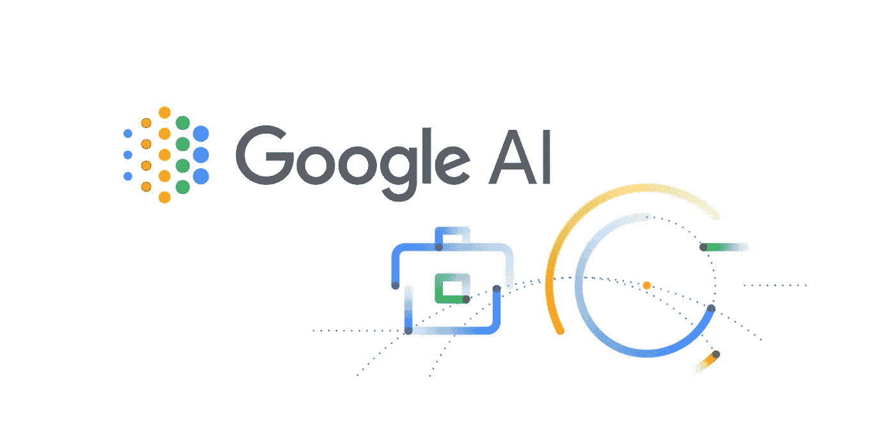
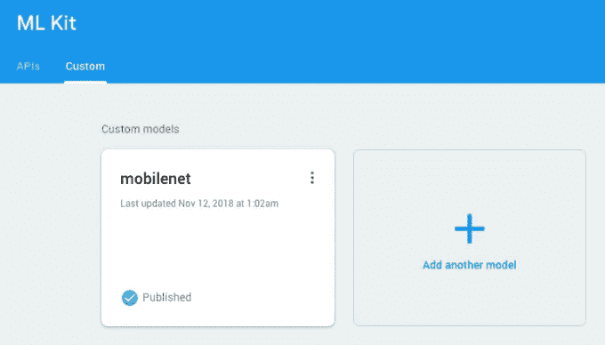
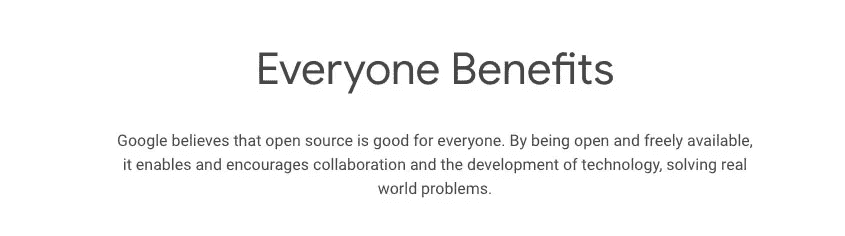
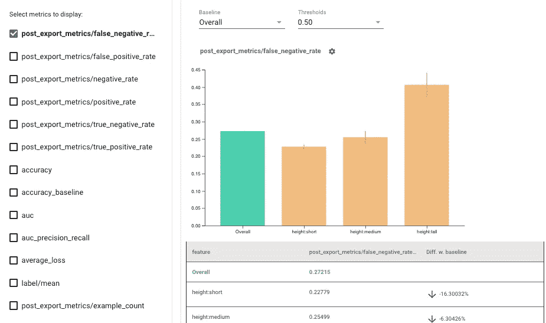
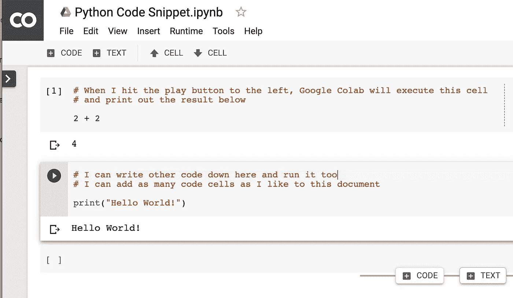
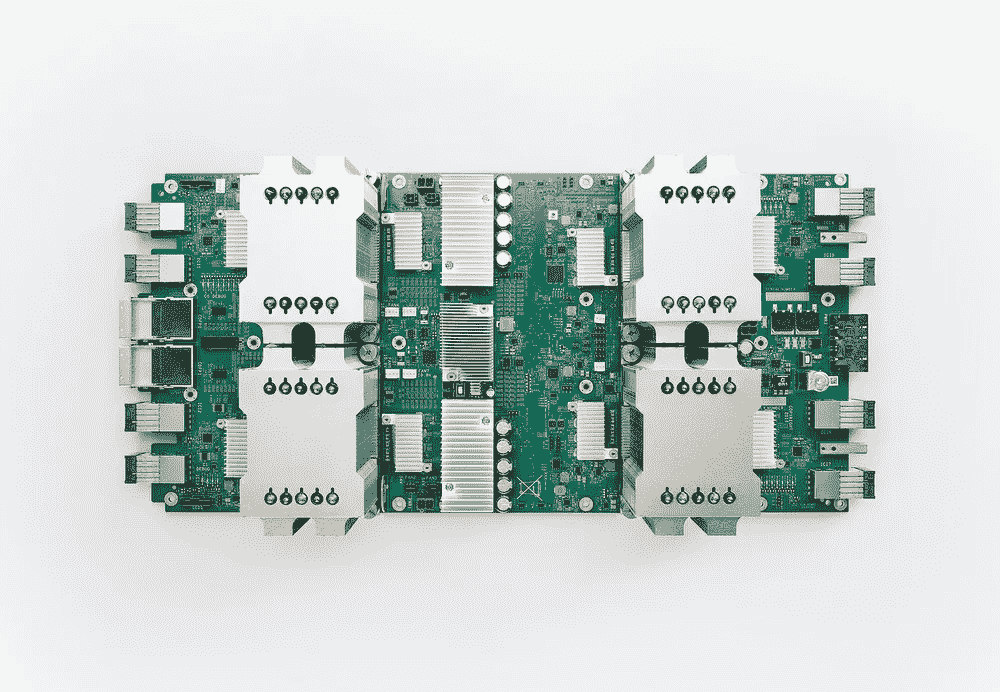

# 面向所有人的顶级谷歌人工智能工具

> 原文：<https://towardsdatascience.com/top-google-ai-tools-for-everyone-60346ab7e08?source=collection_archive---------5----------------------->

## 使用谷歌人工智能中心将想法变为现实

谷歌人工智能将人工智能的好处带给每个人([来源](https://in.pinterest.com/pin/781585710312288592/))

> “我们希望使用人工智能来增强人们的能力，使我们能够完成更多的工作，并让我们花更多的时间进行创造性的努力。”
> 
> **——杰夫·迪恩，**谷歌高级研究员

称谷歌只是一个搜索巨头是一种保守的说法，因为它从一个单纯的搜索引擎成长为几个关键 it 领域创新的驱动力是如此之快。在过去的几年里，谷歌已经在几乎所有的数字领域扎下了根，无论是智能手机、平板电脑、笔记本电脑等消费电子产品，还是 Android 和 Chrome OS 等底层软件，或者是谷歌人工智能支持的智能软件。

谷歌一直在智能软件行业积极创新。凭借其在搜索和分析方面的专业知识，多年来获得的数据帮助谷歌创造了各种工具，如 **TensorFlow** 、 **ML Kit** 、 **Cloud AI** 以及其他许多工具，试图了解人工智能的能力。

> 谷歌人工智能专注于将人工智能的好处带给每个人。

接下来的章节将更加详细地介绍谷歌如何将其工具套件针对特定的用户群体，如开发人员、研究人员和组织，以及他们如何从谷歌的人工智能工具中受益。

# **面向开发者**

随着越来越多的开发人员投身于人工智能领域，看到了它的潜力，谷歌通过提供几个强大的工具来满足他们的动态需求，例如:

# **●张量流**

> 革命来了！欢迎使用 TensorFlow 2.0。

[TensorFlow](https://www.tensorflow.org/js/) 是谷歌向世界提供的端到端开源深度学习库，利用[机器学习](https://hackernoon.com/the-simplest-explanation-of-machine-learning-youll-ever-read-bebc0700047c)来改善其各种产品提供的服务。使用 TensorFlow 的工具和库套件，开发人员可以建立高度精确和定义良好的机器学习模型。

TensorFlow 可以在各种设备上提供平滑的模型构建和灵活的部署，使创建和部署复杂的人工智能模型变得轻而易举。有了强大的社区支持，无论你是新手还是有经验的人，都有大量的想法让你开始。

这里让我们看一些样品[。](https://github.com/tensorflow/tfjs-examples)

> 准备好参加【2020 年 TensorFlow 开发峰会

为 2020 年 TensorFlow 开发峰会做好准备([来源](https://www.youtube.com/watch?v=pl_f83pvTGU)

# **● ML 套件**

ML Kit 将谷歌的机器学习专业知识以一个强大且易于使用的包的形式带给移动开发者([来源](https://www.youtube.com/watch?v=ejrn_JHksws))。

[ML Kit](https://firebase.google.com/products/ml-kit) 是一个**移动专用 SDK** ，目前可用于 Android & iOS，以利用谷歌的机器学习到你的移动应用程序中的好处，并准备它们来解决现实世界的问题。 [ML 套件](https://developers.google.com/ml-kit)可以帮助你在底层机器学习技术**驱动的任务中取得成功，比如**:

● **语言识别**

> *将文本传递给 ML 工具包- >获取文本中检测到的语言*

这支持超过 100 种语言，包括印地语，阿拉伯语，中文和更多！

**在此找到支持语言的完整列表:**

 [## ML 工具包语言标识:支持的语言| Firebase

### 编辑描述

firebase.google.com](https://firebase.google.com/docs/ml-kit/langid-support) 

● [**文本识别**](https://firebase.google.com/docs/ml-kit/recognize-text)

> 点击图片->获取图片中的文本

ML Kit 提取图片中出现的任何文本( [source](https://medium.com/@bapspatil/ok-ml-kit-how-smart-are-you-83c9e58b7330) )

● **图像扫描和贴标**

> 点击图片->获取图片中的对象列表

● **人脸识别**

> 点击图片->获取图片中的所有面

可以在 ML 工具包中检测人脸([来源](https://prostheticknowledge.tumblr.com/post/53395398529/anti-facial-recognition-visor-interesting))

● **智能回复**

> 将消息传递到 ML 工具包->获得 3 个智能回复

ML 套件为您提供 3 个智能回复

● **条形码扫描**

ML 套件支持从条形码中扫描和提取信息([来源](https://medium.com/@bapspatil/ok-ml-kit-how-smart-are-you-83c9e58b7330))

> 点击图片->从扫描的条形码/二维码获取信息

● **与 TensorFlow Lite 的定制模型集成**

借助适用于各种用例的设备上或云实施的现成 API，您可以轻松地将 ML 模型应用于您的数据，并通过与 TensorFlow Lite 的自定义集成选项来跟踪应用的性能。

此选项允许您将 TensorFlow Lite 模型添加到 ML 工具包中并使用它们([源](https://medium.com/@bapspatil/ok-ml-kit-how-smart-are-you-83c9e58b7330))

# **●谷歌开源**

Google 开源把开源的所有价值带给 Google，把 Google 的所有资源都给开源([来源](https://opensource.google/))

由于每天都有更新更好的软件被开发出来，所以需要不断地将它提升到一个新的水平。一旦开发人员开始创建只开放源代码的代码，那么社区就可以积极参与并帮助改进和扩展它。有了免费的代码，开发人员可以通过访问其存储库来修改和扩展代码，通常在这个过程中解决复杂的问题。

每日秀([来源](http://www.cc.com/shows/the-daily-show-with-trevor-noah))

谷歌承诺通过鼓励开发者向任何对其背后想法感兴趣的人公开他们的代码来团结开发者。谷歌提供了大量免费和[开源项目](https://opensource.googleblog.com/) **，比如**:

> ● ClusterFuzz，在过去两年里，它在几个项目中发现了超过 11000 个漏洞。
> 
> ●auto slip，智能重构视频以适应现代设备。
> 
> ● Blockly，通过拖放代码块提供简单的编码，甚至可以用来创建业务逻辑。

# ● **公平性指标**

谷歌在其开源倡议中提供了公平指标。它是一种工具，提供量化机器学习系统中公平性的指标。**由 TensorFlow** 提供支持，目的是消除机器学习系统的任何偏见，同时提高其公平性，减少影响系统和组织的不公平偏见。由于能够随着需求的增长而扩展，谷歌在设计时考虑到了各种业务。

使用公平性指标来可视化公平性评估的指标([来源](https://blog.tensorflow.org/2019/12/fairness-indicators-fair-ML-systems.html))。

# **●合作实验室**

开始用 Google Colaboratory 编写 Python([来源](https://lambdachops.com/start-writing-python-with-google-colab))

[Colaboratory 或 Colab](https://colab.research.google.com/notebooks/intro.ipynb) ，简而言之，是 Python 的在线代码编辑器和编译器。你可以把它想象成 Google Docs，但对于 Python 来说，它是由 Google Drive 等提供的存储能力支持的。它相对易于使用，消除了在多个用户之间共享配置的麻烦，简化了协作流程。它还提供了远程处理您的代码的能力，并提供了为代码片段的详细解释创建降价的选项。

> 想了解更多关于 Google Colab 的信息，请观看视频

开始使用谷歌合作实验室([来源](https://www.youtube.com/watch?v=inN8seMm7UI)

# **为研究人员**

在进入一个新的研究领域时，广泛的研究是绝对必要的。利用现有模型生成的全面而丰富的数据集，并向用户公开，Google 通过提供以下工具简化了获取这些数据集的过程:

# ● **谷歌数据集**

对于每一个机器学习模型，根本的问题是用正确的数据训练它。Google Datasets 通过提供数据集来解决这个问题。

[谷歌数据集](https://cloud.google.com/public-datasets)是由谷歌管理的数据集集合，通过分析研究人员的广泛兴趣定期更新。

谷歌提供了相当广泛的数据集类别，包括图像、转录的音频、视频和文本。针对具有不同使用案例的各种用户，每个类别都有数据集的详细介绍，并带有下载链接以便于访问。

一旦用户下载数据集并在数据集上训练他们的模型，他们就可以为现实世界的场景准备他们的模型。可以通过谷歌数据集搜索来搜索更多的数据集。

# ● **谷歌数据集搜索**

随着互联网上的每个模型生成其数据集，谷歌通过提供搜索功能，帮助简化了与互联网上的其他用户共享数据集的过程。就像它在网上搜索任何东西的搜索服务一样，[谷歌的数据集搜索](https://datasetsearch.research.google.com/)缩小了你要寻找的数据集的搜索范围。从那里开始，您可以了解更多关于数据集的信息，并得到它。

> 数据为王，谷歌知道这一点

 [## 谷歌刚刚发布了 2500 万个免费数据集

### 以下是您需要了解的关于世界上最大的数据仓库的信息

towardsdatascience.com](/google-just-published-25-million-free-datasets-d83940e24284) 

# ● **众包**

谷歌的另一项举措是通过向用户提供有趣的挑战来提高其数据集的准确性，要求他们识别各种类别的图像，如绘画、字母、报纸、插图等等。

从这些类别中，贡献者可以从提供的选择中识别和标记图片，以改善谷歌的服务。如果你有这种竞争精神，一旦你开始做出贡献，你将被授予一个有趣的徽章和里程碑。

通过 Google Crowdsource([source](https://www.youtube.com/watch?v=oLTNtvIHJ7M))改进你的产品

[Google Crowdsource](https://crowdsource.google.com/) 不仅处理图像，还处理各种其他部分，比如:

> -手写识别
> 
> -面部表情
> 
> -翻译
> 
> -翻译验证
> 
> -图像标题
> 
> -图像标签验证

# **为组织**

通过密切监控市场，谷歌可以确定其服务如何将企业的潜在里程碑转变为已实现的目标。谷歌为企业提供工具，通过采用人工智能和人工智能的专业知识，可以简化他们的工作流程，达到新的高度。从精确的数据集、定制模型、高性能云服务等等，谷歌可以为各种规模的企业提供很多东西。

一些组织已经受益于谷歌的人工智能工具，例如[**【Lyft】**](https://cloud.google.com/customers/lyft)[**马克斯·凯尔森**](https://cloud.google.com/customers/max-kelsen/)[**易贝**](https://www.ebay.com/) 和 [**两个适马**](https://www.pionline.com/article/20180417/ONLINE/180419840/two-sigma-adds-google-scientist-for-ai-expansion) 等等。组织可以从以下谷歌人工智能工具中受益:

# ● **云 TPU**

TPU·V2(来源:[谷歌云平台博客](https://blog.google/products/google-cloud/google-cloud-offer-tpus-machine-learning/))

随着所有的数字运算，机器学习需要一个高性能的系统。正因为如此，[谷歌建立了它的 TPU](https://cloud.google.com/tpu/) ，这是**张量处理单元**的缩写，它就是为这个服务的。通过为企业提供所需的能力，而无需任何内部设置，云 TPU 使企业能够通过降低硬件成本为客户提供最佳服务。

企业可以确定他们首选的云 TPU，从要求较低的任务到要求最高的任务，并从以下提供的选项中选择一个:

●云 TPU v2

●云 TPU v3

●云 TPU v2 吊舱

●云 TPU v3 Pod

# ● **云 AI**

[云人工智能](https://cloud.google.com/products/ai)使你能够将机器学习能力应用到你的业务中，以便它随时准备迎接新的挑战。使用云人工智能，企业可以使用谷歌提供的现有模型，或者根据自己的喜好定制一个模型。

Umdlibrary Yes GIF 作者[凯瑟琳·马丁图书馆](https://lib.d.umn.edu/)

云人工智能分为三个部分。云人工智能包括—

**-人工智能中枢**

提供了一个现成的人工智能组件的集合，并提供了在模型上共享和实验的选项。

- **人工智能积木**

允许开发人员将对话、视觉、语言、结构化数据和云自动化功能添加到他们的应用程序中。

**- AI 平台**

人工智能平台通过人工智能平台笔记本、深度学习容器、数据标签服务、持续评估、人工智能平台培训等多种服务，使数据科学家、工程师和开发人员能够快速将他们的想法转化为部署。

**有趣的阅读—**

 [## 谷歌云人工智能从云视觉 API 中移除性别标签，以避免偏见

### 谷歌云人工智能正在用它的云视觉 API 移除给图像中的人贴上“男人”或“女人”标签的能力

venturebeat.com](https://venturebeat.com/2020/02/20/google-cloud-ai-removes-gender-labels-from-cloud-vision-api-to-avoid-bias/) 

# **3。云汽车**

[Cloud AutoM](https://cloud.google.com/automl) L 被 **Disney** 、 **Imagia** 、 **Meredith** 等热门品牌使用，可以轻松训练定制[机器学习](/googles-automl-will-change-how-businesses-use-machine-learning-c7d72257aba9)模型，生成高质量的训练数据。通过与大量其他谷歌服务的完全集成，以及从一个服务到另一个服务的无缝转移过程，您的企业可以通过最大化您的产出来实现其全部潜力。

 [## 谦逊的天才:谷歌汽车背后的人

### 现在就在人工智能前沿会议上获取门票，聆听这位演讲者的演讲。

medium.com](https://medium.com/aifrontiers/an-unassuming-genius-the-man-behind-google-brains-automl-4ddc801f3e9b) 

[**从云 AutoML 开始—**](/getting-started-with-automl-vision-alpha-ba769121235c)

开始使用 AutoML( [来源](https://www.youtube.com/watch?v=kgxfdTh9lz0))

# **结论**

人工智能出现的时间相对较短，但随着时间的推移，我们发现的进步和应用是惊人的。看看人工智能的好处，企业可以通过早期采用人工智能和机器学习并进行试验来获得优势。

谷歌一直在这一领域不断创新，为包括开发人员、研究人员和企业在内的各种用户提供了多种工具，如 **ML Kit** 、 **TensorFlow** 、 **Fire Indicators** 等。通过鼓励使用其云人工智能工具，谷歌正试图推动人工智能和人工智能在现实世界中的存在。

其目的是为用户提供评估、协作、改进和部署其定制的机器学习模型的精确方法，以提高生产力和改善服务。

# **更多资源**

**hacker noon**——[TensorFlow 死了，tensor flow 万岁！](https://medium.com/hackernoon/tensorflow-is-dead-long-live-tensorflow-49d3e975cf04)

**颤振社区—** [颤振+MLKit = ❤](http://Flutter +MLKit = ❤)

**走向数据科学**——[Google Colab 入门](/getting-started-with-google-colab-f2fff97f594c)

**数据科学中心—**[https://www . datascience Central . com/profiles/blogs/top-8-Google-ai-tools](https://www.datasciencecentral.com/profiles/blogs/top-8-google-ai-tools)

**谷歌人工智能**——[https://ai.google/](https://ai.google/)

> 关于作者
> 
> **克莱尔 D** 。是[**Digitalogy**](https://www.digitalogy.co/)**—**的内容制作者和营销人员，这是一个技术采购和定制匹配市场，根据全球各地的特定需求，将人们与预先筛选的&顶尖开发人员和设计师联系起来。在[**Linkedin**](https://www.linkedin.com/company/digitalogy)[**Twitter**](https://twitter.com/DigitalogyCorp)[**insta gram**](https://www.instagram.com/digitalogycorp)上连接 **Digitalogy** 。