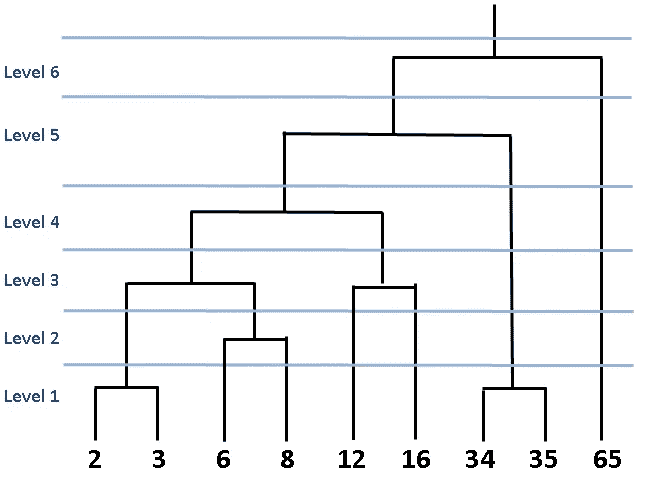
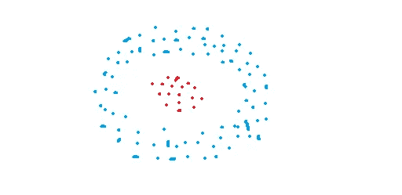
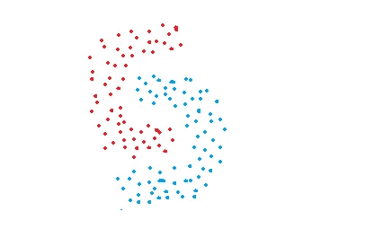
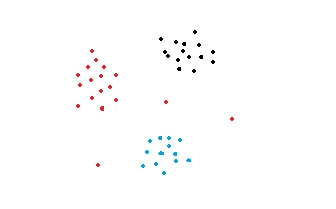
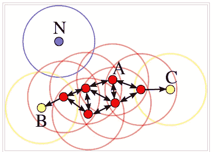

# 用于聚类的顶级机器学习算法

> 原文：<https://towardsdatascience.com/top-machine-learning-algorithms-for-clustering-a09c6771805?source=collection_archive---------14----------------------->

## 如何找到数据的底层结构

照片由[金莎·艾利斯](https://unsplash.com/@kymellis?utm_source=unsplash&utm_medium=referral&utm_content=creditCopyText)在 [Unsplash](https://unsplash.com/s/photos/view?utm_source=unsplash&utm_medium=referral&utm_content=creditCopyText) 上拍摄

聚类是一种对一组数据点进行分组的方法，将相似的数据点分组在一起。因此，聚类算法寻找数据点之间的相似或相异之处。聚类是一种无监督的学习方法，因此没有与数据点相关联的标签。聚类算法试图找到数据的底层结构。

有不同的方法和算法来执行聚类任务，这些任务可以分为三个子类别:

*   **基于分区的聚类**
*   **层次聚类**
*   **基于密度的聚类**

所有这些方法都旨在将数据分组到簇中。他们使用的方法略有不同。我将用每种方法的通用算法详细解释每种方法。在开始这个话题之前，我想指出聚类和分类之间的区别。

# **聚类 vs 分类**

*   分类任务中的观察值(或数据点)有标签。根据一些测量值对每个观察值进行分类。分类算法试图对观测值的测量值(特征)和它们的指定类别之间的关系进行建模。然后，模型预测新观察的类别。
*   聚类中的观察值(或数据点)没有标签。我们希望该模型能够在数据集中找到结构，以便可以将相似的观察结果分组到聚类中。我们基本上要求模型标记观察值。

# **基于分区的聚类**

[Shashank Sahay](https://unsplash.com/@shashanksahay?utm_source=unsplash&utm_medium=referral&utm_content=creditCopyText) 在 [Unsplash](https://unsplash.com/s/photos/view?utm_source=unsplash&utm_medium=referral&utm_content=creditCopyText) 上拍摄的照片

基于分区的聚类技术试图根据应用于数据点的距离度量来创建数据分区。这种方法最常见的算法是 **k 均值聚类**。

k-均值聚类旨在将数据划分为 k 个聚类，使得同一聚类中的数据点相似，而不同聚类中的数据点相距较远。

> 两点的相似性由它们之间的距离决定。

测量距离的方法有很多。[欧几里德距离](https://en.wikipedia.org/wiki/Euclidean_distance)(p = 2 的闵可夫斯基距离)是最常用的距离度量之一。

K-means 聚类试图最小化一个类内的距离，最大化不同类之间的距离。K-means 算法不能确定聚类数。我们需要在创建 KMeans 对象时定义它，这可能是一项具有挑战性的任务。

K-means 是一个迭代过程。它建立在[期望最大化](https://en.wikipedia.org/wiki/Expectation%E2%80%93maximization_algorithm)算法的基础上。确定集群数量后，它通过执行以下步骤来工作:

1.  为每个簇随机选择质心(簇的中心)。
2.  计算所有数据点到质心的距离。
3.  将数据点分配给最近的聚类。
4.  通过取聚类中所有数据点的平均值，找到每个聚类的新质心。
5.  重复步骤 2、3 和 4，直到所有点收敛并且聚类中心停止移动。

> **注意**:初始质心是随机选择的，这可能会导致最终的聚类有些不同。为了解决这个问题，scikit learn 提供了 **n_init** 参数。k-means 算法以不同的初始质心运行“n_init”次，并且最终结果将根据 n_init 次连续运行来确定。

**优点:**

*   容易理解
*   相对较快
*   可扩展用于大型数据集
*   能够以一种聪明的方式选择初始质心的位置，从而加速收敛
*   保证收敛

**缺点:**

*   集群的数量必须预先确定。K-means 算法无法猜测数据中存在多少个聚类。确定集群的数量可能是一项具有挑战性的任务。
*   只能画线性边界。如果数据中存在非线性结构来分隔组，k-means 将不是一个好的选择。
*   随着样本数量的增加而变慢，因为在每一步，k-means 算法都会访问所有数据点并计算距离。另一种方法是使用数据点的子集来更新质心的位置(即 sk learn . cluster . minibatchkmeans)
*   对异常值敏感

# **层次聚类**

塞缪尔·查伦在 [Unsplash](https://unsplash.com/s/photos/hidden?utm_source=unsplash&utm_medium=referral&utm_content=creditCopyText) 上拍摄的照片

这种方法通过构建集群的层次结构来工作。分层聚类意味着通过迭代分组或分离数据点来创建聚类树。有两种类型的分层聚类:

*   凝聚聚类
*   分裂聚类

> 分层聚类的优点之一是我们不必指定聚类的数量(但是我们可以)。

**聚集聚类**是一种自下而上的方法。每个数据点首先被假定为一个单独的聚类。然后迭代地组合相似的聚类。让我们看一个例子来解释清楚这个概念。

我们有一个由 9 个样本组成的数据集。我选择与这些样本相关的数字来演示相似性的概念。在每次迭代(或级别)中，最接近的数字(即样本)被组合在一起。如下图所示，我们从 9 个集群开始。最接近的在第一级被组合，然后我们有 7 个集群。与蓝线相交的黑线的数量代表簇的数量。

树突图

上图称为**树状图**，这是一个表示基于树的方法的图表。在层次聚类中，树状图用于可视化聚类之间的关系。

随着我们往上走，随着更多样本的合并，聚类的数量会减少。在级别 6 之后，所有样本被合并到一个大的聚类下。

层次聚类的优点之一是我们不必预先指定聚类的数量。但是，将所有数据点合并到一个聚类中是不明智的。我们应该在某个时候停止组合集群。Scikit-learn 为此提供了两个选项:

*   达到一定数量的簇后停止( **n_clusters** )
*   设置联动的阈值(**距离 _ 阈值**)。如果两个聚类之间的距离超过阈值，这些聚类将不会被合并。

**分裂聚类**在现实生活中并不常用，所以我将简单地提一下。一个简单而清晰的解释是，分裂性聚集与聚集性聚集相反。我们从一个包含所有数据点的巨大集群开始。然后数据点被分成不同的簇。这是一种自上而下的方法。

如果基础数据具有某种层次结构，分层聚类是有用的，并且会给出更好的结果。

分层聚类的一些常见用例:

*   遗传或其他生物数据可以用来创建一个树状图，以代表突变或进化水平。[种系发生树](https://en.wikipedia.org/wiki/Phylogenetic_tree)用于展示基于相似性和差异性的进化关系。
*   层次聚类也用于对文本文档进行分组。
*   层次聚类的另一个常见用例是**社交网络分析。**
*   层次聚类也用于**离群点检测。**

**优点**

*   不需要预先指定集群的数量。必须为 k-means 算法指定聚类数。
*   借助于树状图，它很容易实现和解释。
*   总是生成相同的聚类。k-均值聚类可能会产生不同的聚类，这取决于质心(聚类的中心)是如何初始化的。

**缺点**

*   与 k-means 相比，这是一种较慢的算法。分层聚类需要很长时间来运行，尤其是对于大型数据集。

# **基于密度的聚类**

照片由[哈坎·奥尔德林](https://unsplash.com/@greystoke?utm_source=unsplash&utm_medium=referral&utm_content=creditCopyText)在 [Unsplash](https://unsplash.com/s/photos/view?utm_source=unsplash&utm_medium=referral&utm_content=creditCopyText) 上拍摄

基于分区和层次聚类技术对于正常形状的聚类非常有效。然而，当涉及到任意形状的聚类或检测异常值时，基于密度的技术更有效。

请考虑以下数字:

这些图中的数据点以任意形状分组或者包含异常值。基于密度的聚类算法在发现高密度区域和离群点方面非常有效。对于某些任务来说，检测异常值是非常重要的，例如异常检测。这种方法最常用的算法之一是 DBSCAN。

**DBSCAN** 代表**d**en sity-**b**as**s**partial**c**illumination of**a**a**n**oise。它能够找到任意形状的聚类和带有噪声的聚类(即异常值)。

DBSCAN 背后的主要思想是，如果一个点靠近来自该簇的许多点，则该点属于该簇。

DBSCAN 有两个关键参数:

*   **eps** :指定邻域的距离。如果两点之间的距离小于或等于 eps，则认为这两点是相邻的。
*   **minPts:** 定义一个聚类的最小数据点数。

基于这两个参数，点被分类为核心点、边界点或异常点:

*   **核心点:**如果一个点在其半径为 eps 的周围区域内至少有 minPts 个数的点(包括该点本身)，则该点为核心点。
*   **边界点:**如果一个点可以从一个核心点到达，并且其周围区域内的点数少于 minPts，那么这个点就是边界点。
*   **离群点:**如果一个点不是核心点并且从任何核心点都不可达，那么这个点就是离群点。

这些观点可以用形象化来更好地解释。下图摘自维基百科:

[图来源](https://en.wikipedia.org/wiki/DBSCAN)

在这种情况下，minPts 是 4。红色点是核心点，因为在其半径为 eps 的周围区域内至少有**4 个点。该区域在图中用圆圈表示。黄色点是边界点，因为它们可以从核心点到达，并且其邻域内的点少于 4 个。可到达意味着在核心点的周围区域。点 B 和 C 在其邻域内(即以 eps 为半径的周围区域)有两个点(包括点本身)。最后，N 是一个异常值，因为它不是一个核心点，不能从核心点到达。**

我们已经学习了参数和不同类型点的定义。现在我们可以谈谈算法是如何工作的。这其实很简单:

*   确定 minPts 和 eps。
*   随机选择一个起始点，使用半径 eps 确定其邻域。如果邻域中至少有 minPts 个数的点，则将该点标记为核心点，并开始形成聚类。如果不是，则该点被标记为噪声。一旦聚类形成开始(假设聚类 A)，初始点邻域内的所有点都成为聚类 A 的一部分。如果这些新点也是核心点，则它们邻域内的点也被添加到聚类 A 中。

> 注意:被标记为噪声的点可以被重新访问，并且是聚类的一部分。

*   下一步是在前面步骤中没有访问过的点中随机选择另一个点。然后同样的程序适用。
*   当所有点都被访问时，该过程结束。

> 使用 k-means 算法中的距离测量方法来确定点之间的距离。最常用的方法是欧氏距离。

通过应用这些步骤，DBSCAN 算法能够找到高密度区域并将它们从低密度区域中分离出来。

一个集群包括相邻的核心点(即彼此可到达的)以及这些核心点的所有边界点。形成集群的必要条件是至少有一个核心点。尽管可能性很小，但我们可能有一个只有一个核心点及其边界点的集群。

**优点:**

*   不需要预先指定簇的数量。
*   适用于任意形状的集群。
*   DBSCAN 对异常值是鲁棒的，并且能够检测异常值。

**缺点:**

*   在某些情况下，确定适当的邻域距离(eps)并不容易，这需要领域知识。
*   如果集群在集群内密度方面差异很大，那么 DBSCAN 就不太适合定义集群。聚类的特征由 eps-minPts 参数的组合来定义。因为我们将一个 eps-minPts 组合传递给该算法，所以它不能很好地推广到具有很大不同密度的聚类。

感谢阅读。如果您有任何反馈，请告诉我。

**参考文献**

*   https://en.wikipedia.org/wiki/Phylogenetic_tree
*   【https://en.wikipedia.org/wiki/DBSCAN 