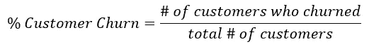
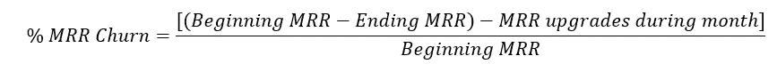
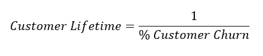
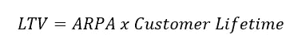
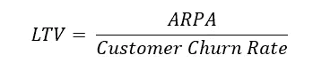
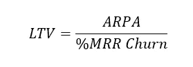
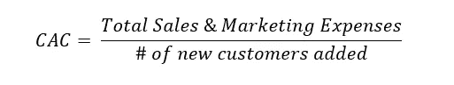
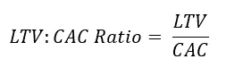
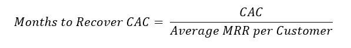
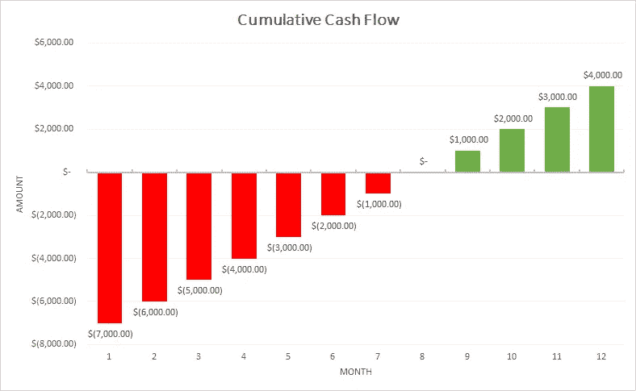

# SaaS 公司的顶级指标

> 原文：<https://towardsdatascience.com/top-metrics-for-saas-companies-6a28a903a33f?source=collection_archive---------32----------------------->

## 商业量化是成功的关键

艾萨克·史密斯在 [Unsplash](https://unsplash.com/s/photos/measure?utm_source=unsplash&utm_medium=referral&utm_content=creditCopyText) 上拍摄的照片

> “当衡量绩效时，绩效就会提高。当性能得到测量和反馈时，改进的速度就会加快。”
> 
> -皮尔逊定律

在过去的几十年里，aaS 公司在市场上变得越来越普遍。仅在 2018 年，全球就有大约 11000 家 SaaS 公司(Crunchbase)。**虽然 2018 年 SaaS 的预计收入为 800 亿美元(Gartner)，但 2018 年 SaaS 的实际收入超过 1200 亿美元(IDC 全球)**！这些收入的很大一部分也流向了一些大公司，比如谷歌、Adobe、Slack 和微软。

SaaS 公司如何在快速增长的市场中保持竞争力？虽然可能有很多方法，但向内看是一种非常有效的方法。

公司可以使用许多 SaaS 指标来衡量他们的增长，但今天我将重点关注我认为最相关的指标:

*   客户流失
*   收入流失
*   客户终身价值(LTV)
*   客户获取成本(CAC)
*   CAC:LTV 比率
*   恢复 CAC 的月数

# 客户流失

**客户流失率是衡量一段时间内失去多少业务的指标。**客户流失有助于公司更好地了解客户保持率，并找出产品和/或公司的痛点。

客户流失

**作为一般基准，5–7%的年流失率是一个很好的目标(大约每月 0.4–0.6%)**。当然，这一指标取决于公司的许多方面。如果你公司的主要客户群是企业级客户，你会希望有一个低流失率，因为每个客户的离开都会对你的底线产生重大影响。另一方面，如果您有许多合同期较短或遇到现金流问题的小型企业客户，那么更高的客户流失率可能是可以接受的。

# 每月经常性收入(MRR)流失

**每月经常性收入流失通常与客户流失一起衡量。**如果你有 100 个客户，失去了 5 个，那就是 5%的客户流失率，但是你怎么知道每个客户的流失实际上给公司造成了多少损失呢？这就是收入流失发挥作用的地方。

重要的是要注意到**你可以因为各种原因(向上销售/向下销售、折扣、信用、用途变化等)在不失去或获得任何客户的情况下获得巨大的收入流失**。).另外，**将现有客户的收入流失与新客户分开来衡量也很有用**。通过这种方式，确定新的收入/损失来自哪里变得更加容易。

看着 MRR 搅动，公式如下:

每月经常性收入流失

您也可以调整年度经常性收入(ARR)和季度经常性收入(QRR)的公式。这个公式给出了一段时间内从现有客户那里获得/损失的收入的**百分比。**如果流失率为负，这意味着我们的 MRR 自期初以来实际上增加了。

对于基准，我使用了 [Baremetrics 开放基准群组分析](https://baremetrics.com/open-benchmarks)页面，基准取决于**每账户平均收入(ARPA)。从 Baremetrics 的调查结果来看，一个好的 MRR 流失率范围是 8-10%。**

# 客户终身价值(LTV)

从之前的客户流失开始:

客户生命周期

我们现在知道了客户的生命周期。例如，如果月流失率为 5%，客户寿命将为 1/0.05，即 20 个月。

下一步是计算寿命值，即:

终身价值

其中 ARPA 是每个账户的平均收入。结合上面的客户生命周期，我们也可以这样来看公式:

终身价值——客户流失

更准确的版本是使用 MRR 流失来代替:

终身价值——MRR 流失

**这个值让我们大致了解每个客户给我们公司带来了多少价值。**一般来说，LTV 高并无大碍，但是 LTV:CAC 比率(稍后解释)为 SaaS 公司提供了一个明确的基准。

# 客户获取成本(CAC)

客户获取成本

顾名思义， **CAC 是衡量获得一个客户需要多少成本的指标**。它考虑了广告、员工工资、团队会议、产品维护等等。

如果你花 1000 美元获得 100 个新客户，那么 CAC 就是 10 美元。这个 CAC 好吗？这取决于客户带来了多少价值，我们将在接下来进一步探讨这一点。

# LTV:CAC 比率

LTV 与 CAC 比率

LTV:资本成本比率是 SaaS 公司最重要的比率之一。它回答了这样一个问题:**我们每花一美元去获得一个客户，我们能得到多少收入作为回报？**

LTV 与 CAC 的理想比例是 3:1 。如果你的比例是 1:1，那就是你花钱太多的迹象。另一方面，10:1 的比率乍一看似乎不错，但这也可能表明你没有花足够的钱来获得客户，从而限制了你的市场份额。

# 恢复 CAC 的月数

恢复 CAC 的月数

这个指标帮助我们找出**在获得一个新客户后需要多长时间才能达到收支平衡**。通常，**的目标是在获得客户后的 12 个月内收回 CAC。**更多成功的公司能够在更短的时间内做到这一点。

想象一下，我们的第一个客户以 12，000 美元的价格从我们这里购买了一份年度订阅，但它在 CAC 中花费了 8000 美元。现金流大概是这样的:

8 个月后，我们终于可以从我们的第一个客户那里看到一些利润了！如果我们将客户增加到 2 或 3 个，同时将 CAC 保持在 8000 美元，我们将看到我们的增长呈指数增长！对于拥有 SaaS 产品的初创公司，负现金流在早期就被预期，这些公司必须保持强劲，因为他们努力增加他们的客户群。

我知道还有许多其他 SaaS 指标公司可以用来提高绩效，但这是我觉得在 SaaS 最普遍的一些。

我希望这些信息有助于澄清一些重要的 SaaS 指标。非常感谢你阅读这篇博客，希望你继续关注下一篇！