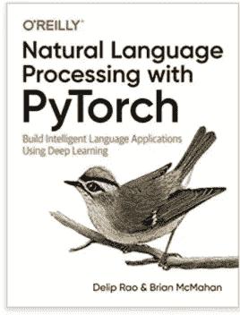

# 2020 年最佳 NLP 读物

> 原文：<https://towardsdatascience.com/top-nlp-books-to-read-2020-12012ef41dc1?source=collection_archive---------4----------------------->

## 这是我个人为自然语言处理推荐的书籍列表，供实践者和理论家参考

作者图片

迄今为止，有很多关于自然语言处理的书籍可供你学习。然而，为自己选择合适的书可能会令人生畏，因为书实在太多了！这篇文章提供了我个人推荐的补充你的 NLP 学习的顶级书籍列表。我把清单分成了实践和理论书籍，这取决于你是实践者还是研究者。

# 练习册

## 1.实用自然语言处理:构建真实世界自然语言处理系统的综合指南

作者[索姆亚·瓦贾拉](https://www.amazon.com/Sowmya-Vajjala/e/B08B88819X/ref=dp_byline_cont_book_1)、[菩萨](https://www.amazon.com/Bodhisattwa-Majumder/e/B08B7WZNYT/ref=dp_byline_cont_book_2)、[阿努杰·古普塔](https://www.amazon.com/Anuj-Gupta/e/B08B7VLNFS/ref=dp_byline_cont_book_3)、[哈什特·苏拉纳](https://www.amazon.com/Harshit-Surana/e/B08BFNJ9VM/ref=dp_byline_cont_book_4)(2020 年 6 月 17 日出版)

评分:⭐⭐⭐⭐

这本书概述了如何为你自己的问题建立一个真实的 NLP 系统。它将指导您逐步构建一个专为您的用例定制的高性能、高效的 NLP 设置。这本书涵盖了各种 NLP 任务的广泛范围，不同的 NLP 和深度学习方法，如何根据您自己的特定设置微调模型，不同方法的评估，软件实施和部署，以及来自领先研究人员的最佳实践。

## 2.[使用 PyTorch 进行自然语言处理:使用深度学习构建智能语言应用](https://amzn.to/35EhDOk)

作者[德利普·拉奥](https://www.amazon.com/Delip-Rao/e/B07R38JFGP/ref=dp_byline_cont_book_1)，[布莱恩·麦克马汉](https://www.amazon.com/s/ref=dp_byline_sr_book_2?ie=UTF8&field-author=Brian+McMahan&text=Brian+McMahan&sort=relevancerank&search-alias=books)(2019 年 2 月 19 日出版)

评分:⭐⭐⭐⭐

这本书是一本实用指南，教你如何使用流行的 Pytorch 库构建 NLP 应用程序。这是一本方便的书，它将教你:计算图和监督学习范式，Pytorch 的基础知识，传统的 NLP 方法，神经网络的基础，单词嵌入，句子预测，序列到序列模型，以及构建生产系统的设计模式。对于那些喜欢从实际例子中学习并希望使用 Pytorch 进行开发的人来说，这是一本很棒的书。

## 3.[自然语言处理实践:用 Python 理解、分析和生成文本](https://amzn.to/3cREeKX)

由[霍布森巷](https://www.amazon.com/Hobson-Lane/e/B07PZJDTMJ/ref=dp_byline_cont_book_1)、[汉尼斯哈普克](https://www.amazon.com/Hannes-Hapke/e/B07PV6Z58H/ref=dp_byline_cont_book_2)、[科尔霍华德](https://www.amazon.com/Cole-Howard/e/B07NKKS496/ref=dp_byline_cont_book_3)(2019 年 4 月 14 日出版)

评分:⭐⭐⭐⭐⭐

这本书假设对深度学习和 Python 技能有初步的理解。它教你如何使用 Python 库(如 Keras、Tensorflow、gensim 和 sci-kit learn)解决现代有趣的 NLP 问题。这本书涵盖的内容从基础到更深的自然语言处理概念:字预处理，字表示，感知器，CNN，RNN，LSTM，序列到序列模型和注意力，命名实体识别，问答，对话系统，最后优化自然语言处理系统。

## 4.[针对拥有 fastai 和 PyTorch 的程序员的深度学习:没有博士学位的 ai 应用](https://amzn.to/3gJwe1g)

由[杰瑞米·霍华德](https://www.amazon.com/Jeremy-Howard/e/B085WBBLMN/ref=dp_byline_cont_book_1)、[西尔万·古格](https://www.amazon.com/Sylvain-Gugger/e/B08FVSQ8XL/ref=dp_byline_cont_book_2)(2020 年 8 月 4 日出版)

评分:⭐⭐⭐⭐⭐

这本书的作者展示了没有人工智能博士学位如何实现深度学习，这是业内普遍认为的一种误解。使用流行的框架 fast.ai，这一切都是可能的，该框架旨在将 NLP 的生产和研究转化为几行代码。这本书向您展示了如何真正快速地建立和训练深度学习模型，使用最佳实践方法，提高准确性和速度，并将您的模型部署为 web 应用程序。对于没有多少深度学习或 NLP 背景，但知道一些 Python 基础知识的人来说，这是一本完美的书。

# 理论书籍

## 1.[自然语言处理中的神经网络方法](https://amzn.to/3qesWWB)

作者[约夫·戈德堡](https://www.amazon.com/Yoav-Goldberg/e/B0744KCH9G/ref=dp_byline_cont_book_1)，[格雷姆·赫斯特](https://www.amazon.com/s/ref=dp_byline_sr_book_2?ie=UTF8&field-author=Graeme+Hirst&text=Graeme+Hirst&sort=relevancerank&search-alias=books)(2017 年 4 月 17 日出版)

评分:⭐⭐⭐⭐

这是我最喜欢的关于 NLP 的理论书，非常全面。它侧重于 NLP 的神经网络模型背后的概念，并显示它们如何成功地解决 NLP 问题。本书的前半部分涵盖了监督学习、前馈神经网络、处理文本数据的基础知识、分布式单词表示和计算图抽象。本书的后半部分介绍了更具体的模型架构，这些架构构成了当今许多最先进方法的基础:CNN、RNN、LSTM、基于世代的模型和注意力模型。

## 2.[自然语言处理中的深度学习](https://amzn.to/2UfGoO9)

由[邓丽](https://www.amazon.com/s/ref=dp_byline_sr_ebooks_1?ie=UTF8&field-author=Li+Deng&text=Li+Deng&sort=relevancerank&search-alias=digital-text)、[刘阳](https://www.amazon.com/s/ref=dp_byline_sr_ebooks_2?ie=UTF8&field-author=Yang+Liu&text=Yang+Liu&sort=relevancerank&search-alias=digital-text)(发布于 2018 年 5 月 23 日)
评分:⭐⭐⭐⭐

这本书主要面向想要了解 NLP 最新发展水平(截止到 2018 年年中)的高级学生、博士后研究人员和行业研究人员。这本书回顾了各种 NLP 任务中的最新方法:语音识别、对话系统、问题回答、机器翻译、情感分析、自然语言生成等。

## 3.[自然语言处理和语音识别的深度学习](https://amzn.to/3wKaN5t)

由[乌代·卡马斯](https://www.amazon.com/s/ref=dp_byline_sr_book_1?ie=UTF8&field-author=Uday+Kamath&text=Uday+Kamath&sort=relevancerank&search-alias=books)、[刘醇逸](https://www.amazon.com/John-Liu/e/B07SZ9TKZV/ref=dp_byline_cont_book_2)、[詹姆斯·惠特克](https://www.amazon.com/James-Whitaker/e/B07XXCX2J7/ref=dp_byline_cont_book_3)(2020 年 8 月 14 日出版)

评分:⭐⭐⭐⭐⭐

这本书解释了 NLP 深度学习背后的概念。分为机器学习、NLP、语音介绍三个板块；深度学习基础；以及先进的文本和语音深度学习技术。第一部分介绍了基本的机器学习和自然语言处理理论。第二部分讲授 NLP 的基本概念，包括单词嵌入、CNN、RNN 和语音识别模型。最后一节讨论了自然语言处理中的前沿研究，如注意机制、记忆增强网络、多任务学习、强化学习、领域适应等。

## 4.[自然语言处理简介](https://amzn.to/35DCdOB)

作者[雅各布·爱森斯坦](https://www.amazon.com/Jacob-Eisenstein/e/B07ZYLNLHD/ref=dp_byline_cont_book_1)(2019 年 10 月 1 日出版)

评分:⭐⭐⭐⭐

这本书是针对高级本科生和研究生，学术研究人员和 NLP 软件工程师。它提供了一个经典算法的综合研究，也是在当前时代使用的当代技术。这本书分为四个部分。第一部分介绍基本的机器学习，第二部分教授文本的结构化表示。第三部分探讨了不同的单词表示，而最后一部分涵盖了三个基本的 NLP 应用:信息提取、机器翻译和文本生成。

# 结束语

在这篇文章之后，我希望你现在能对现有的顶级书籍有一个更广阔的视角！:D，如果这是你的预期目标，我希望你在一天结束的时候脑子里有一本书

为了您的方便，这是书单:

**练习册**

*   [**实用自然语言处理:构建真实世界自然语言处理系统综合指南**](https://amzn.to/3cTPYNl)
*   [**使用 PyTorch 进行自然语言处理:使用深度学习构建智能语言应用**](https://amzn.to/35EhDOk)
*   [**自然语言处理在行动:用 Python 理解、分析、生成文本**](https://amzn.to/3cREeKX)
*   [**fastai 和 PyTorch 的程序员深度学习:没有博士学位的 ai 应用**](https://amzn.to/3gJwe1g)

**理论书籍**

*   [**自然语言处理中的神经网络方法**](https://amzn.to/3qesWWB)
*   [**自然语言处理中的深度学习**](https://amzn.to/2UfGoO9)
*   [**面向 NLP 和语音识别的深度学习**](https://amzn.to/3wKaN5t)
*   [**自然语言处理入门**](https://amzn.to/35DCdOB)

*(注意:这篇文章包含所讨论书籍的链接)*

如果你喜欢我的工作，你也可以看看我以前在顶级 NLP 图书馆 2020 上的帖子！

 [## 2020 年将使用的顶级 NLP 库

### AllenNLP，Fast.ai，Spacy，NLTK，TorchText，Huggingface，Gensim，OpenNMT，ParlAI，DeepPavlov

towardsdatascience.com](/top-nlp-libraries-to-use-2020-4f700cdb841f)