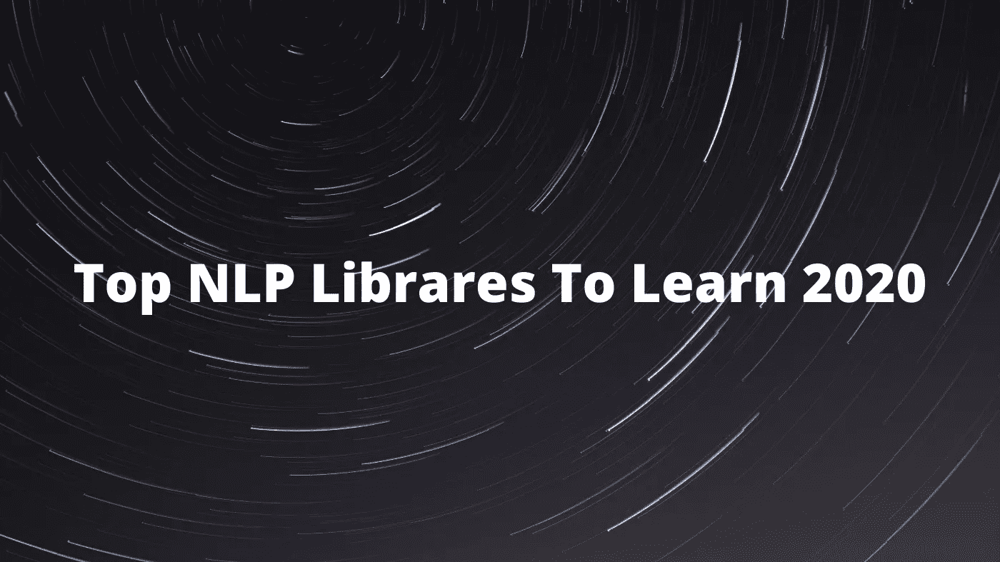

# 2020 年将使用的顶级 NLP 库

> 原文：<https://towardsdatascience.com/top-nlp-libraries-to-use-2020-4f700cdb841f?source=collection_archive---------13----------------------->

## AllenNLP，Fairseq，Fast.ai，Spacy，NLTK，TorchText，Huggingface，Gensim，OpenNMT，ParlAI，DeepPavlov

涉及

# 自然语言处理

自然语言处理已成为 2020 年深度学习中最受研究的领域之一，这主要是因为它越来越受欢迎，未来有潜力，并支持各种各样的应用程序。

如果你以前玩过深度学习，你可能知道常规的深度学习框架，如 [Tensorflow](https://www.tensorflow.org/) 、 [Keras](https://keras.io/) 和 [Pytorch](https://pytorch.org/) 。假设你知道这些基本框架，本教程致力于用其他有用的 NLP 库简要指导你，你可以在 2020 年学习和使用。根据您想做的事情，您可能会去掉一些您感兴趣或不知道存在的工具的名称！

# 总体框架

## 艾伦 LP

AllenNLP 标志([来源](https://github.com/allenai/allennlp))

*   知名度:⭐⭐⭐⭐
*   官方网站:[https://allennlp.org/](https://allennlp.org/)
*   github:[https://github.com/allenai/allennlp](https://github.com/allenai/allennlp)
*   说明:AllenNLP 是 NLP 深度学习的通用框架，由世界著名的 [Allen Institute for AI](https://allenai.org/) 实验室建立。它包含最先进的参考模型，您可以快速开始实施。它还支持各种各样的任务和数据集，因此无需担心。它还包括许多很酷的演示，你可以看看你是否想学习和使用这个框架！

## 公平序列

Fairseq 徽标([来源](https://github.com/pytorch/fairseq))

*   知名度:⭐⭐⭐⭐
*   官方网站:[https://fairseq.readthedocs.io/en/latest](https://fairseq.readthedocs.io/en/latest)
*   github:[https://github.com/pytorch/fairseq](https://github.com/pytorch/fairseq)
*   说明:Fairseq 是由脸书人工智能研究院开发的一个流行的自然语言处理框架。它是一个用于机器翻译、文本摘要、语言建模、文本生成和其他任务的序列建模工具包。它包含经典模型的内置实现，如 CNN、LSTMs，甚至是具有自我关注功能的[基本变形金刚](https://arxiv.org/abs/1706.03762)。它的 CLI 支持也非常方便。我有时会使用 Fairseq 来训练基线，以便与我自己的模型进行比较，我敢打赌，许多研究人员也是出于同样的目的使用它的！

## Fast.ai

*   知名度:⭐⭐⭐⭐
*   官方网站:【http://docs.fast.ai/ 
*   github:[https://github.com/fastai/fastai](https://github.com/fastai/fastai)
*   解释:Fast.ai 旨在通过其免费的在线课程和易于使用的软件库，让没有技术背景的人也可以进行深度学习。事实上，它的联合创始人杰瑞米·霍华德刚刚出版了(2020 年 8 月)一本全新的书，名为[fastai 和 PyTorch 的程序员的深度学习:没有博士学位的人工智能应用](https://www.amazon.com/Deep-Learning-Coders-fastai-PyTorch/dp/1492045527)，它的标题非常简单明了。在 Fast.ai 库中，他们有一个指定的[文本部分](https://docs.fast.ai/text.core)，用于任何与 NLP 相关的内容。对于 NLP 数据预处理、模型构建、训练和评估，它们具有超高级别的抽象和简单的实现。我真的推荐 Fast.ai 给任何一个重实践轻理论，想快速解决一个问题的人。

# 预处理

## 空间

*   知名度:⭐⭐⭐⭐⭐
*   官方网站:[https://spacy.io/](https://spacy.io/)
*   github:[https://github.com/explosion/spaCy](https://github.com/explosion/spaCy)
*   说明:Spacy 是最流行的文本预处理库，也是你能找到的最方便的库。它包含许多易于使用的功能，如标记化、词性标注、命名实体识别等等。它还支持 59+语言和几个预训练的词向量，你可以让你快速入门！

## NLTK

*   知名度:⭐⭐⭐⭐⭐
*   官方网站:[https://www.nltk.org/](https://www.nltk.org/)
*   github:[https://github.com/nltk/nltk](https://github.com/nltk/nltk)
*   说明:类似于 Spacy，它是现代 NLP 的另一个流行的预处理库。它的功能范围从标记化、词干化、标注到解析和语义推理。就个人而言，NLTK 是我最喜欢的预处理库，因为我喜欢 NLTK 的简单性。它能快速完成任务。

## 火炬报

*   知名度:⭐⭐⭐⭐
*   官方网站:[https://torchtext.readthedocs.io/en/latest/](https://torchtext.readthedocs.io/en/latest/)
*   github:【https://github.com/pytorch/text 
*   说明:TorchText 得到 Pytorch 的官方支持，因此越来越受欢迎。它包含方便的数据处理实用程序，可以在将它们输入深度学习框架之前批量处理和准备它们。在我的训练、验证和测试数据集中，我经常使用 TorchText 来进行标记化、vocab 构造和创建迭代器，这些都可以在以后由数据加载器使用。它真的是一个方便的工具，用几行简单的代码就能帮你处理所有繁重的工作。您还可以轻松地对数据集使用预先训练的单词嵌入，如 Word2Vec 或 FastText。通过查看我的 [BERT 文本分类使用 Pytorch](/bert-text-classification-using-pytorch-723dfb8b6b5b) 文章，你可以看到我是如何使用 TorchText 的。

# 变形金刚(电影名)

## 拥抱脸

Huggingface 的变形金刚 Logo ( [来源](https://github.com/huggingface/transformers))

*   知名度:⭐⭐⭐⭐⭐
*   官方网站:[https://huggingface.co/](https://huggingface.co/)
*   github:[https://github.com/huggingface/transformers](https://github.com/huggingface/transformers)
*   说明:这是最受欢迎的库，实现了各种各样的变形金刚，从伯特和 GPT-2 到巴特和改革者。我每天都在使用它，根据我自己的经验，它们的代码可读性和文档非常清晰。在他们的官方 [github repo](https://github.com/huggingface/transformers) 中，他们甚至按照不同的任务来组织他们的 python 脚本，比如语言建模、文本生成、问题回答、多项选择等。它们有内置的脚本来运行这些任务的基线转换器，所以使用它们真的很方便！

# 具体任务

## 根西姆

*   知名度:⭐⭐⭐
*   官方网站:[https://radimrehurek.com/gensim/](https://radimrehurek.com/gensim/)
*   github:[https://github.com/RaRe-Technologies/gensim](https://github.com/RaRe-Technologies/gensim)
*   任务:主题建模，文本摘要，语义相似度
*   解释:Gensim 是一个高端的行业级软件，用于特定文本的主题建模。它非常健壮、独立于平台并且可伸缩。我在一家人工智能初创公司实习时使用过它，我们想判断两篇报纸文章之间的语义相似性。有一个非常简单的函数调用，允许您这样做并返回它们的相似性得分，因此非常方便！

## OpenNMT

*   知名度:⭐⭐⭐
*   官方网站:【https://opennmt.net/ 
*   github:【https://github.com/OpenNMT/OpenNMT-py 
*   任务:机器翻译
*   说明:对于机器翻译和序列学习任务，OpenNMT 是一个方便而强大的工具。它包含高度可配置的模型和训练程序，使它成为一个非常简单的使用框架。我有同事推荐使用 OpenNMT 来完成不同种类的序列学习任务，因为它是开源的并且简单。

## 帕莱

ParlAI 标志([来源](https://github.com/facebookresearch/ParlAI))

*   知名度:⭐⭐⭐
*   官方网站:[https://parl.ai/](https://parl.ai/)
*   github:[https://github.com/facebookresearch/ParlAI](https://github.com/facebookresearch/ParlAI)
*   任务:面向任务的对话、闲聊对话、视觉问答
*   说明:ParlAI 是脸书的#1 框架，用于共享、训练和测试不同类型对话任务的对话模型。它为支持各种参考模型、预训练模型、数据集等提供了一体化环境。与列表中的大多数其他工具不同，ParlAI 需要一定程度的编码和机器学习专业知识，如果你想自己定制东西的话。换句话说，使用起来有点复杂，但如果你喜欢对话，这仍然是一个很好的工具。

## DeepPavlov

DeepPavlov 标志([来源](https://github.com/deepmipt/DeepPavlov))

*   知名度:⭐⭐⭐
*   官方网站:[http://deeppavlov.ai/](http://deeppavlov.ai/)
*   github:[https://github.com/deepmipt/DeepPavlov](https://github.com/deepmipt/DeepPavlov)
*   任务:面向任务的对话，闲聊对话
*   解释:作为 ParlAI 的替代，我认为 DeepPavlov 更适合应用和部署，而不是研究，尽管你仍然可以使用 DeepPavlov 进行大量的定制。我认为帕尔莱之于迪普帕洛夫就像皮托尔之于张量流。DeepPavlov 是一个主要用于聊天机器人和虚拟助手开发的框架，因为它提供了生产就绪和行业级对话代理所需的所有环境工具。我曾经在一次黑客马拉松中使用过它，将一个对话代理微调到餐馆领域(这样用户可以查看菜单并点他们想要的食物)，最终结果非常棒！